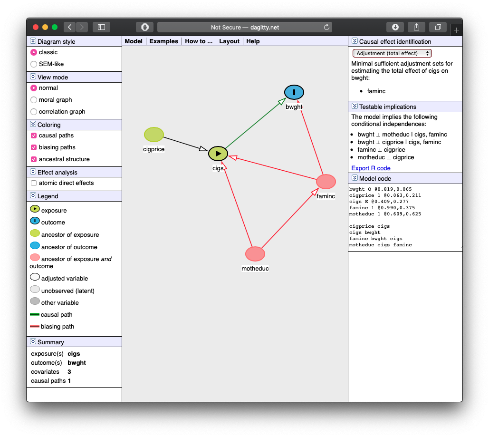
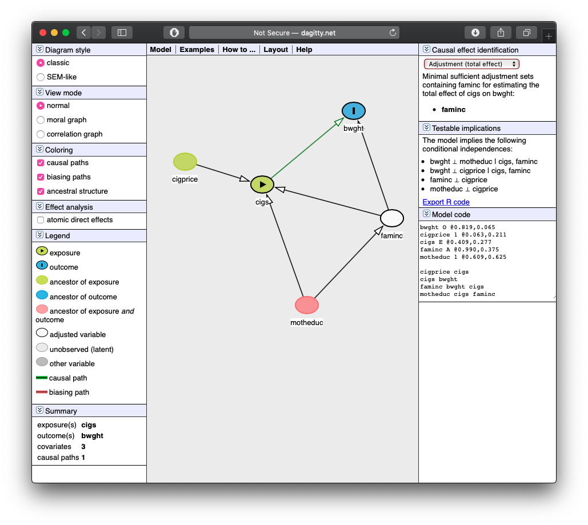
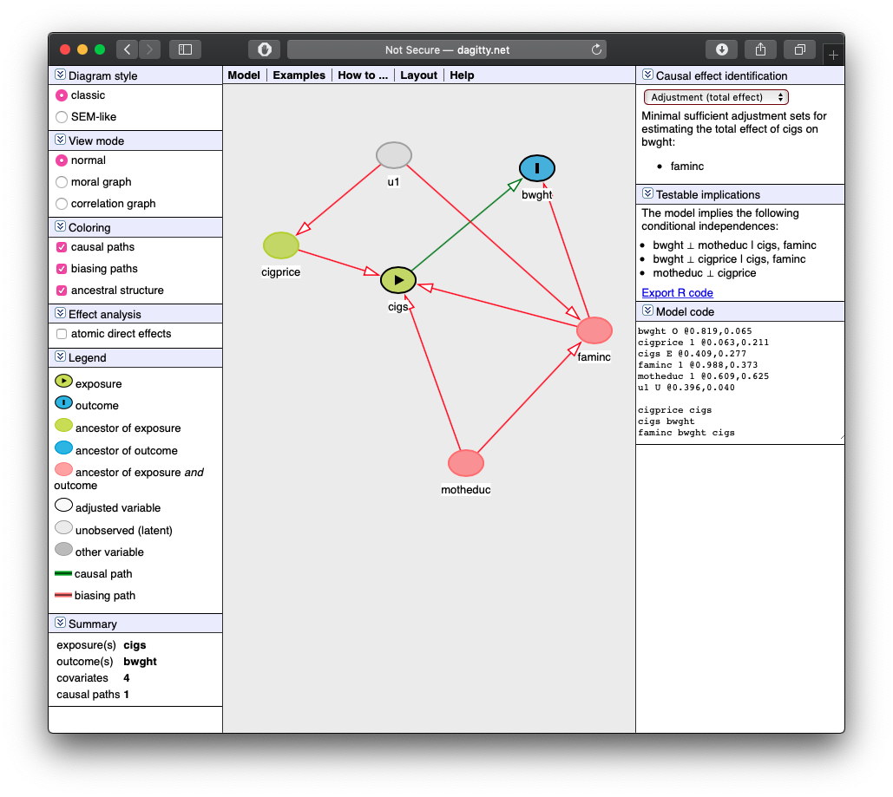
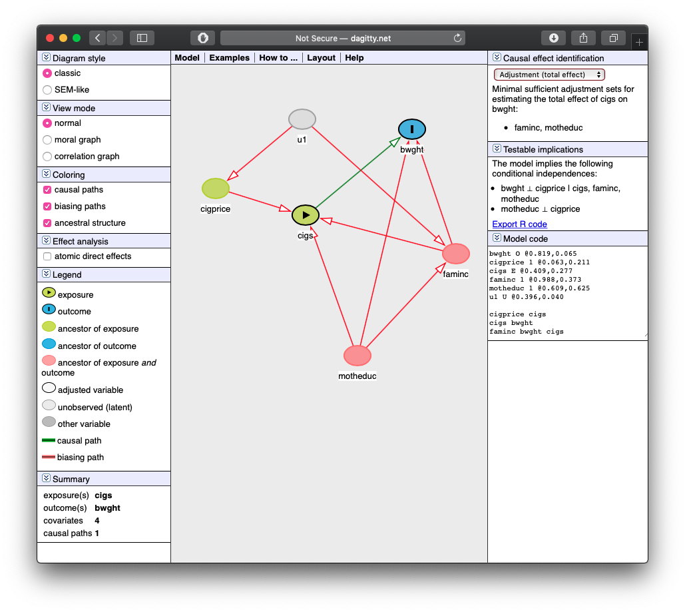
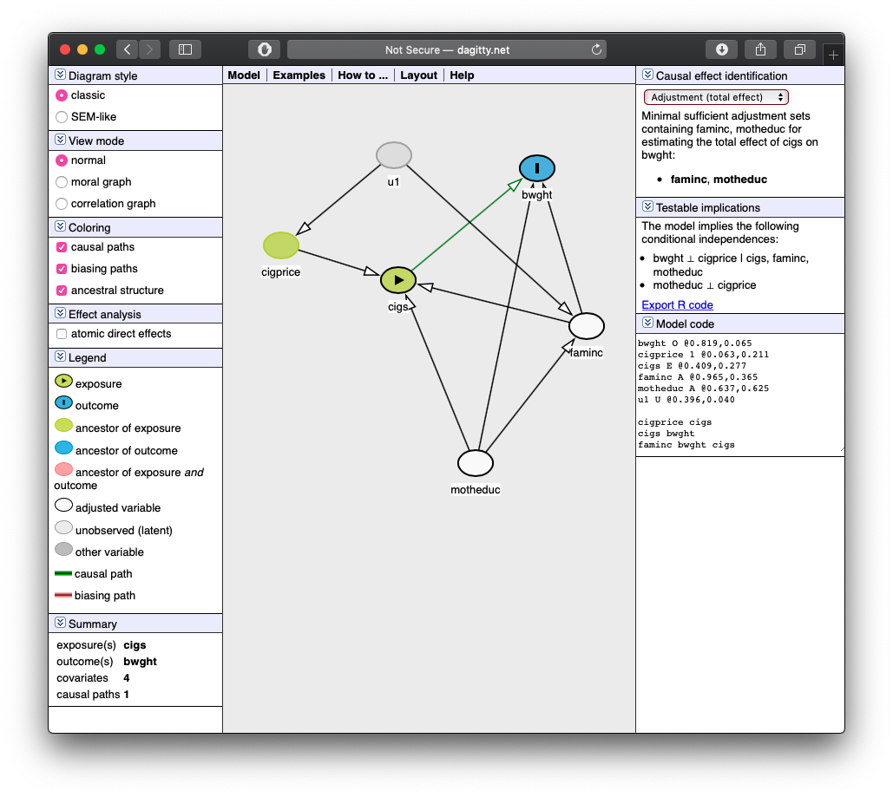

<!--CLICK "KNIT" ABOVE TO RENDER TO HTML, PDF, OR WORD OUTPUT
In fact, try knitting right away and see what this produces!
-->

```{r setup, include=FALSE}
knitr::opts_chunk$set(echo = T,
                      warning = F,
                      message = F,
                      fig.retina = 3,
                      fig.align = "center")
```

Answers may be longer than I would deem sufficient on an exam. Some might vary slightly based on points of interest, examples, or personal experience. These suggested answers are designed to give you both the answer and a short explanation of *why* it is the answer.

# Theory and Concepts

## Question 1

**In your own words, explain the fundamental problem of causal inference.**

## Question 2

Randomized controlled experiments are where a pool of subjects representative of a population are randomly assigned into a treatment group (or into one of a number of groups given different levels of a treatment) or into a control group. The treatment group(s) is(are) given the treatment(s), the control group is given nothing (perhaps a placebo, though this is not always necessary), and then the average results of the two groups are compared to measure the true average effect of treatment.

The key is that the assignment must be random, which controls for all factors that potentially determine the outcome (e.g. when measuring individual outcomes, their height, family background, income, race, age, etc). If subjects are randomly assigned, then knowing anything about the individual (e.g. age, height, etc) tells us nothing about whether or not they got the treatment(s). The only thing that separates a member of the treatment group(s) from the control group is whether or not they were assigned to treatment. This ensures that the average person in the treatment group(s) looks like the average person in the control group, and that we are truly comparing apples to apples, rather than apples to oranges.

## Question 3

**In your own words, describe what omitted variable bias means. What are the two conditions for an omitted variable to cause a bias?**

All variables that might influence the dependent variable ($Y$) that we do not measure and include in our regression are a part of the error term $(\epsilon$). If we omit a variable $(Z)$, it will cause a bias if and only if it meets both of the following conditions:
    1. The variable must be a determinant of our dependent variable, $corr(Z,Y)\neq 0$, and thus would appear in the error term, $\epsilon$.
    2. The variable must be correlated with one of our independent variables of interest in our regression, $corr(Z,X) \neq 0$.  

If both conditions are met, then if we did not include the omitted variable $Z$, our estimate of the causal effect of $X$ on $Y$ would be biased, because our estimate $(\hat{\beta_1}$) would pick up some of the effect of $Z$. If we include $Z$ as another independent variable, then the $\hat{\beta_1}$ on $X$ will tell us the precise effect of *only* $X\rightarrow Y$, holding $Z$ constant. 

```{r, echo=F}
library(tidyverse)
library(ggdag)

dagify(Y~Z+X,
       X~Z,
       exposure = "X",
       outcome = "Y") %>% 
  ggdag_status()+
  theme_dag_blank()+
  theme(legend.position = "none")
```

## Question 4

**In your own words, describe what multicollinearity means. What is the cause, and what are the consequences of multicollinearity? How can we measure multicollinearity and its effects? What happens if multicollinearity is *perfect*?**

Multicollinearity just means that two regressors (e.g .$X_1$ and $X_2$) are correlated with each other. This fact does *not* bias the OLS estimates of these regressors (e.g. $\hat{\beta_1}$ and $\hat{\beta_2}$). In fact, the reason $X_2$ is included in the regression is because omitting it would cause omitted variable bias, since $corr(X_1,X_2)\neq 0$ and $corr(Y, X_2)\neq 0$. However, the variance of these OLS estimators is increased because it is hard to get a precise measure of $X_1\rightarrow Y$ because $X_2\rightarrow Y$ also, and $X_1$ may tend to be certain values (large or small) when $X_2$ is certain values (large or small) so we don't know counterfactuals (e.g. what if $X_1$ were the *opposite* of what it tends to be (large or small) when $X_2$ is large or small). 

The strength of multicollinearity is simply given by the value of the correlation coefficient between $X_1$ and $X_2$, $r_{X_1,X_2}$. We can measure the *effect* of multicollinearity on the variance of a regressor ($X_j$)'s coefficient ($\hat{\beta_j}$) with the **Variance Inflation Factor**: 

$$VIF=\frac{1}{1-R^2_j}$$

where $R^2_j$ is the $R^2$ from an auxiliary regression of $X_j$ on all of the other regressors. 

Multicollinearity is *perfect* when the correlation between $X_1$ and $X_2$ is 1 or -1. This happens when one regressor (e.g. $X_1$) is an exact linear function of another regressor(s) $(e.g. X_1=\frac{X_2}{100}$. A regression cannot be run including both variables, as it creates a logical contradiction. In this example, $\hat{\beta_1}$ would be the marginal effect on $Y$ of changing $X_1$ holding $X_2$ constant -- but $X_2$ would naturally change as it is a function of $X_1$! 

## Question 5

**Explain how we use Directed Acyclic Graphs (DAGs) to depict a causal model: what are the two criteria that must hold for identifying a causal effect of $X$ on $Y$? When should we control a variable, and when should we *not* control a variable?**

A Directed Acyclic Graph (DAG) describes a causal model based on making our assumptions about relationships between variables explicit, and in many cases, testable.

Variables are represented as nodes, and causal effects represented as arrows from one node to another (in the direction of the causal effect). We think about the causal effect of $X \rightarrow Y$ in *counterfactual* terms: if $X$ had been different, $Y$ would have been different as a response.

When considering the causal effect of $X \rightarrow Y$, we must consider *all pathways from $X$ to $Y$* (that do not loop, or go through a variable twice), regardless of the direction of the arrows. The paths will be of two types:

- **Causal (front-door) pathways** where arrows go from $X$ into $Y$ (including through other **mediator** variables)
- **Non-causal (back-door) pathways** where an arrow leads into $X$ (implying $X$ is partially caused by that variable)

Adjusting or controlling for (in a multivariate regression, this means including the variable in the regression) a variable along a pathway closes that pathway.

Variables should be adjusted (controlled for) such that: 

1. **Back-door criterion**: no backdoor pathway between $X$ and $Y$ remains open
2. **Front-door criterion**: no frontdoor pathway is closed

The one exception is a **collider** variable, where a variable along a pathway has arrows pointing into it from both directions. This *automatically blocks a path* (whether front door or back door). Controlling for a collider variable *opens* the pathway it is on.

See [R Practice on Causality and DAGs](/r/3.2-r-practice-answers.Rmd) for examples.

# Theory Problems

For the following questions, please *show all work* and explain answers as necessary. You may lose points if you only write the correct answer. You may use `R` to *verify* your answers, but you are expected to reach the answers in this section "manually."

## Question 6

**A pharmaceutical company is interested in estimating the impact of a new drug on cholesterol levels. They enroll 200 people in a clinical trial. People are randomly assigned the treatment group or into the control group. Half of the people are given the new drug and half the people are given a sugar pill with no active ingredient. To examine the impact of dosage on reductions in cholesterol levels, the authors of the study regress the following model:**

$$\text{cholesterol level}_i = \beta_0+\beta_1 \text{dosage level}_i + u_i$$

**For people in the control group, dosage level$_i=0$ and for people in the treatment group, dosage level$_i$ measures milligrams of the active ingredient. In this case, the authors find a large, negative, statistically significant estimate of $\hat{\beta_1}$. Is this an unbiased estimate of the impact of dosage on change in cholesterol level? Why or why not? Do you expect the estimate to overstate or understate the true relationship between dosage and cholesterol level?**

Consider the 4th assumption about the error term, $u_i$. Does knowing whether (or how much) a person was treated convey any information about other characteristics that affect cholesterol level (in $u_i$)? Again, we are asking if $E[u|X]=0$ or $cor(X, u)=0$.
	
In this case, the answer is clearly no; knowing whether or not someone received treatment tells us *nothing* else about the person that might affect their cholesterol levels (i.e. age, height, diet, weight, family history, etc., all in $u_i)$ because treatment is *randomly* assigned.

In this case, because treatment is exogenous, $E[\hat{\beta_1}]=\beta_1$, $\hat{\beta_1}$ is unbiased.

```{r, echo = F}
library(ggdag)
dagify(chol ~ treat + u,
       exposure = "treat",
       outcome = "chol") %>%
  ggdag_status()+
  theme_dag()+
  theme(legend.position="none")
```

## Question 7

Data were collected from a random sample of 220 home sales from a community in 2017.

$$\widehat{Price}=119.2+0.485 \, BDR+23.4 \, Bath+0.156 \, Hsize+0.002 \, Lsize+0.090 \, Age$$

| Variable | Description |
|----------|-------------|
| $Price$ | selling price (in $1,000s) |
| $BDR$ | number of bedrooms |
| $Bath$ | number of bathrooms |
| $Hsize$ | size of the house (in ft$^2)$ |
| $Lsize$ | lot size (in ft$^2)$ |
| $Age$ |age of the house (in years) |

### Part A

**Suppose that a homeowner converts part of an existing living space in her house to a new bathroom. What is the expected increase in the value of the house?**

From $\hat{\beta_2}$, $23,400

### Part B

**Suppose a homeowner adds a new bathroom to her house, which also increases the size of the house by 100 square feet. What is the expected increase in the value of the house?**

In this case, $\Delta BDR=1$ and $\Delta Hsize=100$. The resulting expected increase in price is $23.4(1)+0.156(100)=39.0$, or $39,000.

### Part C

**Suppose the $R^2$ of this regression is 0.727. Calculate the adjusted $\bar{R}^2$.**

There are $n=220$ observations and $k=6$ variables, so: 

$$\begin{align*}
\bar{R}^2&=1-\frac{n-1}{n-k-1}(1-R^2)\\
&=1-\frac{220-1}{220-6-1}(1-0.727)\\
&=1-\frac{219}{213}(0.273)\\
&=0.719\\
\end{align*}$$

### Part D

**Suppose the following auxiliary regression for $BDR$ has an $R^2$ of 0.841.**

$$\widehat{BDR}=\delta_0+\delta_1Bath+\delta_2Hsize+\delta_3Lsize+\delta_4Age$$

**Calculate the Variance Inflation Factor for $BDR$ and explain what it means.**

$$\begin{align*}
VIF&=\frac{1}{1-R^2_j}\\
&=\frac{1}{1-0.841}\\
&=\frac{1}{0.159}\\
&=6.29\\
\end{align*}$$

The variance on $\hat{\beta_2}$ (on Bath) increases by 6.29 times due to multicollinearity between Bath and other $X$-variables. 

## Question 8

A researcher wants to investigate the effect of education on average hourly wages. Wage, education, and experience in the dataset have the following correlations:

|    | Wage | Education | Experience |
|----|-----:|----------:|-----------:|
| Wage | 1.0000 |    |    |
| Education | 0.4059 |  1.0000  |    |
| Experience | 0.1129 | -0.2995 | 1.0000 |

She runs a simple regression first, and gets the results:

$$\widehat{\text{Wage}} = -0.9049 +  0.5414 \, Education$$

She runs another regression, and gets the results:

$$\widehat{\text{Experience}} = 35.4615 - 1.4681 \, Education$$

### Part A

**If the true marginal effect of experience on wages (holding education constant) is 0.0701, calculate the omitted variable bias in the first regression caused by omitting experience. Does the estimate of $\hat{\beta_1}$ in the first regression overstate or understate the effect of education on wages?**

We know that the estimate in the biased regression (first one above) is a function of:

$$\hat{\alpha_1}=\hat{\beta_1}+\hat{\beta_2}\hat{\delta_1}$$

Where:

- $\hat{\alpha_1}$: the coefficient on education in the biased regression (0.5414)
- $\hat{\beta_1}$: the true effect of education on wages (??)
- $\hat{\beta_2}$: the true effect of experience on wages (0.0701)
- $\hat{\delta_1}$: the effect of education on experience (from an auxiliary regression) (-1.4681)

$$\begin{align*}
		OMV&=\hat{\beta_2} \hat{\delta_1}\\
		&=(0.0701)(-1.4681)\\
		&=-0.1029
\end{align*}$$

Since the bias is negative, it understates the effect of education (due to experience). Note there are other factors that can bias the effect of education, but at least through experience, the bias is negative since the two are negatively related in the data (see the second regression).  

### Part B

**Knowing this, what would be the *true effect* of education on wages, holding experience constant?**

We know the biased estimate for education, 0.0611. Plugging in both this and the bias, we get the "true" effect:

$$\begin{align*}
			\alpha_1&=\beta_1+\beta_2\delta_1\\
			0.5414&=\beta_1-0.1029\\
			0.6443&=\beta_1\\
\end{align*}$$

### Part C

**The $R^2$ for the second regression is 0.0897. If she were to run a better regression including both education and experience, how much would the variance of the coefficients on education and experience increase? Why?**

Here we need to calculate the Variance Inflation Factor (VIF) by using the $R^2$ from the auxiliary regression. 

$$\begin{align*}
		VIF &=\frac{1}{1-R^2_j}\\
		&=\frac{1}{1-(0.0897)}\\
		&=\frac{1}{0.9103}\\
		&=1.0985
\end{align*}$$

The variance increases only by 1.0985 times due to fairly weak multicollinearity between education and experience.

# R Questions

Answer the following questions using `R`. When necessary, please write answers in the same document (knitted `Rmd` to `html` or `pdf`, typed `.doc(x)`, or handwritten) as your answers to the above questions. Be sure to include (email or print an `.R` file, or show in your knitted `markdown`) your code and the outputs of your code with the rest of your answers.

## Question 9

Install the `wooldridge` package if you do not already have it installed.^[This package contains datasets used in Jeffrey Wooldrige's *Introductory Econometrics: A Modern Approach* (the textbook that I used in *my* econometrics classes years ago!)] We will use the `bwght` data from `wooldridge`^[Which comes from The 1988 National Health Interview Survey., used in J. Mullahy (1997), “Instrumental-Variable Estimation of Count Data Models: Applications to Models of Cigarette Smoking Behavior,” *Review of Economics and Statistics* 79: 596-593.]

Let's just look at the following variables:

| Variable | Description |
|----------|-------------|
| `bwght` | Birth Weight (ounces) |
| `cigs` | Cigarettes smoked per day while pregnant (1988) |
| `motheduc` | Mother's education (number of years) |
| `cigprice` | Price of cigarette pack (1988) |
| `faminc` | Family's income in $1,000s (1988) |

> We want to explore how a mother smoking during pregnancy affects the baby's birthweight (which may have strong effects on outcomes over the child's life).

Just to be explicit about it, assign this as some dataframe (feel free to change the name), i.e.: 

```{r}
# install.packages("wooldridge")
library(wooldridge)
bwght<-wooldridge::bwght
```

### Part A

**Make a correlation table for our variables listed above.**^[Hints: `select()` these variables and then pipe them into `cor(., use="pairwise.complete.obs")` to use only observations for which there are data on each variable (to avoid `NA`'s).]

```{r}
bwght %>%
  select(bwght, cigs, motheduc, cigprice, faminc) %>%
  cor(use = "pairwise.complete.obs")
```

### Part B

Consider the following causal model:

```{r, echo=T, message = F, warning = F}
library(ggdag)
dagify(bwght~cigs+inc,
       cigs~price+educ+inc,
       inc~educ,
       exposure = "cigs",
       outcome = "bwght") %>%
  tidy_dagitty(seed = 256) %>%
  ggdag_status()+
  theme_dag_blank()+
  theme(legend.position = "none")
```

Note what we are hypothesizing:

- `bwght` is caused by `cigs` and `inc`
- `cigs` are caused by `price`, `educ`, and `inc`
- `inc` is caused by `educ`

See also how this is written into the notation in R to make the DAG.

Create this model on [dagitty.net](htpp://dagitty.net). What does `dagitty` tell us the testable implications of this causal model?

---



See the middle box on the right on dagitty:

1. $bwght \perp price \, | \, cigs, inc$: birthweight is independent of price, controlling for cigarettes and income

2. $bwght \perp educ \, | \, cigs, inc$: birthweight is independent of education, controlling for cigarettes and income

3. $inc \perp price$: income is independent of price

4. $price \perp educ$: cigarette price is independent of education

### Part C

Test each implication given to you by `dagitty.` 

- For independencies $(x \perp y)$: run a regression of $y$ on $x$.
- For *conditional* independencies $(x \perp y | z, a)$: run a regression of $y$ on $x, z, a$.

For each, test against the null hypothesis that the relevant coefficient $(\hat{\beta_1})$ is 0 (i.e. $x$ and $y$ are indeed independent).

Does this causal model hold up well?

#### Implication 1:

If we run a regression of `bwght` on `cigprice`, including `cigs` and `faminc` as controls, there should not not be a statistically significant coefficient on `cigprice` (i.e. there is no relationship between `cigprice` and `bwght` holding `cigs` and` faminc` constant):

```{r}
lm(bwght~cigprice+cigs+faminc, data = bwght) %>% summary()
```

The coefficient on `cigprice` is small and not statistically significant. This implication holds up well.

#### Implication 2:

If we run a regression of `bwght` on `motheduc`, including `cigs` and `faminc` as controls, there should not not be a statistically significant coefficient on `cigprice` (i.e. there is no relationship between `motheduc` and `bwght` holding `cigs` and` faminc` constant):

```{r}
lm(bwght~motheduc+cigs+faminc, data = bwght) %>% summary()
```

#### Implication 3:

The model implies simply that there is no significant correlation between `faminc` and `cigprice`

```{r}
bwght %>%
  select(faminc, cigprice) %>%
  cor()
```

There is a fairly weak correlation. This implication mostly holds up.

#### Implication 4:

The model implies simply that there is no significant correlation between `cigprice` and `motheduc`

```{r}
bwght %>%
  select(cigprice, motheduc) %>%
  cor(use="pairwise.complete.obs")
```

This is an even weaker correlation. This implication seems to holds up.


### Part D

**List _all_ of the possible pathways from `cigs` to `bwght`. Which are "front-doors" and which are "back-doors?" Are any blocked by colliders?**

1. $cigs \rightarrow bwght$ (causal, front door)
2. $cigs \leftarrow faminc \rightarrow bwght$ (non-causal, back door)
3. $cibs \leftarrow motheduc \rightarrow faminc \rightarrow bwght$ (non-causal, back door)

There are no colliders on any path. 

### Part E

**What is the minimal sufficient set of variables we need to control in order to causally identify the effect of `cigs` on `bwght`?**



We simply need to control for `faminc`. This blocks the back door for both path 2 and path 3.

### Part F

**Estimate the causal effect by running the appropriate regression.**^[Note, on `dagitty`, you can change a variable on the diagram to be "*adjusted*" (controlled for) by double-clicking it and then hitting the `A` key.]

We need to control only for `faminc`, so we put it into the regression to estimate:

$$bwght_i=\beta_0+\beta_1 \, cigs_i+\beta_2 \,faminc_i$$

```{r}
lm(bwght~cigs+faminc, data = bwght) %>% summary()
```

Controlling for income, each cigarette smoked while pregant will cause the birthweight to decrease by 0.46 ounces.

### Part G

**We saw some effect between `faminc` and `cigprice`. Perhaps there are unobserved factors (such as the economy's performance) that affect both. Add an unobserved factor `u1` to your `dagitty` model.**^[Note, on `dagitty`, you can make a variable be "*unobserved*" by double-clicking it and then hitting the `U` key.]



### Part H

**Perhaps our model is poorly specified. Maybe `motheduc` actually has a causal effect on `bwght`? Tweak your model from Question 9 on `dagitty` to add this potential relationship. What testable implications does this new model imply?**

See the middle box on the right on dagitty:

1. $bwght \perp price \, | \, cigs, inc, educ$: birthweight is independent of price, controlling for cigarettes, income, and education

2. $price \perp educ$: cigarette price is independent of education




### Part I

**Test these implications appropriately, like you did in Part C. Does this model hold up well?**

#### Implication 1:

If we run a regression of `bwght` on `cigprice`, including `cigs`, `faminc`, and `motheduc` as controls, there should not not be a statistically significant coefficient on `cigprice` (i.e. there is no relationship between `cigprice` and `bwght` holding `cigs`,` faminc`, and `motheduc` constant):

```{r}
lm(bwght~cigprice+cigs+faminc+motheduc, data = bwght) %>% summary()
```

The coefficient on `cigprice` is small and not statistically significant. This implication holds up well.

#### Implication 2:

This is the same as implication 4 from Part C. Again, this holds up reasonably well.

### Part J

**Under this new causal model, list *all* of the possible pathways from `cigs` to `bwght`. Which are "front-doors" and which are "back-doors?" Are any blocked by colliders?**

1. $cigs \rightarrow bwght$ (causal, front door)
2. $cigs \leftarrow faminc \rightarrow bwght$ (non-causal, back door)
3. $cigs \leftarrow cigprice \leftarrow u1 \rightarrow faminc \rightarrow bwght$ (non-causal, back door)
4. $cigs \leftarrow motheduc \rightarrow bwght$ (non-causal, back door)
5. $cigs \leftarrow motheduc \rightarrow faminc \rightarrow bwght$ (non-causal, back door)

There are no colliders on any path. 

### Part K

**Under this new causal model, what is the minimal sufficient set of variables we need to control in order to causally identify the effect of `cigs` on `bwght`?**

We need to control for `faminc` and `motheduc`. This blocks the back door for paths 2, 3, 4, and 5.

### Part L

**Estimate the causal effect in this new model by running the appropriate regression. Compare your answers to those in part F.**



We need to control for `faminc` and `motheduc`, so we put them into the regression to estimate:

$$bwght_i=\beta_0+\beta_1 \, cigs_i+\beta_2 \,faminc_i+ \beta_3 \, motheduc_i$$
<!--ANSWER BELOW HERE-->

```{r}
lm(bwght~cigs+faminc+motheduc, data = bwght) %>% summary()
```

Controlling for income and education, each cigarette smoked while pregant will cause the birthweight to decrease by 0.46 ounces. It turns out there was no noticeable difference when we included education!


### Part M

**Try out drawing this model using the `ggdag` package in R. See my DAG in question 3 for an example.**


```{r}
library(ggdag)
dagify(bwght~cigs+inc+educ,
       cigs~price+educ+inc,
       inc~educ+u1,
       price~u1,
       exposure = "cigs",
       outcome = "bwght") %>% 
  ggdag_status()+
  theme_dag_blank()+
  theme(legend.position = "none")
```

## Question 10

- [<i class="fas fa-table"></i> `heightwages.csv`](http://metricsf20.classes.ryansafner.com/data/heightwages.csv)

Download the `heightwages.csv` dataset. This data is a part of a larger dataset from the National Longitudinal Survey of Youth (NLSY) 1979 cohort: a nationally representative sample of 12,686 men and women aged 14-22 years old when they were first surveyed in 1979. They were subsequently interviewed every year through 1994 and then every other year afterwards. There are many included variables, but for now we will just focus on: 

- `wage96`: Adult hourly wages (\$/hr) reported in 1996
- `height85`: Adult height (inches) reported in 1985
- `height81`: Adolescent height (inches) reported in 1981

> We want to figure out what is the effect of height on wages (e.g. do taller people earn more on average than shorter people?)

### Part A

**Create a quick scatterplot between `height85` (as $X)$ amd `wage96` (as $Y)$.**

---

<!--WRITE YOUR ANSWERS BELOW -->

```{r, warning=F, message=F}
library(tidyverse)

# load data
heights<-read_csv("https://metricsf20.classes.ryansafner.com/Data/heightwages.csv")

# make scatterplot
ggplot(data=heights, aes(x=height85, y=wage96))+
  geom_jitter(color="blue")+
  geom_smooth(method="lm",color="red")+
  labs(x = "Adult Height in 1985 (inches)",
       y = "Hourly Wage in 1996 ($)")+
  theme_classic(base_family = "Fira Sans Condensed",
           base_size=20)
```

---

### Part B

**Regress wages on adult height. Write the equation of the estimated OLS regression. Interpret the coefficient on `height85`.**

---

<!--WRITE YOUR ANSWERS BELOW -->

```{r}
reg1<-lm(wage96~height85, data=heights)
summary(reg1)
```

$\widehat{\text{Wages}_i} = -6.98+0.31\text{Height}_i$$

For every additional inch in height as an adult, we can expect someone's wages to be $0.31 higher, on average.

---

### Part C

**How much would someone who is 5'10" be predicted to earn per hour, according to the model?**

---

<!--WRITE YOUR ANSWERS BELOW -->

For a 5'10'' person (70 inches), they would earn: 

$$\begin{align*}
	\widehat{Wages}&=-6.98+0.31Height\\
	&=-6.98+0.31(70)\\
	&=-6.98+21.70\\
	&=\$14.72\\	
\end{align*}$$

```{r}
# If you want to calculate it with R
library(broom)
reg1_tidy<-tidy(reg1)

beta_0<-reg1_tidy %>%
  filter(term == "(Intercept)") %>%
  pull(estimate)

beta_1<-reg1_tidy %>%
  filter(term == "height85") %>%
  pull(estimate)

beta_0+beta_1*70 # some rounding error in my calculation above
```
---

### Part D

**Would adolescent height cause an omitted variable bias if it were left out? Explain using both your intuition, and some statistical evidence with `R`.**

---

<!--WRITE YOUR ANSWERS BELOW -->

```{r}
heights %>%
  select(wage96, height81, height85) %>%
  cor(use = "pairwise.complete.obs")
```

We see that Adolescent height `height81` is weakly correlated with `wage96` (to be fair, so is adult height), but it is strongly correlated with adult height `height85`.

---

### Part E

**Now add adolescent height to the regression, and write the new regression equation below, as before. Interpret the coefficient on `height85`.**

---

<!--WRITE YOUR ANSWERS BELOW -->

```{r}
reg2<-lm(wage96~height85+height81, data=heights)
summary(reg2)
```

$$\widehat{\text{Wages}_i}=-9.25-0.11\text{Height85}_i+0.46\text{Height81}_i$$

For every additional inch in height as an adult, we can expect someone's wages to be $0.11 lower, on average, holding their adolescent height constant.

---

### Part F

**How much would someone who is 5'10" in 1985 and 4'8" in 1981 be predicted to earn, according to the model?**

---

<!--WRITE YOUR ANSWERS BELOW -->

For that 5'10" person (70 inches) in 1985 and 4'10" (58") in 1981, they would earn: 

$$\begin{align*}
	\widehat{Wages}&=-9.25-0.11Height85+0.46Height81\\
	&=-9.25-0.11(70)+0.46(58)\\
	&=-9.25-7.70+25.76\\
	&=\$9.73 \\	
\end{align*}$$

```{r}
# If you want to calculate it with R
library(broom)
reg2_tidy<-tidy(reg2)

multi_beta_0<-reg2_tidy %>%
  filter(term == "(Intercept)") %>%
  pull(estimate)

multi_beta_1<-reg2_tidy %>%
  filter(term == "height85") %>%
  pull(estimate)

multi_beta_2<-reg2_tidy %>%
  filter(term == "height81") %>%
  pull(estimate)

multi_beta_0+multi_beta_1*70+multi_beta_2*58 # some rounding error in my calculation above
```

---

### Part G

**What happened to the estimate on `height85` and its standard error?**

---

<!--WRITE YOUR ANSWERS BELOW -->

The effect fell by more than a half, and turned negative. The standard error also doubled (likely due to multicollinearity).

---

### Part H

**Is there multicollinearity between `height85` and `height81`? Explore with a scatterplot.**^[Hint: to avoid overplotting, use `geom_jitter()` instead of `geom_point()` to get a better view of the data.]

---

<!--WRITE YOUR ANSWERS BELOW -->

```{r}
ggplot(data=heights, aes(x=height81, y=height85))+
  geom_jitter(color="blue")+
  geom_smooth(method="lm",color="red")+
  labs(x = "Adult Height in 1985 (inches)",
       y = "Adolescent Height in 1981 (inches)")+
  theme_classic(base_family = "Fira Sans Condensed",
           base_size=20)
```

---

### Part I

**Quantify how much multicollinearity affects the variance of the OLS estimates on both heights**.^[Hint: You'll need the `car` package.]

---

<!--WRITE YOUR ANSWERS BELOW -->

We simply run `vif()` (from the `car` package library) after the recent regression to calculate the Variance Inflation Factor (VIF).

```{r}
#install.packages("car") # install if you don't have 
library("car") # load the car library for the vif() command

vif(reg2) # run vif 
```

The variance of each OLS estimate is inflated by 8.38 times due to multicollinearity. 

---

### Part J

**Reach the same number as in part I by running an auxiliary regression.**^[Hint: There's some missing `wage96` data that may give you a different answer, so `filter()` your data here by `!is.na(wage96)` before running this regression - this will include only observations for `wage96` that are not `NA`'s.]

---

<!--WRITE YOUR ANSWERS BELOW -->

```{r}
aux_reg <- heights %>%
  filter(!is.na(wage96)) %>% # use only for which we have wages
  lm(data = ., height85~height81) # run regression

summary(aux_reg) # look for R-squared
```

We find that adult height is positively affected by adolescent height ($\hat{\beta_1}=0.95$, meaning for every inch that someone is when they are an adolescent, their adult height can be predicted to be about the same). The $R^2$ on the auxiliary regression is 0.88.

\begin{align*}
	VIF&=\frac{1}{1-R^2_1}\\
		&=\frac{1}{1-(0.8807)}\\
		&=\frac{1}{0.1193}\\
		&=8.38\\
\end{align*}

```{r}
# in R: 

# extract r.squared using broom
aux_r_sq<-glance(aux_reg) %>%
  pull(r.squared)

# vif formula
1/(1-aux_r_sq)
```

Note if you failed to tell `R` to not drop the data with NA's you will get a different $R^2$ and hence a different VIF than before. This would use more observations that have data on `height81` and `height85` but not `wage96` which would not be used in the regression...hence, a different $n$ and $R^2$.  


---

### Part K

**Make a regression table from part B and D using `huxtable`.**

---

<!--WRITE YOUR ANSWERS BELOW -->

```{r}
library(huxtable)
huxreg("Wages (1996)"=reg1,
       "Wages (1996)"=reg2,
       coefs = c("Constant" = "(Intercept)",
                 "Adult Height (1985)" = "height85",
                 "Adolescent Height (1981)" = "height81"),
       statistics = c("N" = "nobs",
                      "R-Squared" = "r.squared",
                      "SER" = "sigma"),
       number_format = 2)
```

---
