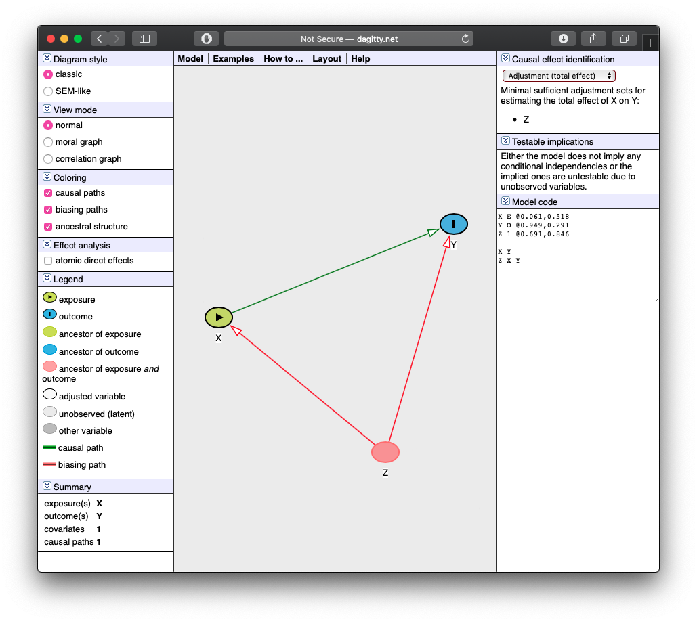
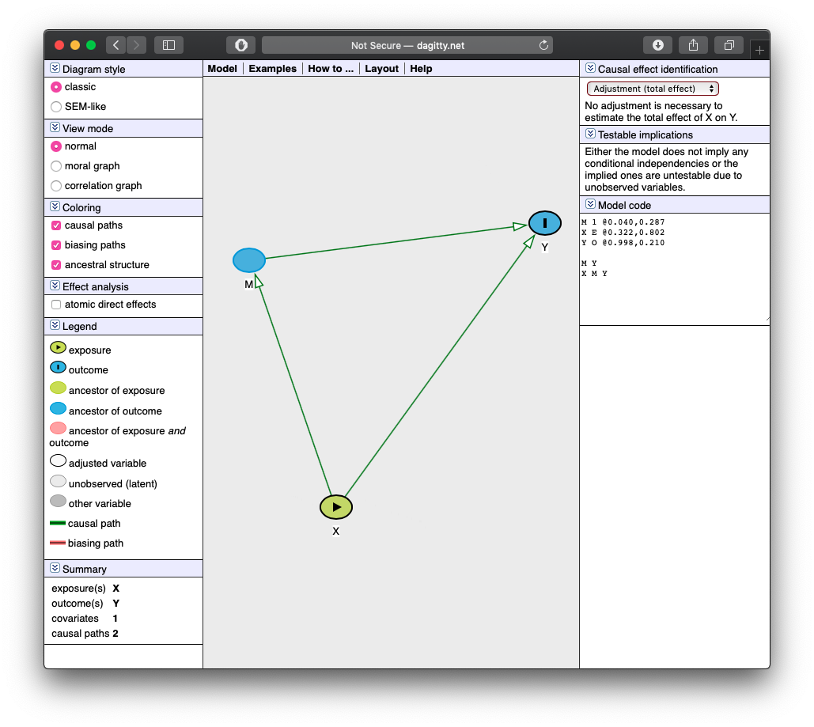
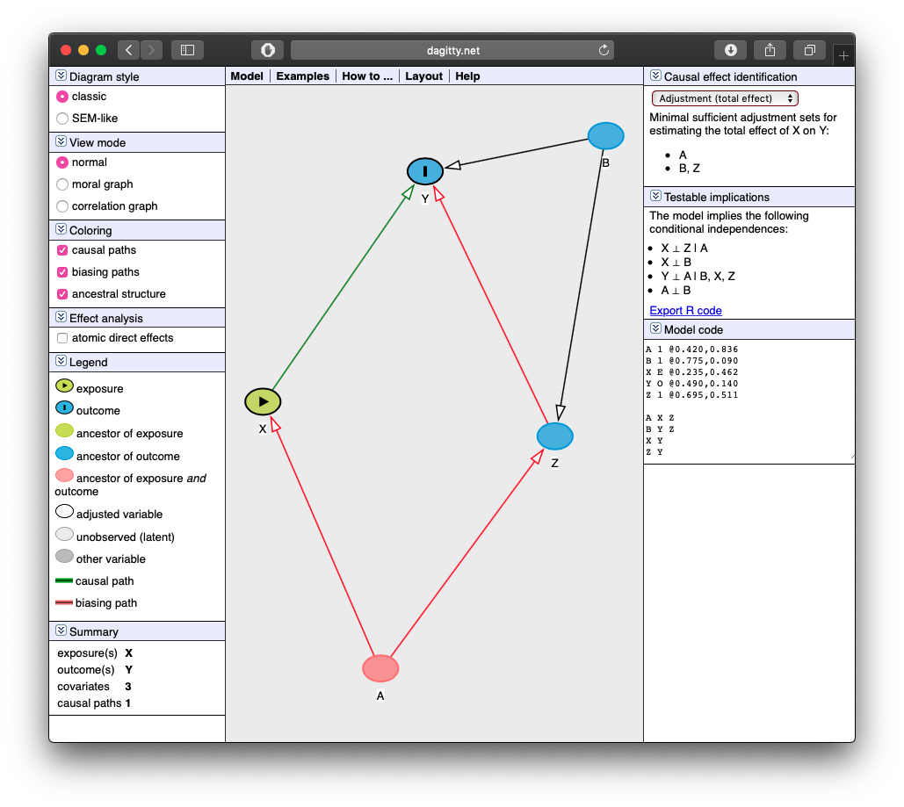
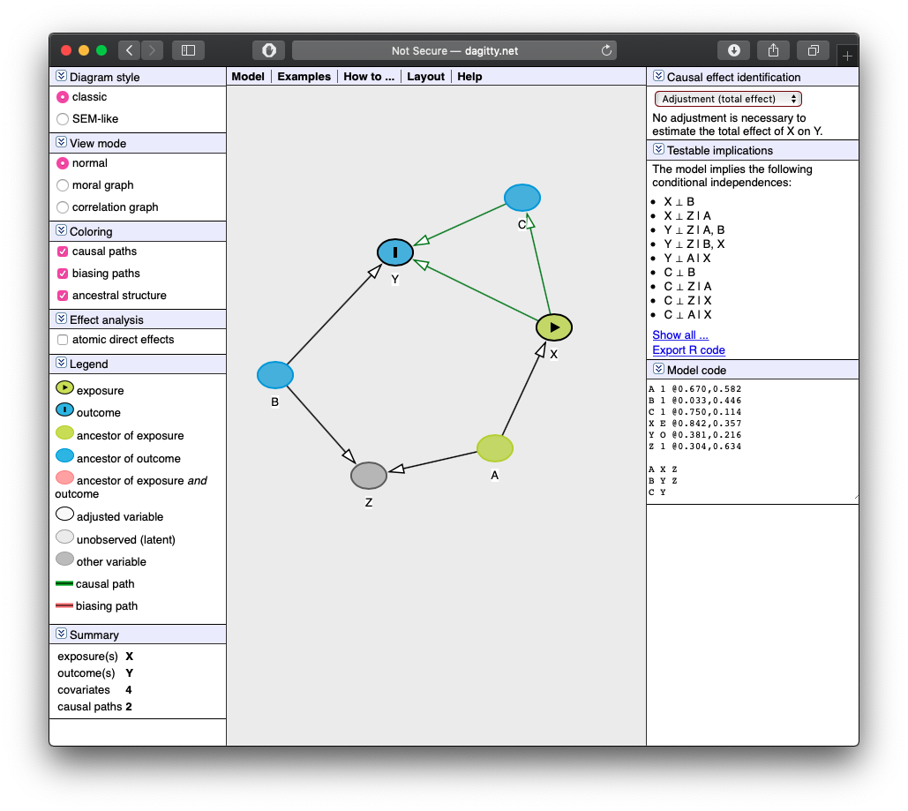
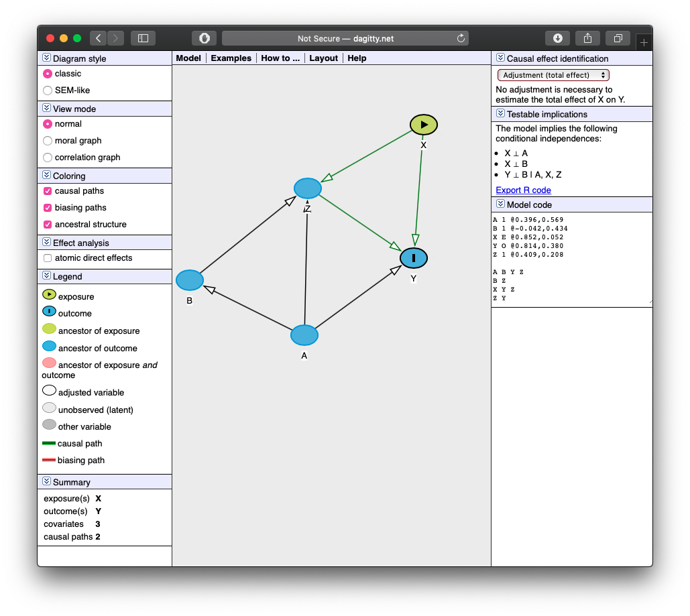

```{r setup, include=FALSE}
knitr::opts_chunk$set(echo = TRUE,
                      message = FALSE,
                      warning = FALSE,
                      fig.retina =3)
library(tidyverse)
```

For each of the following DAGs:^[You can use [`dagitty.net`](http://dagitty.net) to help you, but you should start trying to recognize these on your own!]

i. Write out *all* of the causal pathways from `X` (treatment of interest) to `Y` (outcome of interest).
ii. Identify which variable(s) need to be controlled for to estimate the causal effect of `X` on `Y`.
iii. Draw the DAGs in `r` using `ggdag`. After setting up the dag with `dagify()` (and specifying `exposure` and `outcome` inside `dagify`), pipe that into `ggdag()`. Try again piping it instead into `ggdag_status()` (to highlight what is X and what is Y). Try again piping it instead into `ggdag_adjustment_set()` to show what needs to be controlled.

Don’t forget to install `ggdag`!

```{r}
# install.packages("ggdag")
library(ggdag) # load
```

## Question 1

```{r, echo = F}
dagify(Y~X+Z,
       X~Z,
       exposure = "X",
       outcome = "Y") %>% 
  ggdag(stylized = FALSE, seed=1)+theme_dag_blank()+theme(legend.position = "none")
```

### Part I

Pathways:

1. $X \rightarrow Y$ (causal, front door)
2. $X \leftarrow Z \rightarrow Y$ (not causal, back door)



### Part II

$Z$ needs to be controlled for, since it is opening a backdoor path.


### Part III

```{r}
dag1<-dagify(Y~X+Z,
       X~Z,
       exposure = "X",
       outcome = "Y")

dag1 %>%
  ggdag_status(seed=1)+theme_dag_blank()
```

```{r}
dag1 %>%
  ggdag_paths(seed=1)+theme_dag_blank()
```

```{r}
dag1 %>%
  ggdag_adjustment_set()+theme_dag_blank()
```

## Question 2

```{r, echo = F}
dagify(Y~X+M,
       M~X,
       exposure = "X",
       outcome = "Y") %>% 
  ggdag(stylized = FALSE, seed=1)+theme_dag_blank()+theme(legend.position = "none")
```

### Part I

Pathways:

1. $X \rightarrow Y$ (causal, front door)
2. $X \rightarrow M \rightarrow Y$ (causal, front door)

### Part II

Nothing should be controlled for, since $M$ is a mediator, and part of the effect of $X$ on $Y$



### Part III

```{r}
dag2<-dagify(Y~X+M,
       M~X,
       exposure = "X",
       outcome = "Y")

dag2 %>%
  ggdag_status(seed=1)+theme_dag_blank()
```

```{r}
dag2 %>%
  ggdag_paths(seed=1)+theme_dag_blank()
```

```{r}
dag2 %>%
  ggdag_adjustment_set()+theme_dag_blank()
```

## Question 3

```{r, echo = F}
dagify(Y~X+Z+B,
       Z~B+A,
       X~A,
       exposure = "X",
       outcome = "Y") %>% 
  ggdag(stylized = FALSE, seed=1)+theme_dag_blank()+theme(legend.position = "none")
```

### Part I

Pathways:

1. $X \rightarrow Y$ (causal, front door)
2. $X \leftarrow A \rightarrow Z \rightarrow Y$ (not causal, back door)
3. $X \leftarrow A \rightarrow Z \leftarrow B \rightarrow Y$ (not causal, back door)
  
### Part II

Backdoor path 3 is closed by the collider at $Z$. Backdoor path 2 remains open, so we need to control for $A$. (If we blocked $Z$ to close path 2, that would open up backdoor path 3!) Only $A$ should be controlled for.

Alternatively, we could control for $B$ and $Z$.



### Part III 

```{r}
dag3<-dagify(Y~X+Z+B,
       Z~B+A,
       X~A,
       exposure = "X",
       outcome = "Y")

dag3 %>%
  ggdag_status(seed=1)+theme_dag_blank()
```

```{r}
dag3 %>%
  ggdag_paths(seed=1)+theme_dag_blank()
```

```{r}
dag3 %>%
  ggdag_adjustment_set()+theme_dag_blank()
```

## Question 4

```{r, echo = F}
dagify(Y~X+B+C,
       Z~B+A,
       X~A,
       C~X,
       exposure = "X",
       outcome = "Y") %>% 
  ggdag(stylized = FALSE, seed=2)+theme_dag_blank()+theme(legend.position = "none")
```

### Part I

Pathways:

1. $X \rightarrow Y$ (causal, front door)
2. $X \rightarrow C \rightarrow Y$ (causal, front door)
3. $X \leftarrow A \rightarrow Z \rightarrow B \rightarrow Y$ (not causal, back door)

### Part II

Path 2 is a front door path we want to leave open. Backdoor path 3 is closed by the collider at $Z$. Nothing needs to be controlled for!




### Part III

```{r}
dag4<-dagify(Y~X+B+C,
       Z~B+A,
       X~A,
       C~X,
       exposure = "X",
       outcome = "Y")

dag4 %>%
  ggdag_status(seed=1)+theme_dag_blank()
```

```{r}
dag4 %>%
  ggdag_paths(seed=1)+theme_dag_blank()
```

```{r}
dag4 %>%
  ggdag_adjustment_set()+theme_dag_blank()
```


## Question 5

```{r, echo = F}
dagify(Y~X+Z+A,
       Z~X+A+B,
       B~A,
       exposure = "X",
       outcome = "Y") %>% 
  ggdag(stylized = FALSE, seed=2)+theme_dag_blank()+theme(legend.position = "none")
```

### Part I

Pathways:

1. $X \rightarrow Y$ (causal, front door)
2. $X \rightarrow Z \rightarrow Y$ (causal, front door)
3. $X \rightarrow Z \leftarrow A \rightarrow Y$ (not causal, back door)
4. $X \rightarrow Z \leftarrow B \rightarrow A \rightarrow Y$ (not causal, back door)
  
### Part II

Path 2 is a front door path we want to leave open. Backdoor path 3 is closed by the collider at $Z$. Backdoor path 4 is closed by the collider at $Z$. We don't want to control for anything!



### Part III 

```{r}
dag5<-dagify(Y~X+Z+A,
       Z~X+A+B,
       B~A,
       exposure = "X",
       outcome = "Y")

dag5 %>%
  ggdag_status(seed=1)+theme_dag_blank()
```

```{r}
dag5 %>%
  ggdag_paths(seed=1)+theme_dag_blank()
```

```{r}
dag5 %>%
  ggdag_adjustment_set()+theme_dag_blank()
```
