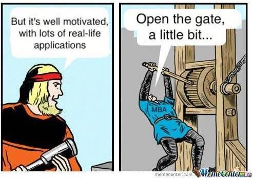
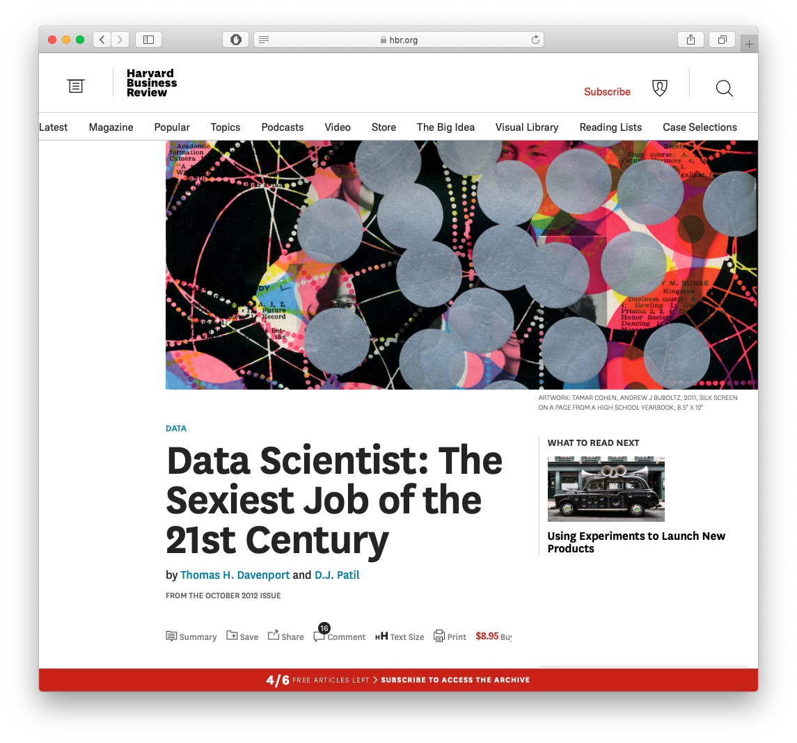
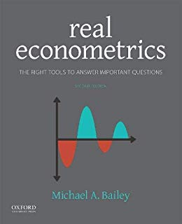

```{r setup, include=FALSE}
options(htmltools.dir.version = FALSE)
knitr::opts_chunk$set(echo=F,
                      message=F,
                      warning=F,
                      fig.retina=3,
                      fig.align = "center")
library("tidyverse")

theme_slides <- theme_light() + 
  theme(
    text = element_text(family = "Fira Sans", size = 24)
  )
```

class: inverse, center, middle

# What is Econometrics?

---

# Why Everyone, Yes *Everyone*, Should Learn Statistics

.pull-left[
.center[


[SMBC](https://www.smbc-comics.com/comic/why-i-couldn39t-be-a-math-teacher)
]
]

--

.pull-right[
.center[


[SMBC](https://www.smbc-comics.com/comic/2010-12-01)
]
]
---

# We're Not so Good at Statistics: Votes I

- Votes in the U.S. House of Representatives in favor of .hi-turquoise[passing] the *Civil Rights Act of 1964*:

.left-column[
| Democrat | Republican |
|----------|------------|
| 61%      | 80%        | 
]

--

.pull-right[
- Simple enough: "on average, Republicans tended to vote for passage more than Democrats"
]

---

# We're Not so Good at Statistics: Votes II

- Broken down further by Northern vs. Southern states:

.left-column[

|       |Democrat  | Republican |
|-------|----------|------------|
| **North** | .hi[94%]      | 85%       | 
|           | (145/154)| (138/162) |
| **South** | .hi[7%]      | 0%        |
|           | (7/94)   | (0/10)    |
| **Overall** | 61%    | .hi-purple[80%]       |
|             | (152/248) | (138/172) |
]

--
.right-column[
- Larger proportion of Democrats $(\frac{94}{248}$, 38%) than Republicans $(\frac{10}{172}$, 6%) were from South

- The 7% of southern Democrats voting *for* the Act dragged down the Democrats' *overall* percentage more than the 0% of southern Republicans
]
---

# We're Not So Good at Statistics: Kidney Stones I

.pull-left[
- Suppose you suffer from kidney stones, your doctor offers you .hi[treatment A] or .hi-purple[treatment B]

- In clinical trials, .hi[Treatment A] was effective for a higher percentage of patients with *large* stones and a higher percentage of patients with *small* stones

- .hi-purple[Treatment B] was effective for a larger percentage of patients overall than .hi[treatment A]

- Wait, what?
]

.pull-right[

.center[

]
]
---

# We're Not So Good at Statistics: Kidney Stones II

.pull-left[
From a real [medical study](https://www.ncbi.nlm.nih.gov/pmc/articles/PMC1339981/): 

|       | .hi[Treatment A]  | .hi-purple[Treatment B] |
|-------|----------|------------|
| **Small Stones** | .hi[93%]      | 87%       | 
|                  | (81/87)| (234/270) |
| **Large Stones** | .hi[73%]       | 69%        |
|                  | (192/263)   | (55/80)    |
| **Overall**      | 78%    | .hi-purple[83%]       |
|                  | (273/350) | (289/350) |
]

.footnote[

.source[C R Charig, D R Webb, S R Payne, and J E Wickham, 1986, "Comparison of treatment of renal calculi by open surgery, percutaneous nephrolithotomy, and extracorporeal shockwave lithotripsy," *Br Med J* (Clin Res Ed) 292(6524): 879–882. ]
]

--

.pull-right[
- The *sizes* of the two groups (i.e. who gets A vs B) are *very* different
]


---

# We're Not So Good at Statistics: Kidney Stones III

.pull-left[
.center[
```{r, echo=F, fig.retina=3}
library("ggdag")
dagify(Out~Treat+Size,
       Treat~Size
      ) %>% 
  #tidy_dagitty() %>%
  ggdag_parents("Out", stylized = FALSE, seed = 3)+theme_dag_blank()+theme(legend.position = "none")

```
]
]

.pull-right[
- The *sizes* of the two groups (i.e. who gets A vs B) are *very* different
- A .hi-purple[lurking variable] in the study is the severity of the case: doctors tended to give treatment B for less severe cases
]

---

# Simpson's Paradox

.pull-left[
.content-box-red[

.red[**Simpson's Paradox**:] The correlation between two variables can change (even reverse!) when additional variables are considered]

]
.pull-right[
.center[]
]

---

# We're Not so Good at Statistics: Smoking I

.pull-left[
- 1964: U.S. Surgeon General issued a [report](http://profiles.nlm.nih.gov/ps/access/NNBBMQ.pdf) claiming that cigarette smoking causes lung cancer

- Evidence based primarily on *correlations* between cigarette smoking and lung cancer
]
.pull-right[


]

---

# We're Not so Good at Statistics: Smoking II

.pull-left[
- Tobacco companies attacked the report, naturally
]
.pull-right[


]

---

# We're Not so Good at Statistics: Smoking III

.left-column[
.center[


Ronald A. Fisher

1890--1924
]
]
.right-column[

- But [so did R. A. Fisher](https://priceonomics.com/why-the-father-of-modern-statistics-didnt-believe/), the "father of modern statistics"
]

---

# We're Not so Good at Statistics: Smoking IV

.pull-left[
- There could be a confounding variable ("smoking gene") that causes *both* lung cancer *and* the urge to smoke

- Would imply: decision to smoke or not would have *no impact* on lung cancer! 

- Correlation between smoking and cancer is spurious!

]

.pull-right[
.center[
```{r, echo=F, fig.retina=3}
library("ggdag")
dagify(Canc~Gene+Smok,
       Smok~Gene,
       coords=list(
         x=c(Smok=1,Canc=2, Gene=1.5),
         y=c(Smok=1,Canc=1, Gene=2)
         )) %>% 
  #tidy_dagitty() %>%
  ggdag_parents("Canc", stylized = FALSE)+theme_dag_blank()+theme(legend.position = "none")

```
]
]

---

# Correlation Does Not Imply Causation I

- The goal of every intro statistics class ever

--

.center[


[XKCD: Correlation](https://xkcd.com/552/)
]

---

# Correlation Does Not Imply Causation II

.center[


[Spurious Correlations](http://www.tylervigen.com/spurious-correlations)
]

---

# Correlation *Can* Imply Causation...

.pull-left[

- It's always good to be skeptical of causal claims

- But this is actually where .hi[econometrics] shines

]

.pull-right[

.center[

]
]

---

# ...With the Right Tools

.pull-left[

- .hi[Econometrics] is the application of statistical tools to *quantify* economic relationships in the real world

- Uses real data to
    - test economic hypotheses
    - quantitatively estimate the magnitude of relationships between economic variables
    - forecast future events 


]

.pull-right[

.center[

]
]

---

# Causal Inference I

.left-column[
.center[

]
]

.right-column[

- What sets econometrics apart from mere statistics (or uses of statistics in other disciplines) is its role in .hi[causal inference]

- We can, with proper tools and interprations, make *quantitative* *causal* claims
    - about the effects of individual choices
    - about the effects of policy interventions
    - about the impact of political institutions
    - about economic history and economic development
    - etc...
]

---

# Causal Inference II

.left-column[
.center[

]
]

.right-column[

> A 50% increase in police presence in a metropolitan area lowers crime rates by 15%, on average<sup>1</sup>

> Being an incumbent in office raises the probability of re-election by 40-45 percentage points<sup>2</sup>

> European cities with at least one printing press in 1500 were at least 29% more likely to become Protestant by 1600<sup>3</sup>

]

.footnote[
.source[<sup>1</sup> Klick, Jonathan and Alexander Tabarrok, 2005, "Using Terror Alert Levels to Estimate the Effect of Police on Crime," *Journal of Law and Economics* 48(1): 267-279

<sup>2</sup> Lee, David S, 2001, "The Electoral Advantage to Incumbency and Voters' Valuation of Politicians' Experience: A Regression Discontinuity Analysis of Elections to the U.S," *NBER Working Paper* 8441

<sup>3</sup> Rubin, Jared, 2014, "Printing and Protestants: An Empirical Test of the Role of Printing in the Reformation," *Review of Economics and Statistics* 96(2): 270-286
]
]
---

# Example 1: Education

.pull-left[
.content-box-green[
.green[Does reducing class sizes improve student performance?]
]
]

.pull-right[

]

---

# Example 1: Education

.pull-left[
.content-box-green[
.green[Does reducing class sizes improve student performance?]

- A policy-relevant tradeoff with a budget constraint
- What is the *precise* effect of class size on performance?
- Is it worth hiring new teachers and building more schools over?
]
]

.pull-right[

]

---

# Example 2: Discrimination in Lending

.pull-left[
.content-box-green[
.green[Is there racial discrimination in home mortgage lending?]
]
]

.pull-right[

]

---

# Example 2: Discrimination in Lending

.pull-left[
.content-box-green[
.green[Is there racial discrimination in home mortgage lending?]

- Boston Fed: 28% of African-Americans are denied mortgages compared to only 9% of White Americans
- Is this due to factors such as credit history, income, or discrimination *purely* because of race? 
]
]

.pull-right[

]

---

# Example 3: Public Health and Public Finance

.pull-left[
.content-box-green[
.green[How much do state cigarette taxes reduce smoking rates?]

]
]

.pull-right[

]

---

# Example 3: Public Health and Public Finance

.pull-left[
.content-box-green[
.green[How much do state cigarette taxes reduce smoking rates?]

.smallest[
- Econ 101: raise price $\implies$ lower quantity consumed

- What is the *price elasticity of demand* for smoking?

- How much tax revenue will this generate?

- Probably: $Taxes \rightarrow Smokers$

- Maybe?: $Taxes \leftarrow Smokers$
]
]
]

.pull-right[

]

---

class: inverse, center, middle

# About this Class

---

# Real Talk I

.center[

]

---

# Real Talk I

.center[

]

---

# Real Talk I

.center[

]

---

# Real Talk II

.pull-left[
- This will be one of the hardest courses you take at Hood 
- There will be moments where you have no idea WTF is going on (*this is normal*)
- Yes, you can still get an **A**
]

.pull-right[
.center[

]
]

---

# This Class Is

.pull-left[

- **Economics**: take your *preexisting* intuition and models for causal inference
- **Statistics**: add regression and statistical inference
- **Computer Programming**: using `R` and `R Studio` for analyzing and presenting data
]

.pull-right[
.center[
```{r, echo=F}
library("ggplot2")
class<-data.frame(Percentage=c(50,40,10),
                  Subject=c("Economics","Statistics","Computer Programming"))

#ggplot(class, aes(x="", y=Percentage, fill=Subject))+
#  geom_col()+theme_void()+scale_fill_viridis_d()

library(treemapify)
ggplot(class, aes(area=Percentage, fill=Subject))+
  geom_treemap()+
  guides(fill=F)+
  geom_treemap_text(aes(label = Subject),
                  colour = "white",
                  place = "topleft",
                  reflow = T,
                  grow = TRUE)+
  #scale_fill_brewer(palette="viridis")+
  scale_fill_viridis_d()
```
]
]

---

# This Class Is

.pull-left[

### .hi-purple[Old School Statistics Courses]

.smallest[
- $\bar{x} = \frac{1}{n} \displaystyle\sum^n_{i=1} x_i$

- $\sigma_x = \displaystyle \sqrt{\frac{1}{n} \sum^n_{i=1} (x_i-\bar{x})^2}$

- $r_{xy}= \displaystyle \frac{\displaystyle\sum^n_{i=1}(x_i-\bar{x})(y_i-\bar{y})}{\sqrt{\displaystyle\sum^n_{i=1}(x_i-\bar{x})^2\sum^n_{i=1}(y_i-\bar{y})^2}}$

- Use pre-cleaned "toy" data, if at all
]
]

--

.pull-right[

### .hi[Hip New Data Science Courses]

- `mean(x)`


- `sd(x)`


- `cor(x, y)`


- Clean and manipulate raw data from scratch (like *real life*!)
]

---

# Prerequisites

- **Courses**: 
  - ECON 205
  - ECON 206
  - ECON 305 or ECON 306
  - MATH 112 or ECMG 212

--

- **Math Skills**:
  - Basic algebra
  - Probability-ish
  - Statistics-ish

--

- **Computer Science Skills**:
  - None

---

# What You'll Get Out of This Class

.pull-left[

By the end of this semester, you will: 

1. understand how to evaluate statistical and empirical claims;
2. use the fundamental models of causal inference and research design;
3. gather, analyze, and communicate with real data in R.
]

.pull-right[
.center[

]
]

---

# This Class Opens Doors

.center[

]

---

# This Class Gives You a Hybrid of Skills

.pull-left[

- **"Data Science"**: ???
- **Causal Inference**: economists' comparative advantage!

]

.pull-right[
.center[
```{r, echo=F}
library("ggplot2")
class2<-data.frame(Percentage=c(50,50),
                  Subject=c("Data Science","Causal Inference"))

#ggplot(class, aes(x="", y=Percentage, fill=Subject))+
#  geom_col()+theme_void()+scale_fill_viridis_d()

library(treemapify)
ggplot(class2, aes(area=Percentage, fill=Subject))+
  geom_treemap()+
  guides(fill=F)+
  geom_treemap_text(aes(label = Subject),
                  colour = "white",
                  place = "topleft",
                  reflow = T,
                  grow = TRUE)+
  #scale_fill_brewer(palette="viridis")+
  scale_fill_viridis_d()
```
]
]
---

# Data Science I 

.pull-left[
.center[
<blockquote class="twitter-tweet" data-lang="en"><p lang="en" dir="ltr">Data Scientist (n.): Person who is better at statistics than any software engineer and better at software engineering than any statistician.</p>&mdash; Josh Wills (@josh_wills) <a href="https://twitter.com/josh_wills/status/198093512149958656?ref_src=twsrc%5Etfw">May 3, 2012</a></blockquote>
<script async src="https://platform.twitter.com/widgets.js" charset="utf-8"></script>
]
]
.pull-right[

.center[

]
]

---

# Data Science II

.pull-left[
.center[
[Harvard Business Review](https://hbr.org/2012/10/data-scientist-the-sexiest-job-of-the-21st-century)



]
]

.pull-right[

.center[
[LinkedIn 2018 Emerging Jobs Report](https://economicgraph.linkedin.com/research/linkedin-2018-emerging-jobs-report)


]
]

---

# R Skills are In Demand

.pull-left[
```{r, echo=F, warning = F, message = F, fig.retina = 3}
library(tidyverse)

kaggle <- read_csv("~/Downloads/kaggle-survey-2018/multipleChoiceResponses.csv")

clean <- kaggle %>%
  select(Q1, Q2, Q3, Q4, Q5, Q6, Q7, Q8, Q9, Q17, Q18) %>%
  rename(gender = Q1,
         age = Q2,
         country = Q3,
         education = Q4,
         major = Q5,
         job_title = Q6,
         industry = Q7,
         experience = Q8,
         salary = Q9,
         top_lang = Q17,
         rec_lang = Q18) %>%
  slice(-1)

clean %>%
  filter(!is.na(top_lang)) %>%
  group_by(top_lang) %>% 
  summarize(n = n()) %>%
  arrange(desc(n)) %>%
  mutate(perc = round((n/sum(n) * 100),2)) %>%
  slice(1:10) %>%
  ggplot(., aes(x = reorder(top_lang, n), 
                y = perc,
                fill = top_lang))+
  geom_col()+
  scale_y_continuous(breaks=seq(0,60,10))+
  theme_minimal()+
  labs(x = "Programming Language",
       y = "Percent",
       title = "Programming Languages Used Most by Data Scientists",
       caption = "Source: 2018 Kaggle Data Science Survey")+
  coord_flip()+
  guides(fill = F)+
  scale_fill_viridis_d()
```
]

.pull-right[
.source[[Kaggle Data Science Survey 2018](https://www.kaggle.com/kaggle/kaggle-survey-2018)]
]

---

# Yada Yada Machine Learning

.pull-left[

.center[

]
]

.pull-right[

> "When you’re fundraising, it’s AI. When you’re hiring, it’s ML. When you’re implementing, it’s logistic regression."

> - everyone on Twitter ever ([Source](https://towardsdatascience.com/no-machine-learning-is-not-just-glorified-statistics-26d3952234e3))
]

---

# Causal Inference I

.pull-left[
- Machine learning and artificial intelligence are "dumb"<sup>1</sup>
- With the right models and research designs, we *can* say "X causes Y" and quantify it!
- Economists are in a unique position to make *causal* claims that mere statistics cannot
]

.pull-right[

]

.footnote[<sup>1</sup> For more, see [my blog post](https://ryansafner.com/post/econometrics-data-science-and-causal-inference/), and Pearl & MacKenzie (2018), *The Book of Why*]
---

# Causal Inference II

.pull-left[
.center[

[Harvard Business Review](https://hbr.org/2019/02/why-tech-companies-hire-so-many-economists)
]
]
.pull-right[

.font80[
"First, the field of economics has spent decades developing a toolkit aimed at investigating empirical relationships, focusing on techniques to help understand which correlations speak to a causal relationship and which do not. This comes up all the time — does Uber Express Pool grow the full Uber user base, or simply draw in users from other Uber products? Should eBay advertise on Google, or does this simply syphon off people who would have come through organic search anyway? Are African-American Airbnb users rejected on the basis of their race? These are just a few of the countless questions that tech companies are grappling with, investing heavily in understanding the extent of a causal relationship."
]
]

---

# Building Good Workflow Habits

.pull-left[

- I will show you the tools to make your workflow:
    - Reproducible
    - Computer- and Human-Readable (!)
    - Automated
    - All in one program
]

.pull-right[


]

---

# A Quick Example

.left-code[

```{r gapplot, eval=F, echo=T}
library("gapminder")

ggplot(data = gapminder, 
       aes(x = gdpPercap,
           y = lifeExp,
           color = continent))+
  geom_point(alpha=0.3)+
  geom_smooth(method = "lm")+
	scale_x_log10(breaks=c(1000,10000, 100000),
	              label=scales::dollar)+
	labs(x = "GDP/Capita",
	     y = "Life Expectancy (Years)")+
  facet_wrap(~continent)+
  guides(color = F)+
  theme_light()
```
]

.right-plot[
.center[
```{r, ref.label="gapplot", echo=F, fig.retina=3, out.width="72.5%"}
```
]
]
---

# Logistics: Hybrid Course

.smaller[
- .hi[hybrid]: more .hi-purple[synchronous] material than .hi-turquoise[asynchronous] material

- I will always be teaching .hi[remotely]
  - A classroom is available to you
  - I may make occasional visits to campus if you *need* something in person (TBD)

- Office hours: Tu/Th 3:30-5:00 PM on Zoom
  - <i class="fas fa-video"></i> Zoom link in Blackboard's `LIVE CLASS SESSIONS` link
  - <i class="fab fa-slack"></i> Slack channels

- Teaching Assistant(s): TBD
  - grade HWs & hold (likely virtual) office hours
]

---

# Logistics: Hybrid Course

- We will have .hi-purple[synchronous] sessions Tues/Thurs 11:30 AM-12:45 PM on **<i class="fas fa-video"></i> Zoom**

- Lecture videos will be posted on **Blackboard** via Panopto for students unable to join synchronously
  - If you were present, you do not need to watch the video (again)!
  - You are not *required* to attend synchronously, but it will help you

- All graded assignments are .hi-turquoise[asynchronous]
  - (Probably) submitted on Blackboard by 11:59 PM Sundays
  - (Probably) timed exams on Blackboard

---

# Assignments

.pull-left[

- Research project:
    - Come up with a testable research question
    - Find data
    - Analyze data
    - Present your results (in writing and verbally)
- HWs
- Midterm, Final exam (in-class, closed notes)
]

.pull-right[
.center[
```{r, echo = F}
library("tidyverse")
assignments <- tribble(
  ~"",  ~Assignment, ~Percent,
  "1", "Research Project", "30%",
  "n"     , "Homeworks (Average)", "25%",
  "1", "Midterm", "20%",
  "1"     , "Final", "25%"
)
knitr::kable(assignments, "html")
```
]
]

---

# Your "Textbooks"

.pull-left[
.center[

]
]
.pull-right[
.center[

]
]

---

# Tips for Success In This Course

.pull-left[
- *Take notes. On paper. Really.*

- **Work together** on assignments and study together.

- Ask questions, come to office hours. Don't struggle in silence, you are not alone!

- .hi[You are learning how to learn]<sup>1</sup>

- See the [reference page](http://metricsf19.classes.ryansafner.com/reference) for more
]

.pull-right[
.center[

]
]

.footnote[<sup>1</sup> A properly worded Google search will become your secret weapon. Believe me. It's still mine.]

---

# Course Website

.pull-left[
.center[


]
]

.pull-right[
.center[

]
]

[metricsF20.classes.ryansafner.com](http://metricsF20.classes.ryansafner.com)

---

# Roadmap for the Semester

.center[

]
