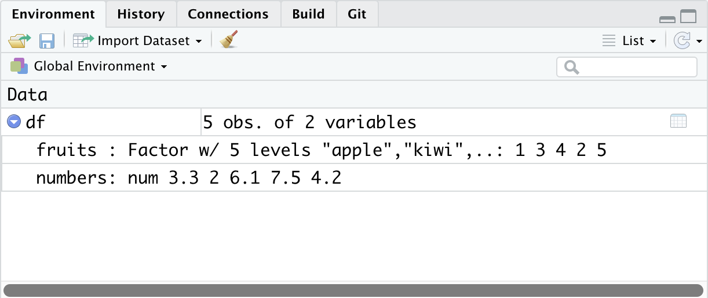

```{r setup, include=FALSE}
options(htmltools.dir.version = FALSE)
knitr::opts_chunk$set(message=F,
                      warning=F)
library(tidyverse)

```

class: inverse

# Outline

## [Meet R and R Studio](#9)

## [Ways to Use R](#16)

## [Coding Basics](#22)

## [Types of R Objects](#40)

## [Data Structures](#45)

## [Working with Objects](#49)

## [Working with Data](#66)

---

# Data Science 

- .hi[You go into data analysis with the tools you know, not the tools you need]

- The next 2-3 weeks are all about giving you the tools you need 
    - Admittedly, a bit before you know what you need them *for*

- We will extend them as we learn specific models

---

# Why Not Excel? I

.center[

]

---

# Why Not Excel? II

.center[

]

---

# Why Use R?

.pull-left[

- **Free** and **open source**

- A very large community
    - Written by statisticians for statistics
    - Most packages are written for `R` first
    
- Can handle virtually any data format

- Makes replication easy

- Can integrate into documents (with `R markdown`)

- R is a *language* so it can do *everything*
    - A good stepping stone to learning other languages like *Python*

]

.pull-right[

.center[

]

]

---

# Excel and Stata Can't Do This (In Slides)

.left-code[

```{r gapplot, eval=F, echo=T}
library("gapminder")

ggplot(data = gapminder, 
       aes(x = gdpPercap,
           y = lifeExp,
           color = continent))+
  geom_point(alpha=0.3)+
  geom_smooth(method = "lm")+
	scale_x_log10(breaks=c(1000,10000, 100000),
	              label=scales::dollar)+
	labs(x = "GDP/Capita",
	     y = "Life Expectancy (Years)")+
  facet_wrap(~continent)+
  guides(color = F)+
  theme_light()
```
]

.right-plot[
.center[
```{r, ref.label="gapplot", echo=F, fig.retina=3, out.width="72.5%"}
```
]
]

---

# Or This: Execute R Code Inside Your Documents

.pull-left[
# Code

  ```{r, eval=F, echo=T}
  library(gapminder)
  ```

The average GDP per capita is $`` `r
round(mean(gapminder$gdpPercap),2)` `` with a standard deviation of $`` `r
round(sd(gapminder$gdpPercap),2)` ``.  
]

.pull-right[
# Output

```{r, echo=F}
library(gapminder)
```

The average GDP per capita is $`r round(mean(gapminder$gdpPercap),2)` with a standard deviation of $`r round(sd(gapminder$gdpPercap),2)`. 

]

---

class: inverse, center, middle
# Meet R and R Studio

---

# *R* and *R Studio* I

.pull-left[
.smallest[
- .hi[R] is the programming language that executes commands

- .hi-purple[R Studio] is an integrated development environment (IDE) that makes your coding life a lot easier
  - Write code in scripts
  - Execute individual commands or entire scripts
  - Auto-complete, highlight syntax
  - View data, objects, and plots
  - Get help and documentation on commands and functions
  - Integrate code into documents with `R Markdown`
]
]

.pull-right[

.center[


R Studio
]
]

---

# *R* and *R Studio* II

.pull-left[

- .hi[R] is like your car's engine, .hi-purple[R Studio] is the dashboard

- You will do everything in .hi-purple[R Studio]

- .hi[R] itself is just a command language (you could run it in your computer's shell/terminal/command prompt)
]

.pull-right[

.center[


R Studio
]
]

---

# *R* and *R Studio* III

.pull-left[

R Studio has 4 window panes:

1. .hi-purple[Source]<sup>.red[1]</sup>: a text editor for documents, R scripts, etc.
2. .hi-purple[Console]: type in commands to run
3. .hi-purple[Browser]: view files, plots, help, etc
4. .hi-purple[Environment]: view created objects, command history, version control

]

.pull-right[

.center[


R Studio
]
]

.footnote[<sup>.red[1]</sup>May not be immediately visible until you create new files.]

---

# Learning...

.pull-left[

- .hi[You don't “*learn R*”, you learn *how to do things in R*]

- In order to do learn this, you need to learn *how to search for what you want to do*

]

--

.pull-right[

<blockquote class="twitter-tweet"><p lang="en" dir="ltr">My <a href="https://twitter.com/hashtag/rstats?src=hash&amp;ref_src=twsrc%5Etfw">#rstats</a> learning path:<br><br>1. Install R<br>2. Install RStudio<br>3. Google &quot;How do I [THING I WANT TO DO] in R?&quot;<br><br>Repeat step 3 ad infinitum.</p>&mdash; Jesse Mostipak (@kierisi) <a href="https://twitter.com/kierisi/status/898534740051062785?ref_src=twsrc%5Etfw">August 18, 2017</a></blockquote> <script async src="https://platform.twitter.com/widgets.js" charset="utf-8"></script> 

<blockquote class="twitter-tweet"><p lang="en" dir="ltr">A surprisingly large part of having expertise in a topic is not so much knowing everything about it but learning the language and sources well enough to be extremely efficient in google searches.</p>&mdash; Katie Mack (@AstroKatie) <a href="https://twitter.com/AstroKatie/status/1071442842873159681?ref_src=twsrc%5Etfw">December 8, 2018</a></blockquote> <script async src="https://platform.twitter.com/widgets.js" charset="utf-8"></script> 

]

---


# ...and Sucking

.center[

]

---

class: inverse, center, middle
# Ways to Use R

---

# 1. Using the Console

.pull-left[

- Type individual commands into the console window

- Great for testing individual commands to see what happens

- Not saved! Not reproducible! Not recommended!
]

.pull-right[

```{r, echo=T}
2+2
summary(mpg$hwy)
```
]

---

# 1. Using the Console 

.pull-left[

- Type individual commands into the console window

- Great for testing individual commands to see what happens

- Not saved! Not reproducible! Not recommended!
]

.pull-right[
.center[

]
]

---

# 2. Writing an R Script

.pull-left[

- Source pane is a text-editor

- Make `.R` files: all input commands in a single script

- Comment with `#`

- Can run any or all of script at once

- Can save, reproduce, and send to others!

]

.pull-right[

.pull-right[
.center[

]
]
]

---

# 3. Using Markdown

- A later lecture: `R Markdown`, a simple markup language to write documents in
    - **Optional**, but many students have enjoyed it and use it well beyond this class!
    
- Can integrate text, `R` code, figures, citations & bibliographies in a *single* plain-text file & output into a variety of formats: PDF, webpage, slides, Word doc, etc.

.center[

]

---

# For Today

- Practicing typing at the Command line/Console

- Learning different commands and objects relevant for data analysis

- Saving and running `.R` scripts

- Later: `R markdown`, literate programming, workflow management

- .hi-purple[Today may seem a bit overwhelming]
    - You don't need to know or internalize all of this today
    - Use this as a reference to come back to over the semester

---

class: inverse, center, middle
# Coding Basics

---

# Getting to Know Your Computer

- R assumes a default (often inconvenient) .hi["working directory"] on your computer
    - The first place it looks to `open` or `save` files 

- Find out where R this is with `getwd()`

- Change it with `setwd(path/to/folder)`<sup>.red[1]</sup>

- Soon I'll show you better ways where you won't ever have to worry about this

.footnote[<sup>.red[1]</sup> Note the path is OS-specific. For Windows it might be `C:/Documents/`. For Mac it is often your username folder.]

---

# Coding

.left-column[

.center[


Hadley Wickham

Chief Scientist, R Studio
]
]

.right-column[

> "There’s an implied contract between you and R: it will do the tedious computation for you, but in return, you must be completely precise in your instructions. Typos matter. Case matters." - [R for Data Science, Ch. 4](https://r4ds.had.co.nz/workflow-basics.html)
]

---

# Say Hello to My Little Friend

.center[

]

---

# Say Hello to My Better Friend

.center[

]

---

# R Is Helpful Too!

- type `help(function_name)` or `?(function_name)` to get documentation on a function
.center[

From Kieran Healy's excellent (free online!) [book on Data Visualization](http://socviz.co/).]


]
---

# Tips for Writing Code

- Comment, comment, comment!
- The hashtag `#` starts a comment, R will ignore everything on the rest of that line

```{r, eval=F}
# Run regression of y on x, save as reg1 
reg1<-lm(y~x, data=data) #runs regression 
summary(reg1$coefficients) #prints coefficients
```

- Save often!
  - Write scripts that save the commands that did what you wanted (and comment them!)
  - Better yet, use a version control system like Git (I hope to cover this later)

---

# Style and Naming

.smaller[
- Once we start writing longer blocks of code, it helps to have a consistent (and human-readable!) style
- I follow [this style guide](https://adv-r.had.co.nz/Style.html) (you are not required to)<sup>.red[1]</sup>

- Naming objects and files will become important<sup>.red[2]</sup>
    - DO NOT USE SPACES! You've seen seen webpages intended to be called `my webpage in html` turned into `http://my%20webpage%20in%20html.html`

```{r,eval=F}
i_use_underscores
some.people.use.snake.case
othersUseCamelCase
```
]

.footnote[<sup>.red[1]</sup> Also described in [today's course notes page](http://metricsF20.classes.ryansafner.com/class/1.2-class/) and the course [reference page](http://metricsF20.classes.ryansafner.com/reference).

<sup>.red[2]</sup> Consider your folders on your computer as well...]

---

# Coding Basics

- You'll have to get used to the fact that you are coding in commands to execute

- Start with the easiest: simple math operators and calculations:

--

```{r, eval=F}
> 2+2
```

```{r, echo=F}
2+2
```

--

- Note that R will ask for **input** with `>` and give you **output** starting with `## [1]`

---

# Coding Basics II

- We can start using more fancy commands

```{r}
2^3
```

--

```{r}
sqrt(25)
```

--

```{r}
log(6)
```

--

```{r}
pi/2
```

---

# Packages

.pull-left[
.smallest[
- Since R is open source, users contribute **packages**
    - Really it's just users writing custom functions and saving them for others to use
- Load packages with `library()`
    - e.g. `library("package_name")`
- If you don't have a package, you must first `install.packages()`<sup>.red[1]</sup> 
    - e.g. `install.packages("package_name")`
]
.footnote[<sup>.red[1]</sup> Yes, note the plural, even if it's just for one package!]

]
.pull-right[

.center[

]

]

---

# R: Objects and Functions

.pull-left[
- R is an .hi[**object-oriented**] programming language
- 99% of the time, you will be:

1. creating `objects`
    - assign values to an object with `=` (or `<-`)

2. running `functions` on `objects`
    - syntax: `function_name(object_name)`
]

.pull-right[

```{r}
# make an object
my_object = -c(1,2,3,4,5)

# look at it 
my_object

# find the sum
sum(my_object)

# find the mean 
mean(my_object)
```
]
---

# R: Objects and Functions II

.pull-left[
- Functions have ".hi[arguments]," the input(s)

- Some functions may have multiple inputs

- The argument of a function can be another function!

]

.pull-right[

```{r}
# find the sd
sd(my_object)

# round everything in my object to two decimals
round(my_object,2)

# round the sd to two decimals
round(sd(my_object),2)
```
]

---

class: inverse, center, middle

# Types of R Objects

---

# Numeric

.pull-left[
- .hi[Numeric] objects are just numbers<sup>.red[1]</sup>

- Can be mathematically manipulated
]

.pull-right[
```{r}
x = 2 
y = 3
x+y
x*y
```
]
.footnote[.red[<sup>1</sup>] If you want to get technical, R may call these `integer` or `double` if there are decimal values.]

---

# Character

.pull-left[
- .hi[Character] objects are **"strings"** of text held inside quote marks

- Can contain spaces, so long as contained within quote marks
]

.pull-right[
```{r}
name = "Ryan Safner"
address = "Washington D.C."

name
address
```
]

---

# Logical

.pull-left[
.smallest[
- .hi[Logical] objects are **binary** `TRUE` or `FALSE` indicators
- Used a lot to evaluate *conditionals*:
  - `>`, `<`: greater than, less than
  - `>=`, `<=`: greater than or equal to, less than or equal to
  - `==`, `!=`: is equal to, is not equal to<sup>.red[1]</sup>
  - `&in&` : Is a member of the set of ($\in$)
  - `&`: "AND"
  - `|`: "OR" 
]

.footnote[<sup>.red[1]</sup> One `=` *assigns* a value (like `<-`). Two `==` *evaluate* a conditional statement.]

]

.pull-right[

```{r}

z = 10 # set z equal to 10

z==10 # is z equal to 10?

"red"=="blue" # is red equal to blue?

z > 1 & z < 12 # is z > 1 AND < 12?

z <= 1 | z==10 # is z >= 1 OR equal to 10?

```

]

---

# Factor

- .hi[Factor] objects contain **categorical** data - membership in mutually exclusive groups

- Look like strings, behave more like logicals, but with more than two options

```{r, echo=F}
class = sample(c("freshman", "sophomore", "junior", "senior"),10, replace=T)
```

```{r, echo=F}
class = as.factor(class)
levels(class) = c('freshman','sophomore','junior', 'senior')
class
```

- We'll make much more extensive use of them later

```{r, echo=F}
class = ordered(class, levels=c('freshman','sophomore','junior', 'senior'))
class
```

---

class: inverse, center, middle

# Data Structures

---

# Vectors

.pull-left[

- `Vector`: the simplest type of object, just a collection of objects

- Make a vector using the combine `c()` function
]

.pull-right[

```{r}
# create a vector called vec
vec = c(1,"orange", 83.5, pi)

# look at vec
vec
```
]

---

# Data Frames I

.pull-left[

- `Data frame`: what we'll be using almost always

- Think like a "spreadsheet"

- Each *column* is a vector (variable)

- Each *row* is an observation (pair of values for all variables)
]

.pull-right[

```{r}
library("ggplot2")

diamonds

```

]
---

# Data Frames II 

.pull-left[

- Dataframes are really just combinations of (column) vectors

- You can make data frames by combinining named vectors with `data.frame()` or creating each column/vector in each argument 
]

.pull-right[
```{r}
# make two vectors
fruits = c("apple","orange","pear","kiwi","pineapple")
numbers = c(3.3,2.0,6.1,7.5,4.2)

# combine into dataframe
df = data.frame(fruits,numbers)

# do it all in one step (note the = instead of <-)
df = data.frame(fruits=c("apple","orange","pear","kiwi","pineapple"),
               numbers=c(3.3,2.0,6.1,7.5,4.2))

# look at it
df
```

]

---

class: inverse, center, middle
# Working with Objects

---

# Objects: Storing, Viewing, and Overwriting

- We want to store things in objects to run functions on them later
- Recall, any object is created with the assignment operator `<-` 

```{r}
my_vector = c(1,2,3,4,5)
```

- R will not give any output after an assignment

---

# Objects: Storing, Viewing, and Overwriting

- *View* an object (and list its contents) by typing its name

```{r}
my_vector
```

--

- objects maintain their values until they are assigned different values that will *overwrite* the object

```{r}
my_vector = c(2,7,9,1,5)
my_vector
```

---

# Objects: Checking and Changing Classes

- Check what type of object something is with `class()`

```{r}
class("six")
class(6)
```

--

- Can also use logical tests of `is.()` 

```{r}
is.numeric("six")
is.character("six")
```

---

# Objects: Checking and Changing Classes

- Convert objects from one class to another with `as.object_class()`
    - Pay attention: you can't convert non-numbers to `numeric`, etc! 

```{r}
as.character(6)
as.numeric("six")
```

---

# Objects: Different Classes and Coercion I

- Different types of objects have different rules about mixing classes
- Vectors can *not* contain different types of data
    - Different types of data will be "**coerced**" into the lowest-common denominator type of object

```{r}
mixed_vector = c(pi, 12, "apple", 6.32)
class(mixed_vector)
mixed_vector
```

---

# Objects: Different Classes and Coercion II

- Data frames can have columns with different types of data, so long as all the elements in each column are the same class<sup>.red[1]</sup>

.pull-left[
```{r}
df
```
]

.pull-right[

```{r}
class(df$fruits)
class(df$numbers)
```
]

.footnote[<sup>.red[1]</sup>Remember each column in a data frame is a vector!] 

---

# More on Data Frames I

- Learn more about a data frame with the `str()` command to view its structure

```{r}
class(df) 
str(df)
```

---

# More on Data Frames II

- Take a look at the first 5 (or `n`) rows with `head()`

```{r}
head(df)
head(df, n=2)
```

---

# More on Data Frames III

- Get summary statistics<sup>.red[1]</sup> by column (variable) with `summary()`

```{r}
summary(df)
```

.footnote[<sup>.red[1]</sup> For `numeric` data only; a frequency table is displayed for `character` or `factor` data]
---

# More on Data Frames IV

- Note, once you save an object, it shows up in the **Environment Pane** in the upper right window 
- Click the blue arrow button in front of the object for some more information

.center[

]
---

# More on Data Frames V

- `data.frame` objects can be viewed in their own panel by clicking on the name of the object
- Note you cannot edit anything in this pane, it is for viewing only 

.center[

]
---

# Functions Again I 

- Functions in R are vectorized, meaning running a function on a vector applies it to *each* element

```{r}
my_vector = c(2,4,5,10)
my_vector+4 # add 4 to all elements
my_vector^2 # square all elements
```

---

# Functions Again II

- But often we want to run functions on vectors that *aggregate* to a result (e.g. a statistic):

```{r}
length(my_vector) # how many elements
sum(my_vector) # add all elements
max(my_vector) # find largest element
min(my_vector) # find smallest element
mean(my_vector) # mean of all elements
median(my_vector) # median of all elements
sd(my_vector) # standard deviation
```

---

# Common Errors

- If you make a coding error (e.g. forget to close a parenthesis), R might show a `+` sign waiting for you to finish the command

```{r, echo=T, eval=F}
> 2+(2*3
+
```

- Either finish the command-- e.g. add `)`--or hit `Esc` to cancel

---

class: inverse, center, middle

# Working with Data

---

# Indexing and Subsetting I 

.pull-left[
.code60[
```{r, echo=F}
mtcars = mtcars %>%
  select(1:7) %>%
  slice(1:12)
```

```{r}
mtcars
```
]
]

.pull-right[
.smallest[
- Each element in a data frame is .h1[indexed] by referring to its row and column: `df[r,c]`
- To select elements by row and column (".h1[subset]"), type in the row(s) and/or column(s) to select
    - Leaving `r` or `c` blank selects *all* rows or columns
    - Select multiple values with `c()`<sup>1</sup>
    - Select a range of values with `:`
    - Don't forget the comma between `r` and `c`! 
]

.footnote[<sup>1</sup> You can also "negate" values, selecting everything *except* for values with a `-` in front of them.]
]

---

# Indexing and Subsetting II 

.pull-left[
.code60[
```{r}
mtcars
```
]
]

.pull-right[

### Subset by Row (Observations)
.code60[
```{r}
mtcars[1,] # first row
mtcars[c(1,3,4),] # first, third, and fourth rows
mtcars[1:3,] # first three rows
```
]
]

---

# Indexing and Subsetting III

.pull-left[
.code60[
```{r}
mtcars
```
]
]

.pull-right[

### Subset by Column (Variable)

.code60[
```{r}
mtcars[,6] # select column 6

mtcars[,2:4] # select columns 2 through 4
```
]
]
---

# Indexing and Subsetting IV

.pull-left[
.code60[
```{r}
mtcars
```
]
]

.pull-right[

### Subset by Column (Variable)

- Alternatively, double brackets `[[]]` selects a column by position

.code60[
```{r}
mtcars[[6]] # same thing
```
]
- Data frames can select columns by *name* with `$`

.code60[
```{r}
mtcars$wt
```
]
]

---


# Indexing and Subsetting V

.pull-left[
.code60[
```{r}
mtcars
```
]
]

.pull-right[

- Select observations (rows) that meet logical criteria

### Subset by Condition

.code60[
```{r}
mtcars[mtcars$wt>4,] # select obs with wt>4
mtcars[mtcars$cyl==6,] # select obs with exactly 6 cyl
mtcars[mtcars$wt<4 & mtcars$wt>2,] # select obs where 2<wt<4
mtcars[mtcars$cyl==4 | mtcars$cyl==6,] # select obs with 4 OR 6 cyl
```
]

]

---

# What's To Come

- Next class: data visualization with `ggplot2`

- And then: data wrangling with `tidyverse`

- And then: literate programming and workflow management with `R Markdown`

- Finally: back to econometric theory!