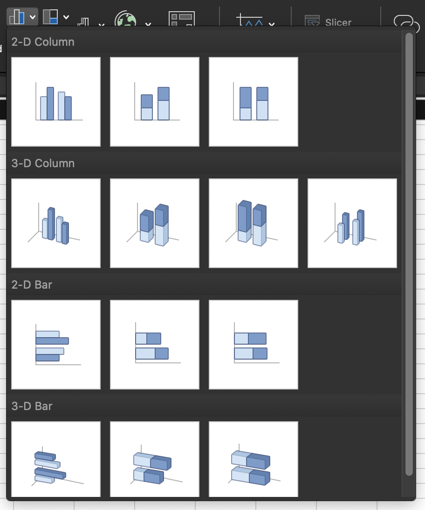

```{r setup, include=FALSE}
options(htmltools.dir.version = FALSE)
knitr::opts_chunk$set(message=F,
                      warning=F)
library(tidyverse)

```

class: inverse

# Outline

## [Plotting in Base R](#4)

## [ggplot2 and the tidyverse](#11)

## [Some Troubleshooting](#60)

---

# Graphics and Statistics

- Admittedly, we still need to cover basic descriptive statistics and data fundamentals
    - continuous, discrete, cross-sectional, time series, panel data
    - mean, median, variance, standard deviation
    - random variables, distributions, PDFs, Z-scores
    - bargraphs, boxplots, histograms, scatterplots

- All of this is coming in 2 weeks as we return to statistics and econometric theory

- But let's start with the fun stuff right away, even if you don't fully know the *reasons*: .hi[data visualiation]

---

class: inverse, center, middle

# Plotting in Base R

---

# Our Data Source

- For our examples, we'll use a dataset `mpg` from the `ggplot2` library

.code80[
```{r}
library(ggplot2)

head(mpg)
```

]

---

# Plotting in Base R

- Base `R` is very powerful and intuitive to plot, but not very sexy

- Basic syntax for most types of plots:

```{r, eval=F}
plot_type(my_df$variable)
```

- If using multiple variables, you can avoid typing `$` by just typing the variable names and then in another argument to the plotting function, specify `data = my_df`

```{r, eval=F}
plot_type(my_df$variable1, my_df$variable2, data = my_df)
```

---

# Plotting in Base R: Histogram


.pull-left[
.smallest[
- Using the `mpg` data, plotting a .hi[histogram] of `hwy`

```{r base-hist, eval=F}
hist(mpg$hwy)
```

]
]

.pull-right[
.center[
```{r, ref.label="base-hist", echo=F, fig.retina=3}
```
]
]

---

# Plotting in Base R: Boxplot

.pull-left[
.smallest[
- Using the `mpg` data, plotting a .hi[boxplot] of `hwy`

```{r base-boxplot, eval=F}
boxplot(mpg$hwy)
```

]

]

.pull-right[
.center[
```{r, ref.label="base-boxplot", echo=F, fig.retina=3}
```
]
]

---

# Plotting in Base R: Boxplot by Category

.pull-left[

.smallest[
- Using the `mpg` data, plotting a .hi[boxplot] of `hwy` .hi-purple[by] `class`

```{r base-boxplot2, eval=F}
boxplot(mpg$hwy ~ mpg$class)
```

```{r, eval=F}
# second method
boxplot(mpg ~ class, data = mtcars)
```

- The `~` is part of `R`'s .hi-purple[“formula notation”]: 
    - Dependent variable goes to left
    - Independent variable(s) to right, separated with `+`'s
    - Think `y~x+z` means "`y` is explained by `x` and `z`"

]
]
.pull-right[
.center[
```{r, ref.label="base-boxplot2", echo=F, fig.retina=3}
```
]
]

---

# Plotting in Base R: Scatterplot

.pull-left[
- Using the `mpg` data, plotting a .hi[scatterplot] of `hwy` against `displ`

```{r base-scatter, eval=F}
plot(mpg$hwy ~ mpg$displ)
```

```{r, eval=F}
# second method
plot(hwy ~ displ, data = mpg)
```

]

.pull-right[
.center[
```{r, ref.label="base-scatter", echo=F, fig.retina=3}
```
]
]

---

class: inverse, center, middle

# ggplot2 and the tidyverse

---

class: blank

background-image: url(https://www.dropbox.com/s/np8v4ihjotkckc1/tidyverse1.png?raw=1)
background-size: cover

---

# The tidyverse

> "The tidyverse is an opinionated collection of R packages designed for data science. All packages share an underlying design philosophy, grammar, and data structures.

- Largely (but not only) created by Hadley Wickham

- We will look at this much more extensively next week!

- This "flavor" of `R` will make your coding life *so much easier!* 


---

# ggplot

.pull-left[

- `ggplot2` is perhaps the most popular package in `R` and a core element of the `tidyverse`

- `gg` stands for a .hi-purple[grammar of graphics]

- Very powerful and beautiful graphics, very customizable and reproducible, but requires a bit of a learning curve

- All those "cool graphics" you've seen in the New York Times, fivethirtyeight, the Economist, Vox, etc use the grammar of graphics
]

.pull-right[
.center[

]
]

---

# ggplot: All Your Figure are Belong to Us

.pull-left[
.center[


Source: [fivethirtyeight](https://fivethirtyeight.com/features/fastest-airlines-fastest-airports/)
]
]
.pull-left[
.center[


Source: [fivethirtyeight](https://fivethirtyeight.com/features/how-to-tell-someones-age-when-all-you-know-is-her-name/)
]
]

---

# Why Go gg? 

.left-column[

.center[


Hadley Wickham

Chief Scientist, R Studio
]
]

.right-column[

> "The transferrable skills from ggplot2 are not the idiosyncracies of plotting syntax, but a powerful way of thinking about visualisation, as a way of **mapping between variables and the visual properties of geometric objects** that you can perceive." 

]

.source[[http://disq.us/p/sv640d](http://disq.us/p/sv640d)]

---

# The Grammar of Graphics (gg)

.pull-left[

- This is a true *grammar*

- We don't talk about specific chart .hi-purple[types]
  - That you have to hunt through in Excel and reshape your data to fit it

- Instead we talk about specific chart .hi[components]
]

.pull-right[
.center[

]
]

---

# The Grammar of Graphics (gg) I

.pull-left[
.smallest[
- Any graphic can be built from the same components:
  1. .hi-purple[Data] to be drawn from
  2. .hi-purple[Aesthetic mappings] from data to some visual marking
  3. .hi-purple[Geometric objects] on the plot
  4. .hi-purple[Scales] define the range of values
  5. .hi-purple[Coordinates] to organize location
  6. .hi-purple[Labels] describe the scale and markings
  7. .hi-purple[Facets] group into subplots
  8. .hi-purple[Themes] style the plot elements
    
- Not every plot needs *every* component, but all plots *must* have the first 3!
]
]

.pull-right[
.center[

]
]

---

# The Grammar of Graphics (gg) II

.pull-left[
.smallest[
- Any graphic can be built from the same components:
  1. `data` to be drawn from
  2. `aes`.hi-purple[thetic mappings] from data to some visual marking
  3. `geom`.hi-purple[metric objects] on the plot
  4. `scale` define the range of values
  5. `coord`.hi-purple[inates] to organize location
  6. `labels` describe the scale and markings
  7. `facet` group into subplots
  8. `theme` style the plot elements
    
- Not every plot needs *every* component, but all plots *must* have the first 3!
]
]
.pull-right[
.center[

]
]

---

# The Grammar of Graphics (gg): All at Once

.pull-left[

## All in one command

- Produces plot output in viewer

- Does not save plot
    - Save with `Export` menu in viewer

- Adding layers requires whole code for new plot

]

.pull-right[
```{r, eval = F}
ggplot(data = mpg)+
  aes(x = displ,
        y = hwy)+
  geom_point()+
  geom_smooth()
```
]

---

# The Grammar of Graphics (gg): As R Objects

.pull-left[
## Saving as an object

- Saves your plot as an `R` object

- Does *not* show in viewer
  - Execute the name of your object to see it

- Can add layers by calling the original plot name
]

.pull-right[

```{r, eval=F}
# make and save plot
p <- ggplot(data = mpg)+
  aes(x = displ,
        y = hwy)+
  geom_point()

p # view plot

# add a layer

p + geom_smooth() # shows new plot

p <- p + geom_smooth() # saves and overwrites p
p2 <- p + geom_smooth() # saves as different object

```
]

---

# The Grammar of Graphics (gg): Data

.left-code[
### Data

`ggplot(data = mpg)`

]

.right-plot[

**Data** is the source of our data. As part of the `tidyverse`, `ggplot2` requires data to be .hi-purple["tidy"]<sup>.red[1]</sup>:

1. Each variable forms a .hl[column]

2. Each observation forms a .hl[row]

3. Each observational unit forms a table

]

.footnote[<sup>.red[1]</sup> Data "tidyness" is the core element of all `tidyverse` packages. Much more on all of this next class.]

---

# The Grammar of Graphics (gg): Adding Layers

.left-code[
### Data
]

.right-plot[
- Add a layer with `+` at the end of a line (never at the beginning!)

- Style recommendation: start a new line after each `+` to improve legibility!

- We will build a plot layer-by-layer
]

---

# The Grammar of Graphics (gg): Aesthetics I

.left-code[
### Data
### Aesthetics
`+ aes()`
]

.right-plot[
**Aesthetics** map data to visual elements or parameters

.center[

]
]

---

# The Grammar of Graphics (gg): Aesthetics II

.left-code[
### Data
### Aesthetics
`+ aes()`
]

.right-plot[
**Aesthetics** map data to visual elements or parameters

.center[

]
]

---

# The Grammar of Graphics (gg): Aesthetics III

.left-code[
### Data
### Aesthetics
`+ aes()`
]

.right-plot[
**Aesthetics** map data to visual elements or parameters

- `displ`

- `hwy`

- `class`

]

---

# The Grammar of Graphics (gg): Aesthetics III

.left-code[
### Data
### Aesthetics
`+ aes()`
]

.right-plot[
**Aesthetics** map data to visual elements or parameters

- `displ` → **x**

- `hwy` → **y**

- `class` → *shape*, *size*, **color**, etc.

]

---

# The Grammar of Graphics (gg): Aesthetics IV

.left-code[
### Data
### Aesthetics
`+ aes()`
]

.right-plot[
**Aesthetics** map data to visual elements or parameters

.center[

]
]
---

# The Grammar of Graphics (gg): Aesthetics IV

.left-code[
### Data
### Aesthetics
`+ aes()`
]

.right-plot[
**Aesthetics** map data to visual elements or parameters

```{r, eval=F}
aes(x = displ,
    y = hwy,
    color = class)
```
]

---

# The Grammar of Graphics (gg): Geoms I

.left-code[
### Data
### Aesthetics
### Geoms
`+ geom_*()`
]

.right-plot[
**Geometric objects** displayed on the plot

.center[
```{r geom_demo, echo=FALSE, fig.retina=3, fig.height=6}
minimal_theme <- theme_bw() +
  theme(
    axis.text = element_blank(),
    axis.ticks = element_blank(),
    panel.grid = element_blank(),
    panel.border = element_blank(),
    axis.title = element_blank(),
    plot.title = element_text(hjust = 0.5),
    text = element_text(family = "Fira Mono"),
    plot.background = element_rect(fill = "#FAFAFA", color = NA),
    panel.background = element_rect(fill = "#FAFAFA", color = NA)
  )

set.seed(20)
df_geom <- data_frame(y = rnorm(10), x = 1:10)

g_geom <- list()
g_geom$point <- ggplot(df_geom, aes(x, y)) + geom_point() + ggtitle("geom_point()")
g_geom$line <- ggplot(df_geom, aes(x, y)) + geom_line() + ggtitle("geom_line()")
g_geom$bar <- ggplot(df_geom, aes(x, y)) + geom_col() + ggtitle("geom_col()")
g_geom$boxplot <- ggplot(df_geom, aes(y = y)) + geom_boxplot() + ggtitle("geom_boxplot()")
g_geom$histogram <- ggplot(df_geom, aes(y)) + geom_histogram(binwidth = 1) + ggtitle("geom_histogram()")
g_geom$density <- ggplot(df_geom, aes(y)) + geom_density(fill = "grey40", alpha = 0.25) + ggtitle("geom_density()") + xlim(-4, 4)

g_geom <- map(g_geom, ~ . + minimal_theme)

cowplot::plot_grid(plotlist = g_geom)
```
]
]

---

# The Grammar of Graphics (gg): Geoms II

.left-code[
### Data
### Aesthetics
### Geoms
`+ geom_*()`
]

.right-plot[
**Geometric objects** displayed on the plot

- What `geom`s you should use depends on what you want to show:

| Type | `geom` |
|------|--------|
| Point | `geom_point()` |
| Line  | `geom_line()`, `geom_path()`  |
| Bar   | `geom_bar()`, `geom_col()` |
| Histogram | `geom_histogram()` |
| Regression | `geom_smooth()` |
| Boxplot | `geom_boxplot()` |
| Text | `geom_text()` |
| Density | `geom_density()` |
]

---

# The Grammar of Graphics (gg): Geoms III

.left-code[
### Data
### Aesthetics
### Geoms
`+ geom_*()`
]

.right-plot[
**Geometric objects** displayed on the plot

```{r, eval=F}
##  [1] "geom_abline"     "geom_area"       "geom_bar"        "geom_bin2d"     
##  [5] "geom_blank"      "geom_boxplot"    "geom_col"        "geom_contour"   
##  [9] "geom_count"      "geom_crossbar"   "geom_curve"      "geom_density"   
## [13] "geom_density_2d" "geom_density2d"  "geom_dotplot"    "geom_errorbar"  
## [17] "geom_errorbarh"  "geom_freqpoly"   "geom_hex"        "geom_histogram" 
## [21] "geom_hline"      "geom_jitter"     "geom_label"      "geom_line"      
## [25] "geom_linerange"  "geom_map"        "geom_path"       "geom_point"     
## [29] "geom_pointrange" "geom_polygon"    "geom_qq"         "geom_qq_line"   
## [33] "geom_quantile"   "geom_raster"     "geom_rect"       "geom_ribbon"    
## [37] "geom_rug"        "geom_segment"    "geom_sf"         "geom_sf_label"  
## [41] "geom_sf_text"    "geom_smooth"     "geom_spoke"      "geom_step"      
## [45] "geom_text"       "geom_tile"       "geom_violin"     "geom_vline"
```

See [http://ggplot2.tidyverse.org/reference](http://ggplot2.tidyverse.org/reference) for many more options

]

---

# The Grammar of Graphics (gg): Geoms IV

.left-code[
### Data
### Aesthetics
### Geoms
`+ geom_*()`
]

.right-plot[
**Geometric objects** displayed on the plot

Or just start typing `geom_` in R Studio!

.center[

]
]

---

# Let's Make a Plot!

.left-code[
```{r plot-1, eval=F, echo=T}
ggplot(data = mpg)
```
]

.right-plot[
```{r, ref.label="plot-1", echo=F, fig.retina=3, fig.align="center"}
```

]

---

# Let's Make a Plot!

.left-code[
```{r plot-2, eval=F, echo=T}
ggplot(data = mpg)+
  aes(x = displ, #<<
        y = hwy) #<<
```
]

.right-plot[
```{r, ref.label="plot-2", echo=F, fig.retina=3, fig.align="center"}
```

]

---

# Let's Make a Plot!

.left-code[
```{r plot-3, eval=F, echo=T}
ggplot(data = mpg)+
  aes(x = displ,
        y = hwy)+
  geom_point() #<<
```
]

.right-plot[
```{r, ref.label="plot-3", echo=F, fig.retina=3, fig.align="center"}
```

]

---

# Let's Make a Plot!

.left-code[
```{r plot-4, eval=F, echo=T}
ggplot(data = mpg)+
  aes(x = displ,
        y = hwy)+
  geom_point(aes(color = class)) #<<
```
]

.right-plot[
```{r, ref.label="plot-4", echo=F, fig.retina=3, fig.align="center"}
```

]

---

# Let's Make a Plot!

.left-code[
```{r plot-5, eval=F, echo=T}
ggplot(data = mpg)+
  aes(x = displ,
        y = hwy)+
  geom_point(aes(color = class))+
  geom_smooth() #<<
```
]

.right-plot[
```{r, ref.label="plot-5", echo=F, fig.retina=3, fig.align="center"}
```

]

---

# More Geoms

.left-code[
### Data
### Aesthetics
### Geoms
`+ geom_*()`
]

.right-plot[
`geom_*(aes, data, stat, position)`

- `data`: geoms can have their own data
    - has to map onto global coordinates

- `aes`: geoms can have their own aesthetics
    - inherits global aesthetics by default
    - different geoms have different available aesthetics
]

---

# Change Our Plot

.left-code[
```{r plot-5a, eval=F, echo=T}
ggplot(data = mpg)+
  aes(x = displ,
        y = hwy)+
  geom_point(aes(color = class))+ #<<
  geom_smooth()
```
]

.right-plot[
```{r, ref.label="plot-5a", echo=F, fig.retina=3, fig.align="center"}
```

]

---

# More Geoms II

.left-code[
### Data
### Aesthetics
### Geoms
`+ geom_*()`
]

.right-plot[
`geom_*(aes, data, stat, position)`

- `stat`: some geoms statistically transform data
    - `geom_histogram()` uses `stat_bin()` to group observations into bins

- `position`: some adjust location of objects
    - `dodge`, `stack`, `jitter`
]

---

# Let's Change Our Plot

.left-code[
```{r plot-box, eval=F, echo=T}
ggplot(data = mpg)+
  aes(x = class, #<<
      y = hwy)+ #<<
  geom_boxplot() #<<
```
]

.right-plot[
```{r, ref.label="plot-box", echo=F, fig.retina=3, fig.align="center"}
```

]

---

# Let's Change Our Plot

.left-code[
```{r plot-6, eval=F, echo=T}
ggplot(data = mpg)+
  aes(x = class)+ #<<
  geom_bar() #<<
```
]

.right-plot[
```{r, ref.label="plot-6", echo=F, fig.retina=3, fig.align="center"}
```

]

---

# Let's Change Our Plot

.left-code[
```{r plot-7, eval=F, echo=T}
ggplot(data = mpg)+
  aes(x = class,
      fill = drv)+ #<<
  geom_bar() 
```
]

.right-plot[
```{r, ref.label="plot-7", echo=F, fig.retina=3, fig.align="center"}
```

]

---

# Let's Change Our Plot

.left-code[
```{r plot-8, eval=F, echo=T}
ggplot(data = mpg)+
  aes(x = class,
      fill = drv)+ 
  geom_bar(position = "dodge") #<<
```
]

.right-plot[
```{r, ref.label="plot-8", echo=F, fig.retina=3, fig.align="center"}
```

]


---

# Back to the Original (and saving it)

.left-code[
```{r plot-8a, eval=F, echo=T}
p <- ggplot(data = mpg)+ #<<
  aes(x = displ,
        y = hwy)+
  geom_point(aes(color = class))+
  geom_smooth()

p # show plot
```
]

.right-plot[
```{r, ref.label="plot-8a", echo=F, fig.retina=3, fig.align="center"}
```

]

---

# The Grammar of Graphics (gg): Facets I

.left-code[
### Data
### Aesthetics
### Geoms
### Facets
`+ facet_wrap()`

`+ facet_grid()`
]

.right-plot[

```{r, fig.retina=3, fig.height=3.5, fig.align="center"}
p + facet_wrap(~year) #<<
```
]

---

# The Grammar of Graphics (gg): Facets II

.left-code[
### Data
### Aesthetics
### Geoms
### Facets
`+ facet_wrap()`

`+ facet_grid()`
]

.right-plot[

```{r, fig.retina=3, fig.height=3.5, fig.align="center"}
p + facet_grid(cyl~year) #<<
```
]

---

# The Grammar of Graphics (gg): Labels

.left-code[
### Data
### Aesthetics
### Geoms
### Facets
### Labels
`+ labs()`
]

.right-plot[

```{r, fig.retina=3, fig.height=4, fig.align="center"}
p + facet_wrap(~year)+
  labs(x = "Engine Displacement (Liters)", #<<
       y = "Highway MPG", #<<
       title = "Car Mileage and Displacement", #<<
       subtitle = "More Displacement Lowers Highway MPG", #<<
       caption = "Source: EPA", #<<
       color = "Vehicle Class")#<<
```
]

---

# The Grammar of Graphics (gg): Scales

.left-code[
### Data
### Aesthetics
### Geoms
### Facets
### Labels
### Scales
`+ scale_*_*()`
]

.right-plot[

`scale`+`_`+`<aes>`+`_`+`<type>`+`()`

- `<aes>`: parameter you want to adjust
- `<type`: type of parameter

- I want to change my discrete x-axis: `scale_x_discrete()`
- I want to change my continuous y-axis: `scale_y_continuous()`
- I want to rescale x-axis to log: `scale_x_log10()`
- I want to use a different color palette: `scale_fill_discrete()`, `scale_color_manual()`
]
---

# The Grammar of Graphics (gg): Scales

.left-code[

```{r scales, eval=F}
ggplot(data = mpg)+
  aes(x = displ,
        y = hwy)+
  geom_point(aes(color = class))+
  geom_smooth()+
  facet_wrap(~year)+
  labs(x = "Engine Displacement (Liters)",
       y = "Highway MPG",
       title = "Car Mileage and Displacement",
       subtitle = "More Displacement Lowers Highway MPG",
       caption = "Source: EPA",
       color = "Vehicle Class")+
  scale_color_viridis_d()#<<
```
]

.right-plot[

```{r, echo=F, ref.label="scales", fig.retina=3, fig.align="center"}

```
]

---

# The Grammar of Graphics (gg): Themes

.left-code[
### Data
### Aesthetics
### Geoms
### Facets
### Labels
### Scales
### Theme
`+ theme_*()`
]

.right-plot[

**Theme** changes appearance of plot decorations (things not mapped to data)

- Some themes that come with `ggplot2`:

- `+ theme_bw()`
- `+ theme_dark()`
- `+ theme_gray()`
- `+ theme_minimal()`
- `+ theme_light()`
- `+ theme_classic()`
]
---

# The Grammar of Graphics (gg): Themes

.left-code[
### Data
### Aesthetics
### Geoms
### Facets
### Labels
### Scales
### Theme
`+ theme_*()`
]

.right-plot[

**Theme** changes appearance of plot decorations (things not mapped to data)

- Many parameters we could change

- Global options: `line`, `rect`, `text`, `title`
- `axis`: x-, y-, or other axis title, ticks, lines
- `legend`: plot legends for fill or color
- `panel`: actual plot area
- `plot`: whole image
- `strip`: facet labels
]

---

# The Grammar of Graphics (gg): Themes

.left-code[

```{r theme1, eval=F}
ggplot(data = mpg)+
  aes(x = displ,
        y = hwy)+
  geom_point(aes(color = class))+
  geom_smooth()+
  facet_wrap(~year)+
  labs(x = "Engine Displacement (Liters)",
       y = "Highway MPG",
       title = "Car Mileage and Displacement",
       subtitle = "More Displacement Lowers Highway MPG",
       caption = "Source: EPA",
       color = "Vehicle Class")+
  scale_color_viridis_d()+
  theme_bw()#<<
```
]

.right-plot[

```{r, echo=F, ref.label="theme1", fig.retina=3, fig.align="center"}

```
]

---

# The Grammar of Graphics (gg): Themes II

.left-code[

```{r theme2, eval=F}
ggplot(data = mpg)+
  aes(x = displ,
        y = hwy)+
  geom_point(aes(color = class))+
  geom_smooth()+
  facet_wrap(~year)+
  labs(x = "Engine Displacement (Liters)",
       y = "Highway MPG",
       title = "Car Mileage and Displacement",
       subtitle = "More Displacement Lowers Highway MPG",
       caption = "Source: EPA",
       color = "Vehicle Class")+
  scale_color_viridis_d()+
  theme_minimal()#<<
```
]

.right-plot[

```{r, echo=F, ref.label="theme2", fig.retina=3, fig.align="center"}

```
]

---

# The Grammar of Graphics (gg): Themes III

.left-code[

```{r theme3, eval=F}
ggplot(data = mpg)+
  aes(x = displ,
        y = hwy)+
  geom_point(aes(color = class))+
  geom_smooth()+
  facet_wrap(~year)+
  labs(x = "Engine Displacement (Liters)",
       y = "Highway MPG",
       title = "Car Mileage and Displacement",
       subtitle = "More Displacement Lowers Highway MPG",
       caption = "Source: EPA",
       color = "Vehicle Class")+
  scale_color_viridis_d()+
  theme_minimal()+
  theme(text = element_text(family = "Fira Sans"))#<<
```
]

.right-plot[

```{r, echo=F, ref.label="theme3", fig.retina=3, fig.align="center"}

```
]

---

# The Grammar of Graphics (gg): Themes III

.left-code[

```{r theme4, eval=F}
ggplot(data = mpg)+
  aes(x = displ,
        y = hwy)+
  geom_point(aes(color = class))+
  geom_smooth()+
  facet_wrap(~year)+
  labs(x = "Engine Displacement (Liters)",
       y = "Highway MPG",
       title = "Car Mileage and Displacement",
       subtitle = "More Displacement Lowers Highway MPG",
       caption = "Source: EPA",
       color = "Vehicle Class")+
  scale_color_viridis_d()+
  theme_minimal()+
  theme(text = element_text(family = "Fira Sans"),
        legend.position="bottom") #<<
```
]

.right-plot[

```{r, echo=F, ref.label="theme4", fig.retina=3, fig.align="center"}

```
]

---

# The Grammar of Graphics (gg): Themes (ggthemes)

.left-code[
### Data
### Aesthetics
### Geoms
### Facets
### Labels
### Scales
### Theme
`+ theme_*()`
]

.right-plot[

- `ggthemes` package adds some other nice themes

```{r}
# install if you don't have it
# install.packages("ggthemes")
library("ggthemes") # load package
```

]

---

# The Grammar of Graphics (gg): Themes IV

.left-code[

```{r theme5, eval=F}
library("ggthemes") #<<
ggplot(data = mpg)+
  aes(x = displ,
        y = hwy)+
  geom_point(aes(color = class))+
  geom_smooth()+
  facet_wrap(~year)+
  labs(x = "Engine Displacement (Liters)",
       y = "Highway MPG",
       title = "Car Mileage and Displacement",
       subtitle = "More Displacement Lowers Highway MPG",
       caption = "Source: EPA",
       color = "Vehicle Class")+
  scale_color_viridis_d()+
  theme_economist()+ #<<
  theme(text = element_text(family = "Fira Sans"),
        legend.position="bottom") 
```
]

.right-plot[

```{r, echo=F, ref.label="theme5", fig.retina=3, fig.align="center"}

```
]

---

# The Grammar of Graphics (gg): Themes V

.left-code[

```{r theme6, eval=F}
library("ggthemes") #<<
ggplot(data = mpg)+
  aes(x = displ,
        y = hwy)+
  geom_point(aes(color = class))+
  geom_smooth()+
  facet_wrap(~year)+
  labs(x = "Engine Displacement (Liters)",
       y = "Highway MPG",
       title = "Car Mileage and Displacement",
       subtitle = "More Displacement Lowers Highway MPG",
       caption = "Source: EPA",
       color = "Vehicle Class")+
  scale_color_viridis_d()+
  theme_fivethirtyeight()+ #<<
  theme(text = element_text(family = "Fira Sans"),
        legend.position="bottom") 
```
]

.right-plot[

```{r, echo=F, ref.label="theme6", fig.retina=3, fig.align="center"}

```
]

---

class: inverse, center, middle

# Some Troubleshooting

---

# Global vs. Local Aesthetics

- `aes()` can go in base (`data`) layer and/or in individual `geom()` layers
- All `geoms` will inherit global `aes` from `data` layer unless overridden

.pull-left[

```{r fig.retina=3, fig.height=3.5, fig.align="center"}
# ALL GEOMS will map data to colors
ggplot(data = mpg, aes(x = displ,
                       y = hwy,
                       color = class))+
  geom_point()+
  geom_smooth()
```

]

.pull-right[
```{r fig.retina=3, fig.height=3.5, fig.align="center"}
# ONLY points will map data to colors
ggplot(data = mpg, aes(x = displ,
                       y = hwy))+
  geom_point(aes(color = class))+
  geom_smooth()
```
]

---

# Mapped vs. Set Aesthetics

- `aes`thetics such as `size` and `color` can be mapped from data or set to a single value
- Map *inside* of `aes()`, set *outside* of `aes()` 

.pull-left[

```{r fig.retina=3, fig.height=3.5, fig.align="center"}
# Point colors are mapped from class data
ggplot(data = mpg, aes(x = displ,
                       y = hwy))+
  geom_point(aes(color = class))+
  geom_smooth()
```
]


.pull-right[
```{r fig.retina=3, fig.height=3.5, fig.align="center"}
# Point colors are all set to blue
ggplot(data = mpg, aes(x = displ,
                       y = hwy))+
  geom_point(aes(), color = "red")+
  geom_smooth(aes(), color = "blue")
```
]

---

# Go Crazy I

.left-code[
```{r gap-map, echo=F}
library("socviz")
library(mapproj)

us_states <- map_data("state")

election$region <- tolower(election$state)
us_states_elec <- left_join(us_states, election)

theme_map <- function(base_size=9, base_family="") {
    require(grid)
    theme_bw(base_size=base_size, base_family=base_family) %+replace%
        theme(axis.line=element_blank(),
              axis.text=element_blank(),
              axis.ticks=element_blank(),
              axis.title=element_blank(),
              panel.background=element_blank(),
              panel.border=element_blank(),
              panel.grid=element_blank(),
              panel.spacing=unit(0, "lines"),
              plot.background=element_blank(),
              legend.justification = c(0,0),
              legend.position = c(0,0)
              )
}

county_full <- left_join(county_map, county_data, by = "id")
```

```{r gap-map2, eval=F}

# I did some (hidden) data work before this! 
ggplot(data = county_full,
            mapping = aes(x = long, y = lat,
                          fill = pop_dens, 
                          group = group))+ 
  geom_polygon(color = "gray90", size = 0.05)+
  coord_equal()+
  scale_fill_brewer(palette="Blues",
                             labels = c("0-10", "10-50", "50-100", "100-500",
                                        "500-1,000", "1,000-5,000", ">5,000"))+
  labs(fill = "Population per\nsquare mile") +
    theme_map() +
    guides(fill = guide_legend(nrow = 1)) + 
    theme(legend.position = "bottom")
```
]

.right-plot[
```{r ref.label="gap-map2", fig.retina=3, fig.height=5.5, fig.align="center", echo=F}
```
]

---

# Go Crazy II

.left-code[
```{r gap-anim, eval=F, cache = T}
library("gapminder")
library("gganimate")
ggplot(gapminder) +
  aes(x = gdpPercap, y = lifeExp, size = pop, color = country) +
  geom_point() +
  guides(color = FALSE, size = FALSE) +
  scale_x_log10(
    breaks = c(10^3, 10^4, 10^5), 
    labels = c("$1k", "$10k", "$100k")) +
  scale_color_manual(values = gapminder::country_colors) +
  scale_size(range = c(0.5, 12)) +
  labs(
    x = "GDP per capita",
    y = "Life Expectancy",
    caption = "Source: Hans Rosling's gapminder.org") +
  theme_minimal(14, base_family = "Fira Sans") +
  theme(
    strip.text = element_text(size = 16, face = "bold"),
    panel.border = element_rect(fill = NA, color = "grey40"),
    panel.grid.minor = element_blank())+
  transition_states(year, 1, 0)+
  ggtitle("Income and Life Expectancy - {closest_state}")
```
]

.right-plot[
```{r ref.label="gap-anim", fig.retina=3, fig.height=5.5, fig.align="center", echo=F}
```
]

---

# Data Visualization and Graphic Design Principles

.pull-left[

- We will return to various graphics as we cover descriptive statistics and regression

- I hope to cover some basic principles of good graphic design for figures and plots
    - If not in class, I will make a page on the website, and/or a video
]

--

.pull-right[

Remember:

.center[

]
]

---

# Less is More

.pull-left[

.center[

"Shoot me"

]

]

--

.pull-right[


.center[
Less is More:


]
]
---

# Try to Show One Trend Really Clearly

.center[

]

.source[New York Times: ["How Stable Are Democracies? ‘Warning Signs Are Flashing Red’"](https://www.nytimes.com/2016/11/29/world/americas/western-liberal-democracy.html), Nov 29, 2016]

---

# Reference: R Studio Makes Great "Cheat Sheet"s! 

.center[

]

.source[[RStudio: ggplot2 Cheat Sheet](https://www.rstudio.com/wp-content/uploads/2015/03/ggplot2-cheatsheet.pdf)]
---

# Reference

On `ggplot2`

- **R Studio's [ggplot2 Cheat Sheet](https://www.rstudio.com/wp-content/uploads/2015/03/ggplot2-cheatsheet.pdf)**
- **`ggplot2`'s website [reference section](https://ggplot2.tidyverse.org/reference/index.html)**
- Hadley Wickham's[ R for Data Science book chapter on ggplot2](http://r4ds.had.co.nz/data-visualisation.html)
- STHDA's [be awesome in ggplot2](http://www.sthda.com/english/wiki/be-awesome-in-ggplot2-a-practical-guide-to-be-highly-effective-r-software-and-data-visualization)
- r-statistic's [top 50 ggplot2 visualizations](http://r-statistics.co/Top50-Ggplot2-Visualizations-MasterList-R-Code.html)

On data visualization

- **Kieran Healy's [Data Visualization: A Practical Guide](http://socviz.co/)**
- **Claus Wilke's [Fundamentals of Data Visualization](https://serialmentor.com/dataviz)**
- PolicyViz [Better Presentations](https://policyviz.com/) 
- Karl Broman's [How to Display Data Badly](https://www.biostat.wisc.edu/~kbroman/presentations/IowaState2013/graphs_combined.pdf)
- [I Want Hue](http://tools.medialab.sciences-po.fr/iwanthue/) 
