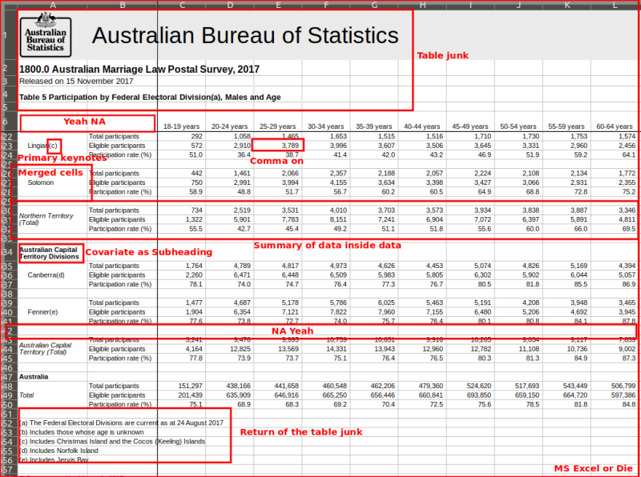
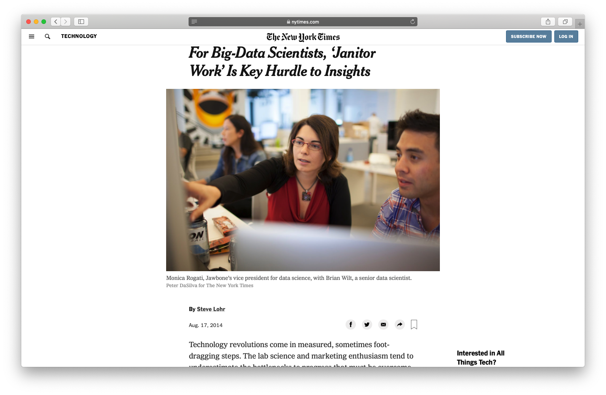
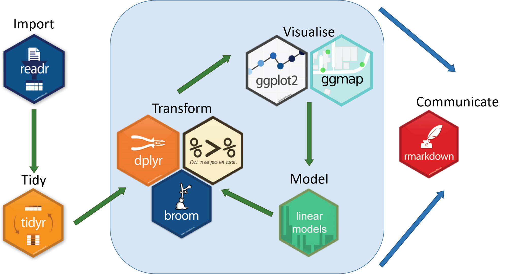
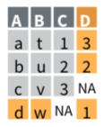
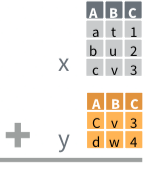

```{r setup, include=FALSE}
options(htmltools.dir.version = FALSE)
knitr::opts_chunk$set(message=F,
                      warning=F)
library(tidyverse)

```

class: inverse, middle, center

.pull-left[

### [tibble: friendlier dataframes](#12)

### [magrittr: piping code](#17)

### [readr: importing data](#26)

### [dplyr: wrangling data](#32)

### [dplyr::filter(): select observations](#35)

### [dplyr::arrange(): reorder observations](#50)
]

.pull-right[

### [dplyr::select(): select variables](#60)

### [dplyr::rename(): rename variables](#73)

### [dplyr::mutate(): create new variables](#77)

### [dplyr::summarize(): create statistics](#98)

### [tidyr: reshaping data](#133)

### [dplyr: combining datasets](#134)

]

---

# Data Wrangling

.pull-left[

- Most data analysis is taming chaos into order
    - Data strewn from multiple sources 😨
    - Missing data ("`NA`") 😡
    - Data not in a readable form 🤢

.center[

]
]

.pull-right[
.center[


]
]
---

# Workflow of a Data Scientist I


.pull-left[
1. .hi-purple[Import] raw data from out there in the world
2. .hi-purple[Tidy] it into a form that you can use 
3. .hi-purple[Explore] the data (do these 3 repetitively!)
    - **Transform**
    - **Visualize**
    - **Model**
4. .hi-purple[Communicate] results to target audience

Ideally, you'd want to be able to do all of this in one program
]

.pull-right[
.center[


[R for Data Science](http://r4ds.had.co.nz)
]
]

---

# Workflow of a Data Scientist II

.pull-left[
.center[

[New York Times](https://www.nytimes.com/2014/08/18/technology/for-big-data-scientists-hurdle-to-insights-is-janitor-work.html)
]

]

.pull-right[

> "Yet far too much handcrafted work - what data scientists call "**data wrangling**," "**data munging**," and "**data janitor work**" - is still required. Data scientists, according to interviews and expert estimates, spend from **50 to 80 percent of their time** mired in this more mundane labor of collecting and preparing unruly digital data, before it can be explored for useful nuggets."

]

---

class: blank

background-image: url(../images/tidyverse1.png)
background-size: cover

---

# The tidyverse I

> "The tidyverse is an opinionated collection of R packages designed for data science. All packages share an underlying design philosophy, grammar, and data structures. 

- Allows you to do all of those things with one (set of) package(s)!
- Learn more at [tidyverse.org](tidyverse.org)

.center[

]

---

# The tidyverse II 

- Easiest to just load the core tidyverse all at once
    - First install may take a few minutes - installs a lot of packages!
    - Note loading the tidyverse is "noisy", it will spew a lot of messages
    - Hide them with `suppressPackageStartupMessages()` and insert `library()` command inside

```{r, echo=FALSE}
detach("package:tidyverse", TRUE) # just to show start up message of tidyverse, let's unload it first
```

```{r, message=TRUE, warning=TRUE}
# install for first time
# install.packages("tidyverse") # this takes a few minutes and may give several prompts

# load tidyverse 
suppressPackageStartupMessages(library("tidyverse"))
```

---

# The tidyverse III

- `tidyverse` contains a lot of packages, not all are loaded automatically

```{r}
tidyverse_packages()
```

---

# Your Workflow in the tidyverse: 

.center[

]
---

# Tidyverse Packages
.smallest[
- We will make **extensive** use of (and talk today about):

1. `tibble` for friendlier dataframes
2. `magrittr` for "pipeable" code
3. `readr` for importing data
4. `dplyr` for data wrangling
5. `tidyr` for tidying data
6. `ggplot2` for plotting data (we've already covered)

- We will (or might) later look at:
7. `broom` for tidy regression (not part of core tidyverse)
8. `forcats` for working with factors
9. `stringr` for working with strings
10. `lubridate` for working with dates and times
11. `purrr` for iteration

]

---

class: inverse, center, middle
# tibble: friendlier dataframes

---

# tibble I

.left-column[

.center[]
]

.right-column[

- `tibble` converts all `data.frames` into a *friendlier* version called `tibbles` (or `tbl_df`)

]

---

# tibble II

.pull-left[

```{r, eval=F}
diamonds
```

<!--Can't fit in columns so artificially selecting to print only first 7 columns --> 

```{r, echo=F} 
diamonds %>% 
  select(1:7)
```

]

.pull-right[

- Prints much nicer output

- Shows a bit of the `str`ucture:
    - `nrow() x ncol()`
    - `<dbl>` is numeric ("double")
    - `<ord>` is an ordered factor
    - `<int>` is an integer

- Fundamental grammar of tidyverse: 
    1. start with a tibble 
    2. run a function on it
    3. output a new tibble
]

---

# tibble III

.left-column[

.center[]
]

.right-column[
.smallest[
- Create a `tibble` from a `data.frame` with `as_tibble()`

]


```{r, eval=F}
as_tibble(mpg) # take built-in dataframe mpg
```

.smallest[
- Create a `tibble` from scratch with `tibble()`, works like `data.frame()`

]

.code50[
```{r}
example<-tibble(x = seq(2,6,2), # sequence from 2 to 6 by 2's
                y = rnorm(3,0,1), # 3 random draws with mean 0, sd 1
                colors = c("orange", "green", "blue"))

example
```
]
]

---

# tibble IV

.left-column[

.center[]
]

.right-column[

- Create a `tibble` row-by-row with `tribble()`

```{r}
example_2<-tribble(
  ~x, ~y, ~color, # each variable name starts with ~
  2, 1.5, "orange",
  4, 0.2, "green",
  6, 0.8, "blue") # last element has no comma

example_2
```
]

---

class: inverse, center, middle
# magrittr: piping code

---

# magrittr I

.left-column[

.center[

]
]

.right-column[

- The `magrittr` package allows us to use the **"pipe" operator** (`%>%`)<sup>.magenta[†]</sup>

- `%>%` "pipes" the *output* of the *left* of the pipe *into* the *(1<sup>st</sup>) argument* of the *right* 

- Running a function `f` on object `x` as `f(x)` becomes `x %>% f` in pipeable form
    - i.e. "take `x` and then run function `f` on it"
]

.footnote[<sup>.magenta[†]</sup> Keyboard shortcuts in R Studio: `CTRL+Shift+M` (Windows) or `Cmd+Shift+M` (Mac)]

---

# magrittr II

.left-column[

.center[

]
]

.right-column[
.smallest[
- With ordinary math functions, read from outside $\leftarrow$ (inside): 
$$g(f(x))$$
  - i.e. take `x` and perform function `f()` on `x` and then take that result and perform function `g()` on it

- With pipes, read operations from left $\rightarrow$ right: 


```{r, eval=FALSE}
x %>% f %>% g
``` 


take `x` and then perform function `f` on it, then perform function `g` on that result 


- Read `%>%` mentally as "and then"

]
]

---

# magrittr III

.left-column[

.center[

]
]

.right-column[

.content-box-green[
.green[**Example**]

$$ln(exp(x))$$

- First, exponentiate $x$, then take the natural log of that (resulting in just x)
- In pipes:

```{r, eval=F}
x %>% exp() %>% ln()
```
]

]

---

# magrittr IV

.left-column[

.center[

]
]

.right-column[
.content-box-green[
.green[**Example**]

- Sequence: find keys, unlock car, drive to school, park 
- Using nested functions in pseudo-"code":

```{r, eval=F}
park(drive(start_car(find("keys")), to = "campus"))
```

- Using pipes:

```{r, eval=F}
find("keys") %>%
  start_car() %>%
  drive(to = "campus") %>%
  park()
```

]

]

---

# magrittr: Simple Example

```{r, echo=FALSE}
library("gapminder")
```

.pull-left[
```{r, eval=F}
# look at top 6 rows
head(gapminder) 

# use pipe instead
gapminder %>% head()
```
]


.pull-right[

```{r, echo=F}
gapminder %>% head()
```
]

---

# magrittr: More Involved Example

- These two methods produce the same output (average hightway mpg of Audi cars)

--

- Without the pipe

```{r, eval=F}
summarise(group_by(filter(mpg, manufacturer=="audi"), model), hwy_mean = mean(hwy))
```

--

- Using the pipe

.pull-left[

```{r, eval=F}
mpg %>%
  filter(manufacturer=="audi") %>%
  group_by(model) %>%
  summarise(hwy_mean = mean(hwy))

```
]

.pull-right[
```{r, echo=F}
mpg %>%
  filter(manufacturer=="audi") %>%
  group_by(model) %>%
  summarise(hwy_mean = mean(hwy))

```

]
---

class: inverse, center, middle
# readr: importing data

---

# readr

.left-column[

.center[]
]

.right-column[
.smallest[
- `readr` helps load common spreadsheet files (`.csv`, `.tsv`) with simple commands:
- `read_*(path/to/my_data.*)`
    - where `*` can be `.csv` or `.tsv`
    
- Often this is enough, but many more customizations possible

- You can also *export* your data from R into a common spreadsheet file with:
- `write_*(my_df, path = path/to/file_name.*)`
    - where `my_df` is the name of your `tibble`, and `file_name` is the name of the file you want to save as

- Read more on the [tidyverse website](https://readr.tidyverse.org/) and the [Readr Cheatsheet](https://rawgit.com/rstudio/cheatsheets/master/data-import.pdf)
]
]

---

# Readxl and Haven: When Readr isn't Enough

.left-column[

.center[


]
]

.right-column[
.smallest[
- For other data types from software programs like Excel, STATA, SAS, and SPSS:
- `readxl` has equivalent commands for Excel data types:
    - `read_*("path/to/my/data.*")`
    - `write_*(my_dataframe, path=path/to/file_name.*)`
    - where `*` can be `.xls` or `.xlsx`
    
- `haven` has equivalent commands for other data types:
    - `read_*("path/to/my_data.dta")` for STATA `.dta` files
    - `write_*(my_dataframe, path=path/to/file_name.*)`
    - where `*` can be `.dta` (STATA), `.sav` (SPSS), `.sas7bdat` (SAS)
]
]

---

# Common Import Issues I
.smallest[
- Most common: *"where the hell is my data file"??*

- Recall `R` looks for files to `read_*()` in the default working directory (check what it is with `getwd()`, change it with `setwd()`)

- You can tell `R` where this data is by making the `path` a part of the file's name when importing
    - Use `..` to "move up one folder"
    - Use `/` to "enter a folder"

- Either use an **absolute path** on your computer:
```{r, eval=F}
# Example

df <- read_csv("C:/Documents and Settings/Ryan Safner/Downloads/my_data.csv")
```
]

---

# Common Import Issues II

.smallest[
- Most common: *"where the hell is my data file"??*

- Recall `R` looks for files to `read_*()` in the default working directory (check what it is with `getwd()`, change it with `setwd()`)

- You can tell `R` where this data is by making the `path` a part of the file's name when importing
    - Use `..` to "move up one folder"
    - Use `/` to "enter a folder"


- Or use a **relative path** *from* R's working directory

]

.code40[
```{r, eval=F}
# Example
# If working directory is Documents, but data is in Downloads, like so: 
# 
# Ryan Safner/
# |
# |- Documents/
# |- Downloads/
# |- Photos/
# |- Videos/
df <- read_csv("../Downloads/my_data.csv")
```

]

---

# Common Import Issues III

- **Suggestion** to make your data import easier: *Download and move files to R's working directory*

- Your computer and working directory are different from mine (and others)

- This is *not* a reproducible workflow! 

- We'll finally fix this next class with `R Projects`
    - The working directory is set to the Project Folder by default
    - Same for everyone on any computer!

---

class: inverse, center, middle
# dplyr: wrangling data

---

# dplyr I

.left-column[

.center[]
]

.right-column[
.smallest[
- `dplyr` uses more efficient & intuitive commands to manipulate tibbles
- `Base R` grammar passively runs functions on nouns: `function(object)`
- `dplyr` grammar actively uses verbs: `verb(df, conditions)`<sup>.magenta[†]</sup>

- Three great features:

1. Allows use of `%>%` pipe operator
2. Input and output is always a `tibble`
3. Shows the output from a manipulation, but does not save/overwrite as an object unless explicitly assigned to an object

]
]
.footnote[<sup>.magenta[†]</sup> With the pipe, even simpler: `df %>% verb(conditions)`]

---

# dplyr II

.left-column[

.center[]
]

.right-column[

- Common `dplyr` verbs

| Verb | Does | 
|----------|------|
| `filter()` | Keep only selected *observations* | 
| `select()` | Keep only selected *variables* |
| `arrange()` | Reorder rows (e.g. in numerical order) |
| `mutate()` | Create new variables | 
| `summarize()` | Collapse data into summary statistics| 
| `group_by()` | Perform any of the above functions by groups/categories | 

]

---

class: inverse, center, middle
# dplyr::filter(): select observations

.center[

]

---

# dplyr::filter()

- `filter` keeps only selected **observations** (rows)

--

.left-code[

```{r, eval=F}
# look only at African observations
# syntax without the pipe
filter(gapminder, continent=="Africa")
```

```{r, eval=F}
# using the pipe

gapminder %>%
  filter(continent == "Africa")
```

]

--

.right-plot[

```{r, echo=F}
gapminder %>%
  filter(continent == "Africa")
```

]

---

# dplyr: saving and storing outputs I

- `dplyr` functions never modify their inputs (i.e. never overwrite the original `tibble`)
- If you want to save a result, use `<-` to assign it to a new `tibble`
- If assigned, you will not see the output until you call up the new `tibble` by name

--

.left-code[

```{r, eval = F}
# base syntax
africa <- filter(gapminder,
                 continent=="Africa")
```

```{r, eval=F}
# using the pipe
africa <- gapminder %>%
  filter(continent == "Africa")
```

```{r, eval=F}
# look at new tibble
africa
```
]

.right-plot[
```{r, echo = F}
africa <- gapminder %>%
  filter(continent == "Africa")

# look at new tibble
africa
```
]

---

# dplyr: saving and storing outputs II

- If you want to *both* store and view the output at the same time, wrap the command in parentheses!

```{r}
(africa <- gapminder %>%
  filter(continent == "Africa"))
```

---

# dplyr: saving and storing outputs III

- If you were to assign the output to the original `tibble`, it would *overwrite* the original!


```{r, eval = F}
# base syntax
gapminder <- filter(gapminder,
                    continent=="Africa")
```

```{r, eval=F}
# using the pipe
gapminder <- gapminder %>%
  filter(continent == "Africa")

# this overwrites gapminder!
```

---

# dplyr Conditionals

- In many data wrangling contexts, you will want to select data .hi-purple[conditionally]
  - To a computer: observations for which a set of logical conditions are `TRUE`<sup>.magenta[†]</sup>
  - `>`, `<`: greater than, less than
  - `>=`, `<=`: greater than or equal to, less than or equal to
  - `==`<sup>.magenta[‡]</sup>, `!=`: is equal to<sup>.magenta[‡]</sup>, is not equal to
  - `%in%`: is a member of some defined set $(\in)$
  - `&`: AND (commas also work instead)
  - `|`: OR
  - `!`: not

.footnote[<sup>.magenta[†]</sup> See `?Comparison` and `?Base::Logic`.

<sup>.magenta[‡]</sup> Recall one `=` *assigns* values to an object, two `==` *tests* an object for a condition!]

---

# dplyr::filter() with Conditionals

.left-code[

```{r, eval=F}
# look only at African observations
# in 1997
gapminder %>%
  filter(continent == "Africa",
         year == 1997)
```
]

--

.right-plot[

```{r, echo=F}
gapminder %>%
filter(continent == "Africa", year == 1997)
```
]

---

# dplyr::filter() with Conditionals II

.left-code[

```{r, eval=F}
# look only at African observations 
# or observations in 1997
gapminder %>%
  filter(continent == "Africa" |
           year == 1997)
```
]

--

.right-plot[

```{r, echo=F}
gapminder %>%
filter(continent == "Africa" |
       year == 1997)
```
]

---

# dplyr::filter() with Conditionals III


.left-code[

```{r, eval=F}
# look only at U.S. and U.K. 
# observations in 2002
gapminder %>%
  filter(country %in% 
           c("United States",
             "United Kingdom"),
         year == 2002)
```
]

--

.right-plot[

```{r, echo=F}
gapminder %>%
  filter(country %in% c("United States", "United Kingdom"), year == 2002)
```
]

---

class: inverse, center, middle
# dplyr::arrange(): reorder observations

---

# dplyr::arrange() I

- `arrange` reorders **observations** (rows) in a logical order
    - e.g. alphabetical, numeric, small to large
    
--

.left-code[

```{r, eval=F}
# order by smallest to largest pop
# syntax without the pipe
arrange(gapminder, pop)
```

```{r, eval=F}
# using the pipe

gapminder %>%
  arrange(pop)
```

]

--

.right-plot[

```{r, echo=F}
# syntax with the pipe 
gapminder %>%
  arrange(pop)
```

]

---

# dplyr::arrange() II

- Break ties in the value of one variable with the values of additional variables
    
--

.left-code[

```{r, eval=F}
# order by year, with the smallest 
# to largest pop in each year
# syntax without the pipe
arrange(gapminder, year, pop)
```

```{r, eval=F}
# using the pipe

gapminder %>%
  arrange(year, pop)
```

]

--

.right-plot[

```{r, echo=F}
# syntax with the pipe 
gapminder %>%
  arrange(year, pop)
```

]

---

# dplyr::arrange() III

- Use `desc()` to re-order in the opposite direction
    
--

.left-code[

```{r, eval=F}
# order by largest to smallest pop
# syntax without the pipe
arrange(gapminder, desc(pop))
```

```{r, eval=F}
# using the pipe

gapminder %>%
  arrange(desc(pop))
```

]

--

.right-plot[

```{r, echo=F}
# syntax with the pipe 
gapminder %>%
  arrange(desc(pop))
```

]

---

class: inverse, center, middle
# dplyr::select(): select variables

.center[

]

---

# dplyr::select() I

- `select` keeps only selected **variables** (columns)
    - Don't need quotes around column names
--

.left-code[

```{r, eval=F}
# keep only country, year, 
# and population variables
# syntax without the pipe
select(gapminder, country, year, pop)
```

```{r, eval=F}
# using the pipe

gapminder %>%
  select(country, year, pop)
```

]

--

.right-plot[

```{r, echo=F}
# syntax with the pipe 
gapminder %>%
  select(country, year, pop)
```

]

---

# dplyr::select() II

- `select` "all except" by negating a variable with `-`

--

.left-code[

```{r, eval=F}
# keep all *except* gdpPercap
# syntax without the pipe
select(gapminder, -gdpPercap)
```

```{r, eval=F}
# using the pipe

gapminder %>%
  select(-gdpPercap)
```

]

--

.right-plot[

```{r, echo=F}
# syntax with the pipe 
gapminder %>%
  select(-gdpPercap)
```

]

---

# dplyr::select() III

- `select` reorders the columns in the order you provide
    - sometimes useful to keep all variables, and drag one or a few  to the front, add `everything()` at the end

--

.left-code[

```{r, eval=F}
# keep all and move pop first
# syntax without the pipe
select(gapminder, pop, everything())
```

```{r, eval=F}
# using the pipe

gapminder %>%
  select(pop, everything())
```

]

--

.right-plot[

```{r, echo=F}
# syntax with the pipe 
gapminder %>%
  select(pop, everything())
```

]

---

# dplyr::select() IV

- `select` has a lot of helper functions, useful for when you have hundreds of variables
    - see `?select()` for a list
    
--

.pull-left[

```{r}
# keep all variables starting with "co"

gapminder %>%
  select(starts_with("co"))
```

]

--

.pull-right[

```{r}
# keep country and all variables 
# containing "per"

gapminder %>%
  select(country, contains("per"))
```

]

---

class: inverse, center, middle
# dplyr::rename(): rename variables

---

# dplyr::rename()

- `rename` changes the name of a variable (column)
    - Format: `new_name = old_name`
--

.left-code[

```{r, eval=F}
# rename gdpPercap to GDP
# syntax without the pipe
rename(gapminder, GDP = gdpPercap)
```

```{r, eval=F}
# using the pipe

gapminder %>%
  rename(GDP = gdpPercap)
```

]

--

.right-plot[

```{r, echo=F}
# syntax with the pipe 
gapminder %>%
  rename(GDP = gdpPercap)
```

]

---

class: inverse, center, middle
# dplyr::mutate(): create new variables

.center[

]

---

# dplyr::mutate()

- `mutate` creates a new variable (column)
    - always adds a new column at the end
    - general formula: `new_variable_name = operation` 

---

# dplyr::mutate() II


- Three major types of mutates:

1. Create a variable that is a specific value (often categorical)

--

.pull-left[

```{r, eval=F}
# create variable "europe" if country 
# is in Europe
# syntax without the pipe
mutate(gapminder, 
       europe = ifelse(continent == "Europe",
                       yes = "In Europe",
                       no = "Not in Europe"))
```

```{r, eval=F}
# using the pipe

gapminder %>%
  mutate(europe = ifelse(continent == "Europe",
                         yes = "In Europe",
                         no = "Not in Europe"))
```

]

--

.pull-right[

```{r, echo=F}
# syntax with the pipe 
gapminder %>%
  select(1:3) %>% # hiding vars just for space constraints
  mutate(europe = ifelse(continent == "Europe",
                         yes = "In Europe",
                         no = "Not in Europe"))
```
]

---


# dplyr::mutate() III


- Three major types of mutates:

1. Create a variable that is a specific value (often categorical)
2. Change an existing variable (often rescaling)

--

.left-code[

```{r, eval=F}
# create population in millions 
# syntax without the pipe
mutate(gapminder,
       pop_mil = pop / 1000000)
```

```{r, eval=F}
# using the pipe

gapminder %>%
  rename(pop_mil = pop / 1000000)
```

]

--

.right-plot[

```{r, echo=F}
# syntax with the pipe 
gapminder %>%
  select(1:5) %>% # hiding vars just for space constraints
  mutate(pop_mil = pop / 1000000)
```
]

---


# dplyr::mutate() IV


- Three major types of mutates:

1. Create a variable that is a specific value (often categorical)
2. Change an existing variable (often rescaling)
3. Create a variable based on other variables

--

.left-code[

```{r, eval=F}
# create GDP variable from gdpPercap 
# and pop, in billions
# syntax without the pipe
mutate(gapminder,
       GDP = ((gdpPercap * pop)/1000000000))
```

```{r, eval=F}
# using the pipe

gapminder %>%
  mutate(GDP = ((gdpPercap * pop)/1000000000))
```

]

--

.right-plot[

```{r, echo=F}
# syntax with the pipe 
gapminder %>%
  select(c(country, continent, year, pop, gdpPercap)) %>% # hiding vars just for space constraints
  mutate(GDP = ((gdpPercap * pop)/1000000000))
```
]

---

# dplyr::mutate() V

- Change `class` of a variable inside `mutate()` with `as.*()`

```{r}
gapminder %>% head(., 2)

# change year from an integer to a factor
gapminder %>%
  mutate(year = as.factor(year))
```

---

# dplyr::mutate(): Multiple Variables


- Can create multiple new variables with commas:

--

```{r}
gapminder %>%
  mutate(GDP = gdpPercap * pop,
         pop_millions = pop / 1000000)
```

---

# dplyr::transmute()

- `transmute` keeps *only* newly created variables (`select`s only the new `mutate`d variables)

```{r}
gapminder %>%
  transmute(GDP = gdpPercap * pop,
         pop_millions = pop / 1000000)
```

---

# dplyr::mutate(): Conditionals

- Boolean, logical, and conditionals all work well in `mutate()`:

```{r}
gapminder %>%
  select(country, year, lifeExp) %>%
  mutate(long_1 = lifeExp > 70,
         long_2 = ifelse(lifeExp > 70, "Long", "Short"))
```

---

# dplyr::mutate(): order Aware

- `mutate()` is order-aware, so you can chain multiple mutates that depend on previous mutates

```{r}
gapminder %>%
  select(country, year, lifeExp) %>%
  mutate(dog_years = lifeExp * 7,
         comment = paste("Life expectancy in", country, "is", dog_years, "in dog years.", sep = " "))
```

---

# dplyr::mutate(): case_when()

- `case_when` creates a new variable with values that are conditional on values of other variables (e.g., "if/else")
    - Last argument: `TRUE`: when 
```{r}
gapminder %>%
  mutate(European = case_when(
    continent == "Europe" ~ "Aye",
    TRUE ~ "Nay"
  ))
```

---

# dplyr::mutate(): scoped I

- "Scoped" variants of `mutate` that work on a subset of variables:
    - `mutate_all()` affects every variable
    - `mutate_at()` affects named or selected variables
    - `mutate_if()` affects variables that meet a criteria 

```{r}
# round all observations of numeric
# variables to 2 digits
gapminder %>%
  mutate_if(is.numeric, round, digits = 2)
```

---

# dplyr::mutate(): scoped II

- "Scoped" variants of `mutate` that work on a subset of variables:
    - `mutate_all()` affects every variable
    - `mutate_at()` affects named or selected variables
    - `mutate_if()` affects variables that meet a criteria 

```{r}
# make all factor variables uppercase
gapminder %>%
  mutate_if(is.factor, toupper) 
```

---

# dplyr::mutate()

- Don't forget to assign the output to a new `tibble` (or overwrite original) if you want to "save" the new variables!

---

class: inverse, center, middle
# dplyr::summarize(): create statistics

.center[

]

---

# dplyr::summarize() I

- `summarize`<sup>.magenta[†]</sup> outputs a tibble of desired summary statistics
    - can name the statistic variable as if you were `mutate`-ing a new variable
--

.left-code[

```{r, eval=F}
# get average life expectancy
# call it avg_LE
summarize(gapminder,
          avg_LE = mean(lifeExp))
```

```{r, eval=F}
# using the pipe

gapminder %>%
  summarize(avg_LE = mean(lifeExp))
```

]

--

.right-plot[

```{r, echo=F}
gapminder %>%
  summarize(avg_LE = mean(lifeExp))
```

]

.footnote[<sup>.magenta[†]</sup> Also the more civilised non-U.S. English spelling `summarise` also works. `dplyr` was written by a Kiwi after all!
]
---

# dplyr::summarize() II

- Useful `summarize()` commands:

| Command | Does |
|---------|------|
| `n()`<sup>.red[*]</sup>   | Number of observations |
| `n_distinct()`<sup>.red[*]</sup> | Number of unique observations |
| `sum()` | Sum all observations of a variable |
| `mean()` | Average of all observations of a variable |
| `median()` | 50<sup>th</sup> percentile of all observations of a variable |
| `sd()`  | Standard deviation of all observations of a variable |

.footnote[<sup>.red[*]</sup> Most commands require you to put a variable name inside the command's argument parentheses. These commands require nothing to be in parentheses!]

---

# dplyr::summarize() II

- Useful `summarize()` commands (continued):

| Command | Does |
|---------|------|
| `min()` | Minimum value of a variable |
| `max()` | Maximum value of a variable |
| `quantile(., 0.25)`<sup>.red[+]</sup> | Specified percentile (example `25`<sup>th</sup> percentile) of a variable |
| `first()` | First value of a variable |
| `last()` | Last value of a variable |
| `nth(., 2)`<sup>.red[+]</sup> | Specified position of a variable (example `2`<sup>nd</sup>) |

.footnote[<sup>.red[+]</sup> The `.` is where you would put your variable name.]

---

# dplyr::summarize() counts

- Counts of a categorical variable are useful, and can be done a few different ways:

--

```{r}
# summarize with n() gives size of current group, has no arguments
gapminder %>%
  summarize(amount = n()) # I've called it "amount"
```
--

```{r}
# count() is a dedicated command, counts observations by specified variable
gapminder %>%
  count(year) # counts how many observations per year
```

---

# dplyr::summarize() Conditionally

- Can do counts and proportions by conditions
    - How many observations fit specified conditions (e.g. `TRUE`)
    - Numeric objects: `TRUE=1` and `FALSE=0`
        - `sum(x)` becomes the number of `TRUE`s in `x`
        - `mean(x)` becomes the proportion

--

.pull-left[
```{r}
# How many countries have life expectancy
# over 70 in 2007?
gapminder %>%
  filter(year=="2007") %>%
  summarize(Over_70 = sum(lifeExp>70))
```
]
--

.pull-right[
```{r}
# What *proportion* of countries have life
# expectancy over 70 in 2007?
gapminder %>%
  filter(year=="2007") %>%
  summarize(Over_70 = mean(lifeExp>70))
```
]
---

# dplyr::summarize() Multiple Variables

- Can `summarize()` multiple *variables* at once, separate by commas

.left-code[

```{r, eval=F}
# get average life expectancy and GDP 
# call each avg_LE, avg_GDP
summarize(gapminder,
          avg_LE = mean(lifeExp),
          avg_GDP = mean(gdpPercap))
```

```{r, eval=F}
# using the pipe

gapminder %>%
  summarize(avg_LE = mean(lifeExp),
            avg_GDP = mean(gdpPercap))
```

]

--

.right-plot[

```{r, echo=F}
gapminder %>%
  summarize(avg_LE = mean(lifeExp),
            avg_GDP = mean(gdpPercap))
```

]

---

# dplyr::summarize() Multiple Statistics

- Can `summarize()` multiple *statistics* of a variable at once, separate by commas

.left-code[

```{r, eval=F}
# get count, mean, sd, min, max
# of life Expectancy 
summarize(gapminder,
          obs = n(),
          avg_LE = mean(lifeExp),
          sd_LE = sd(lifeExp),
          min_LE = min(lifeExp),
          max_LE = max(lifeExp))
```

```{r, eval=F}
# using the pipe

gapminder %>%
  summarize(obs = n(),
          avg_LE = mean(lifeExp),
          sd_LE = sd(lifeExp),
          min_LE = min(lifeExp),
          max_LE = max(lifeExp))
```

]

--

.right-plot[

```{r, echo=F}
gapminder %>%
  summarize(obs = n(),
          avg_LE = mean(lifeExp),
          sd_LE = sd(lifeExp),
          min_LE = min(lifeExp),
          max_LE = max(lifeExp))
```

]

---

# dplyr::summarize() Multiple Statistics

- "Scoped" versions of `summarize()` that work on a subset of variables
    - `summarize_all()`: affects every variable
    - `summarize_at()`: affects named or selected variables
    - `summarize_if()`: affects variables that meet a criteria

--

.pull-left[

```{r}
# get the average of all
# numeric variables 
gapminder %>%
  summarize_if(is.numeric,
               funs(avg = mean))
```
]

--
.pull-right[
```{r}
# get mean and sd for
# pop and lifeExp

gapminder %>%
  summarize_at(vars(pop, lifeExp),
    funs("avg" = mean,
         "std dev" = sd))
```
]

---

# dplyr::summarize() with group_by() I

- If we have `factor` variables grouping a variable into categories, we can run `dplyr` verbs by group
    - Particularly useful for `summarize()`
    
- First define the group with `group_by()`

--

```{r}
# get average life expectancy and gdp by continent 

gapminder %>%
  group_by(continent) %>%
  summarize(mean_life = mean(lifeExp),
            mean_GDP = mean(gdpPercap))
```

---

# dplyr::summarize() with group_by() II


```{r}
# track changes in average life expectancy and gdp over time 

gapminder %>%
  group_by(year) %>%
  summarize(mean_life = mean(lifeExp),
            mean_GDP = mean(gdpPercap))
```

---

# dplyr::summarize() with group_by() III

- Can group observations by multiple variables (in proper order)

```{r}
# track changes in average life expectancy and gdp by continent over time 

gapminder %>%
  group_by(continent, year) %>%
  summarize(mean_life = mean(lifeExp),
            mean_GDP = mean(gdpPercap))
```

---

# Example: Piping Across Packages

- `tidyverse` uses same grammar and design philosophy
- .green[**Example**]: graphing change in average life expectancy by continent over time

--
.pull-left[
.font80[
```{r ex_plot, eval=F}
gapminder %>%
  group_by(continent, year) %>%
  summarize(mean_life = mean(lifeExp),
            mean_GDP = mean(gdpPercap)) %>%
  # now pipe this tibble in as data for ggplot!
  ggplot(data = ., # . stands in for stuff ^!
         aes(x = year,
             y = mean_life,
             color = continent))+
  geom_path(size=1)+
  labs(x = "Year",
       y = "Average Life Expectancy (Years)",
       color = "Continent",
       title = "Average Life Expectancy Over Time")+
  theme_classic(base_family = "Fira Sans Condensed", base_size=20)
```
]
]

--

.pull-right[

```{r, ref.label="ex_plot", fig.height=5, fig.retina=3, echo=F}

```
]

---

# dplyr: Other Useful Commands I

- `tally` provides counts, best used with `group_by` for `factors`

--

.pull-left[
```{r}
gapminder %>%
  tally
```
]

--

.pull-right[
```{r}
gapminder %>%
  group_by(continent) %>%
  tally
```
]

---

# dplyr: Other Useful Commands II

- `slice()` subsets rows by *position* instead of `filter`ing by *values*

--

```{r}
gapminder %>%
  slice(15:17) # see 15th through 17th observations
```

---

# dplyr: Other Useful Commands III

- `pull()` extracts a column from a `tibble` (just like `$`)

--

```{r}
# Get all U.S. life expectancy observations
gapminder %>%
  filter(country == "United States") %>%
  pull(lifeExp)
```

--

```{r}
# Get U.S. life expectancy in 2007
gapminder %>%
  filter(country == "United States" & year == 2007) %>%
  pull(lifeExp)
```

---

# dplyr: Other Useful Commands IV

- `distinct()` shows the distinct values of a specified variable (recall `n_distinct()` inside `summarize()` just gives you the *number* of values)

```{r}
gapminder %>%
  distinct(country)
```

---

class: inverse, center, middle
# tidyr: reshaping data

.center[

]
---

# tidyr: reshaping and tidying data 

.left-column[

.center[]
]

.right-column[
.smallest[
- `tidyr` helps reshape data into more usable format
- .hi["tidy" data]<sup>.magenta[†]</sup> are (an opinionated view of) data where

1. Each .hi-purple[variable] is in a .hi-purple[column]
2. Each .hi-purple[observation] is a .hi-purple[row]
3. Each .hi-purple[observational unit] forms a .hi-purple[table]<sup>.magenta[‡]</sup>

- Spend less time fighting your tools and more time on analysis!
]
]

.footnote[<sup>.magenta[†]</sup> This is the namesake of the `tidyverse`: all associated packages and functions use or require this data format!

<sup>.magenta[‡]</sup> Alternatively, sometimes rule 3 is "every value is its own cell."]
---

# tidyr: Tidy Data

.smaller[
- "tidy" data $\neq$ clean, perfect data

> "Happy families are all alike; every unhappy family is unhappy in its own way." - Leo Tolstoy

> "Tidy datasets are all alike, but every messy dataset is messy in its own way." - Hadley Wickham
]

.center[

]

---

# tidyr::gather() wide to long I

.pull-left[

```{r}
# make example untidy data 
ex_wide<-tribble(
  ~"Country", ~"2000", ~"2010",
  "United States", 140, 180,
  "Canada", 102, 98,
  "China", 111, 123
)
ex_wide
```

]

.pull-right[

- **Common source of "un-tidy" data**: .hi-purple[Column headers are values, not variable names!] 😨
    - Column names are *values* of a `year` variable!
    - Each row represents *two* observations (one in 2000 and one in 2010)!
]

---

# tidyr::gather() wide to long II

.pull-left[

```{r}
# make example untidy data 
ex_wide<-tribble(
  ~"Country", ~"2000", ~"2010",
  "United States", 140, 180,
  "Canada", 102, 98,
  "China", 111, 123
)
ex_wide
```

]

.pull-right[

- We need to `gather()` these columns into a new pair of variables
    - set of columns that represent values, not variables (`2000` and `2010`)
    - `key`: name of variable whose values form the column names (we'll call it the `year`)
    - `value`: name of the variable whose values are spread over the cells (we'll call it number of `cases`)
]


---
# tidyr::gather() wide to long III

- `gather()` a wide data frame into a long data frame 

.pull-left[

```{r}
ex_wide
```
]

.pull-right[

```{r}
ex_wide %>% gather("2000","2010",
              key = "year",
              value = "cases")
```

]

---

# tidyr::spread() long to wide I

.pull-left[

```{r, echo=F}
ex_long<-tribble(
  ~"Country", ~"Year", ~"Type", ~"Count",
  "United States", 2000, "Cases", 140,
  "United States", 2000, "Population", 300,
  "United States", 2010, "Cases", 180,
  "United States", 2010, "Population", 310,
  "Canada", 2000, "Cases", 102,
  "Canada", 2000, "Population", 110,
  "Canada", 2010, "Cases", 98,
  "Canada", 2010, "Population", 121,
  "China", 2000, "Cases", 111,
  "China", 2000, "Population", 1201,
  "China", 2010, "Cases", 123,
  "China", 2010, "Population", 1241
)

```

```{r}
ex_long # example I made (code hidden)
```

]

.pull-right[

- **Another common source of "un-tidy" data**: .hi-purple[observations are scattered across multiple rows] 😨
    - Each country has two rows per observation, one for `Cases` and one for `Population` (categorized by `type` of variable)
]

---

# tidyr::spread() long to wide II

.pull-left[

```{r, echo=F}
ex_long<-tribble(
  ~"Country", ~"Year", ~"Type", ~"Count",
  "United States", 2000, "Cases", 140,
  "United States", 2000, "Population", 300,
  "United States", 2010, "Cases", 180,
  "United States", 2010, "Population", 310,
  "Canada", 2000, "Cases", 102,
  "Canada", 2000, "Population", 110,
  "Canada", 2010, "Cases", 98,
  "Canada", 2010, "Population", 121,
  "China", 2000, "Cases", 111,
  "China", 2000, "Population", 1201,
  "China", 2010, "Cases", 123,
  "China", 2010, "Population", 1241
)

```

```{r}
ex_long # example I made (code hidden)
```

]

.pull-right[

- We need to `spread()` these columns into a new pair of variables
    - `key`: column that contains variable names (here, the `type`)
    - `value`: column that contains values from multiple variables (here, the `count`)
]

---

# tidyr::spread() long to wide III

- `spread()` a long data frame into a wide data frame 

.pull-left[

```{r}
ex_long
```
]

.pull-right[

```{r}
ex_long %>% spread(key = "Type",
                   value = "Count")
```

]

---

# tidyr

.pull-left[
.center[

]
]

.footnote[<sup>*</sup> Image from Garrick Aden-Buie's excellent [tidyexplain](https://github.com/gadenbuie/tidyexplain)]

---

class: inverse, middle, center

# Combining Datasets

.center[

]
---

# Combining Datasets

- Often, data doesn't come from just one source, but several sources

- We can combine datasets into a single dataframe (tibble) using `dplyr` commands in several ways:
    1. `bind` dataframes together by row or by column
        - `bind_rows()` adds observations (rows) to existing dataset<sup>1</sup>
        - `bind_cols()` adds variables (columns) to existing dataset<sup>2</sup>
    2. `join` two dataframes by designating variable(s) as `key` to match rows by identical values of that `key`
        
.footnote[<sup>.magenta[†]</sup> Note the columns must be identical between the original dataset and the new observations

<sup>.magenta[‡]</sup> Note the rows must be identical between original dataset and new variable]

---

# Two *Similar* Datasets I

- Sometimes you want to add rows (observations) or columns (variables) that happen to match up perfectly
    - New observations contain all the same variables as existing data
    - OR
    - New variables contain all the same observations as existing data

- In this case, simply using `bind_*(old_df, new_df)` will work
    - `bind_columns(old_df, new_df)` adds columns from `new_df` to `old_df`
    - `bind_rows(old_df, new_df)` adds rows from `new_df`  to `old_df`


---

# Two *Similar* Datasets II

.pull-left[
.center[
`bind_columns()` (Variables)


]
]

.pull-right[
.center[
`bind_rows()` (Observations)


]
]

---

# Two *Different* Datasets

.pull-left[
.smallest[
- For the following examples, consider the following two dataframes, `x` and `y`<sup>*</sup>
    - each has one unique variable, `x$x` and `y$y`
    - both have values for observations `1` and `2`
    - `x` has observation `3` which `y` does not have
    - `y` has observation `4` which `x` does not have
- We next consider the ways we can merge dataframes `x` and `y` into a single dataframe

]
]

.pull-right[


]

.footnote[<sup>*</sup> Images on all following slides come from Garrick Aden-Buie's excellent [tidyexplain](https://github.com/gadenbuie/tidyexplain)]

---

# Inner-Join

.pull-left[

- Merge columns from `x` and `y` for which there are matching rows
    - Rows in `x` with no match in `y` (3) will be dropped
    - Rows in `y` with no match in `x` (4) will be dropped

]

.pull-right[


]
---

# Left-Join

.pull-left[

- Start with all rows from `x` and add all columns from `y`
    - Rows in `x` with no match in `y` (3) will have `NA`s
    - Rows in `y` with no match in `x` (4) will be dropped

]

.pull-right[


]

---

# Right-Join

.pull-left[

- Start with all rows from `y` and add all columns from `x`
    - Rows in `y` with no match in `x` (4) will have `NA`s
    - Rows in `x` with no match in `y` (3) will be dropped

]

.pull-right[


]

---

# Full-Join

.pull-left[

- All rows and all columns from `x` and `y`
    - Rows that do not match (3 and 4) will have `NA`s

]

.pull-right[


]

---

# Joining Two *Different* Datasets: Overview

.center[


From [R Studio Cheatsheet: Data Wrangling](https://www.rstudio.com/wp-content/uploads/2015/02/data-wrangling-cheatsheet.pdf)
]

---

# References

.smallest[
- `tibble`
    - [*R For Data Science*, Chapter 10: Tibbles](https://r4ds.had.co.nz/tibbles.html)
- `readr` and importing data
    - [*R For Data Science*, Chapter 11: Data Import](https://r4ds.had.co.nz/data-import.html)
    - [R Studio Cheatsheet: Data Import](https://www.rstudio.com/resources/cheatsheets/#import)
- `dplyr` and data wrangling
    - [*R For Data Science*, Chapter 5: Data Transformation](https://r4ds.had.co.nz/tibbles.html)
    - [R Studio Cheatsheet: Data Wrangling](https://www.rstudio.com/wp-content/uploads/2015/02/data-wrangling-cheatsheet.pdf) ([New version](https://www.rstudio.com/resources/cheatsheets/#dplyr))
- `tidyr` and tidying or reshaping data
    - [*R For Data Science*, Chapter 12: Tidy Data](https://r4ds.had.co.nz/tidy-data.html)
    - [R Studio Cheatsheet: Data Wrangling](https://www.rstudio.com/wp-content/uploads/2015/02/data-wrangling-cheatsheet.pdf)
    - [R Studio Cheatsheet: Data Import](https://www.rstudio.com/resources/cheatsheets/#import)
- joining data
    - [*R For Data Science*, Chapter 13: Relational Data](https://r4ds.had.co.nz/relational-data.html)
    - [R Studio Cheatsheet: Data Transformation](https://www.rstudio.com/resources/cheatsheets/#dplyr)
]