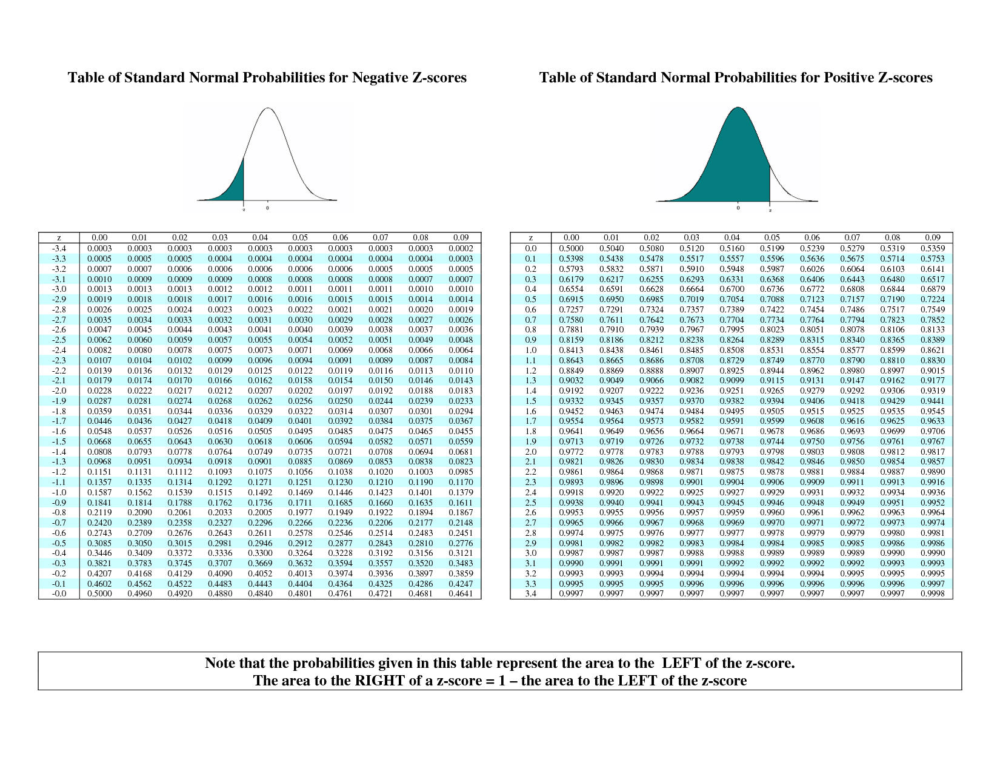

```{r setup, include=FALSE}
options(htmltools.dir.version = FALSE)
knitr::opts_chunk$set(echo=F,
                      message=F,
                      warning=F)
library(tidyverse)
set.seed(256)
update_geom_defaults("label", list(family = "Fira Sans Condensed"))
```

class: inverse, center, middle
# Random Variables

---

# Experiments

.pull-left[

- An .hi-purple[experiment] is any procedure that can (in principle) be repeated infinitely and has a well-defined set of outcomes

.content-box-green[
.green[**Example**]: flip a coin 10 times

]
]

.pull-right[
.center[

]
]

---

# Random Variables

.pull-left[

- A .hi-purple[random variable (RV)] takes on values that are unknown in advance, but determined by an experiment

- A numerical summary of a random outcome

.content-box-green[
.green[**Example**]: the number of heads from 10 coin flips

]
]

.pull-right[
.center[

]
]

---

# Random Variables: Notation

- Random variable $X$ takes on individual values $(x_i)$ from a set of possible values

- Often capital letters to denote RV's
    - lowercase letters for individual values

.content-box-green[
.green[**Example**]: Let $X$ be the number of Heads from 10 coin flips. $\quad x_i \in \{0, 1, 2,...,10\}$
]

---

class: inverse, center, middle
# Discrete Random Variables

---

# Discrete Random Variables

.pull-left[

- A .hi[discrete random variable]: takes on a finite/countable set of possible values

.content-box-green[
.green[**Example**]: Let $X$ be the number of times your computer crashes this semester<sup>.red[1]</sup>, $x_i \in \{0, 1, 2, 3, 4\}$
]

]

.pull-right[

.center[

]
]

.footnote[<sup>.red[1]</sup> Please, back up your files!]

---

# Discrete Random Variables: Probability Distribution

.pull-left[
- .hi[Probability distribution] of a R.V. fully lists all the possible values of $X$ and their associated probabilities
]

.pull-right[

.green[**Example**]:


| $x_i$  | $P(X=x_i)$ |
|--------|------------|
| 0      | 0.80       |
| 1      | 0.10       |
| 2      | 0.06       |
| 3      | 0.03       |
| 4      | 0.01       |

]

---

# Discrete Random Variables: pdf

.pull-left[
.hi[Probability distribution function (pdf)] summarizes the possible outcomes of $X$ and their probabilities

- Notation: $f_X$ is the pdf of $X$: 

$$f_X=p_i, \quad i=1,2,...,k$$

- For any real number $x_i$, $f(x_i)$ is the probablity that $X=x_i$

]

.pull-right[
.green[**Example**]:


| $x_i$  | $P(X=x_i)$ |
|--------|------------|
| 0      | 0.80       |
| 1      | 0.10       |
| 2      | 0.06       |
| 3      | 0.03       |
| 4      | 0.01       |

]

--

- What is $f(0)$?

--

- What is $f(3)$?

---

# Discrete Random Variables: pdf Graph

.pull-left[

.code50[
```{r, echo=T, eval=F}
crashes<-tibble(number = c(0,1,2,3,4),
                prob = c(0.80, 0.10, 0.06, 0.03, 0.01))

ggplot(data = crashes)+
  aes(x = number,
      y = prob)+
  geom_col(fill="#0072B2")+
  labs(x = "Number of Crashes",
       y = "Probability")+
    theme_classic(base_family = "Fira Sans Condensed",
           base_size=20)
```

]
]
.pull-right[

```{r, fig.retina=3}
crashes<-tibble(number = c(0,1,2,3,4),
                prob = c(0.80, 0.10, 0.06, 0.03, 0.01))

ggplot(data = crashes)+
  aes(x = number,
      y = prob)+
  geom_col(fill="#0072B2")+
  labs(x = "Number of Crashes",
       y = "Probability")+
    theme_classic(base_family = "Fira Sans Condensed",
           base_size=20)
```
]

---

# Discrete Random Variables: cdf

.pull-left[
.hi[Cumulative distribution function (pdf)] lists probability $X$ will be *at most* (less than or equal to) a given value $x_i$

- Notation: $F_X=P(X \leq x_i)$

]

.pull-right[

.green[**Example**]:


| $x_i$  | $f(x)$ | $F(x)$ |
|--------|--------|--------|
| 0      | 0.80   | 0.80   |
| 1      | 0.10   | 0.90   |
| 2      | 0.06   | 0.96   |
| 3      | 0.03   | 0.99   |
| 4      | 0.01   | 1.00   |

]

--

- What is the probability your computer will crash *at most* once, $F(1)$?

--

- What about three times, $F(3)$?

---

# Discrete Random Variables: cdf Graph

.pull-left[
.code50[
```{r, echo=T, eval=T}
crashes<-crashes %>%
  mutate(cum_prob = cumsum(prob))

crashes

```

```{r, echo=T, eval=F}
ggplot(data = crashes)+
  aes(x = number,
      y = cum_prob)+
  geom_col(fill="#0072B2")+
  labs(x = "Number of Crashes",
       y = "Probability")+
    theme_classic(base_family = "Fira Sans Condensed",
           base_size=20)
```

]
]

.pull-right[

```{r, fig.retina=3}
crashes<-crashes %>%
  mutate(cum_prob = cumsum(prob))

ggplot(data = crashes)+
  aes(x = number,
      y = cum_prob)+
  geom_col(fill="#0072B2")+
  labs(x = "Number of Crashes",
       y = "Probability")+
    theme_classic(base_family = "Fira Sans Condensed",
           base_size=20)
```
]

---

class: inverse, center, middle
# Expected Value and Variance

---

# Expected Value of a Random Variable

- .hi[Expected value] of a random variable $X$, written $E(X)$, is the long-run average value of $X$ "expected" after many repetitions

$$E(X)=\sum^k_{i=1} p_i x_i$$

--

- $E(X)=p_1x_1+p_2x_2+ \cdots +p_kx_k$

- A **probability-weighted average** of $X$, with each $x_i$ weighted by its associated probability $p_i$

- Also called the .hi["mean"] or .hi["expectation"] of $X$, always denoted either $E(X)$ or $\mu_X$

---

# Expected Value: Example I

.content-box-green[
.green[**Example**]: Suppose you lend your friend $100 at 10% interest. If the loan is repaid, you receive $110. You estimate that your friend is 99% likely to repay, but there is a default risk of 1% where you get nothing. What is the expected value of repayment?

]

---

# Expected Value: Example II

.green[**Example**]:

Let $X$ be a random variable that is described by the following pdf:

| $x_i$  | $P(X=x_i)$ |
|--------|------------|
| 1      | 0.50       |
| 2      | 0.25       |
| 3      | 0.15       |
| 4      | 0.10       |

Calculate $E(X)$. 

---

# The Steps to Calculate E(X), Coded

```{r, echo=T}
# Make a Random Variable called X
X<-tibble(x_i=c(1,2,3,4), # values of X
          p_i=c(0.50,0.25,0.15,0.10)) # probabilities

X %>%
  summarize(expected_value = sum(x_i*p_i))
```

---

# Variance of a Random Variable

- The .hi[variance] of a random variable $X$, denoted $var(X)$ or $\sigma^2_X$ is:

$$\begin{align*}\sigma^2_X &= E[(x_i-\mu_X)^2]\\
&=\sum_{i=1}^n(x_i-\mu_X)^2p_i\\ \end{align*}$$

- This is the .hi-purple[expected value of the squared deviations from the mean]
    - i.e. the probability-weighted average of the squared deviations 

---

# Standard Deviation of a Random Variable

- The .hi[standard deviation] of a random variable $X$, denoted $sd(X)$ or $\sigma_X$ is:

$$\sigma_X=\sqrt{\sigma_X^2}$$

---

# Standard Deviation: Example I

.content-box-green[
.green[**Example**]: What is the standard deviation of computer crashes?
]

| $x_i$  | $P(X=x_i)$ |
|--------|------------|
| 0      | 0.80       |
| 1      | 0.10       |
| 2      | 0.06       |
| 3      | 0.03       |
| 4      | 0.01       |

---

# The Steps to Calculate sd(X), Coded I

```{r, echo=T}
# get the expected value 
crashes %>%
  summarize(expected_value = sum(number*prob))

# save this for quick use
exp_value<-0.35

crashes_2 <- crashes %>%
  select(-cum_prob) %>% # we don't need the cdf
  # create new columns
  mutate(deviations = number - exp_value, # deviations from exp_value
         deviations_sq = deviations^2,
         weighted_devs_sq = prob * deviations^2) # square deviations
```

---

# The Steps to Calculate sd(X), Coded II

```{r, echo=T}
# look at what we made
crashes_2
```

---

# The Steps to Calculate sd(X), Coded III

```{r, echo=T}
# now we want to take the expected value of the squared deviations to get variance
crashes_2 %>%
  summarize(variance = sum(weighted_devs_sq), # variance
            sd = sqrt(variance)) # sd is square root
```

---

# Standard Deviation: Example II

.content-box-green[
.green[**Example**]: What is the standard deviation of the random variable we saw before?
]

| $x_i$  | $P(X=x_i)$ |
|--------|------------|
| 1      | 0.50       |
| 2      | 0.25       |
| 3      | 0.15       |
| 4      | 0.10       |

Hint: you already found it's expected value.

---

class: inverse, center, middle
# Continuous Random Variables

---

# Continuous Random Variables

.pull-left[

- .hi[Continuous random variables] can take on an uncountable (infinite) number of values

- So many values that the probability of any specific value is infinitely small:
$$P(X=x_i)\rightarrow 0$$

- Instead, we focus on a *range* of values it might take on

]

.pull-right[

.center[

]
]

---

# Continuous Random Variables: pdf I

.pull-left[
.hi[Probability *density* function (pdf)] of a continuous variable represents the probability between two values as the area under a curve

- The total area under the curve is 1

- Since $P(a)=0$ and $P(b)=0$, $P(a<X<b)=P(a \leq X \leq b)$

.content-box-green[
.green[**Example**]: $P(0 \leq X \leq 2)$
]

- See [today's class notes](/class/2.2-class) for how to graph math/stats functions in `ggplot`!
]

.pull-right[

```{r, fig.retina=3}

shade_0_to_2 <- function(x) {
    y <- dnorm(x, mean = 0, sd = 1)
    y[x < 0 | x >2] <- NA
    return(y)
}

ggplot(data = tibble(x=-4:4))+
  aes(x = x)+
  stat_function(fun = dnorm, size=2, color="blue")+
  stat_function(fun=shade_0_to_2, geom="area", fill="blue", alpha=0.5)+
  labs(x = "X",
       y = "Probability")+
  theme_classic(base_family = "Fira Sans Condensed",
           base_size=20)
```

]

---

# Continuous Random Variables: pdf II

.pull-left[

- FYI using calculus:

$$P(a \leq X \leq b) = \int_a^b f(x) dx $$

- Complicated: software or (old fashioned!) probability tables to calculate

]

.pull-right[

```{r, fig.retina=3}

shade_0_to_2 <- function(x) {
    y <- dnorm(x, mean = 0, sd = 1)
    y[x < 0 | x >2] <- NA
    return(y)
}

ggplot(data = tibble(x=-4:4))+
  aes(x = x)+
  stat_function(fun = dnorm, size=2, color="blue")+
  stat_function(fun=shade_0_to_2, geom="area", fill="blue", alpha=0.5)+
  labs(x = "X",
       y = "Probability")+
  theme_classic(base_family = "Fira Sans Condensed",
           base_size=20)
```

]

---

# Continuous Random Variables: cdf I

.pull-left[

- The .hi[cumulative density function (cdf)] describes the area under the pdf for all values less than or equal to (i.e. to the left of) a given value, $k$

$$P(X \leq k)$$ 

.content-box-green[
.green[**Example**]: $P(X \leq 2)$
]
]

.pull-right[

```{r, fig.retina=3}

shade_up_to_2 <- function(x) {
    y <- pnorm(x, mean = 0, sd = 1)
    y[x < -4 | x >2] <- NA
    return(y)
}

ggplot(data = tibble(x=-4:4))+
  aes(x = x)+
  stat_function(fun = pnorm, size=2, color="blue")+
  stat_function(fun=shade_up_to_2, geom="area", fill="blue", alpha=0.5)+
  labs(x = "X",
       y = "Probability")+
  theme_classic(base_family = "Fira Sans Condensed",
           base_size=20)
```

]

---

# Continuous Random Variables: cdf II

.pull-left[

- Note: to find the probability of values *greater* than or equal to (to the right of) a given value $k$:

$$P(X \geq k)=1-P(X \leq k)$$

.content-box-green[
.green[**Example**]: $P(X \geq 2) = 1 - P(X \leq 2)$
]
]

.pull-right[

```{r, fig.retina=3}

shade_2_up <- function(x) {
    y <- pnorm(x, mean = 0, sd = 1)
    y[x < 2 | x >4] <- NA
    return(y)
}

ggplot(data = tibble(x=-4:4))+
  aes(x = x)+
  stat_function(fun = pnorm, size=2, color="blue")+
  stat_function(fun=shade_2_up, geom="area", fill="blue", alpha=0.5)+
  labs(x = "X",
       y = "Probability")+
  theme_classic(base_family = "Fira Sans Condensed",
           base_size=20)
```

.center[
$P(X \geq 2)=$ area under the curve to the right of 2
]
]

---

class: inverse, center, middle
# The Normal Distribution

---

# The Normal Distribution I

.pull-left[

- The .hi[Gaussian] or .hi[normal distribution] is the most useful type of probability distribution

$$ X \sim N(\mu,\sigma)$$

- Continuous, symmetric, unimodal, with mean $\mu$ and standard deviation $\sigma$

]

.pull-right[

```{r, fig.retina=3}
ggplot(data = tibble(x=-4:4))+
  aes(x = x)+
  stat_function(fun = dnorm, size=2, color="blue")+
  scale_x_continuous(breaks=seq(-4,4,1))+
  labs(x = "X",
       y = "Probability")+
  theme_classic(base_family = "Fira Sans Condensed",
           base_size=20)
```

]

---

# The Normal Distribution II

.pull-left[

- FYI: The pdf of $X \sim N(\mu, \sigma)$ is 
$$P(X=k)=	\frac{1}{\sqrt{2\pi \sigma^2}}e^{-\frac{1}{2}\big(\frac{(k-\mu)}{\sigma}\big)^2}$$

- **Do not try and learn this**, we have software and (previously tables) to calculate pdfs and cdfs

]

.pull-right[

```{r, fig.retina=3}
normal_pdf<-ggplot(data = tibble(x=-4:4))+
  aes(x = x)+
  stat_function(fun = dnorm, size=2, color="blue")+
  labs(x = "X",
       y = "Probability")+
  scale_x_continuous(breaks=seq(-4,4,1))+
  theme_classic(base_family = "Fira Sans Condensed",
           base_size=20)
normal_pdf
```

]

---

# The 68-95-99.7 Rule

.pull-left[

- .hi[68-95-99.7% empirical rule]: for a normal distribution:
]

.pull-right[

```{r}
shade68 <- function(x) {
    y <- dnorm(x, mean = 0, sd = 1)
    y[x < -1 | x > 1] <- NA
    return(y)
}

shade95 <- function(x) {
    y <- dnorm(x, mean = 0, sd = 1)
    y[x < -2 | x > 2] <- NA
    return(y)
}

shade99.7 <- function(x) {
    y <- dnorm(x, mean = 0, sd = 1)
    y[x < -3 | x > 3] <- NA
    return(y)
}

```

```{r, fig.retina=3}
normal_pdf
```
]

---

# The 68-95-99.7 Rule

.pull-left[

- .hi[68-95-99.7% empirical rule]: for a normal distribution:

- $P(\mu-1\sigma \leq X \leq \mu+1\sigma) \approx$ 68%

]

.pull-right[

```{r, fig.retina=3}
normal_pdf + 
  stat_function(fun = shade68, geom="area", fill="#8856a7", alpha=0.6)+
  annotate("segment", x = -1, xend = 1, y = 0.15, yend = 0.15, colour = "#000000", size=0.5, linetype = 2, alpha=1, arrow=arrow(length=unit(0.25,"cm"), ends="both", type="closed"))+
  annotate("text", x = 0, y = 0.16, label = "68%", color="#000000")
```
]

---

# The 68-95-99.7 Rule

.pull-left[

- .hi[68-95-99.7% empirical rule]: for a normal distribution:

- $P(\mu-1\sigma \leq X \leq \mu+1\sigma) \approx$ 68%

- $P(\mu-2\sigma \leq X \leq \mu+2\sigma) \approx$ 95%

]

.pull-right[

```{r, fig.retina=3}
normal_pdf + 
  stat_function(fun = shade95, geom="area", fill="#9ebcda", alpha=0.6)+
  stat_function(fun = shade68, geom="area", fill="#8856a7", alpha=0.6)+
  annotate("text", x = 0, y = 0.11, label = "95%", color="#000000")+
  annotate("segment", x = -1, xend = 1, y = 0.15, yend = 0.15, colour = "#000000", size=0.5, linetype = 2, alpha=1, arrow=arrow(length=unit(0.25,"cm"), ends="both", type="closed"))+
  annotate("segment", x = -2, xend = 2, y = 0.10, yend = 0.10, colour = "#000000", size=0.5, linetype = 2, alpha=1, arrow=arrow(length=unit(0.25,"cm"), ends="both", type="closed"))+
  annotate("text", x = 0, y = 0.16, label = "68%", color="#000000")
```
]

---
# The 68-95-99.7 Rule

.pull-left[

- .hi[68-95-99.7% empirical rule]: for a normal distribution:

- $P(\mu-1\sigma \leq X \leq \mu+1\sigma) \approx$ 68%

- $P(\mu-2\sigma \leq X \leq \mu+2\sigma) \approx$ 95%

- $P(\mu-3\sigma \leq X \leq \mu+3\sigma) \approx$ 99.7%

- **68/95/99.7%** of observations fall within **1/2/3 standard deviations** of the mean
]

.pull-right[

```{r, fig.retina=3}
normal_pdf + 
  stat_function(fun = shade99.7, geom="area", fill="#e0ecf4", alpha=0.6)+
  stat_function(fun = shade95, geom="area", fill="#9ebcda", alpha=0.6)+
  stat_function(fun = shade68, geom="area", fill="#8856a7", alpha=0.6)+
  annotate("segment", x = -3, xend = 3, y = 0.05, yend = 0.05, colour = "#000000", size=0.5, linetype = 2, alpha=1, arrow=arrow(length=unit(0.25,"cm"), ends="both", type="closed"))+
  annotate("text", x = 0, y = 0.06, label = "99.7%", color="#000000")+
  annotate("segment", x = -2, xend = 2, y = 0.10, yend = 0.10, colour = "#000000", size=0.5, linetype = 2, alpha=1, arrow=arrow(length=unit(0.25,"cm"), ends="both", type="closed"))+
  annotate("text", x = 0, y = 0.11, label = "95%", color="#000000")+
  annotate("segment", x = -1, xend = 1, y = 0.15, yend = 0.15, colour = "#000000", size=0.5, linetype = 2, alpha=1, arrow=arrow(length=unit(0.25,"cm"), ends="both", type="closed"))+
  annotate("text", x = 0, y = 0.16, label = "68%", color="#000000")
```
]

---

# The Standard Normal Distribution

.pull-left[

- The .hi-purple[standard] normal distribution (often referred to as **Z**) has mean 0 and standard deviation 1

$$Z \sim N(0,1)$$

]

.pull-right[

```{r}
normal_pdf
```
]

---

# The Standard Normal cdf

.pull-left[

- The .hi-purple[standard] normal cdf

$$\Phi(k)=P(Z \leq k)$$

]

.pull-right[

```{r, fig.retina=3}
ggplot(data = tibble(x=-4:4))+
  aes(x = x)+
  stat_function(fun = pnorm, size=2, color="blue")+
  labs(x = "X",
       y = "Probability")+
  theme_classic(base_family = "Fira Sans Condensed",
           base_size=20)
```

]

---

# Standardizing Variables

.pull-left[

- We can take any normal distribution (for any $\mu, \sigma)$ and **standardize** it to the standard normal distribution by taking the .hi[Z-score] of any value, $x_i$:

$$Z=\frac{x_i-\mu}{\sigma}$$

- Subtract any value by the distribution's mean and divide by standard deviation

- $Z$: number of standard deviations $x_i$ value is away from the mean
]

.pull-right[
```{r, fig.retina=3}
normal_pdf
```
]

---

# Standardizing Variables: Example

.content-box-green[
.green[**Example**]: On August 8, 2011, the Dow dropped 634.8 points, sending shock waves through the financial community. Assume that during mid-2011 to mid-2012 the daily change for the Dow is normally distributed, with the mean daily change of 1.87 points and a standard deviation of 155.28 points. What is the $Z$-score?

]

--

$$Z = \frac{X - \mu}{\sigma}$$

--


$$Z = \frac{634.8-1.87}{155.28}$$

--

$$Z = -4.1$$

This is 4.1 standard deviations $(\sigma)$ beneath the mean, an *extremely* low probability event.  

---

# Standardizing Variables: From X to Z I

.smallest[
.content-box-green[
.green[**Example**]: In the last quarter of 2015, a group of 64 mutual funds had a mean return of 2.4% with a standard deviation of 5.6%. These returns can be approximated by a normal distribution.

What percent of the funds would you expect to be earning between -3.2% and 8.0% returns?

]
]

--

.smaller[
Convert to standard normal to find $Z$-scores for $8$ and $-3.2.$

$$P(-3.2 < X < 8)$$

]

--

.smaller[
$$P(\frac{-3.2-2.4}{5.6} < \frac{X-2.4}{5.6} < \frac{8-2.4}{5.6})$$
]

--

.smaller[
$$P(-1 < Z < 1)$$
]

--

.smaller[
$$P(X \pm 1\sigma)=0.68$$
]

---

# Standardizing Variables: From X to Z II

```{r, fig.height=3, fig.retina=3, fig.align="center"}

shade_neg3.2_to_8 <- function(x) {
    y <- dnorm(x, mean = 2.4, sd = 5.6)
    y[x < -3.2 | x >8] <- NA
    return(y)
}

ggplot(data = tibble(x=seq(-20,24.8,5.6)))+
  aes(x = x)+
  stat_function(fun = dnorm, args=list(mean = 2.4, sd = 5.6), size=2, color="blue")+
  stat_function(fun=shade_neg3.2_to_8, geom="area", fill="blue", alpha=0.5)+
  labs(x = "Mutual Funds Return % (X)",
       y = "Probability")+
  scale_x_continuous(breaks=seq(-20,24.8,5.6))+
  theme_classic(base_family = "Fira Sans Condensed",
           base_size=20)
```

```{r, fig.height=3, fig.retina=3, fig.align="center"}

shade_neg1_to_1 <- function(x) {
    y <- dnorm(x, mean = 0, sd = 1)
    y[x < -1 | x >1] <- NA
    return(y)
}

ggplot(data = tibble(x=seq(-4,4,1)))+
  aes(x = x)+
  stat_function(fun = dnorm, size=2, color="green")+
  stat_function(fun=shade_neg1_to_1, geom="area", fill="green", alpha=0.5)+
  labs(x = "Standard Deviations (Z)",
       y = "Probability")+
  scale_x_continuous(breaks=seq(-4,4,1))+
  theme_classic(base_family = "Fira Sans Condensed",
           base_size=20)
```

---

# Standardizing Variables: From X to Z III

.content-box-blue[
.blue[**You Try**]: In the last quarter of 2015, a group of 64 mutual funds had a mean return of 2.4% with a standard deviation of 5.6%. These returns can be approximated by a normal distribution.

1. What percent of the funds would you expect to be earning between -3.2% and 8.0% returns?

2. What percent of the funds would you expect to be earning 2.4% or less?

3. What percent of the funds would you expect to be earning between -8.8% and 13.6%?

4. What percent of the funds would you expect to be earning returns greater than 13.6%?
]

---

# Finding Z-score Probabilities I

- How do we actually find the probabilities for $Z-$scores? 	

--

.center[

]

---

# Finding Z-score Probabilities II


.pull-left[

Probability to the **left** of $z_i$

$$P(Z \leq z_i)= \underbrace{\Phi(z_i)}_{\text{cdf of }z_i}$$


```{r, fig.retina=3, fig.height=5, fig.align="center"}
shade_neg4_to_1 <- function(x) {
    y <- dnorm(x, mean = 0, sd = 1)
    y[x < -4 | x >1] <- NA
    return(y)
}

ggplot(data = tibble(x=-4:4))+
  aes(x = x)+
  stat_function(fun = dnorm, size=2, color="blue")+
  stat_function(fun=shade_neg4_to_1, geom="area", fill="blue", alpha=0.5)+
  labs(x = "X",
       y = "Probability")+
  scale_x_continuous(breaks=c(1),
                      label=c(expression(z[i])))+
  theme_classic(base_family = "Fira Sans Condensed",
           base_size=20)

```

]
.pull-right[

Probability to the **right** of $z_i$

$$P(Z \geq z_i)= 1-\underbrace{\Phi(z_i)}_{\text{cdf of }z_i}$$


```{r, fig.retina=3, fig.height=5, fig.align="center"}
shade_1_to_4 <- function(x) {
    y <- dnorm(x, mean = 0, sd = 1)
    y[x < 1 | x >4] <- NA
    return(y)
}

ggplot(data = tibble(x=-4:4))+
  aes(x = x)+
  stat_function(fun = dnorm, size=2, color="blue")+
  stat_function(fun=shade_1_to_4, geom="area", fill="blue", alpha=0.5)+
  labs(x = "X",
       y = "Probability")+
  scale_x_continuous(breaks=c(1),
                      label=c(expression(z[i])))+
  theme_classic(base_family = "Fira Sans Condensed",
           base_size=20)

```


]

---

# Finding Z-score Probabilities III


Probability **between** $z_1$ and $z_2$

$$P(z_1 \geq Z \geq z_2)= \underbrace{\Phi(z_2)}_{\text{cdf of }z_2} - \underbrace{\Phi(z_1)}_{\text{cdf of }z_1}$$


```{r, fig.retina=3, fig.height=5, fig.align="center"}
shade_neg1_to_1 <- function(x) {
    y <- dnorm(x, mean = 0, sd = 1)
    y[x < -1 | x >1] <- NA
    return(y)
}

ggplot(data = tibble(x=-4:4))+
  aes(x = x)+
  stat_function(fun = dnorm, size=2, color="blue")+
  stat_function(fun=shade_neg1_to_1, geom="area", fill="blue", alpha=0.5)+
  labs(x = "X",
       y = "Probability")+
  scale_x_continuous(breaks=c(-1,1),
                      label=c(expression(z[1]), expression(z[2])))+
  theme_classic(base_family = "Fira Sans Condensed",
           base_size=20)

```

---

# Finding Z-score Probabilities IV

.pull-left[

- `pnorm()` calculates `p`robabilities with a `norm`al distribution with arguments:
  - `mean = ` the mean
  - `sd = ` the standard deviation
  - `lower.tail = ` 
      - `TRUE` if looking at area to *LEFT* of value
      - `FALSE` if looking at area to *RIGHT* of value

]

.pull-right[
```{r, fig.retina=3, fig.align="center"}
normal_pdf
```

]

---

# Finding Z-score Probabilities IV

.pull-left[

.content-box-green[
.green[**Example**:] Let the distribution of grades be normal, with mean 75 and standard deviation 10.

]

- Probability a student gets **at least an 80**

```{r, echo=T}
pnorm(80, 
      mean = 75,
      sd = 10,
      lower.tail = FALSE) # looking to right
```
]

.pull-right[
```{r, fig.retina=3, fig.align="center"}
shade_80_up <- function(x) {
    y <- dnorm(x, mean = 75, sd = 10)
    y[x < 80] <- NA
    return(y)
}

ggplot(data = tibble(x=35:115))+
  aes(x = x)+
  stat_function(fun = dnorm, args=list(mean = 75, sd = 10), size=2, color="blue")+
  stat_function(fun=shade_80_up, geom="area", fill="blue", alpha=0.5)+
  labs(x = "X",
       y = "Probability")+
  scale_x_continuous(breaks = seq(35,115,5))+
  theme_classic(base_family = "Fira Sans Condensed",
           base_size=20)

```

]

---

# Finding Z-score Probabilities V

.pull-left[

.content-box-green[
.green[**Example**:] Let the distribution of grades be normal, with mean 75 and standard deviation 10.

]

- Probability a student gets **at most an 80**

```{r, echo=T}
pnorm(80, 
      mean = 75,
      sd = 10,
      lower.tail = TRUE) # looking to left
```
]

.pull-right[
```{r, fig.retina=3, fig.align="center"}
shade_up_to_80 <- function(x) {
    y <- dnorm(x, mean = 75, sd = 10)
    y[x > 80] <- NA
    return(y)
}

ggplot(data = tibble(x=35:115))+
  aes(x = x)+
  stat_function(fun = dnorm, args=list(mean = 75, sd = 10), size=2, color="blue")+
  stat_function(fun=shade_up_to_80, geom="area", fill="blue", alpha=0.5)+
  labs(x = "X",
       y = "Probability")+
  scale_x_continuous(breaks = seq(35,115,5))+
  theme_classic(base_family = "Fira Sans Condensed",
           base_size=20)

```

]

---

# Finding Z-score Probabilities VI

.pull-left[

.content-box-green[
.green[**Example**:] Let the distribution of grades be normal, with mean 75 and standard deviation 10.

]

.smaller[
- Probability a student gets **between a 65 and 85**
]

.code50[
```{r, echo=T}
# subtract two left tails!
pnorm(85, # larger number first!
      mean = 75,
      sd = 10,
      lower.tail = TRUE) - # looking to left, & SUBTRACT
  pnorm(65, # smaller number second!
        mean = 75,
        sd = 10,
        lower.tail = TRUE) #looking to left
```
]
]

.pull-right[
```{r, fig.retina=3, fig.align="center"}
shade_65_to_85 <- function(x) {
    y <- dnorm(x, mean = 75, sd = 10)
    y[x < 65 | x > 85] <- NA
    return(y)
}

ggplot(data = tibble(x=35:115))+
  aes(x = x)+
  stat_function(fun = dnorm, args=list(mean = 75, sd = 10), size=2, color="blue")+
  stat_function(fun=shade_65_to_85, geom="area", fill="blue", alpha=0.5)+
  labs(x = "X",
       y = "Probability")+
  scale_x_continuous(breaks = seq(35,115,5))+
  theme_classic(base_family = "Fira Sans Condensed",
           base_size=20)

```

]