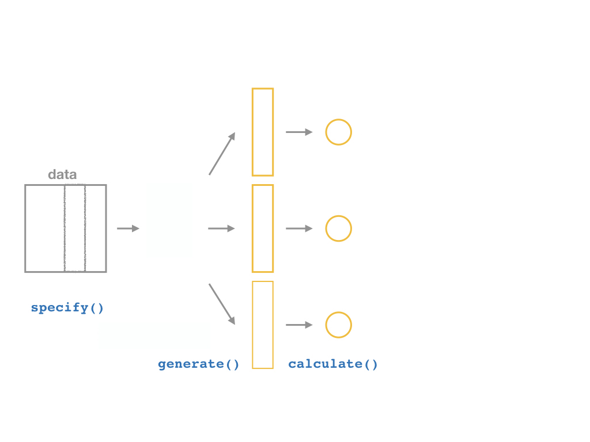

```{r setup, include=FALSE}
options(htmltools.dir.version = FALSE)
knitr::opts_chunk$set(echo=F,
                      message=F,
                      warning=F,
                      fig.retina =3)
library(tidyverse)
library(parallel)
library(ggthemes)
library(broom)
set.seed(256)
update_geom_defaults("label", list(family = "Fira Sans Condensed"))
```

```{r regression-setup, echo=F, results="hide"}

library(haven)
CASchool<-read_dta("../data/caschool.dta")

# run regression of testscr on str
school_reg <- lm(testscr ~ str, 
                 data = CASchool)

library(broom)
school_reg_tidy <- tidy(school_reg,
     conf.int = TRUE) # add confidence intervals
CASchool_aug <- augment(school_reg)


```

```{R, gen dataset, include = F, cache = T}
# Set population and sample sizes
n_p <- 100
n_s <- 30

# Generate data
pop_df <- tibble(
  i = 3,
  x = rnorm(n_p, mean = 5, sd = 1.5),
  e = rnorm(n_p, mean = 0, sd = 1),
  y = i + 0.5 * x + e,
  row = rep(1:sqrt(n_p), times = sqrt(n_p)),
  col = rep(1:sqrt(n_p), each = sqrt(n_p)),
  s1 = sample(x = c(rep(T, n_s), rep(F, n_p - n_s))),
  s2 = sample(x = c(rep(T, n_s), rep(F, n_p - n_s))),
  s3 = sample(x = c(rep(T, n_s), rep(F, n_p - n_s)))
)

# Regressions
lm0 <- lm(y ~ x, data = pop_df)
lm1 <- lm(y ~ x, data = filter(pop_df, s1 == T))
lm2 <- lm(y ~ x, data = filter(pop_df, s2 == T))
lm3 <- lm(y ~ x, data = filter(pop_df, s3 == T))

# Simulation
sim_df <- mclapply(mc.cores = 10, X = 1:1e4, FUN = function(x, size = n_s) {
  lm(y ~ x, data = pop_df %>% sample_n(size = size)) %>% tidy()
  }) %>% 
  do.call(rbind, .) %>%
  as_tibble()
```

class: inverse

# Outline

### [Why Uncertainty Matters](#3)

### [Confidence Intervals](#16)

### [Confidence Intervals Using the infer Package](#24)

---

class: inverse, center, middle

# Why Uncertainty Matters

---

# Recall: The Two Big Problems with Data

.pull-left[
.smallest[
- We use econometrics to .hi-purple[identify] causal relationships and make .hi-purple[inferences] about them

1. Problem for .hi-purple[identification]: .hi[endogeneity]
  - $X$ is **exogenous** if $cor(x, u) = 0$
  - $X$ is **endogenous** if $cor(x, u) \neq 0$

2. Problem for .hi-purple[inference]: .hi[randomness]
  - Data is random due to **natural sampling variation**
  - Taking one sample of a population will yield slightly different information than another sample of the same population
]

]

.pull-right[
.center[


]
]

---

# Distributions of the OLS Estimators

- OLS estimators $(\hat{\beta_0}$ and $\hat{\beta_1})$ are computed from a finite (specific) sample of data

- Our OLS model contains **2 sources of randomness**:

- .hi-purple[*Modeled* randomness]: $u$ includes all factors affecting $Y$ *other* than $X$
    - different samples will have different values of those other factors $(u_i)$

- .hi-purple[*Sampling* randomness]: different samples will generate different OLS estimators
    - Thus, $\hat{\beta_0}, \hat{\beta_1}$ are *also* **random variables**, with their own <span class=hi>sampling distribution</span>

---

# The Two Problems: Where We're Heading...Ultimately

.center[
.b[Sample] $\underbrace{\rightarrow}_{\text{statistical inference}}$ .b[Population] $\underbrace{\rightarrow}_{\text{causal indentification}}$ .b[Unobserved Parameters]
]

- We want to .hi[identify] causal relationships between **population** variables
  - Logically first thing to consider
  - .hi-purple[Endogeneity problem]

- We'll use **sample** *statistics* to .hi-purple[infer] something about population *parameters*
  - In practice, we'll only ever have a finite *sample distribution* of data
  - We *don't* know the *population distribution* of data
  - .hi-purple[Randomness problem]

---

# Why Sample vs. Population Matters

.pull-left[

```{R, pop1, echo = F, fig.fullwidth = T, fig.height=4}
ggplot(data = pop_df, aes(x = row, y = col)) +
geom_point(color = "darkslategray", size = 10) +
theme_void()
```

.center[**Population**]

]

--

.pull-right[

```{R, scatter1, echo = F, fig.fullwidth = T, fig.height=4}
ggplot(data = pop_df, aes(x = x, y = y)) +
geom_abline(
  intercept = lm0$coefficients[1], slope = lm0$coefficients[2],
  color = "#e64173", size = 3
) +
geom_point(color = "darkslategray", size = 6) +
theme_void()
```

.center[**Population relationship**]

$$Y_i = `r round(lm0$coefficients[1], 2)` + `r round(lm0$coefficients[2], 2)` X_i + u_i $$

$$Y_i = \beta_0 + \beta_1 X_i + u_i $$


]

---

# Why Sample vs. Population Matters

.pull-left[

```{R, sample1, echo = F, fig.fullwidth = T, fig.height=4}
ggplot(data = pop_df, aes(x = row, y = col, shape = s1)) +
geom_point(color = "darkslategray", size = 10) +
scale_shape_manual(values = c(1, 19)) +
theme_void()+
  theme(legend.position = "FALSE")
```

.center[**Sample 1:** 30 random individuals]

]

--

.pull-right[

```{R, sample1 scatter, echo = F, fig.fullwidth = T, fig.height=4}
ggplot(data = pop_df, aes(x = x, y = y)) +
geom_abline(
  intercept = lm0$coefficients[1], slope = lm0$coefficients[2],
  color = "#e64173", size = 3, alpha = 0.3
) +
geom_point(aes(shape = s1), color = "darkslategray", size = 6) +
geom_abline(
  intercept = lm1$coefficients[1], slope = lm1$coefficients[2],
  size = 2, linetype = 2, color = "black"
) +
scale_shape_manual(values = c(1, 19)) +
theme_void()+
  theme(legend.position = "FALSE")

```

.center[

**Population relationship**
<br>
$Y_i = `r round(lm0$coefficients[1], 2)` + `r round(lm0$coefficients[2], 2)` X_i + u_i$

**Sample relationship**
<br>
$\hat{Y}_i = `r round(lm1$coefficients[1], 2)` + `r round(lm1$coefficients[2], 2)` X_i$

]

]

---

# Why Sample vs. Population Matters

.pull-left[

```{R, sample2, echo = F, fig.fullwidth = T, fig.height=4}
ggplot(data = pop_df, aes(x = row, y = col, shape = s2)) +
geom_point(color = "darkslategray", size = 10) +
scale_shape_manual(values = c(1, 19)) +
theme_void()+
  theme(legend.position = "FALSE")
```

.center[**Sample 2:** 30 random individuals]

]

.pull-right[

```{R, sample2 scatter, echo = F, fig.fullwidth = T, fig.height=4}
ggplot(data = pop_df, aes(x = x, y = y)) +
geom_abline(
  intercept = lm0$coefficients[1], slope = lm0$coefficients[2],
  color = "#e64173", size = 3, alpha = 0.3
) +
geom_point(aes(shape = s2), color = "darkslategray", size = 6) +
geom_abline(
  intercept = lm1$coefficients[1], slope = lm1$coefficients[2],
  size = 2, linetype = 2, color = "black", alpha = 0.3
) +
geom_abline(
  intercept = lm2$coefficients[1], slope = lm2$coefficients[2],
  size = 2, linetype = 2, color = "black"
) +
scale_shape_manual(values = c(1, 19)) +
theme_void()+
  theme(legend.position = "FALSE")
```

.center[

**Population relationship**
<br>
$Y_i = `r round(lm0$coefficients[1], 2)` + `r round(lm0$coefficients[2], 2)` X_i + u_i$

**Sample relationship**
<br>
$\hat{Y}_i = `r round(lm2$coefficients[1], 2)` + `r round(lm2$coefficients[2], 2)` X_i$

]

]
---

# Why Sample vs. Population Matters

.pull-left[

```{R, sample3, echo = F, fig.fullwidth = T, fig.height=4}
ggplot(data = pop_df, aes(x = row, y = col, shape = s3)) +
geom_point(color = "darkslategray", size = 10) +
scale_shape_manual(values = c(1, 19)) +
theme_void()+
  theme(legend.position = "FALSE")
```

.center[**Sample 3:** 30 random individuals]

]

.pull-right[

```{R, sample3 scatter, echo = F, fig.fullwidth = T, fig.height=4}
ggplot(data = pop_df, aes(x = x, y = y)) +
geom_abline(
  intercept = lm0$coefficients[1], slope = lm0$coefficients[2],
  color = "#e64173", size = 3, alpha = 0.3
) +
geom_point(aes(shape = s3), color = "darkslategray", size = 6) +
geom_abline(
  intercept = lm1$coefficients[1], slope = lm1$coefficients[2],
  size = 2, linetype = 2, color = "black", alpha = 0.3
) +
geom_abline(
  intercept = lm2$coefficients[1], slope = lm2$coefficients[2],
  size = 2, linetype = 2, color = "black", alpha = 0.3
) +
geom_abline(
  intercept = lm3$coefficients[1], slope = lm3$coefficients[2],
  size = 2, linetype = 2, color = "black"
) +
scale_shape_manual(values = c(1, 19)) +
theme_void()+
  theme(legend.position = "FALSE")
```

.center[

**Population relationship**
<br>
$Y_i = `r round(lm0$coefficients[1], 2)` + `r round(lm0$coefficients[2], 2)` X_i + u_i$

**Sample relationship**
<br>
$\hat{Y}_i = `r round(lm3$coefficients[1], 2)` + `r round(lm3$coefficients[2], 2)` X_i$

]

]

---

# Why Sample vs. Population Matters

.pull-left[
- Let's repeat this process **10,000 times**!

- This exercise is called a .hi-purple[(Monte Carlo) simulation]
  - I'll show you how to do this next class with the `infer` package

]

--

.pull-right[
```{R, simulation-scatter, echo = F,cache = T}
# Reshape sim_df
line_df <- tibble(
  intercept = sim_df %>% filter(term != "x") %>% select(estimate) %>% unlist(),
  slope = sim_df %>% filter(term == "x") %>% select(estimate) %>% unlist()
)
ggplot() +
geom_abline(data = line_df, aes(intercept = intercept, slope = slope), alpha = 0.01) +
geom_point(data = pop_df, aes(x = x, y = y), size = 6, color = "darkslategray") +
geom_abline(
  intercept = lm0$coefficients[1], slope = lm0$coefficients[2],
  color = "#e64173", size = 3
) +
theme_void()
```

]

---

# Why Sample vs. Population Matters

.pull-left[
.smallest[
- .hi-turquoise[On average] estimated regression lines from our hypothetical samples provide an unbiased estimate of the true population regression line
$$E[\hat{\beta_1}] =  \beta_1$$

- However, any *individual line* (any *one* sample) can miss the mark

- This leads to .hi-purple[uncertainty] about our estimated regression line
  - Remember, we only have *one* sample in reality!
  - This is why we care about the .hi[standard error] of our line: $se(\hat{\beta_1})$!
]
]

.pull-right[
```{R, ref.label="simulation-scatter"}
```
]

---

class: inverse, center, middle

# Confidence Intervals

---

# Statistical Inference

.center[
.b[Sample] $\xrightarrow{\text{statistical inference}}$ .b[Population] $\xrightarrow{\text{causal indentification}}$ .b[Unobserved Parameters]
]

---

# Statistical Inference

.center[
.hi[Sample] $\color{#e64173}{\xrightarrow{\text{statistical inference}}}$ .hi[Population] $\xrightarrow{\text{causal indentification}}$ .b[Unobserved Parameters]
]

- So what we naturally want to start doing is .hi[inferring] what the true population regression model is, using our estimated regression model from our sample

--

$$\hat{Y_i}=\hat{\beta_0}+\hat{\beta_1}X \xrightarrow{\text{🤞 hopefully 🤞}} Y_i=\beta_0+\beta_1X+u_i$$ 

- We can’t yet make causal inferences about whether/how $X$ *causes* $Y$
  - coming after the midterm!

---

# Estimation and Statistical Inference

.pull-leff[

- Our problem with .hi-purple[uncertainty] is we don’t know whether our sample estimate is *close* or *far* from the unknown population parameter

- But we can use our errors to learn how well our model statistics likely estimate the true parameters

- Use $\hat{\beta_1}$ and its standard error, $se(\hat{\beta_1})$ for statistical inference about true $\beta_1$

- We have two options...
]

.pull-right[

]
---

# Estimation and Statistical Inference

.pull-left[
.center[


.hi[Point estimate]
]

.smaller[
- Use our $\hat{\beta_1}$ and $se(\hat{\beta_1})$ to determine whether we have statistically significant evidence to reject a hypothesized $\beta_1$

- Reporting a *single* value $(\hat{\beta_1})$ is often not going to be the true population parameter $(\beta_1)$
]
]

.pull-right[
.center[


.hi[Confidence interval]
]

.smaller[
- Use $\hat{\beta_1}$ and $se(\hat{\beta_1})$ to create an *range* of values that gives us a good chance of capturing the true $\beta_1$
]
]

---

# Accuracy vs. Precision

.center[

]

- More typical in econometrics to do hypothesis testing (next class)

---

# Generating Confidence Intervals

.pull-left[

- We can generate our confidence interval by generating a .hi-purple[“bootstrap”] sampling distribution

- This takes our sample data, and resamples it by selecting random observations with replacement

- This allows us to approximate the sampling distribution of $\hat{\beta_1}$ by simulation!
]

.pull-right[
.center[

]
]

---

class: inverse, center, middle

# Confidence Intervals Using the infer Package

---

# Confidence Intervals Using the infer Package

.left-column[
.center[

]
]

.right-column[

- The `infer` package allows you to do statistical inference in a `tidy` way, following the philosophy of the `tidyverse`

```{r, eval = F, echo = T}
# install first!
install.packages("infer")

# load
library(infer)
```
]

```{r, echo = F}
library(infer)
```

---

# Confidence Intervals with the infer Package I

.left-column[
.center[

]
]

.right-column[

- `infer` allows you to run through these steps manually to understand the process:

1. `specify()` a model

2. `generate()` a bootstrap distribution 

3. `calculate()` the confidence interval

4. `visualize()` with a histogram (optional)
]


---

# Confidence Intervals with the infer Package II

.center[

]

---

# Confidence Intervals with the infer Package II

.center[

]

---

# Confidence Intervals with the infer Package II

.center[

]

---

# Confidence Intervals with the infer Package II

.center[

]

---

# Confidence Intervals with the infer Package II

.center[

]

---

# Bootstrapping

.pull-left[
## Our Sample

.smallest[

```{r, echo = F}
school_reg %>% tidy()
```
]
]

--

.pull-right[
## Another “Sample”

.smallest[
```{r, echo = F}
CASchool %>%
  specify(testscr ~ str) %>%
  generate(reps = 1,
           type = "bootstrap") %>%
  lm(testscr ~ str, data = .) %>%
  tidy()
```
]

👆 Bootstrapped from Our Sample

]

--

- Now we want to do this 1,000 times to simulate the unknown sampling distribution of $\hat{\beta_1}$

---

# The *infer* Pipeline: Specify

.center[

]

---

# The *infer* Pipeline: Specify

.left-code[
### Specify

`data %>%`
`  specify(y ~ x)`
]

.right-plot[
- Take our data and pipe it into the `specify()` function, which is essentially a `lm()` function for regression (for our purposes)

```{r, echo=T, eval=F}
CASchool %>%
  specify(testscr ~ str)
```

.smallest[
```{r}
CASchool %>%
  specify(testscr ~ str)%>%
  head(., n = 5)
```

]
]

---

# The *infer* Pipeline: Generate

.center[

]

---

# The *infer* Pipeline: Generate

.left-code[
### Specify

### Generate

`%>% generate(reps = n,`
`             type = "bootstrap")`
]

.right-plot[
- Now the magic starts, as we run a number of simulated samples

- Set the number of `reps` and set `type` to `"bootstrap"`

```{r, echo=T, eval=F}
CASchool %>%
  specify(testscr ~ str) %>%
  generate(reps = 1000,
           type = "bootstrap")
```
]

---

# The *infer* Pipeline: Generate

.left-code[
### Specify

### Generate

`%>% generate(reps = n,`
`             type = "bootstrap")`
]

.right-plot[
.quitesmall[
```{r, echo=F, eval=T}
CASchool %>%
  specify(testscr ~ str) %>%
  generate(reps = 1000,
           type = "bootstrap")
```

- `replicate`: the “sample” number (1-1000)

- creates `x` and `y` values (data points)
]
]

---

# The *infer* Pipeline: Calculate

.left-code[
### Specify

### Generate

### Calculate
`%>% calculate(stat = "slope")`
]

.right-plot[
.quitesmall[
```{r, echo=T, eval=F}
CASchool %>%
  specify(testscr ~ str) %>%
  generate(reps = 1000,
           type = "bootstrap") %>%
  calculate(stat = "slope")
```

- For each of the 1,000 replicates, calculate `slope` in `lm(testscr ~ str)`

- Calls it the `stat`
]
]

---

# The *infer* Pipeline: Calculate

.left-code[
### Specify

### Generate

### Calculate
`%>% calculate(stat = "slope")`
]

.right-plot[
.quitesmall[
```{r, echo=F, eval=T}
CASchool %>%
  specify(testscr ~ str) %>%
  generate(reps = 1000,
           type = "bootstrap") %>%
  calculate(stat = "slope")
```

]
]

---

# The *infer* Pipeline: Calculate

.left-code[
### Specify

### Generate

### Calculate
`%>% calculate(stat = "slope")`
]

.right-plot[
.quitesmall[
```{r, echo=T, eval=T}
boot <- CASchool %>% #<< # save this
  specify(testscr ~ str) %>%
  generate(reps = 1000,
           type = "bootstrap") %>%
  calculate(stat = "slope")
```

]

- `boot` is (our simulated) sampling distribution of `\\(\hat{\beta_1}\\)`!

- We can now use this to estimate the confidence interval from *our* `\\(\hat{\beta_1}=-2.28\\)`

- And visualize it
]

---

# Confidence Interval

.pull-left[

- A 95% confidence interval is the middle 95% of the sampling distribution

.smallest[
```{r}
ci<-boot %>%
  summarize(lower = quantile(stat, 0.025),
            upper = quantile(stat, 0.975))
ci
```
]

]

.pull-right[
.quitesmall[
```{r, echo = T, fig.height=4}
sampling_dist<-ggplot(data = boot)+
  aes(x = stat)+
  geom_histogram(color="white", fill = "#e64173")+
  labs(x = expression(hat(beta[1])))+
  theme_pander(base_family = "Fira Sans Condensed",
           base_size=20)
sampling_dist
```
]
]

---

# Confidence Interval

.pull-left[

- A confidence interval is the middle 95% of the sampling distribution

.smallest[
```{r, echo = T}
ci<-boot %>%
  summarize(lower = quantile(stat, 0.025),
            upper = quantile(stat, 0.975))
ci
```

]
]

.pull-right[
.quitesmall[
```{r, echo = T, fig.height=4}
sampling_dist+
  geom_vline(data = ci, aes(xintercept = lower), size = 1, linetype="dashed")+
  geom_vline(data = ci, aes(xintercept = upper), size = 1, linetype="dashed")
```
]
]

---

# The *infer* Pipeline: Confidence Interval

.left-code[
### Specify

### Generate

### Calculate

### Get Confidence Interval
`%>% get_confidence_interval()`
]

.right-plot[
.quitesmall[
```{r, echo=T, eval=T}
CASchool %>% #<< # save this
  specify(testscr ~ str) %>%
  generate(reps = 1000,
           type = "bootstrap") %>%
  calculate(stat = "slope") %>%
  get_confidence_interval(level = 0.95,
                          type = "se",
                          point_estimate = -2.28)
```
]
]

---

# Broom Can Estimate a Confidence Interval

.quitesmall[
```{r, echo = T}
tidy_reg <- school_reg %>% tidy(conf.int = T)
tidy_reg
```
]

--

.quitesmall[
.code60[
```{r, echo = T}
# save and extract confidence interval
our_CI <- tidy_reg %>%
  filter(term == "str") %>%
  select(conf.low, conf.high)

our_CI
```
]
]

---

# The *infer* Pipeline: Confidence Interval

.left-code[
### Specify

### Generate

### Calculate

### Visualize
`%>% visualize()`
]

.right-plot[
.quitesmall[
```{r, echo=T, eval=T, fig.height=3.5}
CASchool %>% #<< # save this
  specify(testscr ~ str) %>%
  generate(reps = 1000,
           type = "bootstrap") %>%
  calculate(stat = "slope") %>%
  visualize()
```

]

- `visualize()` is just a wrapper for `ggplot()`
]

---

# The *infer* Pipeline: Confidence Interval

.left-code[
### Specify

### Generate

### Calculate

### Visualize
`%>% visualize()`
]

.right-plot[
.quitesmall[
```{r, echo=T, eval=T, fig.height=3.5}
CASchool %>% #<< # save this
  specify(testscr ~ str) %>%
  generate(reps = 1000,
           type = "bootstrap") %>%
  calculate(stat = "slope") %>%
  visualize()+shade_ci(endpoints = our_CI)
```

]
.smaller[
- If we have our confidence levels saved (`our_CI`) we can `shade_ci()` in `infer`'s `visualize()` function
]
]
---

# Confidence Intervals

.smallest[
- In general, a .hi[confidence interval (CI)] takes a point estimate and extrapolates it within some .hi-purple[margin of error]:

.center[
$\bigg($ point estimate — margin of error, point estimate + margin of error $\bigg)$
]

- The main question is, .hi-turquoise[how confident do we want to be] that our interval contains the true parameter?
  - Larger confidence level, larger margin of error (and thus larger interval)

- .hi-purple[$1- \alpha$] is the .hi-purple[confidence level] of our confidence interval
  - .hi-purple[$\alpha$] is the .hi-purple[“significance level”] that we use in hypothesis testing
  - `\\(\alpha\\)`: probability that the true mean is *not* contained within our interval

- Typical levels: 90%, 95%, 99%
  - 95% is especially common, `\\(\alpha=0.05\\)`
]

---

# Confidence Levels

.pull-left[
- Depending on our confidence level, we are essentially looking for the center $(1-\alpha)$% of the sampling distribution

- Puts $\frac{\alpha}{2}$ in each tail 
]

.pull-right[
```{r}
ggplot(data = tibble(x=-4:4))+
  aes(x = x)+
  stat_function(fun = dt, args=list(1000), size=2, geom="area", fill="gray", alpha=0.5)+
  stat_function(fun = dt, args=list(1000), size=2, xlim=c(-1.96,1.96), geom="area", fill="#e64173", alpha=1)+
  #stat_function(fun = dt, args=list(1000), size=2, xlim=c(-4,-1.96), geom="area", fill="#e64173")+
  #stat_function(fun = dt, args=list(1000), size=2, xlim=c(1.96, 4), geom="area", fill="#e64173")+
  labs(x = expression(paste("Sampling Distribution of "),hat(beta[1])),
       y = "Probability")+
  annotate("segment", x = -1.96, xend = 1.96, y = 0.10, yend = 0.10, colour = "#000000", size=0.5, linetype = 2, alpha=1, arrow=arrow(length=unit(0.25,"cm"), ends="both", type="closed"))+
  annotate("text", x = 0, y = 0.11, label = expression(1-alpha), color="#000000")+
  
  annotate("segment", x = -4, xend = -1.96, y = 0.05, yend = 0.05, colour = "#000000", size=0.5, linetype = 2, alpha=1, arrow=arrow(length=unit(0.25,"cm"), ends="both", type="closed"))+
  annotate("text", x = -3, y = 0.075, label = expression(frac(alpha,2)), color="#000000")+
  
  annotate("segment", x = 1.96, xend = 4, y = 0.05, yend = 0.05, colour = "#000000", size=0.5, linetype = 2, alpha=1, arrow=arrow(length=unit(0.25,"cm"), ends="both", type="closed"))+
  annotate("text", x = 3, y = 0.075, label = expression(frac(alpha,2)), color="#000000")+
  scale_x_continuous(breaks=NULL)+
  scale_y_continuous(breaks=NULL)+
  theme_classic(base_family = "Fira Sans Condensed",
           base_size=20)
```

]

---

# Confidence Levels and the Empirical Rule

.pull-left[

- Recall the .hi-purple[68-95-99.7% empirical rule] for (standard) normal distributions!<sup>.magenta[†]</sup>

- 95% of data falls within 2 standard deviations of the mean

- Thus, in 95% of samples, the true parameter is likely to fall within *about* 2 standard deviations of the sample estimate

.tiny[
<sup>.magenta[†]</sup> I’m playing fast and loose here, we can’t actually use the normal distribution, we use the Student’s t-distribution with n-k-1 degrees of freedom. But there’s no need to complicate things you don’t need to know about. Look at today’s [class notes](/class/2.6-class) for more.
]

]

.pull-right[
```{r}
ggplot(data = tibble(x=-4:4))+
  aes(x = x)+
  stat_function(fun = dnorm, size=2, geom="area", fill="gray", alpha=0.5)+
  stat_function(fun = dnorm, size=2, xlim=c(-2,2), geom="area", fill="#e64173")+
  labs(x = "Z (Standard Deviations from mean)",
       y = "Probability")+
  annotate("segment", x = -2, xend = 2, y = 0.10, yend = 0.10, colour = "#000000", size=0.5, linetype = 2, alpha=1, arrow=arrow(length=unit(0.25,"cm"), ends="both", type="closed"))+
  annotate("text", x = 0, y = 0.11, label = "95%", color="#000000")+
  annotate("segment", x = -4, xend = -1.96, y = 0.05, yend = 0.05, colour = "#000000", size=0.5, linetype = 2, alpha=1, arrow=arrow(length=unit(0.25,"cm"), ends="both", type="closed"))+
  annotate("text", x = -3, y = 0.075, label = "2.5%", color="#000000")+
  
  annotate("segment", x = 1.96, xend = 4, y = 0.05, yend = 0.05, colour = "#000000", size=0.5, linetype = 2, alpha=1, arrow=arrow(length=unit(0.25,"cm"), ends="both", type="closed"))+
  annotate("text", x = 3, y = 0.075, label = "2.5%", color="#000000")+
  scale_x_continuous(breaks=seq(-4,4,1))+
  theme_classic(base_family = "Fira Sans Condensed",
           base_size=20)
```
]

---

# Interpreting Confidence Intervals

- So our confidence interval for our slope is (-3.22, -1.33), what does this mean again?

--

❌ 95% of the time, the true effect of class size on test score will be between  -3.22 and -1.33

--

❌ We are 95% confident that a randomly selected school district will have an effect of class size on test score between -3.22 and -1.33

--

❌ The effect of class size on test score is  -2.28 95% of the time.

--

✅ We are 95% confident that in similarly constructed samples, the true effect is between  -3.22 and -1.33
