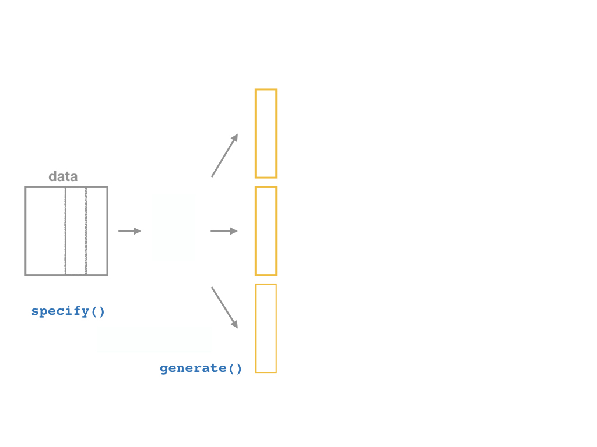

```{r setup, include=FALSE}
options(htmltools.dir.version = FALSE)
knitr::opts_chunk$set(echo=F,
                      message=F,
                      warning=F,
                      fig.retina =3)
library(tidyverse)
library(parallel)
library(ggthemes)
library(broom)
set.seed(256)
update_geom_defaults("label", list(family = "Fira Sans Condensed"))
```

```{r regression-setup, echo=F, results="hide"}

library(haven)
CASchool<-read_dta("../data/caschool.dta")

# run regression of testscr on str
school_reg <- lm(testscr ~ str, 
                 data = CASchool)

library(broom)
school_reg_tidy <- tidy(school_reg,
     conf.int = TRUE) # add confidence intervals
CASchool_aug <- augment(school_reg)


```

```{R, gen dataset, include = F, cache = T}
# Set population and sample sizes
n_p <- 100
n_s <- 30

# Generate data
pop_df <- tibble(
  i = 3,
  x = rnorm(n_p, mean = 5, sd = 1.5),
  e = rnorm(n_p, mean = 0, sd = 1),
  y = i + 0.5 * x + e,
  row = rep(1:sqrt(n_p), times = sqrt(n_p)),
  col = rep(1:sqrt(n_p), each = sqrt(n_p)),
  s1 = sample(x = c(rep(T, n_s), rep(F, n_p - n_s))),
  s2 = sample(x = c(rep(T, n_s), rep(F, n_p - n_s))),
  s3 = sample(x = c(rep(T, n_s), rep(F, n_p - n_s)))
)

# Regressions
lm0 <- lm(y ~ x, data = pop_df)
lm1 <- lm(y ~ x, data = filter(pop_df, s1 == T))
lm2 <- lm(y ~ x, data = filter(pop_df, s2 == T))
lm3 <- lm(y ~ x, data = filter(pop_df, s3 == T))

# Simulation
sim_df <- mclapply(mc.cores = 10, X = 1:1e4, FUN = function(x, size = n_s) {
  lm(y ~ x, data = pop_df %>% sample_n(size = size)) %>% tidy()
  }) %>% 
  do.call(rbind, .) %>%
  as_tibble()
```

class: inverse

# Outline

### R


---

# Recall: The Two Big Problems with Data

.pull-left[
.smallest[
- We use econometrics to .hi-purple[identify] causal relationships and make .hi-purple[inferences] about them

1. Problem for .hi-purple[identification]: .hi[endogeneity]
    - $X$ is **exogenous** if its variation is *unrelated* to other factors $(u)$ that affect $Y$
    - $X$ is **endogenous** if its variation is *related* to other factors $(u)$ that affect $Y$

2. Problem for .hi-purple[inference]: .hi[randomness]
    - Data is random due to **natural sampling variation**
    - Taking one sample of a population will yield slightly different information than another sample of the same population
]

]

.pull-right[
.center[


]
]

---

# Distributions of the OLS Estimators

- OLS estimators $(\hat{\beta_0}$ and $\hat{\beta_1})$ are computed from a finite (specific) sample of data

- Our OLS model contains **2 sources of randomness**:

- .hi-purple[*Modeled* randomness]: $u$ includes all factors affecting $Y$ *other* than $X$
    - different samples will have different values of those other factors $(u_i)$

- .hi-purple[*Sampling* randomness]: different samples will generate different OLS estimators
    - Thus, $\hat{\beta_0}, \hat{\beta_1}$ are *also* **random variables**, with their own <span class=hi>sampling distribution</span>

---

# The Two Problems: Where We're Heading...Ultimately

.center[
.b[Sample] $\underbrace{\rightarrow}_{\text{statistical inference}}$ .b[Population] $\underbrace{\rightarrow}_{\text{causal indentification}}$ .b[Unobserved Parameters]
]

- We want to .hi[identify] causal relationships between **population** variables
  - Logically first thing to consider
  - .hi-purple[Endogeneity problem]

- We'll use **sample** *statistics* to .hi-purple[infer] something about population *parameters*
  - In practice, we'll only ever have a finite *sample distribution* of data
  - We *don't* know the *population distribution* of data
  - .hi-purple[Randomness problem]

---

# Why Sample vs. Population Matters

.pull-left[

```{R, pop1, echo = F, fig.fullwidth = T, fig.height=4}
ggplot(data = pop_df, aes(x = row, y = col)) +
geom_point(color = "darkslategray", size = 10) +
theme_void()
```

.center[**Population**]

]

--

.pull-right[

```{R, scatter1, echo = F, fig.fullwidth = T, fig.height=4}
ggplot(data = pop_df, aes(x = x, y = y)) +
geom_abline(
  intercept = lm0$coefficients[1], slope = lm0$coefficients[2],
  color = "#e64173", size = 3
) +
geom_point(color = "darkslategray", size = 6) +
theme_void()
```

.center[**Population relationship**]

$$Y_i = `r round(lm0$coefficients[1], 2)` + `r round(lm0$coefficients[2], 2)` X_i + u_i $$

$$Y_i = \beta_0 + \beta_1 X_i + u_i $$


]

---

# Why Sample vs. Population Matters

.pull-left[

```{R, sample1, echo = F, fig.fullwidth = T, fig.height=4}
ggplot(data = pop_df, aes(x = row, y = col, shape = s1)) +
geom_point(color = "darkslategray", size = 10) +
scale_shape_manual(values = c(1, 19)) +
theme_void()+
  theme(legend.position = "FALSE")
```

.center[**Sample 1:** 30 random individuals]

]

--

.pull-right[

```{R, sample1 scatter, echo = F, fig.fullwidth = T, fig.height=4}
ggplot(data = pop_df, aes(x = x, y = y)) +
geom_abline(
  intercept = lm0$coefficients[1], slope = lm0$coefficients[2],
  color = "#e64173", size = 3, alpha = 0.3
) +
geom_point(aes(shape = s1), color = "darkslategray", size = 6) +
geom_abline(
  intercept = lm1$coefficients[1], slope = lm1$coefficients[2],
  size = 2, linetype = 2, color = "black"
) +
scale_shape_manual(values = c(1, 19)) +
theme_void()+
  theme(legend.position = "FALSE")

```

.center[

**Population relationship**
<br>
$Y_i = `r round(lm0$coefficients[1], 2)` + `r round(lm0$coefficients[2], 2)` X_i + u_i$

**Sample relationship**
<br>
$\hat{Y}_i = `r round(lm1$coefficients[1], 2)` + `r round(lm1$coefficients[2], 2)` X_i$

]

]

---

# Why Sample vs. Population Matters

.pull-left[

```{R, sample2, echo = F, fig.fullwidth = T, fig.height=4}
ggplot(data = pop_df, aes(x = row, y = col, shape = s2)) +
geom_point(color = "darkslategray", size = 10) +
scale_shape_manual(values = c(1, 19)) +
theme_void()+
  theme(legend.position = "FALSE")
```

.center[**Sample 2:** 30 random individuals]

]

.pull-right[

```{R, sample2 scatter, echo = F, fig.fullwidth = T, fig.height=4}
ggplot(data = pop_df, aes(x = x, y = y)) +
geom_abline(
  intercept = lm0$coefficients[1], slope = lm0$coefficients[2],
  color = "#e64173", size = 3, alpha = 0.3
) +
geom_point(aes(shape = s2), color = "darkslategray", size = 6) +
geom_abline(
  intercept = lm1$coefficients[1], slope = lm1$coefficients[2],
  size = 2, linetype = 2, color = "black", alpha = 0.3
) +
geom_abline(
  intercept = lm2$coefficients[1], slope = lm2$coefficients[2],
  size = 2, linetype = 2, color = "black"
) +
scale_shape_manual(values = c(1, 19)) +
theme_void()+
  theme(legend.position = "FALSE")
```

.center[

**Population relationship**
<br>
$Y_i = `r round(lm0$coefficients[1], 2)` + `r round(lm0$coefficients[2], 2)` X_i + u_i$

**Sample relationship**
<br>
$\hat{Y}_i = `r round(lm2$coefficients[1], 2)` + `r round(lm2$coefficients[2], 2)` X_i$

]

]
---

# Why Sample vs. Population Matters

.pull-left[

```{R, sample3, echo = F, fig.fullwidth = T, fig.height=4}
ggplot(data = pop_df, aes(x = row, y = col, shape = s3)) +
geom_point(color = "darkslategray", size = 10) +
scale_shape_manual(values = c(1, 19)) +
theme_void()+
  theme(legend.position = "FALSE")
```

.center[**Sample 3:** 30 random individuals]

]

.pull-right[

```{R, sample3 scatter, echo = F, fig.fullwidth = T, fig.height=4}
ggplot(data = pop_df, aes(x = x, y = y)) +
geom_abline(
  intercept = lm0$coefficients[1], slope = lm0$coefficients[2],
  color = "#e64173", size = 3, alpha = 0.3
) +
geom_point(aes(shape = s3), color = "darkslategray", size = 6) +
geom_abline(
  intercept = lm1$coefficients[1], slope = lm1$coefficients[2],
  size = 2, linetype = 2, color = "black", alpha = 0.3
) +
geom_abline(
  intercept = lm2$coefficients[1], slope = lm2$coefficients[2],
  size = 2, linetype = 2, color = "black", alpha = 0.3
) +
geom_abline(
  intercept = lm3$coefficients[1], slope = lm3$coefficients[2],
  size = 2, linetype = 2, color = "black"
) +
scale_shape_manual(values = c(1, 19)) +
theme_void()+
  theme(legend.position = "FALSE")
```

.center[

**Population relationship**
<br>
$Y_i = `r round(lm0$coefficients[1], 2)` + `r round(lm0$coefficients[2], 2)` X_i + u_i$

**Sample relationship**
<br>
$\hat{Y}_i = `r round(lm3$coefficients[1], 2)` + `r round(lm3$coefficients[2], 2)` X_i$

]

]

---

# Why Sample vs. Population Matters

.pull-left[
- Let's repeat this process **10,000 times**!

- This exercise is called a .hi-purple[(Monte Carlo) simulation]
  - I'll show you how to do this next class with the `infer` package

]

--

.pull-right[
```{R, simulation-scatter, echo = F,cache = T}
# Reshape sim_df
line_df <- tibble(
  intercept = sim_df %>% filter(term != "x") %>% select(estimate) %>% unlist(),
  slope = sim_df %>% filter(term == "x") %>% select(estimate) %>% unlist()
)
ggplot() +
geom_abline(data = line_df, aes(intercept = intercept, slope = slope), alpha = 0.01) +
geom_point(data = pop_df, aes(x = x, y = y), size = 6, color = "darkslategray") +
geom_abline(
  intercept = lm0$coefficients[1], slope = lm0$coefficients[2],
  color = "#e64173", size = 3
) +
theme_void()
```

]

---

# Why Sample vs. Population Matters

.pull-left[
.smallest[
- .hi-turquoise[On average] estimated regression lines from our hypothetical samples provide an unbiased estimate of the true population regression line
$$E[\hat{\beta_1}] =  \beta_1$$

- However, any *individual line* (any *one* sample) can miss the mark

- This leads to .hi-purple[uncertainty] about our estimated regression line
  - Remember, we only have *one* sample in reality!
  - This is why we care about the .hi[standard error] of our line: $se(\hat{\beta_1})$!
]
]

.pull-right[
```{R, ref.label="simulation-scatter"}
```
]

---

class: inverse, center, middle

# Confidence Intervals

---

# Statistical Inference

.center[
.b[Sample] $\xrightarrow{\text{statistical inference}}$ .b[Population] $\xrightarrow{\text{causal indentification}}$ .b[Unobserved Parameters]
]

---

# Statistical Inference

.center[
.hi[Sample] $\color{#e64173}{\xrightarrow{\text{statistical inference}}}$ .hi[Population] $\xrightarrow{\text{causal indentification}}$ .b[Unobserved Parameters]
]

- So what we naturally want to start doing is .hi[inferring] what the true population regression model is, using our estimated regression model from our sample

--

$$\hat{Y_i}=\hat{\beta_0}+\hat{\beta_1}X \xrightarrow{\text{🤞 hopefully 🤞}} Y_i=\beta_0+\beta_1X+u_i$$ 

- We can’t yet make causal inferences about whether/how $X$ *causes* $Y$
  - coming after the midterm!

---

# Estimation and Statistical Inference

.pull-leff[

- Our problem with .hi-purple[uncertainty] is we don’t know whether our sample estimate is *close* or *far* from the unknown population parameter

- But we can use our errors to learn how well our model statistics likely estimate the true parameters

- Use $\hat{\beta_1}$ and its standard error, $se(\hat{\beta_1})$ for statistical inference about true $\beta_1$

- We have two options...
]

.pull-right[

]
---

# Estimation and Statistical Inference

.pull-left[
.center[


.hi[Point estimate]
]

.smaller[
- Use our $\hat{\beta_1}$ and $se(\hat{\beta_1})$ to determine whether we have statistically significant evidence to reject a hypothesized $\beta_1$

- Reporting a *single* value $(\hat{\beta_1})$ is often not going to be the true population parameter $(\beta_1)$
]
]

.pull-right[
.center[


.hi[Confidence interval]
]

.smaller[
- Use $\hat{\beta_1}$ and $se(\hat{\beta_1})$ to create an *range* of values that gives us a good chance of capturing the true $\beta_1$
]
]

---

# Accuracy vs. Precision

.center[

]

- More typical in econometrics to do hypothesis testing (next class)

---

# Generating Confidence Intervals

.pull-left[

- We can generate our confidence interval by generating a .hi-purple[“bootstrap”] sampling distribution

- This takes our sample data, and resamples it by selecting random observations with replacement

- This allows us to approximate the sampling distribution of $\hat{\beta_1}$ by simulation!
]

.pull-right[
.center[

]
]

---

class: inverse, center, middle

# Confidence Intervals Using the infer Package

---

# Confidence Intervals Using the infer Package

.left-column[
.center[

]
]

.right-column[

- The `infer` package allows you to do statistical inference in a `tidy` way, following the philosophy of the `tidyverse`

```{r, eval = F, echo = T}
# install first!
install.packages("infer")

# load
library(infer)
```
]

```{r, echo = F}
library(infer)
```

---

# Confidence Intervals with the infer Package I

.left-column[
.center[

]
]

.right-column[

- `infer` allows you to run through these steps manually to understand the process:

1. `specify()` a model

2. `generate()` a bootstrap distribution 

3. `calculate()` the confidence interval

4. `visualize()` with a histogram (optional)
]


---

# Confidence Intervals with the infer Package II

.center[

]

---

# Confidence Intervals with the infer Package II

.center[

]

---

# Confidence Intervals with the infer Package II

.center[

]

---

# Confidence Intervals with the infer Package II

.center[

]

---

# Confidence Intervals with the infer Package II

.center[

]

---

# Bootstrapping

.pull-left[
## Our Sample

.smallest[

```{r, echo = F}
school_reg %>% tidy()
```
]
]

--

.pull-right[
## Another “Sample”

.smallest[
```{r, echo = F}
CASchool %>%
  specify(testscr ~ str) %>%
  generate(reps = 1,
           type = "bootstrap") %>%
  lm(testscr ~ str, data = .) %>%
  tidy()
```
]

👆 Bootstrapped from Our Sample

]

--

- Now we want to do this 1,000 times to simulate the unknown sampling distribution of $\hat{\beta_1}$

---

# The *infer* Pipeline: Specify

.center[

]

---

# The *infer* Pipeline: Specify

.left-code[
### Specify

`data %>%`
`  specify(y ~ x)`
]

.right-plot[
- Take our data and pipe it into the `specify()` function, which is essentially a `lm()` function for regression (for our purposes)

```{r, echo=T, eval=F}
CASchool %>%
  specify(testscr ~ str)
```

.smallest[
```{r}
CASchool %>%
  specify(testscr ~ str)%>%
  head(., n = 5)
```

]
]

---

# The *infer* Pipeline: Generate

.center[

]

---

# The *infer* Pipeline: Generate

.left-code[
### Specify

### Generate

`%>% generate(reps = n,`
`             type = "bootstrap")`
]

.right-plot[
- Now the magic starts, as we run a number of simulated samples

- Set the number of `reps` and set `type` to `"bootstrap"`

```{r, echo=T, eval=F}
CASchool %>%
  specify(testscr ~ str) %>%
  generate(reps = 1000,
           type = "bootstrap")
```
]

---

# The *infer* Pipeline: Generate

.left-code[
### Specify

### Generate

`%>% generate(reps = n,`
`             type = "bootstrap")`
]

.right-plot[
.quitesmall[
```{r, echo=F, eval=T}
CASchool %>%
  specify(testscr ~ str) %>%
  generate(reps = 1000,
           type = "bootstrap")
```

- `replicate`: the “sample” number (1-1000)

- creates `x` and `y` values (data points)
]
]

---

# The *infer* Pipeline: Calculate

.left-code[
### Specify

### Generate

### Calculate
`%>% calculate(stat = "slope")`
]

.right-plot[
.quitesmall[
```{r, echo=T, eval=F}
CASchool %>%
  specify(testscr ~ str) %>%
  generate(reps = 1000,
           type = "bootstrap") %>%
  calculate(stat = "slope")
```

- For each of the 1,000 replicates, calculate `slope` in `lm(testscr ~ str)`

- Calls it the `stat`
]
]

---

# The *infer* Pipeline: Calculate

.left-code[
### Specify

### Generate

### Calculate
`%>% calculate(stat = "slope")`
]

.right-plot[
.quitesmall[
```{r, echo=F, eval=T}
CASchool %>%
  specify(testscr ~ str) %>%
  generate(reps = 1000,
           type = "bootstrap") %>%
  calculate(stat = "slope")
```

]
]

---

# The *infer* Pipeline: Calculate

.left-code[
### Specify

### Generate

### Calculate
`%>% calculate(stat = "slope")`
]

.right-plot[
.quitesmall[
```{r, echo=T, eval=T}
boot <- CASchool %>% #<< # save this
  specify(testscr ~ str) %>%
  generate(reps = 1000,
           type = "bootstrap") %>%
  calculate(stat = "slope")
```

]

- `boot` is (our simulated) sampling distribution of `\\(\hat{\beta_1}\\)`!

- We can now use this to estimate the confidence interval from *our* `\\(\hat{\beta_1}=-2.28\\)`

- And visualize it
]

---

# Confidence Interval

.pull-left[

- A 95% confidence interval is the middle 95% of the sampling distribution

.smallest[
```{r}
ci<-boot %>%
  summarize(lower = quantile(stat, 0.025),
            upper = quantile(stat, 0.975))
ci
```
]

]

.pull-right[
.quitesmall[
```{r, echo = T, fig.height=4}
sampling_dist<-ggplot(data = boot)+
  aes(x = stat)+
  geom_histogram(color="white", fill = "#e64173")+
  labs(x = expression(hat(beta[1])))+
  theme_pander(base_family = "Fira Sans Condensed",
           base_size=20)
sampling_dist
```
]
]

---

# Confidence Interval

.pull-left[

- A confidence interval is the middle 95% of the sampling distribution

.smallest[
```{r, echo = T}
ci<-boot %>%
  summarize(lower = quantile(stat, 0.025),
            upper = quantile(stat, 0.975))
ci
```

]
]

.pull-right[
.quitesmall[
```{r, echo = T, fig.height=4}
sampling_dist+
  geom_vline(data = ci, aes(xintercept = lower), size = 1, linetype="dashed")+
  geom_vline(data = ci, aes(xintercept = upper), size = 1, linetype="dashed")
```
]
]

---

# The *infer* Pipeline: Confidence Interval

.left-code[
### Specify

### Generate

### Calculate

### Get Confidence Interval
`%>% get_confidence_interval()`
]

.right-plot[
.quitesmall[
```{r, echo=T, eval=T}
CASchool %>% #<< # save this
  specify(testscr ~ str) %>%
  generate(reps = 1000,
           type = "bootstrap") %>%
  calculate(stat = "slope") %>%
  get_confidence_interval(level = 0.95,
                          type = "se",
                          point_estimate = -2.28)
```
]
]

---

# Broom Can Estimate a Confidence Interval

.quitesmall[
```{r, echo = T}
tidy_reg <- school_reg %>% tidy(conf.int = T)
tidy_reg
```
]

--

.quitesmall[
.code60[
```{r, echo = T}
# save and extract confidence interval
our_CI <- tidy_reg %>%
  filter(term == "str") %>%
  select(conf.low, conf.high)

our_CI
```
]
]

---

# The *infer* Pipeline: Confidence Interval

.left-code[
### Specify

### Generate

### Calculate

### Visualize
`%>% visualize()`
]

.right-plot[
.quitesmall[
```{r, echo=T, eval=T, fig.height=3.5}
CASchool %>% #<< # save this
  specify(testscr ~ str) %>%
  generate(reps = 1000,
           type = "bootstrap") %>%
  calculate(stat = "slope") %>%
  visualize()
```

]

- `visualize()` is just a wrapper for `ggplot()`
]

---

# The *infer* Pipeline: Confidence Interval

.left-code[
### Specify

### Generate

### Calculate

### Visualize
`%>% visualize()`
]

.right-plot[
.quitesmall[
```{r, echo=T, eval=T, fig.height=3.5}
CASchool %>% #<< # save this
  specify(testscr ~ str) %>%
  generate(reps = 1000,
           type = "bootstrap") %>%
  calculate(stat = "slope") %>%
  visualize()+shade_ci(endpoints = our_CI)
```

]
.smaller[
- If we have our confidence levels saved (`our_CI`) we can `shade_ci()` in `infer`'s `visualize()` function
]
]
---

# Confidence Intervals

.smallest[
- In general, a .hi[confidence interval (CI)] takes a point estimate and extrapolates it within some .hi-purple[margin of error]:

.center[
$\bigg($ point estimate — margin of error, point estimate + margin of error $\bigg)$
]

- The main question is, .hi-turquoise[how confident do we want to be] that our interval contains the true parameter?
  - Larger confidence level, larger margin of error (and thus larger interval)

- .hi-purple[$1- \alpha$] is the .hi-purple[confidence level] of our confidence interval
  - .hi-purple[$\alpha$] is the .hi-purple[“significance level”] that we use in hypothesis testing
  - `\\(\alpha\\)`: probability that the true mean is *not* contained within our interval

- Typical levels: 90%, 95%, 99%
  - 95% is especially common, `\\(\alpha=0.05\\)`
]

---

# Confidence Levels

.pull-left[
- Depending on our confidence level, we are essentially looking for the center $(1-\alpha)$% of the sampling distribution

- Puts $\frac{\alpha}{2}$ in each tail 
]

.pull-right[
```{r}
ggplot(data = tibble(x=-4:4))+
  aes(x = x)+
  stat_function(fun = dt, args=list(1000), size=2, geom="area", fill="gray", alpha=0.5)+
  stat_function(fun = dt, args=list(1000), size=2, xlim=c(-1.96,1.96), geom="area", fill="#e64173", alpha=1)+
  #stat_function(fun = dt, args=list(1000), size=2, xlim=c(-4,-1.96), geom="area", fill="#e64173")+
  #stat_function(fun = dt, args=list(1000), size=2, xlim=c(1.96, 4), geom="area", fill="#e64173")+
  labs(x = expression(paste("Sampling Distribution of "),hat(beta[1])),
       y = "Probability")+
  annotate("segment", x = -1.96, xend = 1.96, y = 0.10, yend = 0.10, colour = "#000000", size=0.5, linetype = 2, alpha=1, arrow=arrow(length=unit(0.25,"cm"), ends="both", type="closed"))+
  annotate("text", x = 0, y = 0.11, label = expression(1-alpha), color="#000000")+
  
  annotate("segment", x = -4, xend = -1.96, y = 0.05, yend = 0.05, colour = "#000000", size=0.5, linetype = 2, alpha=1, arrow=arrow(length=unit(0.25,"cm"), ends="both", type="closed"))+
  annotate("text", x = -3, y = 0.075, label = expression(frac(alpha,2)), color="#000000")+
  
  annotate("segment", x = 1.96, xend = 4, y = 0.05, yend = 0.05, colour = "#000000", size=0.5, linetype = 2, alpha=1, arrow=arrow(length=unit(0.25,"cm"), ends="both", type="closed"))+
  annotate("text", x = 3, y = 0.075, label = expression(frac(alpha,2)), color="#000000")+
  scale_x_continuous(breaks=NULL)+
  scale_y_continuous(breaks=NULL)+
  theme_classic(base_family = "Fira Sans Condensed",
           base_size=20)
```

]

---

# Confidence Levels and the Empirical Rule

.pull-left[

- Recall the .hi-purple[68-95-99.7% empirical rule] for (standard) normal distributions!<sup>.magenta[†]</sup>

- 95% of data falls within 2 standard deviations of the mean

- Thus, in 95% of samples, the true parameter is likely to fall within *about* 2 standard deviations of the sample estimate

.tiny[
<sup>.magenta[†]</sup> I’m playing fast and loose here, we can’t actually use the normal distribution, we use the Student’s t-distribution with n-k-1 degrees of freedom. But there’s no need to complicate things you don’t need to know about. Look at today’s [class notes](/class/2.6-class) for more.
]

]

.pull-right[
```{r}
ggplot(data = tibble(x=-4:4))+
  aes(x = x)+
  stat_function(fun = dnorm, size=2, geom="area", fill="gray", alpha=0.5)+
  stat_function(fun = dnorm, size=2, xlim=c(-2,2), geom="area", fill="#e64173")+
  labs(x = "Z (Standard Deviations from mean)",
       y = "Probability")+
  annotate("segment", x = -2, xend = 2, y = 0.10, yend = 0.10, colour = "#000000", size=0.5, linetype = 2, alpha=1, arrow=arrow(length=unit(0.25,"cm"), ends="both", type="closed"))+
  annotate("text", x = 0, y = 0.11, label = "95%", color="#000000")+
  annotate("segment", x = -4, xend = -1.96, y = 0.05, yend = 0.05, colour = "#000000", size=0.5, linetype = 2, alpha=1, arrow=arrow(length=unit(0.25,"cm"), ends="both", type="closed"))+
  annotate("text", x = -3, y = 0.075, label = "2.5%", color="#000000")+
  
  annotate("segment", x = 1.96, xend = 4, y = 0.05, yend = 0.05, colour = "#000000", size=0.5, linetype = 2, alpha=1, arrow=arrow(length=unit(0.25,"cm"), ends="both", type="closed"))+
  annotate("text", x = 3, y = 0.075, label = "2.5%", color="#000000")+
  scale_x_continuous(breaks=seq(-4,4,1))+
  theme_classic(base_family = "Fira Sans Condensed",
           base_size=20)
```
]

---

# Interpreting Confidence Intervals

- So our confidence interval for our slope is $-3.22, -1.33), what does this mean?

--

❌ 95% of the time, the true effect of class size on test score will be between  -3.22 and -1.33

--

❌ We are 95% confident that a randomly selected school district will have an effect of class size on test score between -3.22 and -1.33

--

❌ The effect of class size on test score is  -2.28 95% of the time.

--

✅ We are 95% confident that in similarly constructed samples, the true effect is between  -3.22 and -1.33

---

class: inverse, center, middle

# Hypothesis Testing

---


# Estimation and Hypothesis Testing I

- We want to **test** if our estimates are .hi[statistically significant] and they describe the population
  - This is the "bread and butter" of inferential statistics and the purpose of regression

--

.content-box-green[
.green[**Examples**]:
- Does reducing class size actually improve test scores?
- Do more years of education increase your wages? 
- Is the gender wage gap between men and women really $0.77? 
]

--

- .hi-purple[All modern science is built upon statistical hypothesis testing, so understand it well!]

---

# Estimation and Hypothesis Testing II

.smallest[
- Note, we can test a lot of hypotheses about a lot of population parameters, e.g.
  - A population mean $\mu$ 
    - <span class="green">**Example**: average height of adults</span>
  - A population proportion $p$
    - <span class="green">**Example**: percent of voters who voted for Trump</span>
  - A difference in population means $\mu_A-\mu_B$
    - <span class="green">**Example**: difference in average wages of men vs. women</span>
  - A difference in population proportions $p_A-p_B$
    - <span class="green">**Example**: difference in percent of patients reporting symptoms of drug A vs B</span>
  - See all the possibilities in glorious detail in today's [class notes](/class/2.6-class)

- We will focus on hypotheses about .hi-purple[population regression slope] $(\hat{\beta}_1)$, i.e. the .hi-purple[causal effect]<sup>.magenta[†]</sup> of $X$ on $Y$
]

.footnote[<sup>.magenta[†]</sup> With a model this simple, it's almost certainly **not** causal, but this is the ultimate direction we are heading...]

---

# Null and Alternative Hypotheses I

- All scientific inquiries begin with a .hi[null hypothesis] $(H_0)$ that proposes a specific value of a population parameter
    - Notation: add a subscript 0: $\beta_{1,0}$ (or $\mu_0$, $p_0$, etc)

--

- We suggest an .hi[alternative hypothesis] $(H_a)$, often the one we hope to verify
    - Note, can be multiple alternative hypotheses: $H_1, H_2, \ldots , H_n$

--

- Ask: .hi-purple["Does our data (sample) give us sufficient evidence to reject `\\(H_0\\)` in favor of `\\(H_a\\)`?"]
    - Note: **the test is *always* about** $\mathbf{H_0}$! 
    - See if we have sufficient evidence to reject the status quo

---

# Null and Alternative Hypotheses II

- Null hypothesis assigns a value (or a range) to a population parameter
    - e.g. $\beta_1=2$ or $\beta_1 \leq 20$
    - **Most common is $\beta_1=0$** $\implies$ $X$ has no effect on $Y$ (no slope for a line)
    - Note: always an equality!

--

- Alternative hypothesis must mathematically *contradict* the null hypothesis
    - e.g. $\beta_1 \neq 2$ or $\beta_1 > 20$ or $\beta_1 \neq 0$
    - Note: always an inequality!

--

- Alternative hypotheses come in two forms:
    1. **One-sided alternative**: $\beta_1 >H_0$ or $\beta_1< H_0$
    2. **Two-sided alternative**: $\beta_1 \neq H_0$
        - Note this means either $\beta_1 < H_0$ or $\beta_1 > H_0$

---

# Components of a Valid Hypothesis Test

- All statistical hypothesis tests have the following components:

1. A .hi-purple[null hypothesis, `\\(H_0\\)`]

2. An .hi-purple[alternative hypothesis, `\\(H_a\\)`]

3. A .hi-purple[test statistic] to determine if we reject $H_0$ when the statistic reaches a "critical value"
    - Beyond the critical value is the "rejection region", sufficient evidence to reject $H_0$
    
4. A .hi-purple[conclusion] whether or not to reject $H_0$ in favor of $H_a$

---

# Type I and Type II Errors I

.pull-left[
.smallest[
- Any sample statistic (e.g. $\hat{\beta_1}$) will rarely be exactly equal to the hypothesized population parameter (e.g. $\beta_1$)

- Difference between observed statistic and true paremeter could be because:

1. Parameter is *not* the hypothesized value $(H_0$ is *false*)
    
2. Parameter is truly the hypothesized value $(H_0$ is *true*) but *sampling variability* gave us a different estimate 
    
- .hi-purple[We cannot distinguish between these two possibilities with any certainty]

]
]

.pull-right[
.center[

]
]
---

# Type I and Type II Errors II

.pull-left[
.smaller[
- We can interpret our estimates probabilistically as commiting one of two types of error:

1. .hi[Type I error (false positive)]: rejecting $H_0$ when it is in fact true
    - Believing we found an important result when there is truly no relationship
    
2. .hi[Type II error (false negative)]: failing to reject $H_0$ when it is in fact false
    - Believing we found nothing when there was truly a relationship to find
]
]

.pull-right[
.center[

]
]

---

# Type I and Type II Errors III

```{r, echo=FALSE, results="asis", eval=F}
library(kableExtra)
tribble(
  ~"", ~"", ~"Null is True", ~"Null is False",
  "Judgment", "Reject Null", "Type I Error", "Correct",
  "Judgment", "Don't Reject Null", "Correct", "Type II Error"
  ) %>%
  knitr::kable(.,format="html") %>%
  kable_styling(full_width = F) %>%
  add_header_above(c(" " = 2, "Truth" = 2)) %>%
  column_spec(c(1,2), bold=T) %>%
  collapse_rows(columns = 1, latex_hline = "major", valign = "middle")
```

.regtable[
```{r, echo=FALSE, results="asis"}
library(kableExtra)
tribble(
  ~"", ~"", ~"Null is True", ~"Null is False",
  "Judgment", "Reject Null", "TYPE I ERROR", "CORRECT",
  "Judgment", "Reject Null", "(False +)", "(True +)",
  "Judgment", "Don't Reject Null", "CORRECT", "TYPE II ERROR",
  "Judgment", "Don't Reject Null", "(True -)", "(False -)"
  ) %>%
  knitr::kable(.,format="html") %>%
  kable_styling(full_width = F) %>%
  add_header_above(c(" " = 2, "Truth" = 2)) %>%
  column_spec(c(1,2), bold=T) %>%
  collapse_rows(columns = c(1,2), latex_hline = "major", valign = "middle")

```
]

- Depending on context, committing one type of error may be more serious than the other

---

# Type I and Type II Errors IV

.regtable[
```{r, echo=FALSE, results="asis"}
library(kableExtra)
tribble(
  ~"", ~"", ~"Defendant is Innocent", ~"Defendant is Guilty",
  "Judgment", "Convict", "TYPE I ERROR", "CORRECT",
  "Judgment", "Convict", "(False +)", "(True +)",
  "Judgment", "Acquit", "CORRECT", "TYPE II ERROR",
  "Judgment", "Acquit", "(True -)", "(False -)"
  ) %>%
  knitr::kable(.,format="html") %>%
  kable_styling(full_width = F) %>%
  add_header_above(c(" " = 2, "Truth" = 2)) %>%
  column_spec(c(1,2), bold=T) %>%
  collapse_rows(columns = c(1,2), latex_hline = "major", valign = "middle")

```
]

.smaller[
- Anglo-American common law *presumes* defendant is innocent: $H_0$
]

--

.smaller[
- Jury judges whether the evidence presented against the defendant is plausible *assuming the defendant were in fact innocent*
]
--

.smaller[
- If highly improbable: sufficient evidence to reject $H_0$ and convict
  - Beyond a “reasonable doubt” that the defendant is innocent
]
---

# Type I and Type II Errors V

.left-column[

.center[


William Blackstone

(1723-1780)

]
]

.right-column[

> "It is better that ten guilty persons escape than that one innocent suffer."

- Type I error is worse than a Type II error in law!

]

.source[Blackstone, William, 1765-1770, *Commentaries on the Laws of England*]

---

# Type I and Type II Errors VI

.center[

]

---

# Significance Level, $\alpha$, and Confidence Level $1-\alpha$

- The .hi[significance level, `\\(\alpha\\)`], is the probability of a **Type I error** 

$$\alpha=P(\text{Reject } H_0 | H_0 \text{ is true})$$

--

- The .hi[confidence level] is defined as .hi[`\\((1-\alpha)\\)`]
  - Specify *in advance* an $\alpha$-level (0.10, 0.05, 0.01) with associated confidence level (90%, 95%, 99%)

--

- The probability of a **Type II error** is defined as $\beta$:

$$\beta=P(\text{Don't reject } H_0 | H_0 \text{ is false})$$

---

# $\alpha$ and $\beta$

.regtable[
```{r, echo=FALSE, results="asis"}
tribble(
  ~"", ~"", ~"Null is True", ~"Null is False",
  "Judgment", "Reject Null", "TYPE I ERROR", "CORRECT",
  "Judgment", "Reject Null", "α", "(1-β)",
  "Judgment", "Don't Reject Null", "CORRECT", "TYPE II ERROR",
  "Judgment", "Don't Reject Null", "(1-α)", "β"
  ) %>%
  knitr::kable(.,format="html") %>%
  kable_styling(full_width = F) %>%
  add_header_above(c(" " = 2, "Truth" = 2)) %>%
  column_spec(c(1,2), bold=T) %>%
  collapse_rows(columns = c(1,2), latex_hline = "major", valign = "middle")
```
]

---

# Power and p-values

- The statistical .hi[power of the test] is $(1-\beta)$: the probability of correctly rejecting $H_0$ when $H_0$ is in fact false (e.g. not convicting an innocent person)

$$\text{Power} = 1- \beta = P(\text{Reject }H_0|H_0 \text{ is false})$$

--

- The .hi[`\\(p\\)`-value] or .hi[significance probability] is the probability that, given the null hypothesis is true, the test statistic from a random sample will be at least as extreme as the test statistic of our sample

$$p(\delta \geq \delta_i|H_0 \text{ is true})$$
  - where $\delta$ represents some test statistic
  - $\delta_i$ is the test statistic we observe in our sample
  - More on this in a bit

---

# p-Values and Statistical Significance 
 
- After running our test, we need to make a *decision* between the competing hypotheses

- Compare $p$-value with *pre-determined* $\alpha$ (commonly, $\alpha=0.05$, 95% confidence level)

- If $p<\alpha$: .hi-purple[statistically significant] evidence sufficient to *reject* $H_0$ in favor of $H_a$
  - Note this does **not** mean $H_a$ is true! We merely have *rejected* $H_0$!

- If $p \geq \alpha$: *insufficient* evidence to reject $H_0$
  - Note this does **not** mean $H_0$ is true! We merely have *failed* to *reject* $H_0$!

---

class: inverse, center, middle

# Digression: p-Values and the Philosophy of Science

---

# Hypothesis Testing and the Philosophy of Science I

.left-column[
.center[


Sir Ronald A. Fisher

(1890&mdash;1962)
]
]

.right-column[

> "The null hypothesis is never proved or established, but is possibly disproved, in the course of experimentation. Every experiment may be said to exist only in order to give the facts a chance of disproving the null hypothesis."

1931, *The Design of Experiments*
]

---

# Hypothesis Testing and the Philosophy of Science I

.pull-left[
.smallest[
- Modern philosophy of science is largely based off of hypothesis testing and .hi-purple[falsifiability], which form the "Scientific Method"<sup>.magenta[†]</sup>

- For something to be "scientific", it must be .hi-purple[falsifiable], or at least .hi-purple[testable]

- Hypotheses can be *corroborated* with evidence, but always *tentative* until falsified by data in suggesting an alternative hypothesis

> **"All swans are white"** is a hypothesis rejected upon discovery of a single black swan 

]
]
.pull-right[

.center[
.polaroid[]
]
]
.footnote[<sup>1</sup> Note: economics is a very different kind of "science" with a different methodology!]

---

# Hypothesis Testing and p-Values

- Hypothesis testing, confidence intervals, and p-values are probably the hardest thing to understand in statistics

.center[

<iframe src="https://fivethirtyeight.abcnews.go.com/video/embed/56150342" width="640" height="360" scrolling="no" style="border:none;" allowfullscreen></iframe>

[Fivethirtyeight: Not Even Scientists Can Easily Explain P-values](https://fivethirtyeight.com/features/not-even-scientists-can-easily-explain-p-values/)]
