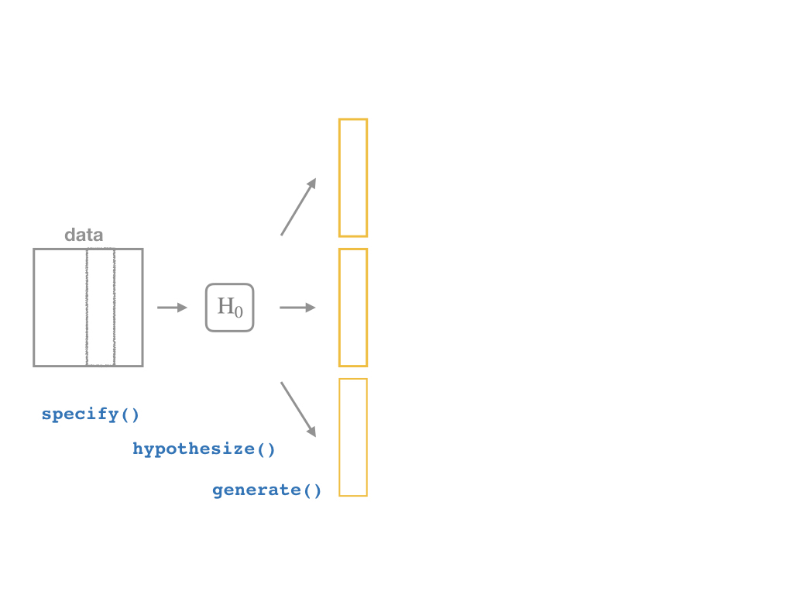

```{r setup, include=FALSE}
options(htmltools.dir.version = FALSE)
knitr::opts_chunk$set(echo=F,
                      message=F,
                      warning=F,
                      fig.retina =3)
library(tidyverse)
library(parallel)
library(ggthemes)
library(broom)
set.seed(256)
update_geom_defaults("label", list(family = "Fira Sans Condensed"))
```

```{r regression-setup, echo=F, results="hide"}

library(haven)
CASchool<-read_dta("../data/caschool.dta")

# run regression of testscr on str
school_reg <- lm(testscr ~ str, 
                 data = CASchool)

library(broom)
school_reg_tidy <- tidy(school_reg,
     conf.int = TRUE) # add confidence intervals
CASchool_aug <- augment(school_reg)


```

class: inverse

# Outline

### [Hypothesis Testing](#58)

### [Digression: p-Values and the Philosophy of Science](#85)

### [# Hypothesis Testing by Simulation, with *infer*](#)

### [What R Calculates (Classical Statistical Inference)](#)

### [# The Use and Abuse of $p$-values](#)

---

class: inverse, center, middle

# Hypothesis Testing

---


# Estimation and Hypothesis Testing I

- We want to **test** if our estimates are .hi[statistically significant] and they describe the population
  - This is the "bread and butter" of inferential statistics and the purpose of regression

--

.content-box-green[
.green[**Examples**]:
- Does reducing class size actually improve test scores?
- Do more years of education increase your wages? 
- Is the gender wage gap between men and women really $0.77? 
]

--

- .hi-purple[All modern science is built upon statistical hypothesis testing, so understand it well!]

---

# Estimation and Hypothesis Testing II

.smallest[
- Note, we can test a lot of hypotheses about a lot of population parameters, e.g.
  - A population mean $\mu$ 
      - <span class="green">**Example**: average height of adults</span>
  - A population proportion $p$
      - <span class="green">**Example**: percent of voters who voted for Trump</span>
  - A difference in population means $\mu_A-\mu_B$
      - <span class="green">**Example**: difference in average wages of men vs. women</span>
  - A difference in population proportions $p_A-p_B$
      - <span class="green">**Example**: difference in percent of patients reporting symptoms of drug A vs B</span>

- We will focus on hypotheses about .hi-purple[population regression slope] $(\hat{\beta}_1)$, i.e. the .hi-purple[causal effect]<sup>.magenta[†]</sup> of $X$ on $Y$
]

.footnote[<sup>.magenta[†]</sup> With a model this simple, it's almost certainly **not** causal, but this is the ultimate direction we are heading...]

---

# Null and Alternative Hypotheses I

- All scientific inquiries begin with a .hi[null hypothesis] $(H_0)$ that proposes a specific value of a population parameter
    - Notation: add a subscript 0: $\beta_{1,0}$ (or $\mu_0$, $p_0$, etc)

--

- We suggest an .hi[alternative hypothesis] $(H_a)$, often the one we hope to verify
    - Note, can be multiple alternative hypotheses: $H_1, H_2, \ldots , H_n$

--

- Ask: .hi-purple["Does our data (sample) give us sufficient evidence to reject `\\(H_0\\)` in favor of `\\(H_a\\)`?"]
    - Note: **the test is *always* about** $\mathbf{H_0}$! 
    - See if we have sufficient evidence to reject the status quo

---

# Null and Alternative Hypotheses II

- Null hypothesis assigns a value (or a range) to a population parameter
  - e.g. $\beta_1=2$ or $\beta_1 \leq 20$
  - .hi-purple[Most common is `\\(\beta_1=0\\)`] $\implies$ $X$ has no effect on $Y$ (no slope for a line)
  - Note: always an equality!

--

- Alternative hypothesis must mathematically *contradict* the null hypothesis
    - e.g. $\beta_1 \neq 2$ or $\beta_1 > 20$ or $\beta_1 \neq 0$
    - Note: always an inequality!

--

- Alternative hypotheses come in two forms:
  1. .hi-purple[One-sided alternative]: $\beta_1 >H_0$ or $\beta_1< H_0$
  2. .hi-purple[Two-sided alternative]: $\beta_1 \neq H_0$
        - Note this means either $\beta_1 < H_0$ or $\beta_1 > H_0$

---

# Components of a Valid Hypothesis Test

- All statistical hypothesis tests have the following components:

--

1. A .hi-purple[null hypothesis, `\\(H_0\\)`]

--

2. An .hi-purple[alternative hypothesis, `\\(H_a\\)`]

--

3. A .hi-purple[test statistic] to determine if we reject $H_0$ when the statistic reaches a "critical value"
    - Beyond the critical value is the "rejection region", sufficient evidence to reject $H_0$
    
--

4. A .hi-purple[conclusion] whether or not to reject $H_0$ in favor of $H_a$

---

# Type I and Type II Errors I

.pull-left[
.smallest[
- Sample statistic $(\hat{\beta_1})$ will rarely be exactly equal to the hypothesized parameter $(\beta_1)$

- Difference between observed statistic and true parameter could be because:

- .hi-turquoise[Parameter is *not* the hypothesized value]
    - $H_0$ is *false*
    
- .hi-turquoise[Parameter is truly hypothesized value but *sampling variability* gave us a different estimate]
    - $H_0$ is *true*

- .hi-purple[We cannot distinguish between these two possibilities with any certainty]

]
]

.pull-right[
.center[

]
]
---

# Type I and Type II Errors II

.pull-left[
.smaller[
- We can interpret our estimates probabilistically as commiting one of two types of error:

1. .hi[Type I error (false positive)]: rejecting $H_0$ when it is in fact true
    - Believing we found an important result when there is truly no relationship
    
2. .hi[Type II error (false negative)]: failing to reject $H_0$ when it is in fact false
    - Believing we found nothing when there was truly a relationship to find
]
]

.pull-right[
.center[

]
]

---

# Type I and Type II Errors III

```{r, echo=FALSE, results="asis", eval=F}
library(kableExtra)
tribble(
  ~"", ~"", ~"Null is True", ~"Null is False",
  "Judgment", "Reject Null", "Type I Error", "Correct",
  "Judgment", "Don't Reject Null", "Correct", "Type II Error"
  ) %>%
  knitr::kable(.,format="html") %>%
  kable_styling(full_width = F) %>%
  add_header_above(c(" " = 2, "Truth" = 2)) %>%
  column_spec(c(1,2), bold=T) %>%
  collapse_rows(columns = 1, latex_hline = "major", valign = "middle")
```

.regtable[
```{r, echo=FALSE, results="asis"}
library(kableExtra)
tribble(
  ~"", ~"", ~"Null is True", ~"Null is False",
  "Judgment", "Reject Null", "TYPE I ERROR", "CORRECT",
  "Judgment", "Reject Null", "(False +)", "(True +)",
  "Judgment", "Don't Reject Null", "CORRECT", "TYPE II ERROR",
  "Judgment", "Don't Reject Null", "(True -)", "(False -)"
  ) %>%
  knitr::kable(.,format="html") %>%
  kable_styling(full_width = F) %>%
  add_header_above(c(" " = 2, "Truth" = 2)) %>%
  column_spec(c(1,2), bold=T) %>%
  collapse_rows(columns = c(1,2), latex_hline = "major", valign = "middle")

```
]

- Depending on context, committing one type of error may be more serious than the other

---

# Type I and Type II Errors IV

.regtable[
```{r, echo=FALSE, results="asis"}
library(kableExtra)
tribble(
  ~"", ~"", ~"Defendant is Innocent", ~"Defendant is Guilty",
  "Judgment", "Convict", "TYPE I ERROR", "CORRECT",
  "Judgment", "Convict", "(False +)", "(True +)",
  "Judgment", "Acquit", "CORRECT", "TYPE II ERROR",
  "Judgment", "Acquit", "(True -)", "(False -)"
  ) %>%
  knitr::kable(.,format="html") %>%
  kable_styling(full_width = F) %>%
  add_header_above(c(" " = 2, "Truth" = 2)) %>%
  column_spec(c(1,2), bold=T) %>%
  collapse_rows(columns = c(1,2), latex_hline = "major", valign = "middle")

```
]

.smaller[
- Anglo-American common law *presumes* defendant is innocent: $H_0$
]

--

.smaller[
- Jury judges whether the evidence presented against the defendant is plausible *assuming the defendant were in fact innocent*
]
--

.smaller[
- If highly improbable: sufficient evidence to reject $H_0$ and convict
  - Beyond a “reasonable doubt” that the defendant is innocent
]
---

# Type I and Type II Errors V

.left-column[

.center[


William Blackstone

(1723-1780)

]
]

.right-column[

> "It is better that ten guilty persons escape than that one innocent suffer."

- Type I error is worse than a Type II error in law!

]

.source[Blackstone, William, 1765-1770, *Commentaries on the Laws of England*]

---

# Type I and Type II Errors VI

.center[

]

---

# Type I and Type II Errors VI

.center[

]

---

# Significance Level, $\alpha$, and Confidence Level $1-\alpha$

- The .hi[significance level, `\\(\alpha\\)`], is the probability of a **Type I error** 

$$\alpha=P(\text{Reject } H_0 | H_0 \text{ is true})$$

--

- The .hi[confidence level] is defined as .hi[`\\((1-\alpha)\\)`]
  - Specify *in advance* an $\alpha$-level (0.10, 0.05, 0.01) with associated confidence level (90%, 95%, 99%)

--

- The probability of a **Type II error** is defined as $\beta$:

$$\beta=P(\text{Don't reject } H_0 | H_0 \text{ is false})$$

---

# $\alpha$ and $\beta$

.regtable[
```{r, echo=FALSE, results="asis"}
tribble(
  ~"", ~"", ~"Null is True", ~"Null is False",
  "Judgment", "Reject Null", "TYPE I ERROR", "CORRECT",
  "Judgment", "Reject Null", "α", "(1-β)",
  "Judgment", "Don't Reject Null", "CORRECT", "TYPE II ERROR",
  "Judgment", "Don't Reject Null", "(1-α)", "β"
  ) %>%
  knitr::kable(.,format="html") %>%
  kable_styling(full_width = F) %>%
  add_header_above(c(" " = 2, "Truth" = 2)) %>%
  column_spec(c(1,2), bold=T) %>%
  collapse_rows(columns = c(1,2), latex_hline = "major", valign = "middle")
```
]

---

# Power and p-values

- The statistical .hi[power of the test] is $(1-\beta)$: the probability of correctly rejecting $H_0$ when $H_0$ is in fact false (e.g. not convicting an innocent person)

$$\text{Power} = 1- \beta = P(\text{Reject }H_0|H_0 \text{ is false})$$

--

- The .hi[`\\(p\\)`-value] or .hi[significance probability] is the probability that, if the null hypothesis were true, the test statistic from any sample will be *at least as extreme* as the test statistic from *our* sample

$$p(\delta \geq \delta_i|H_0 \text{ is true})$$
  - where $\delta$ represents some test statistic
  - $\delta_i$ is the test statistic we observe in our sample
  - More on this in a bit

---

# p-Values and Statistical Significance 
 
- After running our test, we need to make a *decision* between the competing hypotheses

- Compare $p$-value with *pre-determined* $\alpha$ (commonly, $\alpha=0.05$, 95% confidence level)

- If $p<\alpha$: .hi-purple[statistically significant] evidence sufficient to *reject* $H_0$ in favor of $H_a$
  - Note this does **not** mean $H_a$ is true! We merely have *rejected* $H_0$!

- If $p \geq \alpha$: *insufficient* evidence to reject $H_0$
  - Note this does **not** mean $H_0$ is true! We merely have *failed* to *reject* $H_0$!

---

class: inverse, center, middle

# Digression: p-Values and the Philosophy of Science

---

# Hypothesis Testing and the Philosophy of Science I

.left-column[
.center[


Sir Ronald A. Fisher

(1890&mdash;1962)
]
]

.right-column[

> "The null hypothesis is never proved or established, but is possibly disproved, in the course of experimentation. Every experiment may be said to exist only in order to give the facts a chance of disproving the null hypothesis."

1931, *The Design of Experiments*
]

---

# Hypothesis Testing and the Philosophy of Science I

.pull-left[
.smallest[
- Modern philosophy of science is largely based off of hypothesis testing and .hi-purple[falsifiability], which form the "Scientific Method"<sup>.magenta[†]</sup>

- For something to be "scientific", it must be .hi-purple[falsifiable], or at least .hi-purple[testable]

- Hypotheses can be *corroborated* with evidence, but always *tentative* until falsified by data in suggesting an alternative hypothesis

> **"All swans are white"** is a hypothesis rejected upon discovery of a single black swan 

]
]
.pull-right[

.center[
.polaroid[]
]
]
.footnote[<sup>.magenta[†]</sup> Note: economics is a very different kind of "science" with a different methodology!]

---

# Hypothesis Testing and p-Values

- Hypothesis testing, confidence intervals, and p-values are probably the hardest thing to understand in statistics

.center[

<iframe src="https://fivethirtyeight.abcnews.go.com/video/embed/56150342" width="640" height="360" scrolling="no" style="border:none;" allowfullscreen></iframe>

[Fivethirtyeight: Not Even Scientists Can Easily Explain P-values](https://fivethirtyeight.com/features/not-even-scientists-can-easily-explain-p-values/)]

---

# Hypothesis Testing: Which Test? I

- Rigorous course on statistics ([**ECMG 212**](http://ryansafner.com/courses/ecmg212) or **MATH 112**) will spend weeks going through different types of tests:
    - Sample mean; difference of means
    - Proportion; difference of proportions
    - Z-test vs t-test
    - 1 sample vs. 2 samples
    - $\chi^2$ test

- See today's [class notes](/class/2.7-class) page for more

---

# Hypothesis Testing: Which Test? II

.center[

]

---

# There is Only One Test

- Fortunately, some clever statisticians realized ["**there is only one test**"](https://allendowney.blogspot.com/2011/05/there-is-only-one-test.html) and built a nice `R` package called `infer`

1. **Calculate** a statistic, $\delta_i$<sup>.magenta[†]</sup>, from a sample of data

2. **Simulate** a world where $\delta$ is null $(H_0)$

3. **Examine** the distribution of $\delta$ across the null world

4. **Calculate** the probability that $\delta_i$ could exist in the null world

5. **Decide** if $\delta_i$ is statistically significant

.footnote[<sup>.magenta[†]</sup> `\\(\delta\\)` can stand in for any test-statistic in any hypothesis test! For our purposes, `\\(\delta\\)` is the slope of our regression sample, `\\(\hat{\beta}_1\\)`.]

---

# Elements of a Hypothesis Test

.center[


[Alan Downey: "There is still only one test"](https://allendowney.blogspot.com/2016/06/there-is-still-only-one-test.html)
]

---

# Hypothesis Testing with the infer Package I

- R naturally runs the following hypothesis test on any regression as part of `lm()`:

$$\begin{align*}
H_0: \; & \beta_1=0\\
H_1: \; & \beta_1 \neq 0
\end{align*}$$

- `infer` allows you to run through these steps manually to understand the process:

--

1. `specify()` a model

--

2. `hypothesize()` the null 

--

3. `generate()` simulations of the null world 

--

4. `calculate()` the $p$-value

--

5. `visualize()` with a histogram (optional)

---

# Hypothesis Testing with the infer Package II

.center[

]

---

# Hypothesis Testing with the infer Package II

.center[

]

---

# Hypothesis Testing with the infer Package II

.center[

]

---

# Hypothesis Testing with the infer Package II

.center[

]

---

# Hypothesis Testing with the infer Package II

.center[

]

---

# Hypothesis Testing with the infer Package II

.center[

]

---

# Classical Inference: Critical Values of Test Statistic

- .hi-purple[Test statistic `\\((\delta)\\)`]: measures **how far what we observed in our sample $(\hat{\beta_1})$ is from what we would expect if the null hypothesis were true $(\beta_1=0)$**
  - Calculated from a sampling distribution of the estimator (i.e. $\hat{\beta_1})$
  - In econometrics, we use $t$-distributions which have $n-k-1$ degrees of freedom<sup>.magenta[†]</sup>

- .hi-purple[Rejection region]: if the test statistic reaches a .hi-purple["critical value"] of $\delta$, then we **reject** the null hypothesis

.footnote[<sup>.magenta[†]</sup> Again, see today's [class notes](/class/2.7-class) for more on the t-distribution. `\\(k\\)` is the number of independent variables our model has, in this case, with just one `\\(X\\)`, `\\(k=1\\)`. We use two degrees of freedom to calculate `\\(\hat{\beta_0}\\)` and `\\(\hat{\beta_1}\\)`, hence we have `\\(n-2\\)` df.]

---

class: inverse, center, middle

# Hypothesis Testing by Simulation, with *infer*

---

# Imagine a Null World, where $H_0$ is True

.center[


Our world, and a world where $\beta_1=0$ by assumption.
]

---

# Comparing the Worlds I

- From that null world where $H_0: \, \beta_1=0$ is true, we **simulate** another sample and calculate OLS estimators again

--

.pull-left[

## Our Sample

.smallest[
```{r, echo=F}
tidy(school_reg)
```
]
]

--

.pull-right[

## Another Sample

.smallest[
```{r, echo = F}
library(infer)
CASchool %>%
  specify(testscr ~ str) %>%
  hypothesize(null = "independence") %>%
  generate(reps = 1, type = "permute") %>%
  lm(testscr ~ str, data = .) %>%
  tidy()
```
]
]
---

# Comparing the Worlds II

.smallest[
- From that null world where $H_0: \, \beta_1=0$ is true, let's **simulate 1,000** samples and calculate slope $(\hat{\beta_1})$ for each

```{r}
CASchool %>%
  specify(testscr ~ str) %>%
  hypothesize(null = "independence") %>%
  generate(reps = 1000, type = "permute") %>%
  calculate(stat = "slope")%>%
  rename(sample = replicate,
         slope = stat)
```
]

---

# Prepping the *infer*  Pipeline

- Before I show you how to do this, let's first save our estimated slope from our *actual* sample
    - We'll want this later!

```{r, echo=T}
# save as obs_slope
sample_slope <- school_reg_tidy %>% # this is the regression tidied with broom
  filter(term=="str") %>%
  pull(estimate)

# confirm what it is
sample_slope
```

---
# The *infer*  Pipeline: Specify

.center[

]

---

# The *infer*  Pipeline: Specify

.left-code[
### Specify
```{r, echo=T, eval=F}
data %>%
  specify(y ~ x)
```
]

.right-plot[
.smallest[
- Take our data and pipe it into the `specify()` function, which is essentially a `lm()` function for regression (for our purposes)

```{r, echo=T, eval=F}
CASchool %>%
  specify(testscr ~ str)
```


```{r}
CASchool %>%
  specify(testscr ~ str)%>%
  head(.,3)
```
]

- Note nothing happens yet
]

---

# The *infer*  Pipeline: Hypothesize

.center[

]

---

# The *infer*  Pipeline: Hypothesize

.left-code[
### Specify
### Hypothesize

.quitesmall[
`%>% hypothesize(null = "independence")`
]
]

.right-plot[
.smallest[
- Describe what the null hypothesis is here
- In `infer`'s language, we are hypothesizing that `str` and `testscr` are `independent` $(\beta_1=0)$<sup>.magenta[†]</sup>

```{r, echo=T, eval=F}
CASchool %>%
  specify(testscr ~ str) %>%
  hypothesize(null = "independence") #<<
```


```{r}
CASchool %>%
  specify(testscr ~ str) %>%
  hypothesize(null = "independence") %>%
  head(.,3)
```

]
.tiny[<sup>.magenta[†]</sup> `type` can be either `point` (for specific point estimates for a single variable, such as a sample mean, `\\((\bar{x})\\)`, or `independence` (for hypotheses about two samples or a relationship between variables). See more [here](https://moderndive.netlify.com/9-hypothesis-testing.html).]

]


---

# The *infer*  Pipeline: Generate I

.center[

]

---

# The *infer*  Pipeline: Generate I

.left-code[
### Specify
### Hypothesize
### Generate

.quitesmall[
`%>% generate(reps = n, type = "permute")`
]
]
.right-plot[

- Now the magic starts, as we run a number of simulated samples
- Set the number of `reps` and set the `type` equal to `"permute"`
  - we want `permutation` instead of a `bootstrap` for hypothesis testing!

```{r, echo=T, eval=F}
CASchool %>%
  specify(testscr ~ str) %>%
  hypothesize(null = "independence") %>%
  generate(reps = 1000, #<<
           type = "permute") #<<
```

]

---

# The *infer*  Pipeline: Generate II

.left-code[
### Specify
### Hypothesize
### Generate
.quitesmall[
`%>% generate(reps = n, type = "permute")`
]
]

.right-plot[

.smallest[
```{r}
i<-CASchool %>%
  specify(testscr ~ str) %>%
  hypothesize(null = "independence")
i %>%
  generate(reps = 1000, type = "permute")
```
]
]

---

# The *infer*  Pipeline: Calculate I

.center[

]

---

# The *infer*  Pipeline: Calculate I

.left-code[
### Specify
### Hypothesize
### Generate
### Calculate
`%>% calculate(stat = "")`
]

.right-plot[
.smallest[
- We `calculate` sample statistics for each of the 1,000 `replicate` samples

- In our case, calculate the slope, $(\hat{\beta_1})$ for each `replicate`

```{r, echo=T, eval=F}
CASchool %>%
  specify(testscr ~ str) %>%
  hypothesize(null = "independence") %>%
  generate(reps = 1000,
           type = "permute") %>%
  generate(reps = 1000, type = "permute") %>% #<<
  calculate(stat = "slope") #<<
```

- Other `stat`s for calculation: `"mean"`, `"median"`, `"prop"`, `"diff in means"`, `"diff in props"`, etc. (see [package information](https://infer.netlify.com/))
]
]

---

# The *infer*  Pipeline: Calculate II

.left-code[
### Specify
### Hypothesize
### Generate
### Calculate
`%>% calculate(stat = "")`
]

.right-plot[
.smallest[
```{r, echo=F}
i %>%
  generate(reps = 1000, type = "permute") %>%
  calculate(stat = "slope")
```
]
]

---

# The *infer*  Pipeline: Get p Value

.left-code[
### Specify
### Hypothesize
### Generate
### Calculate
### Get p Value
.quitesmall[
`%>% get_p_value(obs stat = "", direction = "both")`
]
]

.right-plot[
.quitesmall[
- We can calculate the .hi[`\\(p\\)`-value]
  - the probability of seeing a value at least as large as our `sample_slope` (`r round(sample_slope, 3)`) in our simulated null distribution

- .hi-purple[Two-sided alternative] $H_a: \beta_1 \neq 0$, we double the raw $p$-value

```{r, echo=F}
simulations <- i %>%
  generate(reps = 1000, type = "permute") %>%
  calculate(stat = "slope")
```

```{r, echo=T}
CASchool %>%
  specify(testscr ~ str) %>%
  hypothesize(null = "independence") %>%
  generate(reps = 1000,
           type = "permute") %>%
  calculate(stat = "slope") %>%
  get_p_value(obs_stat = sample_slope, #<<
              direction = "both") #<<
```
]
]

---

# The *infer*  Pipeline: Visualize I

.center[

]

---

# The *infer*  Pipeline: Visualize I

.left-code[
### Specify
### Hypothesize
### Generate
### Calculate
### Visualize

`%>% visualize()`
]

.right-plot[
.smallest[
- Make a histogram of our null distribution of $\beta_1$
  - Note it is centered at $\beta_1=0$ because that's $H_0$! 

```{r, echo=T, fig.height=3, fig.retina=3, fig.align="center"}
CASchool %>%
  specify(testscr ~ str) %>%
  hypothesize(null = "independence") %>%
  generate(reps = 1000,
           type = "permute") %>%
  calculate(stat = "slope") %>%
 visualize() #<<
```
]
]

---

# The *infer*  Pipeline: Visualize II

.left-code[
### Specify
### Hypothesize
### Generate
### Calculate
### Visualize
`%>% visualize()`
]

.right-plot[
.smallest[
- Add our `sample_slope` to show our finding on the null distr.

```{r, echo=T, fig.height=3, fig.retina=3, fig.align="center"}
CASchool %>%
  specify(testscr ~ str) %>%
  hypothesize(null = "independence") %>%
  generate(reps = 1000,
           type = "permute") %>%
  calculate(stat = "slope") %>%
  visualize(obs_stat = sample_slope) #<<
```
]
]

---

# The *infer*  Pipeline: Visualize p-value

.left-code[
### Specify
### Hypothesize
### Generate
### Calculate
### Visualize
`%>% visualize()+shade_p_value()`
]

.right-plot[
.smallest[
- Add `shade_p_value` to see what $p$ is

```{r, echo=T, fig.height=3, fig.retina=3, fig.align="center"}
CASchool %>%
  specify(testscr ~ str) %>%
  hypothesize(null = "independence") %>%
  generate(reps = 1000,
           type = "permute") %>%
  calculate(stat = "slope") %>%
  visualize(obs_stat = sample_slope)+
  shade_p_value(obs_stat = sample_slope,
                direction = "two_sided")
```
]
]

---

# The *infer*  Pipeline: Visualize Confidence Intervals

.left-code[
### Specify
### Hypothesize
### Generate
### Calculate
### Visualize
`%>% visualize()+shade_ci()`
]

.right-plot[
.smallest[
- To shade confidence interval, we first need a vector of what they are
  - I've saved the outputted `tibble` of them from 4 slides ago as `ci_values`

```{r}
ci_values<-simulations %>%
  get_confidence_interval(level = 0.95,
                          type = "se",
                          point_estimate = sample_slope)
```

```{r, echo=T, fig.height=4, fig.retina=3, fig.align="center"}
simulations %>%
 visualize(obs_stat = sample_slope)+
  shade_confidence_interval(ci_values)
```
]
]

---

# The *infer*  Pipeline: Visualize is a Wrapper of ggplot

- `infer`'s `visualize()` function is just a wrapper function for `ggplot()`
  - you can take your `simulations` `tibble` and just `ggplot` a normal histogram

--

.pull-left[
.code50[
```{r visualize-gg, echo=T, eval=F}
simulations %>%
  ggplot(data = .)+
  aes(x = stat)+
  geom_histogram(color="white", fill="indianred")+
  geom_vline(xintercept = sample_slope,
             color = "blue",
             size = 2,
             linetype = "dashed")+
  labs(x = expression(paste("Distribution of ", hat(beta[1]), " under ", H[0], " that ", beta[1]==0)),
       y = "Samples")+
    theme_classic(base_family = "Fira Sans Condensed",
           base_size=20)
```
]
]

--

.pull-right[
```{r, ref.label="visualize-gg", fig.height=5, fig.retina=3, fig.align="center"}

```
]

---

class: inverse, center, middle

# What R Calculates (Classical Statistical Inference)

---

# What R Does: Classical Statistical Inference I

.pull-left[

- R does things the old-fashioned way, using a *theoretical* null distribution instead of *simulation*

- A .hi[`\\(t\\)`-distribution] with $n-k-1$ df<sup>.magenta[†]</sup>

- Calculate a $t$-statistic for $\hat{\beta_1}$:

$$\text{test statistic} = \frac{\text{estimate} - \text{null hypothesis}}{\text{standard error of estimate}}$$

]

.pull-right[

```{r, fig.retina=3, fig.align="center"}
t_ex<-ggplot(data = tibble(x=-5:5))+
  aes(x = x)+
  stat_function(fun = dt, args=list(df = 418), size=2, color="blue")+
  #stat_function(fun=dt, geom="area", fill="blue", xlim=c(-5,4.75), alpha=0.5)+
  #stat_function(fun=dt, geom="area", fill="blue", xlim=c(4.75,5), alpha=0.5)+
  geom_vline(xintercept = c(-4.75, 4.75), size = 1, color = "red", linetype = "dashed")+
  geom_rect(xmin=-5,xmax=-4.75, ymin=0, ymax=0.4, fill="red", alpha=0.3)+
  geom_rect(xmin=4.75,xmax=5, ymin=0, ymax=0.4, fill="red", alpha=0.3)+
  labs(x = "t",
       y = "Probability")+
  scale_x_continuous(breaks = seq(-5,5,1),
                     lim = c(-5,5),
                     expand = c(0,0))+
  scale_y_continuous(breaks = seq(0,0.4,0.1),
                     lim = c(0,0.4),
                     expand = c(0,0))+
  theme_classic(base_family = "Fira Sans Condensed",
           base_size=20)
t_ex
```

]

.footnote[<sup>.magenta[†]</sup> `\\(k\\)` is the number of `\\(X\\)` variables.]

---

# What R Does: Classical Statistical Inference II

.pull-left[
.smallest[
$$\text{test statistic} = \frac{\text{estimate} - \text{null hypothesis}}{\text{standard error of estimate}}$$

- $t$ has the same interpretation as $Z$, number of std. dev. away from the distribution's center<sup>.magenta[†]</sup>

- Compares to a critical value of $t^*$ (determined by $\alpha$ & $n-k-1$)
    - For 95% confidence, $\alpha=0.05$, $t^* \approx 2$<sup><span class="magenta">‡</span></sup>
]
]

.pull-right[

```{r, fig.retina=3, fig.align="center"}
t_ex
```

]

.footnote[<sup>.magenta[†]</sup> Think of our simulated distribution, the center was 0.

<sup>.magenta[‡]</sup> The 68-95-99.7% empirical rule!]

---

# What R Does: Classical Statistical Inference III

.pull-left[
.quitesmall[
$$\begin{align*}
t &= \frac{\hat{\beta_1}-\beta_{1,0}}{se(\hat{\beta_1})}\\
t &= \frac{-2.28-0}{0.48}\\
t &= -4.75\\ \end{align*}$$

- Our sample slope is 4.75 standard deviations below the mean under $H_0$

- $p$-value: prob. of a test statistic at least as large (in magnitude) as ours if the null hypothesis were true<sup>.magenta[†]</sup>
  - $p$-value is **2-sided** for $H_a: \beta_1 \neq 0$
]
]

.pull-right[

```{r, fig.retina=3, fig.align="center"}
t_ex
```

]

.footnote[<sup>.magenta[†]</sup> Think of our simulated distribution, the center was 0.]

---

# 1-Sided vs. 2-Sided p-values I

.pull-left[

$H_a: \beta_1<0$

$p$-value: $Prob(t < t_i)$

```{r, fig.retina=3, fig.height=5, fig.align="center"}
ggplot(data = tibble(x=-4:4))+
  aes(x = x)+
  stat_function(fun = dnorm, size=2, color="blue")+
  stat_function(fun=dnorm, xlim=c(-4,-2), geom="area", fill="blue", alpha=0.5)+
  labs(x = "t",
       y = "Probability")+
  scale_x_continuous(breaks=c(-2),
                      label=c(expression(-t[i])))+
  theme_classic(base_family = "Fira Sans Condensed",
           base_size=20)

```

]
.pull-right[

$H_a: \beta_1>0$

$p$-value: $Prob(t > t_i)$

```{r, fig.retina=3, fig.height=5, fig.align="center"}
ggplot(data = tibble(x=-4:4))+
  aes(x = x)+
  stat_function(fun = dnorm, size=2, color="blue")+
  stat_function(fun=dnorm, xlim=c(2,4), geom="area", fill="blue", alpha=0.5)+
  labs(x = "t",
       y = "Probability")+
  scale_x_continuous(breaks=c(2),
                      label=c(expression(t[i])))+
  theme_classic(base_family = "Fira Sans Condensed",
           base_size=20)
```


]

---

# 1-Sided vs. 2-Sided p-values I


$H_a: \beta_1 \neq 0$

$p$-value: $2 \times Prob(t > |t_i|)$

```{r, fig.retina=3, fig.height=5, fig.align="center"}
ggplot(data = tibble(x=-4:4))+
  aes(x = x)+
  stat_function(fun = dnorm, size=2, color="blue")+
  stat_function(fun=dnorm, xlim=c(-4,-2), geom="area", fill="blue", alpha=0.5)+
  stat_function(fun=dnorm, xlim=c(2,4), geom="area", fill="blue", alpha=0.5)+
  labs(x = expression(paste("Test Statistic t, (deviation from ", H[0], " if ", H[0], " were True)")),
       y = "Probability")+
  scale_x_continuous(breaks=c(-2,2),
                      label=c(expression(-t[i]), expression(t[i])))+
  theme_classic(base_family = "Fira Sans Condensed",
           base_size=20)
```

---

# Hypothesis Tests in Regression Output I

```{r, echo = T}
summary(school_reg)
```

---

# Hypothesis Tests in Regression Output II

- In `broom`'s `tidy()` (with confidence intervals)

```{r, echo = T}
tidy(school_reg, conf.int=TRUE)
```

---

# Conclusions

$$\begin{align*}
H_0: \,& \beta_1=0\\
H_a: \, & \beta_a \neq 0\\
\end{align*}$$

- Because the hypothesis test's $p$-value $<$ $\alpha$ (0.05)...

- .hi-purple[We have sufficient evidence to reject `\\(H_0\\)` in favor of our alternative hypothesis. Our sample suggests that there *is a relationship* between class size and test scores].

--

- Using the confidence intervals:

- .hi-purple[We are 95% confident that the true marginal effect of class size on test scores is between `\\(-3.22\\)` and `\\(-1.34\\)`.]

---

# Hypothesis Testing vs. Confidence Intervals

- Confidence intervals are all *two-sided* by nature
$$CI_{0.95}=\left(\left[\hat{\beta_1}-2 \times se(\hat{\beta_1})\right], \, \left[\hat{\beta_1}+2 \times se(\hat{\beta_1}\right]) \right)$$

- Hypothesis test $(t$-test) of $H_0: \, \beta_1=0$ computes a $t$-value of<sup>.red[1]</sup>
$$t=\frac{\hat{\beta_1}}{se(\hat{\beta_1})}$$
and $p$<0.05 when $t\geq2$

--

- .hi-purple[If a confidence interval contains the `\\(H_0\\)` value (i.e. `\\(0\\)`, for our test), then *we fail to reject* `\\(H_0\\)`.]

.footnote[<sup>.red[1]</sup> Since our null hypothesis is that `\\(\beta_{1,0}=0\\)`, the test statistic simplifies to this neat fraction.]

---

class: inverse, center, middle

# The Use and Abuse of $p$-values

---

# Common Misconceptions about p-values

.smallest[
- So how do we interpret $p$ again?

❌ $p$ **is the probability that the alternative hypothesis is false**
  - We can never *prove* an alternative hypothesis, only tentatively reject a null hypothesis
]

--

.smallest[
❌ $p$ **is the probability that the null hypothesis is true**
  - We're not *proving* the $H_0$ is false, only saying that it's very unlikely that if $H_0$ were true, we'd obtain a slope as rare as our sample's slope
]

--

.smallest[
❌ $p$ **is the probability that our observed effects were produced purely by random chance**
  - $p$ is computed under a specific model (think about our null world) that *assumes* $H_0$ is true
]

--

.smallest[
❌ $p$ **tells us how significant our finding is**
  - $p$ tells us nothing about the *size* or the *real world significance* of any effect deemed “statistically significant”
  - it only tells us that the slope is statistically significantly different from 0 (if $H_0$ is $\beta_1=0)$ 
]

---

# Abusing p-Values I

.pull-left[
.center[

]
]

--

.pull-right[
.center[

]
]

.source[Source: [SMBC](http://www.smbc-comics.com/?id=1623)]

---

# Abusing p-Values II

.pull-left[

.center[

]
]

.pull-right[

> “The widespread use of 'statistical significance' (generally interpreted as $(p \leq 0.05)$ as a license for making a claim of a scientific finding (or implied truth) leads to considerable distortion of the scientific process.”

]

.source[Wasserstein, Ronald L. and Nicole A. Lazar, (2016), ["The ASA's Statement on p-Values: Context, Process, and Purpose](http://www.tandfonline.com/doi/full/10.1080/00031305.2016.1154108)," *The American Statistician* 30(2): 129-133]

---

# Abusing p-Values II


> “No economist has achieved scientific success as a result of a statistically significant coefficient. Massed observations, clever common sense, elegant theorems, new policies, sagacious economic reasoning, historical perspective, relevant accounting, these have all led to scientific success. Statistical significance has not.”


.source[McCloskey, Dierdre N and Stephen Ziliak, 1996, *The Cult of Statistical Significance*, p. 112)]

---

# p-value Clarification

- Again, .hi[p-value is the probability that, if the null hypothesis were true, we obtain (by pure random chance) a test statistic at least as extreme as the one we estimated for our sample]

- A low p-value means either (and we can't distinguish which):
    1. $H_0$ is true and a highly improbable event has occurred OR
    2. $H_0$ is false

---

# Significance In Regression Tables

.pull-left[
.font80[
.regtable[
```{r}
library(huxtable)
huxreg("Test Score" = school_reg,
       coefs = c("Intercept" = "(Intercept)",
                 "STR" = "str"),
       statistics = c("N" = "nobs",
                      "R-Squared" = "r.squared",
                      "SER" = "sigma"),
       number_format = 2)
```
]
]
]

.pull-right[

- Statistical significance is shown by asterisks, common (but not always!) standard:
    - 1 asterisk: significant at $\alpha=0.10$
    - 2 asterisks: significant at $\alpha=0.05$
    - 3 asterisks: significant at $\alpha=0.01$

- Rare, but sometimes regression tables include $p$-values for estimates
]