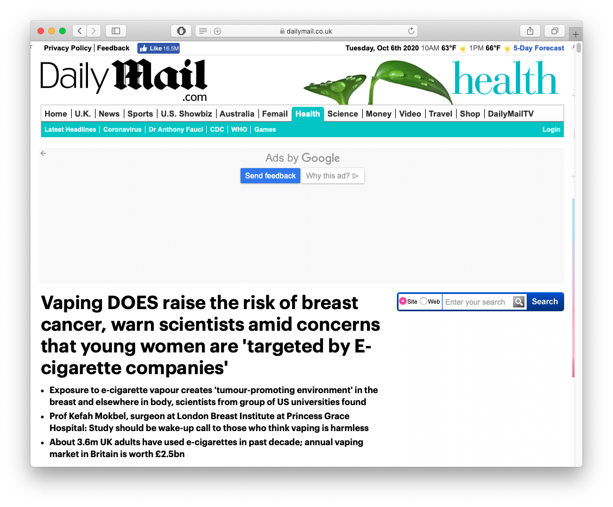

```{r setup, include=FALSE}
options(htmltools.dir.version = FALSE)
knitr::opts_chunk$set(echo=F,
                      message=F,
                      warning=F,
                      fig.retina =3)
library(tidyverse)
library(parallel)
library(ggthemes)
library(broom)
set.seed(256)
update_geom_defaults("label", list(family = "Fira Sans Condensed"))
```

```{r regression-setup, echo=F, results="hide"}

library(haven)
CASchool<-read_dta("../data/caschool.dta")

# run regression of testscr on str
school_reg <- lm(testscr ~ str, 
                 data = CASchool)

library(broom)
school_reg_tidy <- tidy(school_reg,
     conf.int = TRUE) # add confidence intervals
CASchool_aug <- augment(school_reg)


```

class: inverse

# Outline

### [First Pass at Causation: RCTs](#85)

### [Potential Outcomes](#)

### [Quasi-Experiments](#)

### [Attack of/on the Randomistas](#)

---

# Different Uses for Statistics & Econometrics

.pull-left[
.quitesmall[
$$\color{orange}{Y}=\color{teal}{f}(\color{purple}{X})$$

- .hi[Causal inference]: how do changes in $\color{purple}{X}$ affect $\color{orange}{Y}$?
  - We care more about estimating $\color{teal}{f}$ than $\color{orange}{\hat{Y}}$
  - Measure the causal effect of $X \mapsto Y$ (e.g., $\hat{\beta_1})$

$$\color{orange}{\hat{Y}}=\color{teal}{\hat{f}}(\color{purple}{X})$$

- .hi[Prediction]: predict $\color{orange}{Y}$ using an estimated $\color{teal}{f}$
  - $\color{teal}{f}$ is an unknown “black-box”, we care more about $\color{orange}{\hat{Y}}$ 
  - .hi-purple[Forecasting]: predicting future *values* of $Y$ (inflation, sales, GDP)
  - .hi-purple[Classification]: predicting the *category* of an outcome (success or failure, cat picture or not cat picture)

- We care (in this class at least) only about the first
]
]

.pull-right[
.center[

]
]

---

# Recall: The Two Big Problems with Data

.pull-left[
.smallest[
- We use econometrics to .hi-purple[identify] causal relationships and make .hi-purple[inferences] about them

1. Problem for .hi-purple[identification]: .hi[endogeneity]
  - $X$ is **exogenous** if $cor(x, u) = 0$
  - $X$ is **endogenous** if $cor(x, u) \neq 0$

2. Problem for .hi-purple[inference]: .hi[randomness]
  - Data is random due to **natural sampling variation**
  - Taking one sample of a population will yield slightly different information than another sample of the same population
]

]

.pull-right[
.center[


]
]

---

# The Two Problems: Identification and Inference

.center[
.b[Sample] $\xrightarrow{\text{statistical inference}}$ .b[Population] $\xrightarrow{\text{causal indentification}}$ .b[Unobserved Parameters]
]

---

# The Two Problems: Identification and Inference

.center[
.hi[Sample] $\color{#e64173}{\xrightarrow{\text{statistical inference}}}$ .hi[Population] $\xrightarrow{\text{causal indentification}}$ .b[Unobserved Parameters]
]

- We saw how to statistically .hi[infer] values of population parameters using our sample
  - Purely empirical, math & statistics 🤓
---

# The Two Problems: Identification and Inference

.center[
.b[Sample] $\xrightarrow{\text{statistical inference}}$ .hi[Population] $\color{#e64173}{\xrightarrow{\text{causal indentification}}}$ .hi[Unobserved Parameters]
]

- We saw how to statistically .hi[infer] values of population parameters using our sample
  - Purely empirical, math & statistics 🤓

- We now confront the problem of .hi[identifying] causal relationships within population
  - .hi-purple[Endogeneity problem]
  - Even if we had perfect data on the whole population, .hi-purple[“Does X truly cause Y?”], and can we measure that effect?
  - .hi-turquoise[More philosophy & theory than math & statistics!] 🧐

- Truly you should do this first, *before* you get data to make inferences!

---

# What Does Causation Mean?

.pull-left[

- We are going to reflect on one of the biggest problems in .hi[epistemology], the philosophy of knowledge

- We see that X and Y are .hi-turquoise[associated] (or quantitatively, .hi-turquoise[correlated]), but how do we know if .hi-slate[X *causes* Y?]

]

.pull-right[
.center[

]
]

---

class: inverse, center, middle

# First Pass at Causation: RCTs

---

# Random Control Trials (RCTs) I

.pull-left[
.smallest[
- The *ideal* way to demonstrate causation is through a .hi-turquoise[randomized control trial (RCT)] or "random experiment"
  - *Randomly* assign experimental units (e.g. people, firms, etc.) into groups
  - .hi[Treatment group(s)] get a (kind of) treatment
  - .hi-purple[Control group] gets no treatment 
  - Compare results of treatment and control groups to observe the .hi-slate[average treatment effect (ATE)]
  
- .hi-slate[We will understand “causality” (for now) to mean the ATE from an ideal RCT]
]
]

.pull-right[

.center[

]
]

---

# Random Control Trials (RCTs) II

.center[


Classic (simplified) procedure of a randomized control trial (RCT) from medicine
]

---

# Random Control Trials (RCTs) III

.center[

]

---

# Random Control Trials (RCTs) IV

.pull-left[

- .hi-turquoise[Random assignment] to groups ensures that the *only* differences between members of the treatment(s) and control groups is *receiving treatment or not*

]

.pull-right[

.pull-left[
.center[

Treatment Group
]
]

.pull-right[
.center[

Control Group
]
]
]

---

# Random Control Trials (RCTs) IV

.pull-left[

- .hi-turquoise[Random assignment] to groups ensures that the *only* differences between members of the treatment(s) and control groups is *receiving treatment or not*

- .hi-orange[Selection bias:] (pre-existing) differences between members of treatment and control groups *other* than treatment, that affect the outcome 

]

.pull-right[

.pull-left[
.center[

Treatment Group
]
]

.pull-right[
.center[

Control Group

.orange[(Selection Bias)]
]
]
]

---

class: inverse, center, middle

# Potential Outcomes

---

# The Fundamental Problem of Causal Inference

- Suppose we have some outcome variable $Y$

--

- Individuals $(i)$ face a choice between two outcomes (such as being .hi[treated] or .hi-purple[not treated]):
  - $\color{#6A5ACD}{Y_i^{0}}$: outcome when individual $i$ is .hi-purple[not treated]
  - $\color{#e64173}{Y_i^{1}}$: outcome when individual $i$ is .hi[treated]

--

.bigger[
.center[
✨ $\color{#314f4f}{\delta_i} = \color{#e64173}{Y_i^{1}} - \color{#6A5ACD}{Y_i^{0}}$  ✨
]
]

- $\color{#314f4f}{\delta_i}$ is the .hi-slate[causal effect] of treatment on individual $i$

---

background-image: url(https://www.dropbox.com/s/zsx3pa4m51p82dj/twopaths.jpg?raw=1)
background-size: cover

---

# The Fundamental Problem of Causal Inference

.bigger[
.center[
✨ $\color{#314f4f}{\delta_i} = \color{#e64173}{Y_i^{1}} - \color{#6A5ACD}{Y_i^{0}}$  ✨
]
]

--

- This is a nice way to think about the ideal proof of causality, but this is impossible to observe!

---

# The Fundamental Problem of Causal Inference

.bigger[
$$\color{#314f4f}{\delta_i} = \color{red}{?} - \color{#6A5ACD}{Y_i^{0}}$$
]

- This is a nice way to think about the ideal proof of causality, but this is impossible to observe!

- .hi-purple[Individual counterfactuals do not exist (“the path not taken”)]

- You will always only ever get one of these per individual!

---

# The Fundamental Problem of Causal Inference

.bigger[
$$\color{#314f4f}{\delta_i} = \color{#e64173}{Y_i^{1}} - \color{red}{?}$$
]

- This is a nice way to think about the ideal proof of causality, but this is impossible to observe!

- .hi-purple[Individual counterfactuals do not exist (“the path not taken”)]

- You will always only ever get one of these per individual!
  - e.g. what would your life have been like if you did not go to Hood College?? 🧐

- So what can we do?

---

# The Fundamental Problem of Causal Inference

.bigger[
$$\color{#314f4f}{ATE} = \color{#e64173}{E[Y_i^{1}]} - \color{#6A5ACD}{E[Y_i^{0}]}$$
]

- Have large groups, and take *averages* instead!

- .hi-slate[Average Treatment Effect (ATE)]: difference in the average (expected value) of outcome $Y$ between treated individuals and untreated individuals
$$\color{#314f4f}{\delta} = \color{#e64173}{(\bar{Y}|D=1)}-\color{#6A5ACD}{(\bar{Y}|D=0)}$$

- $D_i$ is a .hi-turquoise[binary variable], $= \begin{cases} \color{#6A5ACD}{0} & \color{#6A5ACD}{\text{ if person is not treated}}\\\color{#e64173}{1} & \color{#e64173}{\text{ if person is treated}}\\ \end{cases}$
  - I’d much rather call this $T$, standing for $T$reatment, but this notation is famous

---

# The Fundamental Problem of Causal Inference

.bigger[
$$\color{#314f4f}{ATE} = \color{#e64173}{E[Y_i^{1}]} - \color{#6A5ACD}{E[Y_i^{0}]}$$
]

Again: 

- Either we observe individual $i$ in the .hi[treatment group] $\color{#e64173}{(D=1)}$, i.e.
$$\color{#314f4f}{\delta_i} = \color{#e64173}{Y_i^{1}} - \color{red}{?}$$

- Or we observe individual $i$ in the .hi-purple[control group] $\color{#6A5ACD}{(D=0)}$, i.e.
$$\color{#314f4f}{\delta_i} = \color{red}{?} - \color{#6A5ACD}{Y_i^{0}} $$

- Never both at the same time:
.center[
✨ $\color{#314f4f}{\delta_i} = \color{#e64173}{Y_i^{1}} - \color{#6A5ACD}{Y_i^{0}}$  ✨
]

---

# Example: The Effect of Having Health Insurance I

.pull-left[
.smallest[
.content-box-green[
.green[**Example:**] What is the effect of having health insurance on health outcomes?

- National Health Interview Survey (NHIS) asks “Would you say your health in general is excellent, very good, good, fair, or poor?”

- **Outcome variable $(Y)$**: Index of health (1-poor to 5-excellent) in a sample of married NHIS respondents in 2009 who may or may not have health insurance

- **Treatment $(X)$**: Having health insurance  (vs. not)
]
]
]

.pull-right[


]

---

# Example: The Effect of Having Health Insurance II

.center[
]

.source[Angrist, Joshua & Jorn-Steffen Pischke, 2015, *Mostly Harmless Econometrics*]
---

# Example: The Effect of Having Health Insurance III

- $Y$: outcome variable (health index score, 1-5)

- $Y_i$: health score of an individual $i$

- Individual $i$ has a choice, leading to one of two outcomes:
  - $\color{#6A5ACD}{Y^0_i}$: individual $i$ has *not* purchased health insurance .hi-purple[(“Control”)]
  - $\color{#e64173}{Y^1_i}$: individual $i$ has purchased health insurance .hi[(“Treatment”)]
    
- $\color{#314f4f}{\delta_i}=\color{#e64173}{Y^1_i}-\color{#6A5ACD}{Y^0_i}$: causal effect for individual $i$ of purchasing health insurance

---

# Example: A Hypothetical Comparison

.left-column[

.smallest[
| John      | Maria     |
|-----------|-----------|
|  |  |
| $Y_J^0=3$ | $Y_M^0=5$ | 
| $Y_J^1=4$ | $Y_M^1=5$ |
]
]

--

.right-column[
.smallest[
- John will choose to buy health insurance

- Maria will choose to not buy health insurance
]
]

---

# Example: A Hypothetical Comparison

.left-column[

.smallest[
| John      | Maria     |
|-----------|-----------|
|  |  |
| $Y_J^0=3$ | $Y_M^0=5$ | 
| $Y_J^1=4$ | $Y_M^1=5$ |
| $\color{#314f4f}{\delta_J=1}$ | $\color{#314f4f}{\delta_M=0}$ |
]
]

.right-column[
.smallest[
- John will choose to buy health insurance

- Maria will choose to not buy health insurance

- Health insurance improves John's score by 1, has no effect on Maria's score (individual causal effects $\color{#314f4f}{\delta_i}$)
]
]

---

# Example: A Hypothetical Comparison

.left-column[
.smallest[
| John      | Maria     |
|-----------|-----------|
|  |  |
| $Y_J^0=3$ | $Y_M^0=5$ | 
| $Y_J^1=4$ | $Y_M^1=5$ |
| $\color{#314f4f}{\delta_J=1}$ | $\color{#314f4f}{\delta_M=0}$ |
| $\color{#e64173}{Y_J=(Y_J^1)=4}$ | $\color{#6A5ACD}{Y_M=(Y_M^0)=5}$ | 

]
]

.right-column[
.smallest[
- John will choose to buy health insurance

- Maria will choose to not buy health insurance

- Health insurance improves John's score by 1, has no effect on Maria's score (individual causal effects $\color{#314f4f}{\delta_i}$)

- Note, all we can observe in the data are their health outcomes *after* they have chosen (not) to buy health insurance:
$$\begin{align*}
\color{#e64173}{Y_J}&\color{#e64173}{=4}\\
\color{#6A5ACD}{Y_M}&\color{#6A5ACD}{=5}\\
\end{align*}$$

]
]

---

# Example: A Hypothetical Comparison

.left-column[

.smallest[
| John      | Maria     |
|-----------|-----------|
|  |  |
| $Y_J^0=3$ | $Y_M^0=5$ | 
| $Y_J^1=4$ | $Y_M^1=5$ |
| $\color{#314f4f}{\delta_J=1}$ | $\color{#314f4f}{\delta_M=0}$ |
| $\color{#e64173}{Y_J=(Y_J^1)=4}$ | $\color{#6A5ACD}{Y_M=(Y_M^0)=5}$ | 

]
]

.right-column[
.smallest[
- John will choose to buy health insurance

- Maria will choose to not buy health insurance

- Health insurance improves John's score by 1, has no effect on Maria's score (individual causal effects $\color{#314f4f}{\delta_i}$)

- Note, all we can observe in the data are their health outcomes *after* they have chosen (not) to buy health insurance:
$$\begin{align*}
\color{#e64173}{Y_J}&\color{#e64173}{=4}\\
\color{#6A5ACD}{Y_M}&\color{#6A5ACD}{=5}\\
\end{align*}$$

- .hi-turquoise[*Observed* difference] between John and Maria: $$\color{#e64173}{Y_J}-\color{#6A5ACD}{Y_M}=-1$$
]
]

---

# Counterfactuals

.left-column[

.smallest[
| John      | Maria     |
|-----------|-----------|
|  |  |
| $\color{#e64173}{Y_J=4}$ | $\color{#6A5ACD}{Y_M=5}$ | 

This is all the data we *actually* observe
]
]

.right-column[
.smallest[
- Observed difference between John and Maria: 
$$Y_J-Y_M=\underbrace{\color{#e64173}{Y^1_J}-\color{#6A5ACD}{Y^0_M}}_{=-1}$$

- Recall:
    - John has bought health insurance $\color{#e64173}{Y^1_J}$
    - Maria has not bought insurance $\color{#6A5ACD}{Y^0_M}$

- We don't see the .hi[counterfactuals]: 
    - John's score *without* insurance
    - Maria score *with* insurance
]
]

---

# Counterfactuals

.left-column[
.smallest[
| John      | Maria     |
|-----------|-----------|
|  |  |
| $\color{#e64173}{Y_J=4}$ | $\color{#6A5ACD}{Y_M=5}$ | 

This is all the data we *actually* observe
]
]

.right-column[
.smallest[
- Observed difference between John and Maria: 
$$Y_J-Y_M=\underbrace{\color{#e64173}{Y^1_J}-\color{#6A5ACD}{Y^0_M}}_{=-1}$$

- Algebra trick: add and subtract $\color{#6A5ACD}{Y^0_J}$ to equation

$$\begin{align*}
Y_j-Y_M=\underbrace{\color{#e64173}{Y^1_J}-\color{#6A5ACD}{Y^0_J}}_{=1}+\underbrace{\color{#6A5ACD}{Y^0_J}-\color{#6A5ACD}{Y^0_M}}_{=-2}
\end{align*}$$

- $\color{#e64173}{Y^1_J}-\color{#6A5ACD}{Y^0_J}=1$: Causal effect for John of buying insurance, $\color{#314f4f}{\delta_J}$
- $\color{#6A5ACD}{Y^0_J}-\color{#6A5ACD}{Y^0_M}=-2$: Difference between John & Maria pre-treatment, .hi-orange[“selection bias”]

]
]

---

# Example II

.pull-left[

$$\color{#6A5ACD}{Y^0_J}-\color{#6A5ACD}{Y^0_M} \neq 0$$

- .hi-orange[Selection bias:] (pre-existing) differences between members of treatment and control groups *other* than treatment, that affect the outcome
  - i.e. John and Maria *start out* with very *different* health scores before either decides to buy insurance or not (“recieve treatment” or not)

]

.pull-right[

.pull-left[
.center[


John (Treated)
]
]

.pull-right[
.center[


Maria (Control)
]
]
]

---

# Example II

.pull-left[

$$\color{#6A5ACD}{Y^0_J}-\color{#6A5ACD}{Y^0_M}\neq 0$$

- The choice to get treatment is .hi-turquoise[endogenous]

- A choice made by optimizing agents

- John and Maria have different preferences, endowments, & constraints that cause them to make different decisions

]

.pull-right[

.pull-left[
.center[


John (Treated)
]
]

.pull-right[
.center[


Maria (Control)
]
]
]

---

# Example: Our Ideal Data

.pull-left[
```{r, eval = F, results="asis"}
library("tibble")
tribble(
  ~i, ~Insured, ~Not_Insured, ~Diff,
  "John", 4, 3, 1,
  "Maria", 5, 5, 0,
  "AVERAGE", 4.5, 4.0, 0.5
) %>%
  knitr::kable(., format="html")
```

.smallest[
.center[**Ideal** (but impossible) Data]

| Individual | .hi[Insured] | .hi-purple[Not Insured] | .hi-slate[Diff] |
|---|---------|-------------|------|
| John | .pink[4.0] | .purple[3.0] | .slate[1.0] |
| Maria | .pink[5.0] | .purple[5.0] | .slate[0.0] | 
| **Average** | .pink[4.5] | .purple[4.0] | .hi-slate[0.5] | 

- .hi-slate[Individual treatment effect] (for individual $i$):
$$\color{#314f4f}{\delta_i}=\color{#e64173}{Y^1_i}-\color{#6A5ACD}{Y^0_i}$$
- .hi-slate[*Average* treatment effect]:
$$\color{#314f4f}{ATE}=\frac{1}{n}\sum^n_{i=1}\color{#e64173}{Y^1_i}-\color{#6A5ACD}{Y^0_i}$$

]
]

--

.pull-right[
.smallest[
.center[**Actual** (observed) Data]

| Individual | .hi[Insured] | .hi-purple[Not Insured] | .hi-slate[Diff] |
|---|---------|-------------|------|
| John | .pink[4.0] | ? | ? |
| Maria | ? | .purple[5.0] | ? | 
| **Average** | ? | ? | ? | 

- We never get to see each person's .hi-turquoise[counterfactual] state to compare and calculate ITEs or ATE
  - Maria with insurance $\color{#e64173}{Y^1_M}$
  - John without insurance $\color{#6A5ACD}{Y^0_J}$

]
]

---

# Can’t We Just Take the Difference of Group Means?

.pull-left[
.smaller[
- Can’t we just take the difference in group means?

$$\begin{align*}
diff=\color{#e64173}{Avg(Y_i^{1}|D=1)}-\color{#6A5ACD}{Avg(Y_i^{0}|D=0)}\\
\end{align*}$$

- Suppose there is a uniform treatment effect, $\color{#314f4f}{\delta_i}$

$$\begin{align*}
&= \color{#e64173}{Avg(Y_i^{1}|D=1)}-\color{#6A5ACD}{Avg(Y_i^{0}|D=0)}\\
&= \color{#e64173}{Avg(}\color{#314f4f}{\delta_i}+\color{#6A5ACD}{Y_i^{0}}\color{#e64173}{|D=1)}-\color{#6A5ACD}{Avg(Y_i^{0}|D=0)}\\
&= \color{#314f4f}{\delta_i}+\underbrace{\color{#e64173}{Avg(}\color{#6A5ACD}{Y_i^{0}}\color{#e64173}{|D=1)}-\color{#6A5ACD}{Avg(Y_i^{0}|D=0)}}_{\color{#FFA500}{\text{selection bias}}}\\
&= \color{#314f4f}{ATE} + \color{#FFA500}{\text{selection bias}} \\
\end{align*}$$

]
]

.pull-right[
.smallest[
.center[**Actual** (observed) Data]

| Individual | .hi[Insured] | .hi-purple[Not Insured] | .hi-slate[Diff] |
|---|---------|-------------|------|
| John | .pink[4.0] | ? | ? |
| Maria | ? | .purple[5.0] | ? | 
| **Average** | ? | ? | ? | 

- We never get to see each person's .hi-turquoise[counterfactual] state to compare and calculate ITEs or ATE
  - Maria with insurance $\color{#e64173}{Y^1_M}$
  - John without insurance $\color{#6A5ACD}{Y^0_J}$

]
]

---

# Example: Thinking about the Data

.pull-left[
.smallest[
- Basic comparisons tell us *something* about outcomes, but not .hi-slate[ATE]

$$\text{Diff. in Group Outcomes} = \color{#314f4f}{ATE} + \color{#FFA500}{\text{Selection Bias}}$$

- .hi-orange[Selection bias]: difference in average $Y^0_i$ between groups pre-treatment

- $Y^0_i$ includes *everything* about person $i$ relevant to health *except* treatment (insurance) status
  - Age, sex, height, weight, climate, smoker, exercise, diet, etc. 
  - Imagine a world where *nobody* gets insurance (treatment), who would have highest health scores?
]
]

.pull-right[
.smallest[
.center[**Actual** (observed) Data]

| Individual | .hi[Insured] | .hi-purple[Not Insured] | .hi-slate[Diff] |
|---|---------|-------------|------|
| John | .pink[4.0] | ? | ? |
| Maria | ? | .purple[5.0] | ? | 
| **Average** | ? | ? | ? | 

]
]

---

# Understanding Selection Bias

.pull-left[
.smallest[
- .hi[Treatment group] and .hi-purple[control group] differ on average, for reasons *other* than getting treatment or not!

- .hi-purple[Control group] is not a good counterfactual for .hi[treatment group] without treatment
  - Average *untreated* outcome for the treatment group differs from average untreated outcome for *untreated* group

$$\color{#e64173}{Avg(}\color{#6A5ACD}{Y_i^{0}}\color{#e64173}{|D=1)}-\color{#6A5ACD}{Avg(Y_i^{0}|D=0)}$$
  - Recall we cannot observe $\color{#e64173}{Avg(}\color{#6A5ACD}{Y_i^{0}}\color{#e64173}{|D=1)}$!

]
]

.pull-right[

.pull-left[
.center[


John (Treated)
]
]

.pull-right[
.center[


Maria (Control)
]
]
]


---

# Understanding Selection Bias

.pull-left[

- Consider the problem in regression form:

$Y = \beta_0+\beta_1 D_i + u_i$

- Where $D_i = \begin{cases} \color{#6A5ACD}{0} & \color{#6A5ACD}{\text{ if person is not treated}}\\\color{#e64173}{1} & \color{#e64173}{\text{ if person is treated}}\\ \end{cases}$

- The problem is $cor(D,u) \neq 0$!
  - *D* (Treatment) is endogenous!
  - *Getting* treatment is correlated with other factors!

]

.pull-right[

.pull-left[
.center[


John (Treated)
]
]

.pull-right[
.center[


Maria (Control)
]
]
]

---

# Random Assignment: The Silver Bullet

.pull-left[

- If treatment is .hi[randomly assigned] for a large sample, it eliminates selection bias!

- Treatment and control groups differ *on average* by nothing *except* treatment status

- Creates *ceterus paribus* conditions in economics: groups are identical *on average* (holding constant age, sex, height, etc.)

]

.pull-right[

.pull-left[
.center[

Treatment Group
]
]

.pull-right[
.center[

Control Group
]
]
]

---

# Random Assignment: The Silver Bullet

.pull-left[

- Consider the problem in regression form:

$Y = \beta_0+\beta_1 D_i + u_i$

- If treatment $D_i$ is administered *randomly*, it breaks the correlation with $u_i$!
  - Treatment becomes *exogenous*
  - $cor(D,u)=0$

]

.pull-right[

.pull-left[
.center[

Treatment Group
]
]

.pull-right[
.center[

Control Group
]
]
]

---

class: inverse, center, middle
# Quasi-Experiments

---

# The Quest for Causal Effects I

.pull-left[
- RCTs are considered the "gold standard" for causal claims

- But society is not our laboratory (probably a good thing!)

- We can rarely conduct experiments to get data
]

.pull-right[
.center[

]
]

---

# The Quest for Causal Effects II

.pull-left[
- Instead, we often rely on .hi-purple[observational data]

- This data is *not random*!

- Must take extra care in forming an .hi[identification strategy]

- To make good claims about causation in society, we must get clever! 
]

.pull-right[
.center[

]
]

---

# Natural Experiments

.pull-left[

- Economists often resort to searching for .hi[natural experiments]

- Some events beyond our control occur that separate *otherwise similar* entities into a "treatment" group and a "control" group that we can compare 

- e.g. natural disasters, U.S. State laws, military draft 
]

.pull-right[
.center[

]
]

---

# The First Natural Experiment

.left-column[
.center[


1813-1858
]
]

.right-column[
.smallest[
- John Snow utilized the [first famous natural experiment](http://blogs.plos.org/publichealth/2013/03/11/john-snow-the-first-epidemiologist/) to establish the foundations of epidemiology and the germ theory of disease

- Water pumps with sources *downstream* of a sewage dump in the Thames river spread cholera while water pumps with sources *upstream* did not
]

.center[

]
]

---

# The First Natural Experiment

.left-column[
.center[


1813-1858
]
]

.right-column[
.smallest[
- John Snow utilized the [first famous natural experiment](http://blogs.plos.org/publichealth/2013/03/11/john-snow-the-first-epidemiologist/) to establish the foundations of epidemiology and the germ theory of disease

- Water pumps with sources *downstream* of a sewage dump in the Thames river spread cholera while water pumps with sources *upstream* did not
]

.center[

]
]

---

# Famous Natural Experiments

- **Oregon Health Insurance Experiment**: Oregon used lottery to grant Medicare access to 10,000 people, showing access to Medicaid increased use of health services, lowered debt, etc. relative to those not on Medicaid
- **Angrist (1990)** finds that lifetime earnings of (random) drafted Vietnam veterans is 15% lower than non-veterans
- **Card & Kreuger (1994)** find that minimum wage hike in fast-food restaurants on NJ side of border had no disemployment effects relative to restaurants on PA side of border during the same period
- **Acemoglu, Johnson, and Robinson (2001)** find that inclusive institutions lead to higher economic development than extractive institutions, determined by a colony's disease environment in 1500
- We will look at some of these in greater detail throughout the course
- [A great list, with explanations is here](http://economicspsychologypolicy.blogspot.com/2015/06/list-of-19-natural-experiments.html)

---

class: inverse, center, middle

# Attack of/on the Randomistas

---


background-image: url(https://www.dropbox.com/s/245ma3buawugeog/rctgoldstandard.png?raw=1)
background-size: cover

---

# RCTs are All the Rage

.pull-left[
.center[

<blockquote class="twitter-tweet" data-lang="en"><p lang="en" dir="ltr">Professors Esther Duflo and Abhijit Banerjee, co-directors of MIT&#39;s <a href="https://twitter.com/JPAL?ref_src=twsrc%5Etfw">@JPAL</a>, receive congratulations on the big news this morning. They share in the <a href="https://twitter.com/hashtag/NobelPrize?src=hash&amp;ref_src=twsrc%5Etfw">#NobelPrize</a> in economic sciences “for their experimental approach to alleviating global poverty.”<br> <br>Photo: Bryce Vickmark <a href="https://t.co/NWeTrjR2Bq">pic.twitter.com/NWeTrjR2Bq</a></p>&mdash; Massachusetts Institute of Technology (MIT) (@MIT) <a href="https://twitter.com/MIT/status/1183752282988564480?ref_src=twsrc%5Etfw">October 14, 2019</a></blockquote> <script async src="https://platform.twitter.com/widgets.js" charset="utf-8"></script> 

]
]

.pull-right[
.center[
.smallest[
[Vox (Oct 14, 2019)](https://www.vox.com/future-perfect/2019/10/14/20913928/nobel-prize-economics-duflo-banerjee-kremer)
]


]
]

---

# But Not Everyone Agrees I

.left-column[

.center[


Angus Deaton

Economics Nobel 2015
]

]
.right-column[
.smaller[
> The RCT is a useful tool, but I think that is a mistake to put method ahead of substance. I have written papers using RCTs...[but] no RCT can ever legitimately claim to have established causality. My theme is that RCTs have no special status, they have no exemption from the problems of inference that econometricians have always wrestled with, and there is nothing that they, and only they, can accomplish.

]
]

.source[Deaton, Angus, 2019, [“Randomization in the Tropics Revisited: A Theme and Eleven Variations”](https://scholar.princeton.edu/sites/default/files/deaton/files/deaton_randomization_revisited_v2_2019_01.pdf), Working Paper]

---

# But Not Everyone Agrees II

.left-column[
.center[


Lant Pritchett

]
]

.right-column[
.smallest[
> “People keep saying that the recent Nobelists "studied global poverty." This is exactly wrong. They made a commitment to a method, not a subject, and their commitment to method prevented them from studying global poverty.”

> “At a conference at Brookings in 2008 Paul Romer (last years Nobelist) said: "You guys are like going to a doctor who says you have an allergy and you have cancer. With the skin rash we can divide you skin into areas and test variety of substances and identify with precision and some certainty the cause. Cancer we have some ideas how to treat it but there are a variety of approaches and since we cannot be sure and precise about which is best for you, we will ignore the cancer and not treat it.”

]
]

.source[[Source](https://www.facebook.com/lant.pritchett/posts/10218688602381690)]

---

# But Not Everyone Agrees III

.left-column[

.center[


Angus Deaton

Economics Nobel 2015
]

]
.right-column[

> “Lant Pritchett is so fun to listen to, sometimes you could forget that he is completely full of shit.”

]

.source[[Source](https://medium.com/@ismailalimanik/lant-pritchett-the-debate-about-rcts-in-development-is-over-ec7a28a82c17)]

---

# RCTs and Evidence-Based Policy

.pull-left[
.smallest[
- Programs *randomly* assign treatment to different individuals and measure causal effect of treatment

- Some do: 

- **RAND Health Insurance Study**: randomly give people health insurance

- **Oregon Medicaid Expansion**: randomly give people Medicaid

- **HUD's Moving to Opportunity**: randomly give people moving vouchers

- **Tennessee STAR**: randomly assign students to large vs. small classes

]
]

.pull-right[
.center[

]
]

---

# RCTs and External Validity

.pull-left[
.smaller[
- Even if a study is .hi-purple[internally valid] (used statistics correctly, etc.) we must still worry about .hi-purple[external validity]:

- Is the finding .hi-turquoise[generalizable] to the whole population?

- If we find something in India, does that extend to Bolivia? France?

- Subjects of studies & surveys are often .hi-purple[WEIRD]: .hi-purple[W]estern, .hi-purple[E]ducated, and from .hi-purple[I]ndustrialized .hi-purple[R]ich .hi-purple[D]emocracies
]
]

.pull-right[
.center[


.smallest[
[APA (2010)](https://www.apa.org/monitor/2010/05/weird)
]
]
]

---

# RCTs and External Validity

.pull-left[
.center[

]

]

--

.pull-right[

<blockquote class="twitter-tweet"><p lang="en" dir="ltr">IN MICE<a href="https://t.co/mLuKBRhsAb">https://t.co/mLuKBRhsAb</a></p>&mdash; justsaysinmice (@justsaysinmice) <a href="https://twitter.com/justsaysinmice/status/1305905728591335424?ref_src=twsrc%5Etfw">September 15, 2020</a></blockquote> <script async src="https://platform.twitter.com/widgets.js" charset="utf-8"></script> 

[In Mice twitter account](https://twitter.com/justsaysinmice?lang=en)
]
