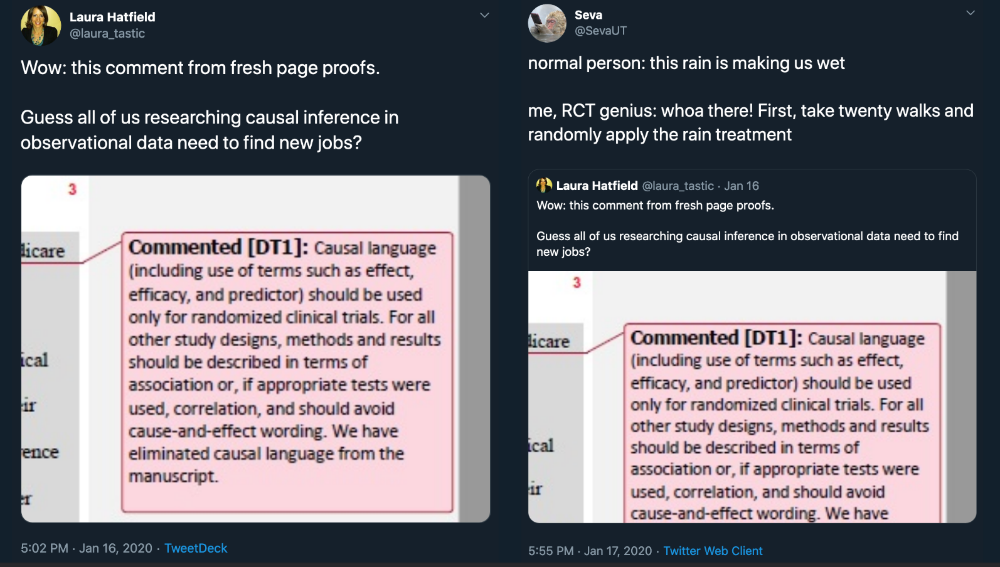
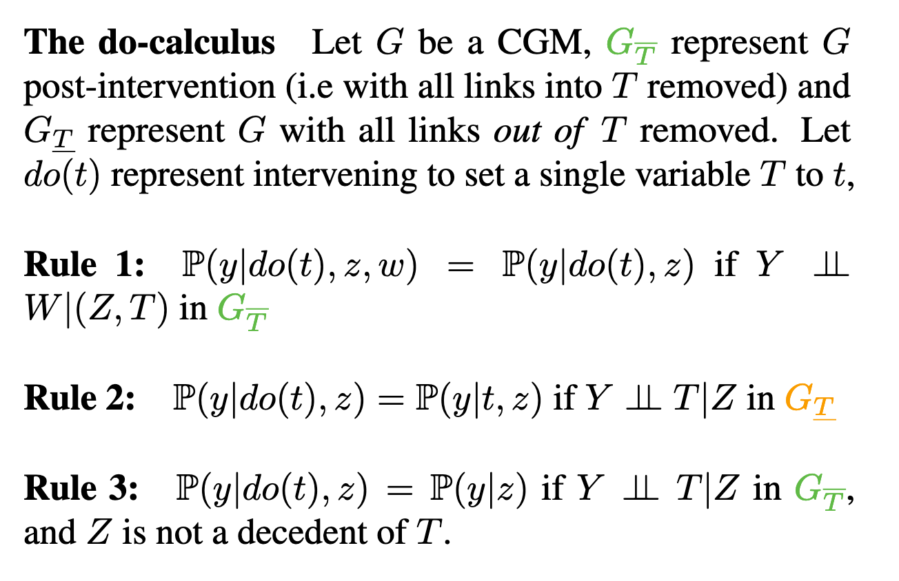

```{r setup, include=FALSE}
options(htmltools.dir.version = FALSE)
knitr::opts_chunk$set(echo=F,
                      message=F,
                      warning=F)
library(tidyverse)
set.seed(256)
update_geom_defaults("label", list(family = "Fira Sans Condensed"))
```

class: inverse

# Outline

### [Correlation vs. Causation](#3)

### [Causal Diagrams](#3)

### [DAG Rules](#16)

---

# You Don’t Need an RCT to Talk About Causality

.pull-left[
- Statistics profession is obstinant that we cannot say anything about causality

- But you have to! It's how the human brain works!

- We can’t concieve of (spurious) correlation without some causation

]

.pull-right[

.center[

]
]

---

# The Causal Revolution

.center[

]


---

# RCTs and Evidence-Based Policy

- .hi-purple[Should we *ONLY* base policies on the evidence from Randomized Controlled Trials?]

--

.pull-left[

<blockquote class="twitter-tweet"><p lang="en" dir="ltr">|￣￣￣￣￣￣￣￣￣￣|<br> IF U DONT SMOKE,<br> U ALREADY <br> BELIEVE IN<br> CAUSAL INFERENCE<br> WITHOUT<br> RANDOMIZED TRIALS<br>|＿＿＿＿＿＿＿＿＿＿| <br> (\__/) ||<br> (•ㅅ•) ||<br> / 　 づ<a href="https://twitter.com/hashtag/HistorianSignBunny?src=hash&amp;ref_src=twsrc%5Etfw">#HistorianSignBunny</a> <a href="https://twitter.com/hashtag/Epidemiology?src=hash&amp;ref_src=twsrc%5Etfw">#Epidemiology</a></p>&mdash; Ellie Murray (@EpiEllie) <a href="https://twitter.com/EpiEllie/status/1017622949799571456?ref_src=twsrc%5Etfw">July 13, 2018</a></blockquote> <script async src="https://platform.twitter.com/widgets.js" charset="utf-8"></script> 

]

--

.pull-right[

.center[

Source: [British Medical Journal](https://www.bmj.com/content/363/bmj.k5094)


]

]

---

# RCTs and Evidence-Based Policy III

.pull-left[
.center[

]
]

--

.pull-right[
.center[

]

]

---

class: inverse, center, middle

# Correlation vs. Causation

---
# Correlation and Causation I

.center[

<blockquote class="twitter-tweet"><p lang="en" dir="ltr">&quot;Correlation implies casuation,&quot; the dean hi-purpleed as he handed me my PhD.<br><br>&quot;But then why-&quot;<br><br>&quot;Because if they knew, they wouldn&#39;t need us.&quot;</p>&mdash; David Robinson (@drob) <a href="https://twitter.com/drob/status/877976063942512640?ref_src=twsrc%5Etfw">June 22, 2017</a></blockquote> <script async src="https://platform.twitter.com/widgets.js" charset="utf-8"></script>

]

---

# What Does Causation Mean?

.pull-left[

.smallest[
- “Correlation does not imply causation”
  - this is exactly backwards!
  - this is just pointing out that exogeneity is violated
]
]

.pull-right[
.center[

]
]

---

# What Does Causation Mean?

.pull-left[
.smallest[
- “Correlation does not imply causation”
  - this is exactly backwards!
  - this is just pointing out that exogeneity is violated
  
- “Correlation implies causation”
  - for an association, there must be *some* causal chain of variables that relate $X$ and $Y$
  - but not necessarily merely $X \rightarrow Y$
]
]

.pull-right[
.center[

]
]

---

# What Does Causation Mean?

.pull-left[

.smallest[
- “Correlation does not imply causation”
  - this is exactly backwards!
  - this is just pointing out that exogeneity is violated
  
- “Correlation implies causation”
  - for an association, there must be *some* causal chain of variables that relate $X$ and $Y$
  - but not necessarily merely $X \rightarrow Y$

- “Correlation plus exogeneity is causation.”
]
]

.pull-right[
.center[

]
]

---

# Correlation and Causation

.pull-left[
- .hi-purple[Correlation:]
  - Math & Statistics
  - Computers, AI, Machine learning can figure this out (even better than humans)

- .hi-purple[Causation:]
  - Philosophy, Intuition, Theory
  - .hi[Counterfactual thinking], unique to humans (vs. animals or machines)
  - Computers *cannot* yet figure this out

]

.pull-right[
.center[

]
]

---

# The Causal Revolution

.pull-left[
.center[

]
]

.pull-right[
.center[

]
]

---

# Causation Requires Counterfactual Thinking

.pull-left[
.center[

]
]

.pull-right[
.center[

]
]

---

background-image: url(https://www.dropbox.com/s/zsx3pa4m51p82dj/twopaths.jpg?raw=1)
background-size: cover

---

# Causal Inference

.pull-left[

- We will seek to understand what causality *is* and how we can approach finding it

- We will also explore the different common .hi[research designs] meant to .hi-purple[identify] causal relationships

- **These skills**, more than supply & demand, constrained optimization models, ISLM, etc, **are the tools and comparative advantage of a modern research economist**
    - Why all big companies (especially in tech) have entire economics departments in them

]

.pull-right[

.center[

]
]

---

# Clever Research Designs Identify Causality

```{r, fig.retina=3, fig.align="center", out.width="60%"}
ggplot(data = tibble(x=c(0,10),
                     y=c(0,10)))+
  aes(x = x,
      y = y)+
  geom_text(x=1,y=0.75, label="Correlation", size =10, color = "#fde0dd")+
  geom_text(x=5,y=0.75, label="Causation", size = 10, color = "#7a0177")+
  
  
  geom_text(x=1,y=1.5, label="Differences", size =5, color = "#fde0dd")+
  geom_text(x=1,y=1.25, label="Pre-Post", size =5, color = "#fde0dd")+
  geom_text(x=2,y=1.75, label="Multiple Regression", size =5, color = "#fbb4b9")+
  geom_text(x=2,y=1.25, label="Matching", size =5, color = "#fbb4b9")+
    geom_text(x=3,y=2, label="Fixed Effects", size =5, color = "#f768a1")+
    geom_text(x=3.5,y=2.25, label="Diff-in-Diff", size =5, color = "#c51b8a")+
  geom_text(x=4,y=1.25, label="Natural Experiments", size =5, color = "#c51b8a")+
  geom_text(x=3.5,y=1.5, label="Regression Discontinuity", size =5, color = "#c51b8a")+
  geom_text(x=5,y=1.75, label="RCTs", size =5, color = "#7a0177")+
  annotate("segment", x = 1, xend = 5, y = 1, yend = 1, colour = "black", size=2, alpha=1, arrow=arrow(length=unit(0.5,"cm"), ends="last", type="closed"))+
  scale_x_continuous(breaks=seq(0,6,1),
                     limits=c(0,6))+
  scale_y_continuous(breaks=seq(0,3,1),
                     limits=c(0.5,2.3))+
  theme_void()
```

---

# Correlation and Causation

.center[

<blockquote class="twitter-tweet"><p lang="en" dir="ltr">Causality isn&#39;t achieved; it&#39;s approached.</p>&mdash; John B. Holbein (@JohnHolbein1) <a href="https://twitter.com/JohnHolbein1/status/982635508089180161?ref_src=twsrc%5Etfw">April 7, 2018</a></blockquote> <script async src="https://platform.twitter.com/widgets.js" charset="utf-8"></script>

]

---

# What Then IS Causation?

.pull-left[
.smallest[
- $X$ causes $Y$ if we can intervene and change $X$ without changing anything else, and $Y$ changes
- $Y$ “listens to” $X$
  - $X$ may not be the only thing that causes $Y$!
]
]

.pull-right[
.center[

]
]

---

# What Then IS Causation?

.pull-left[
.smallest[
- $X$ causes $Y$ if we can intervene and change $X$ without changing anything else, and $Y$ changes
- $Y$ “listens to” $X$
  - $X$ may not be the only thing that causes $Y$!

.content-box-green[
.green[**Example**]

If $X$ is a light switch, and $Y$ is a light:

- Flipping the switch $(X)$ causes the light to go on $(Y)$
- But NOT if the light is burnt out (No $Y$ despite $X$)
- OR if the light was already on $(Y$ without $X$)
]

]
]
.pull-right[
.center[

]
]

---

# Non-Causal Claims 

- All of the following have non-zero correlations. Are they *causal*?

.content-box-green[
.green[**Example**]

- Greater ice cream sales $\rightarrow$ more violent crime
- Rooster crows $\rightarrow$ the sun rises in the morning
- Taking Vitamin C $\rightarrow$ Colds go away a few days later
- Political party in power $\rightarrow$ economy performs better or worse
]

---

# Counterfactuals

.pull-left[

- The *sine qua non* of causal claims are .hi[counterfactuals]: what would $Y$ have been if $X$ had been different?

- It is **impossible** to make a counterfactual claim from data alone! 

- Need a (theoretical) .hi-purpl[causal model] of the data-generating process!

]

.pull-right[
.center[

]
]

---

# Counterfactuals and RCTs

.pull-left[
.smallest[
- Again, RCTs are invoked as the gold standard for their ability to make counterfactual claims:

- Treatment/intervention $(X)$ is *randomly assigned* to individuals, and then outcome $Y$ is measured

> If person i who recieved treatment *had not recieved* the treatment, we can predict what his outcome *would have been*

> If person j who did not recieve treatment *had recieved treatment*, we can predict what her outcome *would have been*

- We can say this because, on average, treatment and control groups are *the same before treatment*

]
]

.pull-right[
.center[

]
]
---

# From RCTs to Causal Models

.pull-left[
- RCTs are but the best-known method of a large, growing science of .hi[causal inference]

- We need a .hi[causal model] to describe the .hi[data-generating process (DGP)]

- Requires us to make some .hi-purple[assumptions]

]

.pull-right[
.center[

]
]

---

class: inverse, center, middle

# Causal Diagrams

---

# Causal Diagrams/DAGs

.pull-left[
- A surprisingly simple, yet rigorous and powerful method of modeling is using a .hi[causal diagram] or .hi[DAG]:
  - .hi[Directed]: Each node has arrows that points only one direction
  - .hi[Acyclic]: Arrows only have one direction, and cannot loop back
  - .hi[Graph]

]

.pull-right[
```{r}
library("ggdag")

dag<-dagify(y ~ x,
       y ~ z,
       x ~ z,
       labels = c("x" = "X",
                  "y" = "Y",
                  "z" = "Z"),
       coords = list(x = c(x = 1, z = 2, y = 3),
                     y = c(x = 1, z = 2, y = 1))) %>%
  tidy_dagitty(seed = 2) %>%
  ggplot(data = .)+
  aes(x = x,
      y = y,
      xend = xend,
      yend = yend)+
  geom_dag_edges(seed = 2)+
  geom_dag_point(aes(color = label))+
  geom_dag_text(aes(label = label), # geom_dag_label_repel, with seed, direction = "y", fontface = "bold"
                     #fill = label),
                fontface = "bold")+
  #scale_fill_manual(values = c("#39CCCC", "#2ECC40", "#0074D9"))+
  scale_color_manual(values = c("X" = "#39CCCC", "Y" = "#2ECC40", "Z" = "#0074D9"))+
  guides(color = F,
         fill = F)+
  theme_dag()
dag
```

]

---

# Causal Diagrams/DAGs

.pull-left[

- A visual model of the data-generating process, encodes our understanding of the causal relationships

- Requires some common sense/economic intutition

- Remember, all models are wrong, we just need them to be *useful*!

]

.pull-right[
```{r}
dag
```

]

---

# Causal Diagrams/DAGs

.pull-left[

- Our light switch example of causality

.center[

]

]

.pull-right[
```{r}
dagify(light ~ switch + burnt,
       exposure = "switch",
       outcome = "light") %>%
  ggdag_status()+theme_dag()+theme(legend.position="none")
```

]

---

# Drawing a DAG: Example

.pull-left[
.smallest[
- Suppose we have data on three variables
  - `IP`: how much a firm spends on IP lawsuits 
  - `tech`: whether a firm is in tech industry
  - `profit`: firm profits

- They are all correlated with each other, but what's are the causal relationships? 

- We need our own .hi-purple[causal model] (from theory, intuition, etc) to sort
  - Data alone will not tell us!
]
]

.pull-right[

```{r, fig.retina=3, outwidth="90%", fig.align="center"}
library(ggdag)
#theme_set(theme_dag_blank())
library(gridExtra)

h1 <- dagify(profit ~ tech+ip,
             tech ~ ip,
             coords=list(
               x=c(tech=1, ip=2, profit=3),
               y=c(tech=1, ip=2, profit=1)
               )) %>% ggdag(stylized = FALSE, seed=256)+
  labs(title = "1")+
  theme_void()+theme(legend.position = "none")

h2 <- dagify(profit ~ tech+ip,
             ip ~ tech,
             coords=list(
               x=c(tech=1, ip=2, profit=3),
               y=c(tech=1, ip=2, profit=1)
               )) %>% ggdag(stylized = FALSE, seed=256)+
  labs(title = "2")+
  theme_void()+theme(legend.position = "none")

h3 <- dagify(profit ~ tech,
             ip ~ tech+profit,
             coords=list(
               x=c(tech=1, ip=2, profit=3),
               y=c(tech=1, ip=2, profit=1)
               )) %>% ggdag(stylized = FALSE, seed=256)+
  labs(title = "3")+
  theme_void()+theme(legend.position = "none")

h4 <- dagify(profit ~ ip,
             tech ~ ip+profit,
             coords=list(
               x=c(tech=1, ip=2, profit=3),
               y=c(tech=1, ip=2, profit=1)
               )) %>% ggdag(stylized = FALSE, seed=256)+
  labs(title = "4")+
  theme_void()+theme(legend.position = "none")

h5 <- dagify(tech ~ ip+profit,
             ip ~ profit,
             coords=list(
               x=c(tech=1, ip=2, profit=3),
               y=c(tech=1, ip=2, profit=1)
               )) %>% ggdag(stylized = FALSE, seed=256)+
  labs(title = "5")+
  theme_void()+theme(legend.position = "none")

h6 <- dagify(tech ~ profit,
             ip ~ profit+tech,
             coords=list(
               x=c(tech=1, ip=2, profit=3),
               y=c(tech=1, ip=2, profit=1)
               )) %>% ggdag(stylized = FALSE, seed=256)+
  labs(title = "6")+
  theme_void()+theme(legend.position = "none")

grid.arrange(h1, h2, h3, h4, h5, h6, ncol=2)

```
]

---

# Drawing a DAG: 

.pull-left[
.smallest[
1. Consider all the variables likely to be important to the data-generating process (including variables we can't observe!)

2. For simplicity, combine some similar ones together or prune those that aren't very important

3. Consider which variables are likely to affect others, and draw arrows connecting them

4. Test some testable implications of the model (to see if we have a correct one!)

]
]
.pull-right[

.center[

]
]

---

# Side Notes

.pull-left[
.smallest[
- Drawing an arrow requires a direction - making a statement about causality!

- *Omitting* an arrow makes an equally important statement too!
  - In fact, we will *need* omitted arrows to show causality!

- If two variables are correlated, but neither causes the other, likely they are both caused by another (perhaps **unobserved**) variable - add it!

- There should be no *cycles* or *loops* (if so, there’s probably another missing variable, such as time)
]
]

.pull-right[
.center[

]
]
---

# DAG Example I

.pull-left[

.content-box-green[
.green[**Example**]: what is the effect of education on wages?
]

- Education $(X$, “treatment” or “exposure”)

- Wages $(Y$, “outcome” or “response”)
]

.pull-right[

```{r, echo = F}
edu_earn_coords <- list(x = c(educ = 2, wage = 4, year = 2, bckg = 4, 
                              loc = 3, conx = 3, laws = 1, u1 = 3),
                        y = c(educ = 2, wage = 2, year = 3, bckg = 3, 
                              loc = 3, conx = 1, laws = 2, u1 = 4))
dagify(wage~educ,
       coords = edu_earn_coords) %>% 
  tidy_dagitty(seed = 2) %>%
  ggdag_parents("wage", stylized = FALSE, seed=256)+theme_dag_blank()+theme(legend.position = "none")
```

]

---

# DAG Example I

.pull-left[

- What other variables are important?
  - Ability
  - Socioeconomic status
  - Demographics
  - Phys. Ed. requirements
  - Year of birth
  - Location
  - Schooling laws
  - Job connections
]

.pull-right[

```{r, echo = F}
dagify(wage~educ,
       coords = edu_earn_coords) %>% 
  tidy_dagitty(seed = 2) %>%
  ggdag_parents("wage", stylized = FALSE, seed=256)+theme_dag_blank()+theme(legend.position = "none")
```

]

---

# DAG Example I

.pull-left[
.smallest[
- In social science and complex systems, 1000s of variables could plausibly be in DAG!

- So simplify:
  - Ignore trivial things (Phys. Ed. requirement)
  - Combine similar variables (Socioeconomic status, Demographics, Location) $\rightarrow$ Background
]
]
.pull-right[

```{r, echo = F}
dagify(wage~educ,
       coords = edu_earn_coords) %>%
  tidy_dagitty(seed = 2) %>%
  ggdag_parents("wage", stylized = FALSE, seed=256)+theme_dag_blank()+theme(legend.position = "none")
```

]

---

# DAG Example II

.pull-left[

- Background, Year of birth, Location, Compulsory schooling, all cause education

- Background, year of birth, location, job connections probably cause wages
]

.pull-right[

```{r, echo = F}
dagify(wage~educ+conx+year+bckg+loc,
       educ~bckg+year+loc+laws,
       coords = edu_earn_coords,
       outcome = "wage",
       exposure = "educ") %>%
  tidy_dagitty(seed = 2) %>%
  ggdag_status(stylized = FALSE)+theme_dag_blank()+theme(legend.position = "none")
```

]

---

# DAG Example III

.pull-left[

- Background, Year of birth, Location, Compulsory schooling, all cause education

- Background, year of birth, location, job connections probably cause wages

- Job connections in fact is probably caused by education!

- Location and background probably both caused by unobserved factor (`u1`)
]

.pull-right[

```{r, echo = F}
dagify(wage~educ+conx+year+bckg+loc,
       educ~bckg+year+loc+laws,
       conx~educ,
       bckg~u1,
       loc~u1,
       coords = edu_earn_coords,
       outcome = "wage",
       exposure = "educ") %>%
  tidy_dagitty(seed = 2) %>%
  ggdag_status(stylized = FALSE)+theme_dag_blank()+theme(legend.position = "none")
```

]

---

# DAG Example IV

.pull-left[

- This is messy, but we have a causal model!

- Makes our assumptions **explicit**, and many of them are **testable**

- DAG suggests certain relationships that will *not* exist:
  - all relationships between `laws` and `conx` go through `educ`
  - so if we controlled for `educ`, then `cor(laws,conx)` should be zero!
]

.pull-right[

```{r, echo = F}
dagify(wage~educ+conx+year+bckg+loc,
       educ~bckg+year+loc+laws,
       conx~educ,
       bckg~u1,
       loc~u1,
       coords = edu_earn_coords,
       outcome = "wage",
       exposure = "educ") %>%
  tidy_dagitty(seed = 2) %>%
  ggdag_status(stylized = FALSE)+theme_dag_blank()+theme(legend.position = "none")

```

]

---

# Let the Computer Do It: Dagitty.net I

.pull-left[
.center[


]
]

.pull-right[

- [Dagitty.net](http://dagitty.net) is a great tool to make these and give you testable implications

- Click `Model -> New Model`

- Name your "exposure" variable $(X$ of interest) and "outcome" variable $(Y)$

]

---

# Let the Computer Do It: Dagitty.net II

.pull-left[
.center[


]
]

.pull-right[

- Click and drag to move nodes around

- Add a new variable by double-clicking

- Add an arrow by double-clicking one variable and then double-clicking on the target (do again to remove arrow)

]

---

# Let the Computer Do It: Dagitty.net III

.pull-left[
.center[


]
]

.pull-right[
.smallest[
- Tells you .hi-purple[how to identify your effect]! (upper right)

> .hi-purple[Minimal sufficient adjustment sets] containing background, location, year for estimating the total effect of educ on wage:
background, location, year

- Tells you some .hi-turquoise[testable implications] (middle right)
  - .hi-turquoise[conditional independencies], for example (last):
  - `job_connections` $\perp$ `year` | `educ`
  - means: holding constant `educ`, there should be no correlation between `job_connections` and `year` - can test this with data!
]
]

---

# Causal Effect

.pull-left[
.center[


]
]

.pull-right[

- If we control for `background`, `location`, and `year`, we can .hi-purple[identify the causal effect] of `educ` $\rightarrow$ `wage`.

]

---

# You Can Draw DAGs In R

.pull-left[

- New package: `ggdag`
- Arrows are made with formula notation: `Y~X+Z` means "`Y` is caused by `X` and `Z`"

```{r, echo = T, eval=F}
# install.packages("ggdag")
library(ggdag)
dagify(wage~educ+conx+year+bckg+loc,
       educ~bckg+year+loc+laws,
       conx~educ,
       bckg~u1,
       loc~u1,
       exposure = "educ", # optional: define X
       outcome = "wage" # optional: define Y
       ) %>%
  ggdag()+
  theme_dag()
```
]

.pull-right[

```{r, echo = F}
dagify(wage~educ+conx+year+bckg+loc,
       educ~bckg+year+loc+laws,
       conx~educ,
       bckg~u1,
       loc~u1) %>% 
  tidy_dagitty(seed = 2) %>%
  ggdag(stylized = FALSE, seed=256)+
  theme_dag()
```

]

---

# ggdag: Additional Tools

.pull-left[

- If you have defined `X` (`exposure`) and `Y` (`outcome`), you can use `ggdag_paths()` to have it show all possible paths between $X$ and $Y$!

```{r, echo = T, eval=F}
dagify(wage~educ+conx+year+bckg+loc,
       educ~bckg+year+loc+laws,
       conx~educ,
       bckg~u1,
       loc~u1,
       exposure = "educ",
       outcome = "wage"
       ) %>%
  tidy_dagitty(seed = 2) %>%
  ggdag_paths()+
  theme_dag()
```
]

.pull-right[

```{r, echo = F}
dagify(wage~educ+conx+year+bckg+loc,
       educ~bckg+year+loc+laws,
       conx~educ,
       bckg~u1,
       loc~u1, 
       exposure = "educ",
       outcome = "wage") %>%
  tidy_dagitty(seed = 2) %>%
  ggdag_paths()+theme_dag()
```

]

---

# You Can Draw DAGs In R

.pull-left[

- If you have defined `X` (`exposure`) and `Y` (`outcome`), you can use `ggdag_adjustment_set()` to have it show you what you need to control for in order to identify $X \rightarrow Y$!

```{r, echo = T, eval=F}
dagify(wage~educ+conx+year+bckg+loc,
       educ~bckg+year+loc+laws,
       conx~educ,
       bckg~u1,
       loc~u1,
       exposure = "educ",
       outcome = "wage"
       ) %>%
  ggdag_adjustment_set(shadow = T)+ # shadow shows adjusted arrows
  theme_dag()
```
]

.pull-right[

```{r, echo = F}
dagify(wage~educ+conx+year+bckg+loc,
       educ~bckg+year+loc+laws,
       conx~educ,
       bckg~u1,
       loc~u1, 
       exposure = "educ",
       outcome = "wage") %>%
  tidy_dagitty(seed = 2) %>%
  ggdag_adjustment_set(shadow = T)+theme_dag()
```

]

---

class: inverse, center, middle

# DAG Rules

---

# DAG Rules

.pull-left[
.smaller[
- How does dagitty.net and `ggdag` know how to identify effects, or what to control for, or what implications are testable?

- Comes from fancy math called “do-calculus”

.center[

]

- Fortunately, these amount to a few simple rules that we can see on a DAG
]
]

.pull-right[
.center[

]
]


---

# DAGs I

.pull-left[
.smaller[
- Typical notation:

- $X$ is independent variable of interest
  - Epidemiology: .hi-purple["intervention"] or .hi-purple[“exposure”]

- $Y$ is dependent or .hi-purple["response"] variable

- Other variables use other letters

- You can of course use words instead of letters!
]
]

.pull-right[

```{r, echo = F, fig.retina=3, fig.align="center"}
dagify(Y~X,
                coords=list(
                x=c(X=1,Y=2),
                y=c(X=1,Y=1)
              ),
       exposure = "X",
       outcome = "Y") %>% 
  tidy_dagitty(seed = 2) %>%
  ggdag_status(stylized = FALSE)+theme_dag_blank()+theme(legend.position = "none")
```
]

---

# DAGs and Causal Effects

.pull-left[

- Arrows indicate causal effect (& direction)

- Two types of causal effect:

1. Direct effects: $X \rightarrow Y$
]

.pull-right[

```{r, echo = F, fig.retina=3, fig.align="center"}
dagify(Y~X,
                coords=list(
                x=c(X=1,Y=2),
                y=c(X=1,Y=1)
              ),
       exposure = "X",
       outcome = "Y") %>% 
  tidy_dagitty(seed = 2) %>%
  ggdag_status(stylized = FALSE)+theme_dag_blank()+theme(legend.position = "none")
```


]

---

# DAGs and Causal Effects

.pull-left[

- Arrows indicate causal effect (& direction)

- Two types of causal effect:

1. Direct effects: $X \rightarrow Y$

2. Indirect effects: $X \rightarrow M \rightarrow Y$ 
  - $M$ is a .hi-purple[“mediator”] variable, the .hi-purple[mechanism] by which $X$ affects $Y$
]

.pull-right[

```{r, echo = F, fig.retina=3, fig.align="center"}
dagify(Y~M,
               M~X,
                coords=list(
                x=c(X=1,Y=2, M=1.5),
                y=c(X=1,Y=1, M=1)
              ),
       exposure = "X",
       outcome = "Y") %>% 
  tidy_dagitty(seed = 2) %>%
  ggdag_status(stylized = FALSE)+theme_dag_blank()+theme(legend.position = "none")
```


]

---

# DAGs and Causal Effects

.pull-left[

- Arrows indicate causal effect (& direction)

- Two types of causal effect:

1. Direct effects: $X \rightarrow Y$

2. Indirect effects: $X \rightarrow M \rightarrow Y$ 
  - $M$ is a .hi-purple[“mediator”] variable, the .hi-purple[mechanism] by which $X$ affects $Y$

3. You of course might have both! 
]

.pull-right[

```{r, echo = F, fig.retina=3, fig.align="center"}
dagify(Y~M+X,
               M~X,
                coords=list(
                x=c(X=1,Y=2, M=1.5),
                y=c(X=1,Y=1, M=1.5 )
              ),
       exposure = "X",
       outcome = "Y") %>% 
  tidy_dagitty(seed = 2) %>%
  ggdag_status(stylized = FALSE)+theme_dag_blank()+theme(legend.position = "none")
```


]

---

# Confounders

.pull-left[
.smaller[
- $Z$ is a .hi[“confounder”] of $X \rightarrow Y$, it causes *both* $X$ and $Y$

- $cor(X,Y)$ is made up of two parts:
  1. Causal effect of $(X \rightarrow Y)$ 👍
  2. $Z$ causing both the values of $X$ and $Y$ 👎 

- Failing to control for $Z$ will .hi-purple[bias] our estimate of the causal effect of $X \rightarrow Y$! 
]
]

.pull-right[

```{r, echo = F}
dagify(Y~Z+X,
       X~Z,
       coords=list(
         x=c(X=1,Y=2, Z=1.5),
         y=c(X=1,Y=1, Z=2)
         ),
       exposure = "X",
       outcome = "Y") %>% 
  tidy_dagitty(seed = 2) %>%
  ggdag_status(stylized = FALSE, seed=256)+theme_dag_blank()+theme(legend.position = "none")
```

]

---

# Confounders

.pull-left[

- Confounders are the DAG-equivalent of .hi[omitted variable bias] (next class)

$$Y_i=\beta_0+\beta_1 X_i$$

- By leaving out $Z_i$, this regression is .hi-purple[biased]

- $\hat{\beta}_1$ picks up *both*:
  - $X \rightarrow Y$
  - $X \leftarrow Z \rightarrow Y$
]

.pull-right[

```{r, echo = F}
dagify(Y~Z+X,
       X~Z,
       coords=list(
         x=c(X=1,Y=2, Z=1.5),
         y=c(X=1,Y=1, Z=2)
         ),
       exposure = "X",
       outcome = "Y") %>% 
  tidy_dagitty(seed = 2) %>%
  ggdag_status(stylized = FALSE, seed=256)+theme_dag_blank()+theme(legend.position = "none")
```

]

---

# “Front Doors” and “Back Doors”

.pull-left[
.smallest[
- With this DAG, there are 2 paths that connect $X$ and $Y$<sup>.magenta[†]</sup>:

1. A .hi[causal “front-door” path]: $X \rightarrow Y$
  - 👍 what we want to measure
    
2. A .hi[non-causal “back-door” path]: $X \leftarrow Z \rightarrow Y$
  - At least one causal arrow runs in the opposite direction
  - 👎 adds a confounding bias
]

]

.pull-right[

```{r, echo = F}
dagify(Y~Z+X,
       X~Z,
       coords=list(
         x=c(X=1,Y=2, Z=1.5),
         y=c(X=1,Y=1, Z=2)
         ),
       exposure = "X",
       outcome = "Y") %>% 
  tidy_dagitty(seed = 2) %>%
  ggdag_status(stylized = FALSE, seed=256)+theme_dag_blank()+theme(legend.position = "none")
```

]

.footnote[<sup>.magenta[†]</sup> Regardless of the *directions* of the arrows!]

---

# Controlling I 

.pull-left[
.smaller[
- Ideally, if we ran a .hi[randomized control trial] and randomily assigned different values of $X$ to different individuals, this would delete the arrow between $Z$ and $X$
  - Individuals’ values of $Z$ do not affect whether or not they are treated ($X$)

- This would only leave the front-door, $X \rightarrow Y$

- But we can rarely run an ideal RCT
]
]

.pull-right[

```{r, echo = F}
dagify(Y~Z+X,
       coords=list(
         x=c(X=1,Y=2, Z=1.5),
         y=c(X=1,Y=1, Z=2)
         ),
       exposure = "X",
       outcome = "Y") %>% 
  tidy_dagitty(seed = 2) %>%
  ggdag_status(stylized = FALSE, seed=256)+theme_dag_blank()+theme(legend.position = "none")
```

]

---

# Controlling I 

.pull-left[

- Instead of an RCT, if we can just .hi-purple[“adjust for”] or .hi-purple[“control for”] $Z$, we can *block* the back-door path $X \leftarrow Z \rightarrow Y$

- This would only leave the front-door path open, $X \rightarrow Y$

- “As good as” an RCT!

]

.pull-right[

```{r, echo = F}
dagify(Y~Z+X,
       X~Z,
       coords=list(
         x=c(X=1,Y=2, Z=1.5),
         y=c(X=1,Y=1, Z=2)),
         exposure = "X",
       outcome = "Y") %>% 
  tidy_dagitty(seed = 2) %>%
  ggdag_adjustment_set(stylized = FALSE, shadow = T)+theme_dag_blank()+theme(legend.position = "bottom")
```


]

---

# Controlling I 

.pull-left[

- Using our terminology from last class, we have an outcome $(Y)$, and some treatment

- But there are .b[unobserved factors] $(u)$

$$Y_i = \beta_0 + \beta_1 Treatment + u_i$$

]

.pull-right[

```{r, echo = F}
dagify(Y~treat+u,
       treat~u,
       coords=list(
         x=c(treat=1, u=1.5, Y=2),
         y=c(treat=1, u=2, Y =1)),
         exposure = "treat",
         outcome = "Y"
         ) %>% 
  #tidy_dagitty() %>%
  ggdag_status(stylized = FALSE, seed=256)+theme_dag_blank()+theme(legend.position = "none")
```

]

---

# Controlling I 

.pull-left[

- Using our terminology from last class, we have an outcome $(Y)$, and some treatment

- But there are .b[unobserved factors] $(u)$

$$Y_i = \beta_0 + \beta_1 Treatment + u_i$$

- If we can *randomly* assign treatment, this makes treatment exogenous:

$$cor(treatment,u)=0$$

]

.pull-right[

```{r, echo = F}
dagify(Y~treat+u,
       coords=list(
         x=c(treat=1, u=1.5, Y=2),
         y=c(treat=1, u=2, Y =1)),
         exposure = "treat",
         outcome = "Y"
         ) %>% 
  #tidy_dagitty() %>%
  ggdag_status(stylized = F)+theme_dag_blank()+theme(legend.position = "none")
```

]

---

# Controlling I 

.pull-left[

- Using our terminology from last class, we have an outcome $(Y)$, and some treatment

- But there are other .b[unobserved factors] $(u)$

$$Y_i = \beta_0 + \beta_1 Treatment + u_i$$

- When we (often) can’t randomly assign treatment, we have to find another way to control for measurable things in $u$

]

.pull-right[
```{r, echo = F}
dagify(Y~treat+u,
       treat~u,
       coords=list(
         x=c(treat=1, u=1.5, Y=2),
         y=c(treat=1, u=2, Y =1)),
         exposure = "treat",
         outcome = "Y"
         ) %>% 
  #tidy_dagitty() %>%
  ggdag_adjustment_set(shadow = T)+theme_dag()
```
]

---

# Controlling II

.pull-left[

- Controlling for a single variable along a long causal path is sufficient to block that path!

- Causal path: $X \rightarrow Y$
- Backdoor path: $X \leftarrow A \rightarrow B \rightarrow C \rightarrow Y$

- It is sufficient to block this backdoor by controlling **either** $A$ **or** $B$ **or** $C$!

]

.pull-right[

```{r, echo = F}
dagify(Y~X+C,
       X~A,
       B~A,
       C~B,
         exposure = "X",
         outcome = "Y"
         ) %>%
  tidy_dagitty(seed = 256) %>%
  ggdag_status(stylized = FALSE)+theme_dag_blank()+theme(legend.position = "none")
```
]
---

# Controlling II

.pull-left[

- Controlling for a single variable along a long causal path is sufficient to block that path!

- Causal path: $X \rightarrow Y$
- Backdoor path: $X \leftarrow A \rightarrow B \rightarrow C \rightarrow Y$

- It is sufficient to block this backdoor by controlling **either** $A$ **or** $B$ **or** $C$!

]

.pull-right[

```{r, echo = F}
dagify(Y~X+C,
       X~A,
       B~A,
       C~B,
         exposure = "X",
         outcome = "Y"
         ) %>%
  tidy_dagitty(seed = 256) %>%
  ggdag_adjustment_set(stylized = FALSE, shadow = T)+theme_dag_blank()+theme(legend.position = "bottom")
```
]
---

# The Back Door Criterion

.pull-left[

- To .hi[identify] the causal effect of $X \rightarrow Y$:

- .hi-purple[“Back-door criterion”]: control for the minimal amount of variables sufficient to ensure that .b[no open back-door exists] between $X$ and $Y$

- .hi-green[Example]: in this DAG, control for $Z$

]

.pull-right[

```{r, echo = F}
dagify(Y~Z+X,
       X~Z,
       coords=list(
         x=c(X=1,Y=2, Z=1.5),
         y=c(X=1,Y=1, Z=2)),
         exposure = "X",
       outcome = "Y") %>% 
  tidy_dagitty(seed = 256) %>%
  ggdag_status(stylized = FALSE)+theme_dag_blank()+theme(legend.position = "none")
```

]

---

# The Back Door Criterion

.pull-left[

.quitesmall[
- Implications of the Back-door criterion:

1) You *only* need to control for the variables that keep a back-door open, *not all other variables!*

.content-box-green[
.green[**Example**]:

- $X \rightarrow Y$ (front-door)
- $X \leftarrow A \rightarrow B \rightarrow Y$ (back-door)

] 
]

]

.pull-right[

```{r, echo = F}
dagify(Y~X+B+C+Z,
       X~A,
       B~A,
         exposure = "X",
         outcome = "Y"
         ) %>% 
  tidy_dagitty(seed = 256) %>%
  ggdag_status(stylized = FALSE)+theme_dag_blank()+theme(legend.position = "none")
```

]

---

# The Back Door Criterion

.pull-left[

.quitesmall[
- Implications of the Back-door criterion:

1) You *only* need to control for the variables that keep a back-door open, *not all other variables!*

.content-box-green[
.green[**Example**]:

- $X \rightarrow Y$ (front-door)
- $X \leftarrow A \rightarrow B \rightarrow Y$ (back-door)

- Need only control for $A$ *or* $B$ to block the back-door path
- $C$ and $Z$ have no effect on $X$, and therefore we don’t need to control for them! 

]

]

]

.pull-right[

```{r, echo = F}
dagify(Y~X+B+C+Z,
       X~A,
       B~A,
         exposure = "X",
         outcome = "Y"
         ) %>% 
  tidy_dagitty(seed = 256) %>%
  ggdag_adjustment_set(stylized = FALSE, shadow = T)+theme_dag_blank()+theme(legend.position = "none")
```

]

---
# The Back Door Criterion: Colliders

.pull-left[
.smallest[
2) Exception: the case of a .hi[“collider”]
  - If arrows “collide” at a node, **that node is automatically blocking the pathway**, .hi-purple[do not control for it!]
  - Controlling for a collider would *open* the path and .b[add bias!]

.content-box-green[
.green[**Example**]:

- $X \rightarrow Y$ (front-door)
- $X \leftarrow A \rightarrow B \leftarrow C \rightarrow Y$ (back-door, but **blocked by B!**)
] 

]
]
.pull-right[

```{r, echo = F}
dagify(Y~X+C,
       X~A,
       B~A+C,
         exposure = "X",
         outcome = "Y"
         ) %>% 
  tidy_dagitty(seed = 256) %>%
  ggdag_status(stylized = FALSE)+theme_dag_blank()+theme(legend.position = "none")
```

]

---

# The Back Door Criterion: Colliders

.pull-left[
.smallest[
2) Exception: the case of a .hi[“collider”]
  - If arrows “collide” at a node, **that node is automatically blocking the pathway**, .hi-purple[do not control for it!]
  - Controlling for a collider would *open* the path and .b[add bias!]

.content-box-green[
.green[**Example**]:

- $X \rightarrow Y$ (front-door)
- $X \leftarrow A \rightarrow B \leftarrow C \rightarrow Y$ (back-door, but **blocked by B!**)
- Don’t need to control for anything here!

] 

]
]
.pull-right[

```{r, echo = F}
dagify(Y~X+C,
       X~A,
       B~A+C,
         exposure = "X",
         outcome = "Y"
         ) %>% 
  tidy_dagitty(seed = 256) %>%
  ggdag_adjustment_set(stylized = FALSE)+theme_dag_blank()+theme(legend.position = "none")
```

]

---

# The Back Door Criterion: Colliders

.pull-left[
.smallest[
.content-box-green[
.green[**Example**]:

- Are you less likely to get the flu if you are hit by a bus?

- $Flu$: getting the flu
- $Bus$: being hit by a bus
- $Hos$: being in the hospital

- Both $Flu$ and $Bus$ send you to $Hos$ (arrows)

- Conditional on being in $Hos$, negative correlation between $Flu$ and $Bus$ (spurious!)
] 
]

]

.pull-right[

```{r, echo = F}
dagify(Hos~Flu+Bus,
       coords=list(
         x=c(Flu=1, Hos=1.5, Bus=2),
         y=c(Flu=1, Hos=2, Bus=1)
       )) %>% 
  ggdag_parents("Hos", stylized = FALSE, seed=256)+theme_dag_blank()+theme(legend.position = "none")
```

]

---

# The Back Door Criterion: Colliders

.pull-left[

- In the NBA, apparently players’ height has no relationship to points scored?
]

.pull-right[
.center[

]
]

---

# The Back Door Criterion: Colliders

.pull-left[

- **In the NBA**, players’ height has no relationship to points scored

- Naturally, taller people score more points in a basketball game, but if you *only* look at NBA players, that relationship goes away

- A person being in the NBA is a collider! Colliders are another way to see .hi-orange[selection bias]

]

.pull-right[

```{r, echo = F}
dagify(NBA~Height+Points,
       Points~Height,
       coords=list(
         x=c(Height=1, NBA=1.5, Points=2),
         y=c(Height=1, NBA=2, Points=1)
       )) %>% 
  ggdag_parents("NBA", stylized = FALSE, seed=256)+theme_dag_blank()+theme(legend.position = "none")
```

]

---

# The Front Door Criterion: Mediators I

.pull-left[
.smallest[
- Another case where controlling for a variable actually *adds bias* is if that variable is known as a .hi[“mediator”].

.content-box-green[
.green[**Example**]:

- $X \rightarrow M \rightarrow Y$ (front-door)
- $X \leftarrow A \rightarrow Y$ (back-door)
- $X \leftarrow B \rightarrow Y$ (back-door)

- Should we control for $M$? 
- If we did, this would block the front-door! 
]
]
]

.pull-right[

```{r, echo = F}
dagify(Y~A+B+M,
       M~X,
       X~A+B,
       coords=list(
         x=c(X=1, A=1.5, B=1.5, M=1.5, Y=2),
         y=c(X=1, A=2, B=0, M=1, Y=1)),
         exposure = "X",
         outcome = "Y"
         ) %>% 
  ggdag_status(stylized = FALSE)+theme_dag_blank()+theme(legend.position = "none")
```

]

---

# The Front Door Criterion: Mediators II

.pull-left[
.smallest[
- Another case where controlling for a variable actually *adds bias* is if that variable is known as a .hi[“mediator”].

.content-box-green[
.green[**Example**]:

- If we control for $M$, would block the front-door! 

- If we can estimate $X \rightarrow M$ and $M \rightarrow Y$ (note, no back-doors to either of these!), we can estimate $X \rightarrow Y$
] 

- This is the .hi-purple[front door method]

]
]

.pull-right[

```{r, echo = F}
dagify(Y~A+B+M,
       M~X,
       X~A+B,
       coords=list(
         x=c(X=1, A=1.5, B=1.5, M=1.5, Y=2),
         y=c(X=1, A=2, B=0, M=1, Y=1)),
         exposure = "X",
         outcome = "Y"
         ) %>% 
  ggdag_adjustment_set(stylized = FALSE, shadow = T)+theme_dag_blank()+theme(legend.position = "bottom")
```

]

---

# The Front Door Criterion: Mediators III

.pull-left[
.smallest[
- Tobacco industry claimed that $cor(smoking, cancer)$ could be spurious due to a confounding `gene` that affects both!
  - Smoking `gene` is unobservable

- Suppose smoking causes `tar` buildup in lungs, which cause `cancer`

- We should *not* control for `tar`, it's on the **front-door path**
  - This is how scientific studies can relate smoking to cancer
]
]

.pull-right[

```{r, echo = F}
dagify(canc~tar+gene,
       tar~smok,
       smok~gene,
       coords=list(
         x=c(smok=1, tar=1.5, gene=1.5, canc=2),
         y=c(smok=1, tar=1, gene=2, canc=1)),
         exposure = "smok",
         outcome = "canc"
       ) %>% 
  ggdag_status(stylized = FALSE, seed=256)+theme_dag_blank()+theme(legend.position = "none")
```

]

---

# Summary: DAG Rules for Causal Identification

.pull-left[
.smallest[
Thus, to achieve .hi-purple[causal identification], control for the minimal amount of variables such that:

1. Ensure **no back-door path remains open**
  - Close back-door paths by *controlling* for any one variable along that path
  - Colliders along a path *automatically* close that path

2. Ensure **no front-door path is closed**
  - Do not control for mediators
]
]

.pull-right[

```{r, echo = F}
dagify(Y~A+B+M,
       M~X,
       X~A+B,
       coords=list(
         x=c(X=1, A=1.5, B=1.5, M=1.5, Y=2),
         y=c(X=1, A=2, B=0, M=1, Y=1)),
         exposure = "X",
         outcome = "Y"
         ) %>% 
  #tidy_dagitty() %>%
  ggdag_status(stylized = FALSE, seed=256)+theme_dag_blank()+theme(legend.position = "none")
```

]