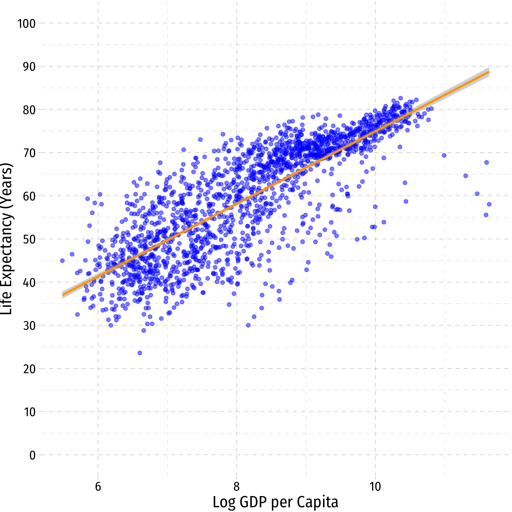
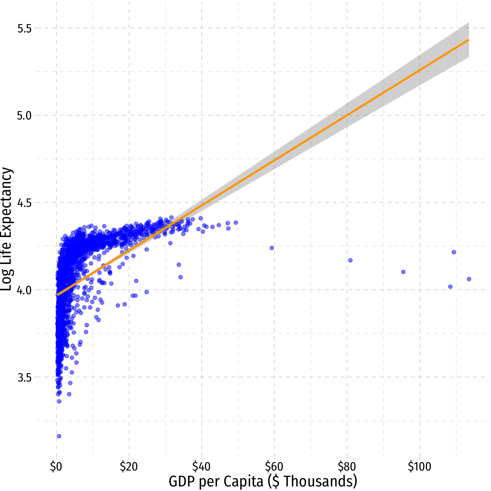
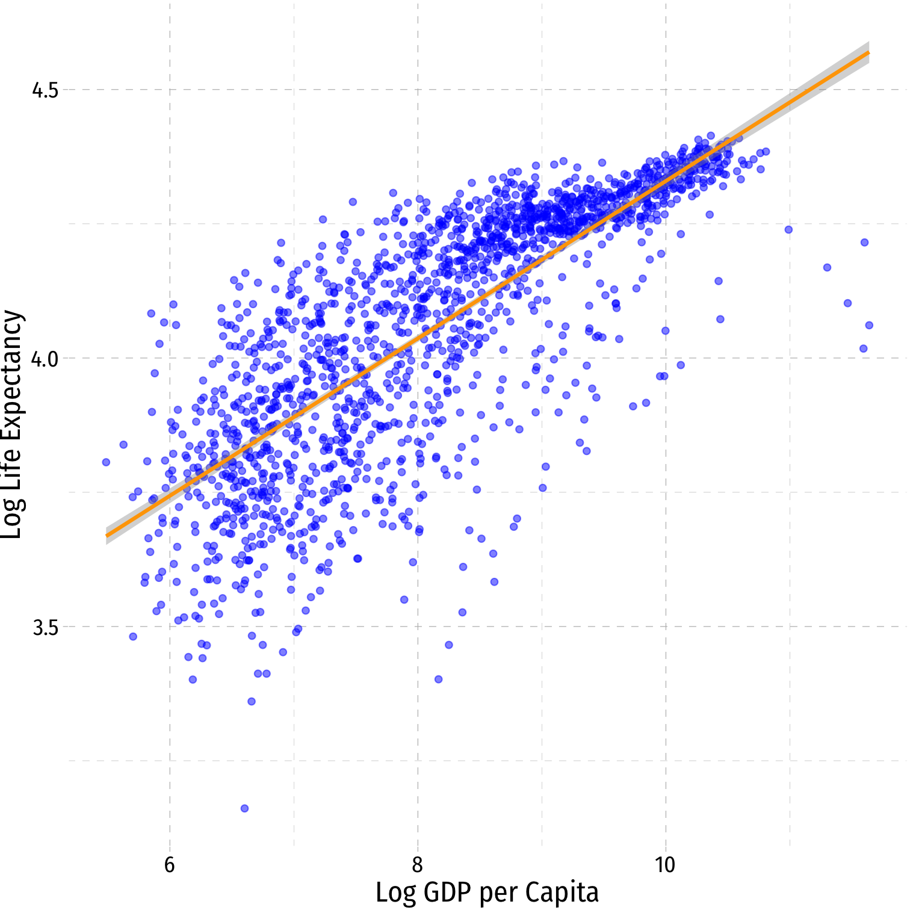

```{r setup, include=FALSE}
options(htmltools.dir.version = FALSE)
knitr::opts_chunk$set(echo=F,
                      message=F,
                      warning=F)
library(tidyverse)
set.seed(256)
update_geom_defaults("label", list(family = "Fira Sans Condensed"))
```


# Nonlinearities

.pull-left[

- Consider the `gapminder` example again
]

.pull-right[

```{r, fig.retina=3}
library(gapminder)
gap_60<-gapminder %>%
  filter(gdpPercap<60000)

p2<-ggplot(data = gap_60)+
  aes(x = gdpPercap,
      y = lifeExp)+
  geom_point(color="blue", alpha=0.5)+
  scale_x_continuous(labels=scales::dollar,
                     breaks=seq(0,120000,20000))+
  scale_y_continuous(breaks=seq(0,100,10),
                     limits=c(0,100))+
  labs(x = "GDP per Capita",
       y = "Life Expectancy (Years)")+
  coord_cartesian(clip = "off")+
  ggthemes::theme_pander(base_family = "Fira Sans Condensed",
           base_size=16)
p2
```

]

---

# Nonlinearities

.pull-left[

- Consider the `gapminder` example again

.quitesmall[
$$\color{red}{\widehat{\text{Life Expectancy}_i}=\hat{\beta_0}+\hat{\beta_1}\text{GDP per capita}_i}$$

]
]

.pull-right[

```{r, fig.retina=3}
p2+geom_smooth(method="lm", color="red")
```

]

---

# Nonlinearities

.pull-left[

- Consider the `gapminder` example again

.quitesmall[
$$\color{red}{\widehat{\text{Life Expectancy}_i}=\hat{\beta_0}+\hat{\beta_1}\text{GDP per capita}_i}$$


$$\color{green}{\widehat{\text{Life Expectancy}_i}=\hat{\beta_0}+\hat{\beta_1}\text{GDP per capita}_i+\hat{\beta_2}\text{GDP per capita}_i^2}$$

]
]

.pull-right[

```{r, fig.retina=3}
p2+geom_smooth(method="lm", color="red")+
  stat_smooth(method="lm", formula=y~x+I(x^2), color = "green")
```

]

---

# Nonlinearities

.pull-left[

- Consider the `gapminder` example again

.quitesmall[
$$\color{red}{\widehat{\text{Life Expectancy}_i}=\hat{\beta_0}+\hat{\beta_1}\text{GDP per capita}_i}$$


$$\color{green}{\widehat{\text{Life Expectancy}_i}=\hat{\beta_0}+\hat{\beta_1}\text{GDP per capita}_i+\hat{\beta_2}\text{GDP per capita}_i^2}$$

$$\color{orange}{\widehat{\text{Life Expectancy}_i}=\hat{\beta_0}+\hat{\beta_1}\ln(\text{GDP per capita}_i)}$$

]

]

.pull-right[

```{r, fig.retina=3}
p2+geom_smooth(method="lm", color="red")+
  stat_smooth(method="lm", formula=y~x+I(x^2), color = "green")+
  stat_smooth(method = "lm", formula=y~log(x), color="orange", size=2)
```

]

---

class: inverse, center, middle

# Logarithmic Models

---

# Logarithmic Models


.pull-left[
.smallest[
- Another useful model for nonlinear data is the .hi[logarithmic model]<sup>.magenta[†]</sup>
  - We transform either $X$, $Y$, or *both* by taking the (natural) logarithm

- Logarithmic model has two additional advantages
  1. We can easily interpret coefficients as **percentage changes** or **elasticities**
  2. Useful economic shape: diminishing returns (production functions, utility functions, etc)
]

.tiny[<sup>.magenta[†]</sup> Note, this should not be confused with a **logistic (logit) mode**, which is a model for *dependent* dummy variables.]

]

.pull-right[
```{r, fig.retina=3}
ggplot(data.frame(x=0:10),aes(x=x))+
    stat_function(fun=log, color="blue",size =2)+
  geom_label(x=9,y=log(9), label="y=log(x)", color="blue", size=5)+
  scale_x_continuous(breaks=seq(0,10,1),
                     limits=c(0,10),
                     expand=c(0,0))+
  scale_y_continuous(limits=c(0,2.5),
                     expand=c(0,0))+
  labs(x = "X",
       y = "Y")+
  theme_classic(base_family = "Fira Sans Condensed",
           base_size=20)
```
]

---

# The Natural Logarithm

.pull-left[
```{r, fig.retina=3}
ggplot(data.frame(x=0:10),aes(x=x))+
    stat_function(fun=log, color="blue",size =2)+
    stat_function(fun=exp, color="red", size =2)+
  stat_function(fun=function(x){x}, size=2, linetype="dashed")+
  geom_label(x=4,y=log(4), label=expression(Y==ln(X)), color="blue", size=5)+
  geom_label(x=1,y=exp(1), label=expression(Y==e^{X}), color="red", size=5)+
  scale_x_continuous(breaks=seq(0,5,1),
                     limits=c(0,5),
                     expand=c(0,0))+
  scale_y_continuous(limits=c(0,5),
                     expand=c(0,0))+
  labs(x = "X",
       y = "Y")+
  theme_classic(base_family = "Fira Sans Condensed",
           base_size=20)
```
]

.pull-right[

- The .red[exponential function], $Y=e^X$ or $Y=exp(X)$, where base $e=2.71828...$

- .blue[Natural logarithm] is the inverse, $Y=ln(X)$

]

---

# The Natural Logarithm: Review I

.smallest[
- **Exponents** are defined as
$$\color{#6A5ACD}{b}^n=\underbrace{\color{#6A5ACD}{b} \times \color{#6A5ACD}{b} \times \cdots \times \color{#6A5ACD}{b}}_{\color{#e64173}{n} \text{ times}}$$
  - where base $b$ is multiplied by itself $n$ times
]
--

.smallest[
- .green[**Example**]: $\color{#6A5ACD}{2}^{\color{#e64173}{3}}=\underbrace{\color{#6A5ACD}{2} \times \color{#6A5ACD}{2} \times \color{#6A5ACD}{2}}_{\color{#e64173}{n=3}}=\color{#314f4f}{8}$
]

--

.smallest[
- **Logarithms** are the inverse, defined as the exponents in the expressions above
$$\text{If } \color{#6A5ACD}{b}^{\color{#e64173}{n}}=\color{#314f4f}{y}\text{, then }log_{\color{#6A5ACD}{b}}(\color{#314f4f}{y})=\color{#e64173}{n}$$
  - $\color{#e64173}{n}$ is the number you must raise $\color{#6A5ACD}{b}$ to in order to get $\color{#314f4f}{y}$
]

--

.smallest[
- .green[**Example**]: $log_{\color{#6A5ACD}{2}}(\color{#314f4f}{8})=\color{#e64173}{3}$
]

---

# The Natural Logarithm: Review II

- Logarithms can have any base, but common to use the **natural logarithm $(ln)$** with base $\mathbf{e=2.71828...}$
$$\text{If } e^n=y\text{, then }ln(y)=n$$

---

# The Natural Logarithm: Properties

- Natural logs have a lot of useful properties:

1. $ln(\frac{1}{x})=-ln(x)$

2. $ln(ab)=ln(a)+ln(b)$

3.  $ln(\frac{x}{a})=ln(x)-ln(a)$

4. $ln(x^a)=a \, ln(x)$

5.  $\frac{d  \, ln \, x}{d \, x} = \frac{1}{x}$

---

# The Natural Logarithm: Example

- Most useful property: for small change in $x$, $\Delta x$:

$$\underbrace{ln(x+\Delta x) - ln(x)}_{\text{Difference in logs}} \approx \underbrace{\frac{\Delta x}{x}}_{\text{Relative change}}$$

--

.content-box-green[
.green[**Example**]: Let $x=100$ and $\Delta x =1$, relative change is:

$$\frac{\Delta x}{x} = \frac{(101-100)}{100} = 0.01 \text{ or }1\%$$

- The logged difference:
$$ln(101)-ln(100) = 0.00995 \approx 1\%$$
]

--

- This allows us to very easily interpret coefficients as *percent changes* or **elasticities**

---

# Elasticity

- An .hi[elasticity] between two variables, $E_{Y,X}$ describes the .hi-purple[responsiveness] of one variable to a change in another

- Measured in percentages: a 1% change in $X$ will cause a $E\%$ change in $Y$

--

$$E_{Y,X}=\frac{\% \Delta Y}{\% \Delta X} =\cfrac{\left(\frac{\Delta Y}{Y}\right)}{\left( \frac{\Delta X}{X}\right)}$$

--

- Numerator is relative change in $Y$, Denominator is relative change in $X$

---

# Math FYI: Cobb Douglas Functions and Logs

- One of the (many) reasons why economists love Cobb-Douglas functions:
$$Y=AL^{\alpha}K^{\beta}$$

--

- Taking logs, relationship becomes linear:

--

$$ln(Y)=\ln(A)+\alpha \ln(L)+ \beta \ln(K)$$

--

- With data on $(Y, L, K)$ and linear regression, can estimate $\alpha$ and $\beta$
  - $\alpha$: elasticity of $Y$ with respect to $L$
      - A 1% change in $L$ will lead to an $\alpha$% change in $Y$
  - $\beta$: elasticity of $Y$ with respect to $K$
      - A 1% change in $K$ will lead to a $\beta$% change in $Y$

---

# Math FYI: Cobb Douglas Functions and Logs

.content-box-green[
.hi-green[Example]: Cobb-Douglas production function:
$$Y=2L^{0.75}K^{0.25}$$
]

--

- Taking logs:

$$\ln Y=\ln 2+0.75 \ln L + 0.25 \ln K$$

--

- A 1% change in $L$ will yield a 0.75% change in output $Y$

- A 1% change in $K$ will yield a 0.25% change in output $Y$

---

# Math FYI: Cobb Douglas Functions and Logs

.content-box-green[
.hi-green[Example]: A Cobb-Douglas utility function of:
$$U(X,Y)=X^{0.5}Y^{0.5}$$

yields a demand function (for x) of:

$$Q = 0.5 \frac{M}{P}$$

where $Q$ is quantity demanded (of good $X$), $M$ is income, and $P$ is the price (of good $X)$
]


--

- Taking logs:

$$\ln Q= \ln 0.5+\ln M - \ln P$$

--

- A 1% change in $M$ will yield a 1% change in consumption $Q$ (income elasticity!)

- A 1% change in $P$ will yield a 1% change in consumption $Q$ (price elasticity!)

---

# Logarithms in R I

- The `log()` function can easily take the logarithm

.smallest[
```{r, echo=T}
gapminder<-gapminder %>%
  mutate(loggdp=log(gdpPercap)) # log GDP per capita

gapminder %>% head() # look at it
```
]

---

# Logarithms in R II


- Note, `log()` by default is the **natural logarithm $ln()$**, i.e. base `e`
  - Can change base with e.g. `log(x, base = 5)`
  - Some common built-in logs: `log10`, `log2` 

```{r, echo=T}
log10(100)
log2(16)
log(19683, base=3)
```

---

# Types of Logarithmic Models

- Three types of log regression models, depending on which variables we log

--

1.  .hi-purple[Linear-log model:] $Y_i=\beta_0+\beta_1 \color{#e64173}{\ln X_i}$

--

2. .hi-purple[Log-linear model:] $\color{#e64173}{\ln Y_i}=\beta_0+\beta_1X_i$

--

3. .hi-purple[Log-log model:] $\color{#e64173}{\ln Y_i}=\beta_0+\beta_1 \color{#e64173}{\ln X_i}$

---

# Linear-Log Model

- .hi-purple[Linear-log model] has an independent variable $(X)$ that is logged

--

$$\begin{align*}
Y&=\beta_0+\beta_1 \color{#e64173}{\ln X_i}\\
\beta_1&=\cfrac{\Delta Y}{\big(\frac{\Delta X}{X}\big)}\\
\end{align*}$$

--

- .hi-purple[**Marginal effect of** `\\(\mathbf{X \rightarrow Y}\\)`: a **1%** change in `\\(X \rightarrow\\)` a `\\(\frac{\beta_1}{100}\\)` **unit** change in `\\(Y\\)`]

---

# Linear-Log Model in R

.pull-left[
.tiny[
```{r, echo=T}
lin_log_reg <- lm(lifeExp ~ loggdp, data = gapminder)
library(broom)
lin_log_reg %>% tidy()
```
]
]

.pull-right[
.smallest[
$$\widehat{\text{Life Expectancy}}_i=-9.10+9.41 \, \text{ln GDP}_i$$
]

]

---

# Linear-Log Model in R

.pull-left[
.tiny[
```{r, echo=T}
lin_log_reg <- lm(lifeExp ~ loggdp, data = gapminder)
library(broom)
lin_log_reg %>% tidy()
```
]
]

.pull-right[

.smallest[
$$\widehat{\text{Life Expectancy}}_i=-9.10+9.41 \, \text{ln GDP}_i$$

- A **1% change in GDP** $\rightarrow$ a $\frac{9.41}{100}=$ **0.0941 year increase** in Life Expectancy

]
]

---

# Linear-Log Model in R

.pull-left[
.tiny[
```{r, echo=T}
lin_log_reg <- lm(lifeExp ~ loggdp, data = gapminder)
library(broom)
lin_log_reg %>% tidy()
```
]
]

.pull-right[

.smallest[
$$\widehat{\text{Life Expectancy}}_i=-9.10+9.41 \, \text{ln GDP}_i$$

- A **1% change in GDP** $\rightarrow$ a $\frac{9.41}{100}=$ **0.0941 year increase** in Life Expectancy

- A **25% fall in GDP** $\rightarrow$ a $(-25 \times 0.0941)=$ **2.353 year decrease** in Life Expectancy

]
]

---

# Linear-Log Model in R

.pull-left[
.tiny[
```{r, echo=T}
lin_log_reg <- lm(lifeExp ~ loggdp, data = gapminder)
library(broom)
lin_log_reg %>% tidy()
```
]
]

.pull-right[
.smallest[
$$\widehat{\text{Life Expectancy}}_i=-9.10+9.41 \, \text{ln GDP}_i$$

- A **1% change in GDP** $\rightarrow$ a $\frac{9.41}{100}=$ **0.0941 year increase** in Life Expectancy

- A **25% fall in GDP** $\rightarrow$ a $(-25 \times 0.0941)=$ **2.353 year decrease** in Life Expectancy

- A **100% rise in GDP** $\rightarrow$ a $(100 \times 0.0941)=$ **9.041 year increase** in Life Expectancy 

]
]
---

# Linear-Log Model Graph I

.pull-left[
.code50[
```{r lin-log-graph, echo=T, eval=F}
ggplot(data = gapminder)+
  aes(x = gdpPercap,
      y = lifeExp)+
  geom_point(color="blue", alpha=0.5)+
  geom_smooth(method="lm", #<<
              formula=y~log(x), #<<
              color="orange")+ #<<
  scale_x_continuous(labels=scales::dollar,
                     breaks=seq(0,120000,20000))+
  scale_y_continuous(breaks=seq(0,100,10),
                     limits=c(0,100))+
  labs(x = "GDP per Capita",
       y = "Life Expectancy (Years)")+
  ggthemes::theme_pander(base_family = "Fira Sans Condensed",
           base_size=16)
```
]
]

.pull-right[
```{r, ref.label="lin-log-graph", fig.retina=3}

```
]

---

# Linear-Log Model Graph II

.pull-left[
.code50[
```{r lin-log-graph2, echo=T, eval=F}
ggplot(data = gapminder)+
  aes(x = loggdp, #<<
      y = lifeExp)+ 
  geom_point(color="blue", alpha=0.5)+
  geom_smooth(method="lm", color="orange")+ #<<
  scale_y_continuous(breaks=seq(0,100,10),
                     limits=c(0,100))+
  labs(x = "Log GDP per Capita",
       y = "Life Expectancy (Years)")+
  ggthemes::theme_pander(base_family = "Fira Sans Condensed",
           base_size=16)
```
]
]

.pull-right[
```{r, ref.label="lin-log-graph2", fig.retina=3}

```
]

---

# Log-Linear Model

- .hi-purple[Log-linear model] has the dependent variable $(Y)$ logged

--

$$\begin{align*}
\color{#e64173}{\ln Y_i}&=\beta_0+\beta_1 X\\
\beta_1&=\cfrac{\big(\frac{\Delta Y}{Y}\big)}{\Delta X}\\
\end{align*}$$

--

- .hi-purple[**Marginal effect of** `\\(\mathbf{X \rightarrow Y}\\)`: a **1 unit** change in `\\(X \rightarrow\\)` a `\\(\beta_1 \times 100\\)` **%** change in `\\(Y\\)`]

---

# Log-Linear Model in R (Preliminaries)

.smallest[
- We will again have very large/small coefficients if we deal with GDP directly, again let's transform `gdpPercap` into $1,000s, call it `gdp_t`

- Then log LifeExp
]

--

.quitesmall[
```{r, echo=T}
gapminder <- gapminder %>%
  mutate(gdp_t = gdpPercap/1000, # first make GDP/capita in $1000s
         loglife = log(lifeExp)) # take the log of LifeExp
gapminder %>% head() # look at it
```
]

---

# Log-Linear Model in R

.pull-left[
.tiny[
```{r, echo=T}
log_lin_reg<-lm(loglife~gdp_t, data = gapminder)
tidy(log_lin_reg)
```
]
]

.pull-right[

.smallest[
$$\widehat{\ln\text{Life Expectancy}}_i=3.967+0.013 \, \text{GDP}_i$$
]

]

---

# Log-Linear Model in R

.pull-left[
.tiny[
```{r, echo=T}
log_lin_reg <- lm(loglife ~ gdp_t, data = gapminder)
log_lin_reg %>% tidy()
```
]
]

.pull-right[

.smallest[
$$\widehat{\ln\text{Life Expectancy}}_i=3.967+0.013 \, \text{GDP}_i$$

- A **$1 (thousand) change in GDP** $\rightarrow$ a $0.013 \times 100\%=$ **1.3% increase** in Life Expectancy

]
]

---

# Log-Linear Model in R

.pull-left[
.tiny[
```{r, echo=T}
log_lin_reg <- lm(loglife ~ gdp_t, data = gapminder)
log_lin_reg %>% tidy()
```
]
]

.pull-right[
.smallest[
$$\widehat{ln(\text{Life Expectancy})}_i=3.967+0.013 \, \text{GDP}_i$$

- A **$1 (thousand) change in GDP** $\rightarrow$ a $0.013 \times 100\%=$ **1.3% increase** in Life Expectancy

- A **$25 (thousand) fall in GDP** $\rightarrow$ a $(-25 \times 1.3\%)=$ **32.5% decrease** in Life Expectancy 

]
]

---

# Log-Linear Model in R

.pull-left[
.tiny[
```{r, echo=T}
log_lin_reg <- lm(loglife ~ gdp_t, data = gapminder)
log_lin_reg %>% tidy()
```
]
]

.pull-right[
.smallest[
$$\widehat{ln(\text{Life Expectancy})}_i=3.967+0.013 \, \text{GDP}_i$$

- A **$1 (thousand) change in GDP** $\rightarrow$ a $0.013 \times 100\%=$ **1.3% increase** in Life Expectancy

- A **$25 (thousand) fall in GDP** $\rightarrow$ a $(-25 \times 1.3\%)=$ **32.5% decrease** in Life Expectancy 

- A **$100 (thousand) rise in GDP** $\rightarrow$ a $(100 \times 1.3\%)=$ **130% increase** in Life Expectancy 
]
]

---

# Linear-Log Model Graph I

.pull-left[
.code50[
```{r log-lin-graph, echo=T, eval=F}
ggplot(data = gapminder)+
  aes(x = gdp_t, #<<
      y = loglife)+ #<<
  geom_point(color="blue", alpha=0.5)+
  geom_smooth(method="lm", color="orange")+ #<<
  scale_x_continuous(labels=scales::dollar,
                     breaks=seq(0,120,20))+
  labs(x = "GDP per Capita ($ Thousands)",
       y = "Log Life Expectancy")+
  ggthemes::theme_pander(base_family = "Fira Sans Condensed",
           base_size=16)
```
]
]

.pull-right[
```{r, ref.label="log-lin-graph", fig.retina=3}

```
]

---

# Log-Log Model

- .hi-purple[Log-log model] has both variables $(X \text{ and } Y)$ logged

--

$$\begin{align*}
\color{#e64173}{\ln Y_i}&=\beta_0+\beta_1 \color{#e64173}{\ln X_i}\\
\beta_1&=\cfrac{\big(\frac{\Delta Y}{Y}\big)}{\big(\frac{\Delta X}{X}\big)}\\
\end{align*}$$

--

- .hi-purple[**Marginal effect of** `\\(\mathbf{X \rightarrow Y}\\)`: a **1%** change in `\\(X \rightarrow\\)` a `\\(\beta_1\\)` **%** change in `\\(Y\\)`]

- $\beta_1$ is the .hi-turquoise[elasticity] of $Y$ with respect to $X$! 

---

# Log-Log Model in R

.pull-left[
.tiny[
```{r, echo=T}
log_log_reg <- lm(loglife ~ loggdp, data = gapminder)
log_log_reg %>% tidy()
```
]
]

.pull-right[

.smallest[
$$\widehat{\text{ln Life Expectancy}}_i=2.864+0.147 \, \text{ln GDP}_i$$
]


]

---

# Log-Log Model in R

.pull-left[
.tiny[
```{r, echo=T}
log_log_reg <- lm(loglife ~ loggdp, data = gapminder)
log_log_reg %>% tidy()
```
]
]

.pull-right[

.smallest[
$$\widehat{\text{ln Life Expectancy}}_i=2.864+0.147 \, \text{ln GDP}_i$$
- A **1% change in GDP** $\rightarrow$ a **0.147% increase** in Life Expectancy

]
]

---

# Log-Log Model in R

.pull-left[
.tiny[
```{r, echo=T}
log_log_reg <- lm(loglife ~ loggdp, data = gapminder)
log_log_reg %>% tidy()
```
]
]

.pull-right[

.smallest[
$$\widehat{\text{ln Life Expectancy}}_i=2.864+0.147 \, \text{ln GDP}_i$$

- A **1% change in GDP** $\rightarrow$ a **0.147% increase** in Life Expectancy

- A **25% fall in GDP** $\rightarrow$ a $(-25 \times 0.147\%)=$ **3.675% decrease** in Life Expectancy 

]
]

---

# Log-Log Model in R

.pull-left[
.tiny[
```{r, echo=T}
log_log_reg <- lm(loglife ~ loggdp, data = gapminder)
log_log_reg %>% tidy()
```
]
]

.pull-right[

.smallest[
$$\widehat{\text{ln Life Expectancy}}_i=2.864+0.147 \, \text{ln GDP}_i$$

- A **1% change in GDP** $\rightarrow$ a **0.147% increase** in Life Expectancy

- A **25% fall in GDP** $\rightarrow$ a $(-25 \times 0.147\%)=$ **3.675% decrease** in Life Expectancy 

- A **100% rise in GDP** $\rightarrow$ a $(100 \times 0.147\%)=$ **14.7% increase** in Life Expectancy 

]
]
---

# Log-Log Model Graph I

.pull-left[
.code50[
```{r log-log-graph, echo=T, eval=F}
ggplot(data = gapminder)+
  aes(x = loggdp, #<<
      y = loglife)+ #<<
  geom_point(color="blue", alpha=0.5)+
  geom_smooth(method="lm", color="orange")+ #<<
  labs(x = "Log GDP per Capita",
       y = "Log Life Expectancy")+
  ggthemes::theme_pander(base_family = "Fira Sans Condensed",
           base_size=16)
```
]
]

.pull-right[
```{r, ref.label="log-log-graph", fig.retina=3}

```
]

---

# Comparing Models I

| Model | Equation | Interpretation |
|-------|----------|----------------|
| Linear-.hi[Log] | $Y=\beta_0+\beta_1 \color{#e64173}{\ln X}$ | 1.hi[%] change in $X \rightarrow \frac{\hat{\beta_1}}{100}$ **unit** change in $Y$ |
| .hi[Log]-Linear | $\color{#e64173}{\ln Y}=\beta_0+\beta_1X$ | 1 **unit** change in $X \rightarrow \hat{\beta_1}\times 100$.hi[%] change in $Y$ |
| .hi[Log]-.hi[Log] | $\color{#e64173}{\ln Y}=\beta_0+\beta_1\color{#e64173}{\ln X}$ | 1.hi[%] change in $X \rightarrow \hat{\beta_1}$.hi[%] change in $Y$ |

- Hint: the variable that gets .hi[logged] changes in .hi[percent] terms, the variable not logged changes in **unit** terms

---

# Comparing Models II

.pull-left[
.code50[
```{r logs-table, echo=T, eval=F}
library(huxtable)
huxreg("Life Exp." = lin_log_reg,
       "Log Life Exp." = log_lin_reg,
       "Log Life Exp." = log_log_reg,
       coefs = c("Constant" = "(Intercept)",
                 "GDP ($1000s)" = "gdp_t",
                 "Log GDP" = "loggdp"),
       statistics = c("N" = "nobs",
                      "R-Squared" = "r.squared",
                      "SER" = "sigma"),
       number_format = 2)
```
]

- Models are very different units, how to choose? 
  - Compare `\\(R^2\\)`’s
  - Compare graphs
  - Compare intution

]

.pull-left[
.tiny[
```{r, ref.label="logs-table"}
```
]
]

---

# Comparing Models III

.smallest[
| Linear-.hi[Log] | .hi[Log]-Linear | .hi[Log]-.hi[Log] |
|:----------:|:----------:|:-------:|
|  |  |  |
| $\hat{Y_i}=\hat{\beta_0}+\hat{\beta_1}\color{#e64173}{\ln X_i}$ | $\color{#e64173}{\ln Y_i}=\hat{\beta_0}+\hat{\beta_1}X_i$ | $\color{#e64173}{\ln Y_i}=\hat{\beta_0}+\hat{\beta_1}\color{#e64173}{\ln X_i}$ |
| $R^2=0.65$ | $R^2=0.30$ | $R^2=0.61$ |
]

---

# When to Log?

.smaller[
- In practice, the following types of variables are logged:
  - Variables that must always be positive (prices, sales, market values)
  - Very large numbers (population, GDP)
  - Variables we want to talk about as percentage changes or growth rates (money supply, population, GDP)
  - Variables that have diminishing returns (output, utility)
  - Variables that have nonlinear scatterplots

]
--

.smaller[
- Avoid logs for:
  - Variables that are less than one, decimals, 0, or negative
  - Categorical variables (season, gender, political party)
  - Time variables (year, week, day)
]

---

class: inverse, center, middle

# Comparing Across Units

---

# Comparing Coefficients of Different Units I

.smallest[
$$\hat{Y_i}=\beta_0+\beta_1 X_1+\beta_2 X_2	$$

- We often want to compare coefficients to see which variable $X_1$ or $X_2$ has a bigger effect on $Y$

- What if $X_1$ and $X_2$ are different units?


.content-box-green[
.green[**Example**]:
$$\begin{align*}
\widehat{\text{Salary}_i}&=\beta_0+\beta_1\, \text{Batting average}_i+\beta_2\, \text{Home runs}_i\\
\widehat{\text{Salary}_i}&=-\text{2,869,439.40}+\text{12,417,629.72} \, \text{Batting average}_i+\text{129,627.36}\, \text{Home runs}_i\\
\end{align*}$$
]
]

---

# Comparing Coefficients of Different Units II

- An easy way is to .hi[standardize]<sup>.magenta[†]</sup> the variables (i.e. take the $Z$-score) 

$$X^{std}=\frac{X-\overline{X}}{sd(X)}$$

.footnote[<sup>.magenta[†]</sup> Also called “centering” or “scaling.”]

---

# Comparing Coefficients of Different Units: Example

.smallest[
| Variable | Mean | Std. Dev. |
|----------|------|-----------|
| Salary | $2,024,616 | $2,764,512 |
| Batting Average | 0.267 | 0.031 |
| Home Runs | 12.11 | 10.31 |

]

.quitesmall[
$$\begin{align*}\scriptsize  
	\widehat{\text{Salary}_i}&=-\text{2,869,439.40}+\text{12,417,629.72} \, \text{Batting average}_i+\text{129,627.36} \, \text{Home runs}_i\\ 
	\widehat{\text{Salary}_i}^{std}&=\text{0.00}+\text{0.14} \, \text{Batting average}_i^{std}+\text{0.48} \, \text{Home runs}_i^{std}\\
	\end{align*}$$
]
--

.quitesmall[
- .hi-purple[Marginal effects] on $Y$ (in *standard deviations* of $Y$) from 1 *standard deviation* change in $X$:

- $\hat{\beta_1}$: a 1 standard deviation increase in Batting Average increases Salary by 0.14 standard deviations

$$0.14 \times \$2,764,512=\$387,032$$

- $\hat{\beta_2}$: a 1 standard deviation increase in Home Runs increases Salary by 0.48 standard deviations
  
$$0.48 \times \$2,764,512=\$1,326,966$$
]
---

# Standardizing in `R`

- Use the `scale()` command inside `mutate()` function to standardize a variable

```{r, echo=T}
gapminder<-gapminder %>%
  mutate(std_life = scale(lifeExp),
         std_gdp = scale(gdpPercap)) 

std_reg<-lm(std_life~std_gdp, data = gapminder)
tidy(std_reg)
```

---

class: inverse, center, middle

# Joint Hypothesis Testing

---

# Joint Hypothesis Testing I

.content-box-green[
.green[**Example**]: Return again to:

$$\widehat{Wage_i}=\hat{\beta_0}+\hat{\beta_1}Male_i+\hat{\beta_2}Northeast_i+\hat{\beta_3}Midwest_i+\hat{\beta_4}South_i$$

]

--

- Maybe region doesn't affect wages *at all*?

--

- $H_0: \beta_2=0, \, \beta_3=0, \, \beta_4=0$

--

- This is a .hi[joint hypothesis] to test

---

# Joint Hypothesis Testing II

- A .hi[joint hypothesis] tests against the null hypothesis of a value for *multiple* parameters:
$$\mathbf{H_0: \beta_1= \beta_2=0}$$
the hypotheses that multiple regressors are equal to zero (have no causal effect on the outcome) 

--

- Our **alternative hypothesis** is that:
$$H_1: \text{ either } \beta_1\neq0\text{ or } \beta_2\neq0\text{ or both}$$
or simply, that $H_0$ is not true 

---

# Types of Joint Hypothesis Tests

.smallest[
- Three main cases of joint hypothesis tests:
]
--

.smallest[
1) $H_0$: $\beta_1=\beta_2=0$
  - Testing against the claim that multiple variables don't matter
  - Useful under high multicollinearity between variables
  - $H_a$: at least one parameter $\neq$ 0
]

--

.smallest[
2) $H_0$: $\beta_1=\beta_2$
  - Testing whether two variables matter the same
  - Variables must be the same units
  - $H_a: \beta_1 (\neq, <, \text{ or }>) \beta_2$
]
--

.smallest[
3) $H_0:$ ALL $\beta$'s $=0$
  - The "**Overall F-test"**
  - Testing against claim that regression model explains *NO* variation in $Y$
]
---

# Joint Hypothesis Tests: F-statistic

- The .hi-turquoise[F-statistic] is the test-statistic used to test joint hypotheses about regression coefficients with an .hi-turquoise[F-test]

--

- This involves comparing two models:
  1. .hi-purple[Unrestricted model]: regression with all coefficients
  2. .hi[Restricted model]: regression under null hypothesis (coefficients equal hypothesized values)

--

- $F$ is an .hi-turquoise[analysis of variance (ANOVA)]
  - essentially tests whether $R^2$ increases statistically significantly as we go from the restricted model$\rightarrow$unrestricted model

--

- $F$ has its own distribution, with *two* sets of degrees of freedom 

---

# Joint Hypothesis F-test: Example I

.content-box-green[
.green[**Example**]: Return again to:

$$\widehat{Wage_i}=\hat{\beta_0}+\hat{\beta_1}Male_i+\hat{\beta_2}Northeast_i+\hat{\beta_3}Midwest_i+\hat{\beta_4}South_i$$

]

--

- $H_0: \beta_2=\beta_3=\beta_4=0$

--

- $H_a$: $H_0$ is not true (at least one $\beta_i \neq 0$)

---

# Joint Hypothesis F-test: Example II
.smallest[
.content-box-green[
.green[**Example**]: Return again to:

$$\widehat{Wage_i}=\hat{\beta_0}+\hat{\beta_1}Male_i+\hat{\beta_2}Northeast_i+\hat{\beta_3}Midwest_i+\hat{\beta_4}South_i$$

]

- .hi-purple[Unrestricted model]:

$$\widehat{Wage_i}=\hat{\beta_0}+\hat{\beta_1}Male_i+\hat{\beta_2}Northeast_i+\hat{\beta_3}Midwest_i+\hat{\beta_4}South_i$$
]

--
.smallest[
- .hi[Restricted model]:

$$\widehat{Wage_i}=\hat{\beta_0}+\hat{\beta_1}Male_i$$
]

--
.smallest[

- $F$: does going from .hi[restricted] to .hi-purple[unrestricted] model statistically significantly improve $R^2$?
]
---

# Calculating the F-statistic

.pull-left[
$$F_{q,(n-k-1)}=\cfrac{\left(\displaystyle\frac{(R^2_u-R^2_r)}{q}\right)}{\left(\displaystyle\frac{(1-R^2_u)}{(n-k-1)}\right)}$$
]

.pull-right[

]

---

# Calculating the F-statistic

.pull-left[
$$F_{q,(n-k-1)}=\cfrac{\left(\displaystyle\frac{(\color{#e64173}{R^2_u}-R^2_r)}{q}\right)}{\left(\displaystyle\frac{(1-\color{#e64173}{R^2_u})}{(n-k-1)}\right)}$$
]

.pull-right[

- $\color{#e64173}{R^2_u}$: the $R^2$ from the .hi[unrestricted model] (all variables)
]

---

# Calculating the F-statistic

.pull-left[
$$F_{q,(n-k-1)}=\cfrac{\left(\displaystyle\frac{(\color{#e64173}{R^2_u}-\color{#6A5ACD}{R^2_r})}{q}\right)}{\left(\displaystyle\frac{(1-\color{#e64173}{R^2_u})}{(n-k-1)}\right)}$$
]

.pull-right[

- $\color{#e64173}{R^2_u}$: the $R^2$ from the .hi[unrestricted model] (all variables)

- $\color{#6A5ACD}{R^2_r}$: the $R^2$ from the .hi-purple[restricted model] (null hypothesis)
]

---

# Calculating the F-statistic

.pull-left[
$$F_{q,(n-k-1)}=\cfrac{\left(\displaystyle\frac{(\color{#e64173}{R^2_u}-\color{#6A5ACD}{R^2_r})}{q}\right)}{\left(\displaystyle\frac{(1-\color{#e64173}{R^2_u})}{(n-k-1)}\right)}$$
]

.pull-right[

- $\color{#e64173}{R^2_u}$: the $R^2$ from the .hi[unrestricted model] (all variables)

- $\color{#6A5ACD}{R^2_r}$: the $R^2$ from the .hi-purple[restricted model] (null hypothesis)

- $q$: number of restrictions (number of $\beta's=0$ under null hypothesis)
]

---

# Calculating the F-statistic

.pull-left[
$$F_{q,(n-k-1)}=\cfrac{\left(\displaystyle\frac{(\color{#e64173}{R^2_u}-\color{#6A5ACD}{R^2_r})}{q}\right)}{\left(\displaystyle\frac{(1-\color{#e64173}{R^2_u})}{(n-k-1)}\right)}$$
]

.pull-right[

- $\color{#e64173}{R^2_u}$: the $R^2$ from the .hi[unrestricted model] (all variables)

- $\color{#6A5ACD}{R^2_r}$: the $R^2$ from the .hi-purple[restricted model] (null hypothesis)

- $q$: number of restrictions (number of $\beta's=0$ under null hypothesis)

- $k$: number of $X$ variables in .hi[unrestricted model] (all variables)
]

---

# Calculating the F-statistic

.pull-left[
$$F_{q,(n-k-1)}=\cfrac{\left(\displaystyle\frac{(\color{#e64173}{R^2_u}-\color{#6A5ACD}{R^2_r})}{q}\right)}{\left(\displaystyle\frac{(1-\color{#e64173}{R^2_u})}{(n-k-1)}\right)}$$
]

.pull-right[

- $\color{#e64173}{R^2_u}$: the $R^2$ from the .hi[unrestricted model] (all variables)

- $\color{#6A5ACD}{R^2_r}$: the $R^2$ from the .hi-purple[restricted model] (null hypothesis)

- $q$: number of restrictions (number of $\beta's=0$ under null hypothesis)

- $k$: number of $X$ variables in .hi[unrestricted model] (all variables)

.smallest[
- $F$ has two sets of degrees of freedom:
  - $q$ for the numerator, $(n-k-1)$ for the denominator
]
]
---

# Calculating the F-statistic II

.pull-left[
$$F_{q,(n-k-1)}=\cfrac{\left(\displaystyle\frac{(R^2_u-R^2_r)}{q}\right)}{\left(\displaystyle\frac{(1-R^2_u)}{(n-k-1)}\right)}$$
]

.pull-right[

- .hi-purple[Key takeaway]: The bigger the difference between $(R^2_u-R^2_r)$, the greater the improvement in fit by adding variables, the larger the $F$!

- This formula is (believe it or not) actually a simplified version (assuming homoskedasticity)
  - I give you this formula to **build your intuition of what F is measuring**
  
]

---

# F-test Example I

- We'll use the `wooldridge` package's `wage1` data again

```{r, echo=T}
# load in data from wooldridge package
library(wooldridge)
wages<-wooldridge::wage1

# run regressions
unrestricted_reg<-lm(wage~female+northcen+west+south, data=wages)
restricted_reg<-lm(wage~female, data=wages)
```

---

# F-test Example II

- .hi[Unrestricted model]:

$$\widehat{Wage_i}=\hat{\beta_0}+\hat{\beta_1}Female_i+\hat{\beta_2}Northeast_i+\hat{\beta_3}Northcen+\hat{\beta_4}South_i$$

- .hi-purple[Restricted model]:

$$\widehat{Wage_i}=\hat{\beta_0}+\hat{\beta_1}Female_i$$

- $H_0: \beta_2 = \beta_3 = \beta_4 =0$

- $q = 3$ restrictions (F numerator df)

- $n-k-1 = 526-4-1=521$ (F denominator df)

---

# F-test Example III

- We can use the `car` package's `linearHypothesis()` command to run an $F$-test:
  - first argument: name of the (unrestricted) regression
  - second argument: vector of variable names (in quotes) you are testing

```{r, echo=T}
# load car package for additional regression tools
library("car") 

# F-test
linearHypothesis(unrestricted_reg, c("northcen", "west", "south")) 
```

---

# Second F-test Example: Are Two Coefficients Equal?

.smallest[
- The second type of test is whether two coefficients equal one another

.content-box-green[
.green[**Example**]: 

$$\widehat{wage_i}=\beta_0+\beta_1 \text{Adolescent height}_i + \beta_2 \text{Adult height}_i + \beta_3 \text{Male}_i$$

]
]
--

.smallest[
- Does height as an adolescent have the same effect on wages as height as an adult?

$$H_0: \beta_1=\beta_2$$
]

--

.smallest[
- What is the .hi-purple[restricted] regression?

$$\widehat{wage_i}=\beta_0+\beta_1(\text{Adolescent height}_i + \text{Adult height}_i )+ \beta_3 \text{Male}_i$$

- $q=1$ restriction
]

---

# Second F-test Example: Data

```{r, echo=T}
# load in data
heightwages<-read_csv("../data/heightwages.csv")

# make a "heights" variable as the sum of adolescent (height81) and adult (height85) height

heightwages <- heightwages %>%
  mutate(heights=height81+height85)

height_reg<-lm(wage96~height81+height85+male, data=heightwages)
height_restricted_reg<-lm(wage96~heights+male, data=heightwages)

```

---

# Second F-test Example: Data

- For second argument, set two variables equal, in quotes

```{r, echo=T}
linearHypothesis(height_reg, "height81=height85") # F-test 
```

- Insufficient evidence to reject $H_0$!

- The effect of adolescent and adult height on wages is the same

---
  
# All F-test I

.pull-left[

.code50[
```{r, echo=T}
summary(unrestricted_reg)
```
]
]

.pull-right[
.smallest[
- Last line of regression output from `summary()` is an **All F-test**
  - $H_0:$ all $\beta's=0$ 
    - the regression explains no variation in $Y$
  - Calculates an `F-statistic` that, if high enough, is significant (`p-value` $<0.05)$ enough to reject $H_0$
]
]

---

# All F-test II

- Alternatively, if you use `broom` instead of `summary()`:
  - `glance()` command makes table of regression summary statistics
  - `tidy()` only shows coefficients

.quitesmall[
```{r, echo=T}
library(broom)
glance(unrestricted_reg)
```
]

- "`statistic`" is the All F-test, "`p.value`" next to it is the p value from the F test